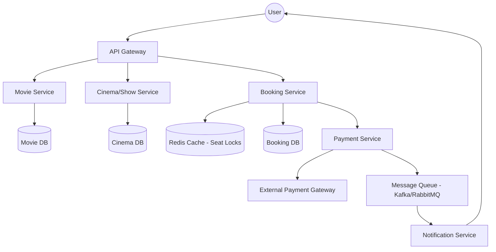

# System Design: Online Movie Ticket Booking System

## 1. Requirements & System Constraints

### 1.1 Functional Requirements
*   **Movie Catalog:** Users should be able to browse movies currently showing or coming soon, filter by city, genre, and language.
*   **Cinema & Show Discovery:** Users can select a cinema and view available showtimes for a specific movie.
*   **Seat Selection:** Users can view a real-time seat map of a cinema hall and select one or more seats.
*   **Temporary Seat Locking:** When a user selects seats, they must be locked for a limited time (e.g., 5–10 minutes) to prevent double-booking while the user completes payment.
*   **Payment Integration:** Integration with third-party payment gateways to confirm the booking.
*   **Ticket Generation:** Upon successful payment, a ticket/QR code is generated and sent to the user.
*   **Cancellation:** Users can cancel bookings based on the cinema's refund policy.

### 1.2 Non-Functional Requirements
*   **Strong Consistency:** No two users should be able to book the same seat for the same show (Atomic transactions).
*   **High Availability:** The system must be available for browsing and searching even during peak loads.
*   **Low Latency:** Seat map retrieval and seat locking must be extremely fast to provide a smooth user experience.
*   **Scalability:** The system must handle massive traffic spikes during the release of blockbuster movies.

### 1.3 Scale Estimations (HLD Context)
*   **Daily Active Users (DAU):** 10 Million.
*   **Peak Concurrent Users:** 1 Million (during major releases).
*   **Total Theaters:** 10,000 worldwide.
*   **Average Seats per Hall:** 200.
*   **Booking Volume:** ~50k requests per second (RPS) during peak bursts.

---

## 2. High-Level Architecture

The system follows a **Microservices Architecture** to decouple the catalog management from the high-concurrency booking engine.

### 2.1 Core Components
1.  **Movie Service:** Manages movie metadata, ratings, and release dates.
2.  **Cinema/Show Service:** Manages theater details, screen layouts, and showtime scheduling.
3.  **Booking Service:** Handles the critical path of seat selection, temporary locking, and booking state management.
4.  **Payment Service:** Interfaces with external payment providers (Stripe, PayPal, etc.).
5.  **Notification Service:** Asynchronous service to send tickets via Email/SMS/Push.
6.  **Cache Layer (Redis):** Stores real-time seat availability and temporary locks.

### 2.2 Architecture Diagram (Mermaid)



---

## 3. Detailed Database Schema Design

A **Relational Database (RDBMS)** like PostgreSQL is chosen because the system requires **ACID compliance**, specifically for transactions involving seat bookings.

### 3.1 Tables & Schema

#### `Movies`
| Field | Type | Constraint | Description |
| :--- | :--- | :--- | :--- |
| `movie_id` | UUID | PK | Unique Movie ID |
| `title` | VARCHAR | NOT NULL | Movie Title |
| `genre` | VARCHAR | | Action, Comedy, etc. |
| `duration` | INT | | Duration in minutes |
| `release_date` | DATE | | Date of release |

#### `Theaters`
| Field | Type | Constraint | Description |
| :--- | :--- | :--- | :--- |
| `theater_id` | UUID | PK | Unique Theater ID |
| `name` | VARCHAR | NOT NULL | Theater Name |
| `city` | VARCHAR | INDEX | City for filtering |

#### `Screens`
| Field | Type | Constraint | Description |
| :--- | :--- | :--- | :--- |
| `screen_id` | UUID | PK | Unique Screen ID |
| `theater_id` | UUID | FK | Reference to `Theaters` |
| `name` | VARCHAR | | Screen Name/Number |

#### `Seats`
| Field | Type | Constraint | Description |
| :--- | :--- | :--- | :--- |
| `seat_id` | UUID | PK | Unique Seat ID |
| `screen_id` | UUID | FK | Reference to `Screens` |
| `row` | VARCHAR | | Row Identifier (e.g., 'A') |
| `col` | INT | | Column Identifier (e.g., 12) |
| `type` | ENUM | | Silver, Gold, Platinum |

#### `Shows`
| Field | Type | Constraint | Description |
| :--- | :--- | :--- | :--- |
| `show_id` | UUID | PK | Unique Show ID |
| `movie_id` | UUID | FK | Reference to `Movies` |
| `screen_id` | UUID | FK | Reference to `Screens` |
| `start_time` | DATETIME | INDEX | Start time of the show |
| `end_time` | DATETIME | | End time of the show |

#### `ShowSeats` (The High-Contention Table)
| Field | Type | Constraint | Description |
| :--- | :--- | :--- | :--- |
| `show_seat_id`| UUID | PK | Unique ID for a seat in a show |
| `show_id` | UUID | FK | Reference to `Shows` |
| `seat_id` | UUID | FK | Reference to `Seats` |
| `status` | ENUM | | Available, Locked, Booked |
| `price` | DECIMAL | | Price for this specific show |
| `version` | INT | | For Optimistic Locking |

#### `Bookings`
| Field | Type | Constraint | Description |
| :--- | :--- | :--- | :--- |
| `booking_id` | UUID | PK | Unique Booking ID |
| `user_id` | UUID | FK | User who booked |
| `show_id` | UUID | FK | Reference to `Shows` |
| `total_price` | DECIMAL | | Total amount paid |
| `status` | ENUM | | Pending, Confirmed, Cancelled |
| `timestamp` | DATETIME | | Booking time |

### 3.2 Indexing Strategy
*   **`Shows(movie_id, start_time)`**: Composite index to quickly find showtimes for a movie.
*   **`Theaters(city)`**: To filter theaters by location.
*   **`ShowSeats(show_id, status)`**: To quickly fetch available seats for a specific screen.

---

## 4. Core API Design

### 4.1 Movie & Show Discovery
`GET /v1/movies?city={city}&genre={genre}`
*   **Response:** `[{ "movie_id": "...", "title": "...", "shows": [...] }]`

`GET /v1/shows/{show_id}/seats`
*   **Response:** `[{ "seat_id": "...", "row": "A", "col": 5, "status": "Available", "price": 12.0 }]`

### 4.2 Booking Flow
`POST /v1/bookings/reserve`
*   **Payload:**
    ```json
    {
      "show_id": "show-123",
      "user_id": "user-456",
      "seat_ids": ["seat-1", "seat-2"]
    }
    ```
*   **Response:** `201 Created` with `booking_id` and `expires_at` timestamp.
*   **Logic:** Atomic update to `ShowSeats` changing status from `Available` $\rightarrow$ `Locked`.

`POST /v1/bookings/{booking_id}/confirm`
*   **Payload:**
    ```json
    {
      "payment_method_id": "pm_...",
      "transaction_id": "txn_..."
    }
    ```
*   **Response:** `200 OK` with Ticket QR code.
*   **Logic:** Changes status from `Locked` $\rightarrow$ `Booked`.

---

## 5. Scalability & Advanced Topics

### 5.1 Handling the "Double Booking" Problem
This is the most critical challenge. Two strategies can be employed:

1.  **Optimistic Locking (DB Level):**
    Use the `version` column in `ShowSeats`.
    `UPDATE ShowSeats SET status = 'Locked', version = version + 1 WHERE show_seat_id = ? AND version = ? AND status = 'Available';`
    If the update returns 0 rows affected, another user has already locked the seat.

2.  **Distributed Locking (Redis Level):**
    Use Redis `SETNX` (Set if Not Exists) with a TTL (Time-to-Live) for each seat key: `lock:show_{id}:seat_{id}`.
    *   If `SETNX` succeeds, the user locks the seat for 10 minutes.
    *   If the user pays, the lock is converted to a permanent DB record.
    *   If the TTL expires, the seat automatically becomes available again.

### 5.2 Caching Strategy
*   **Read-Heavy Data:** Movie details and cinema layouts are cached in Redis with long TTLs.
*   **Write-Heavy Data:** Seat availability is cached using a **BitMap** in Redis. Each bit represents a seat (0=Available, 1=Occupied). This allows for extremely fast retrieval of the seat map for thousands of users.

### 5.3 Handling High Bursts (Blockbusters)
*   **Virtual Queue (Waiting Room):** For highly anticipated movies, implement a queue (e.g., using Kafka or a Redis-based queue) to throttle the number of users entering the seat selection page.
*   **Read Replicas:** Use database read replicas to handle the heavy traffic of users browsing movies and shows.

### 5.4 Fault Tolerance
*   **Payment Timeout:** If the Payment Service does not receive a callback from the gateway within the TTL, a worker process marks the `Booking` as `Expired` and releases the `ShowSeats`.
*   **Idempotency:** All payment and booking APIs must accept an `idempotency_key` to prevent double-charging users during network retries.

---

## 6. Trade-off Analysis

### 6.1 Consistency vs. Availability (CAP Theorem)
In the context of seat booking, **Consistency (C)** is prioritized over **Availability (A)**. We cannot allow double-booking. Therefore, we use a **CP system** for the booking transaction. If the booking database is partitioned or unavailable, we would rather reject a booking request than risk selling the same seat twice.

### 6.2 Latency vs. Storage
By using Redis BitMaps for seat availability, we trade a small amount of memory (storage) for significant gains in latency. Fetching a bit-string is orders of magnitude faster than querying a SQL table with millions of rows for every seat-map refresh.

### 6.3 SQL vs. NoSQL
*   **SQL (PostgreSQL):** Used for Bookings and Seats because of ACID transactions and the relational nature of movies $\rightarrow$ shows $\rightarrow$ seats.
*   **NoSQL (Redis):** Used for session management, distributed locking, and caching to handle high-throughput low-latency requirements.