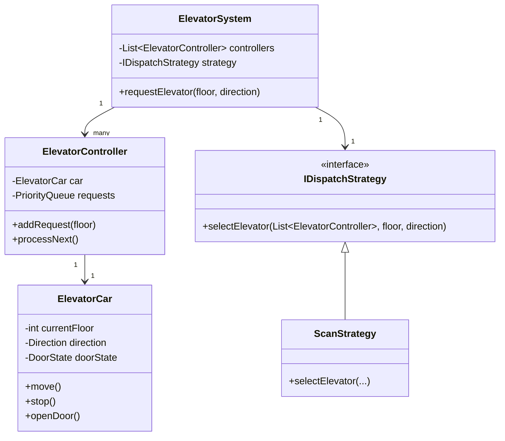

# Elevator System LLD

The Elevator System is a classic Low-Level Design (LLD) problem that tests a candidate's ability to handle **concurrency**, **state management**, and **scheduling algorithms**. The primary goal is to move passengers between floors efficiently while minimizing wait times and power consumption.

---

## 1. Overview & System Requirements

### Core Entities
- **ElevatorSystem**: The central coordinator (Singleton) that manages the bank of elevators.
- **ElevatorCar**: The physical entity that moves, opens/closes doors, and tracks its current floor.
- **InternalRequest**: A request made by a passenger inside the car to go to a specific floor.
- **ExternalRequest**: A request made by a passenger at a floor to go Up or Down.
- **Dispatcher**: The logic engine that decides which elevator should handle a specific external request.
- **DispatchStrategy**: The algorithm used to prioritize floor visits (e.g., FCFS, SCAN).

### Functional Requirements
1. **External Request**: Users can call an elevator from a floor by specifying a direction (Up/Down).
2. **Internal Request**: Users inside the elevator can select a destination floor.
3. **Optimal Dispatch**: The system must assign the "best" elevator to an external request to minimize latency.
4. **State Tracking**: Elevators must track their current floor, direction, and door status.
5. **Safety**: Support for emergency stops and weight limits (conceptual).

### Constraints
- Multiple elevators must operate independently but be coordinated by a central system.
- Requests must be handled such that the elevator doesn't oscillate inefficiently (e.g., moving from 1 to 10, then back to 2, then to 11).

---

## 2. Design Principles & Patterns

### SOLID Principles
- **Single Responsibility Principle (SRP)**: The `ElevatorCar` handles movement and state, while the `Dispatcher` handles the logic of assigning requests.
- **Open/Closed Principle (OCP)**: By using a `DispatchStrategy` interface, we can introduce new scheduling algorithms (like Look or FCFS) without modifying the `ElevatorSystem` code.
- **Dependency Inversion Principle (DIP)**: High-level modules (`ElevatorSystem`) depend on abstractions (`IDispatchStrategy`) rather than concrete implementations.

### Design Patterns Applied
| Pattern | Application | Purpose |
| :--- | :--- | :--- |
| **Singleton** | `ElevatorSystem` | Ensures there is only one global coordinator for all elevators in the building. |
| **State Pattern** | `ElevatorState` | Manages behavior based on whether the elevator is `IDLE`, `MOVING_UP`, or `MOVING_DOWN`. |
| **Strategy Pattern** | `DispatchStrategy` | Allows switching between different algorithms (e.g., SCAN vs. Shortest Seek Time First). |
| **Command Pattern** | `Request` | Encapsulates a request (floor, direction) as an object to be queued and processed. |

---

## 3. Class Structure & Relationships

### ASCII Class Diagram


### Relationship Definitions
- **Composition**: `ElevatorSystem` owns multiple `ElevatorController` objects.
- **Aggregation**: `ElevatorController` manages an `ElevatorCar`.
- **Strategy**: `ElevatorSystem` uses an `IDispatchStrategy` to decide which controller to trigger.

---

## 4. Step-by-Step Logic & Code Walkthrough

### The Dispatching Logic (The "SCAN" Algorithm)
The most efficient way to run an elevator is the **SCAN algorithm**. The elevator continues to move in one direction until it hits the highest/lowest requested floor in that direction, then reverses.

1. **External Request $\to$ Dispatcher**: A user at Floor 5 presses "UP".
2. **Selection**: The Dispatcher looks for:
   - An elevator already moving UP and currently below Floor 5.
   - An IDLE elevator.
   - An elevator moving DOWN but already above Floor 5 (least preferred).
3. **Execution**: The selected `ElevatorController` adds Floor 5 to its `up_queue` or `down_queue`.
4. **Movement**: The `ElevatorCar` updates its `currentFloor` until it matches a request in the current direction's queue.

### Implementation

```python
from enum import Enum
from heapq import heappush, heappop
import collections

class Direction(Enum):
    UP = 1
    DOWN = -1
    IDLE = 0

class DoorState(Enum):
    OPEN = 1
    CLOSED = 0

class Request:
    def __init__(self, floor, direction=None):
        self.floor = floor
        self.direction = direction # None for internal requests

class ElevatorCar:
    def __init__(self, id):
        self.id = id
        self.current_floor = 0
        self.direction = Direction.IDLE
        self.door_state = DoorState.CLOSED

    def move(self, target_floor):
        print(f"Elevator {self.id} moving from {self.current_floor} to {target_floor}")
        self.current_floor = target_floor
        self.open_door()

    def open_door(self):
        self.door_state = DoorState.OPEN
        print(f"Elevator {self.id} doors OPEN at floor {self.current_floor}")
        self.door_state = DoorState.CLOSED

class ElevatorController:
    def __init__(self, car):
        self.car = car
        # Min-heap for UP requests, Max-heap for DOWN requests
        self.up_queue = [] 
        self.down_queue = []

    def add_request(self, floor):
        if floor > self.car.current_floor:
            heappush(self.up_queue, floor)
        elif floor < self.car.current_floor:
            heappush(self.down_queue, -floor) # Max-heap simulation
        else:
            self.car.open_door()

    def process_requests(self):
        while self.up_queue or self.down_queue:
            # Simple SCAN Logic: Process all UP then all DOWN
            if self.car.direction == Direction.UP or self.car.direction == Direction.IDLE:
                self.car.direction = Direction.UP
                while self.up_queue:
                    target = heappop(self.up_queue)
                    self.car.move(target)
            
            if self.down_queue:
                self.car.direction = Direction.DOWN
                while self.down_queue:
                    target = -heappop(self.down_queue)
                    self.car.move(target)
        
        self.car.direction = Direction.IDLE

class ElevatorSystem:
    _instance = None

    def __new__(cls):
        if cls._instance is None:
            cls._instance = super(ElevatorSystem, cls).__new__(cls)
            cls._instance.controllers = []
        return cls._instance

    def add_elevator(self, car):
        self.controllers.append(ElevatorController(car))

    def request_elevator(self, floor, direction):
        # Dispatch Logic: Find the closest elevator moving in the same direction
        best_controller = None
        min_distance = float('inf')

        for controller in self.controllers:
            dist = abs(controller.car.current_floor - floor)
            if dist < min_distance:
                # Heuristic: Prefer elevators already moving in the requested direction
                if controller.car.direction == direction:
                    dist -= 2 # Weight bias
                min_distance = dist
                best_controller = controller

        print(f"Assigning request at floor {floor} to Elevator {best_controller.car.id}")
        best_controller.add_request(floor)
        best_controller.process_requests()

# --- Execution ---
def solve():
    system = ElevatorSystem()
    system.add_elevator(ElevatorCar(1))
    system.add_elevator(ElevatorCar(2))

    # User at floor 3 wants to go UP
    system.request_elevator(3, Direction.UP)
    # User inside elevator 1 wants to go to floor 7
    system.controllers[0].add_request(7)
    system.controllers[0].process_requests()

if __name__ == "__main__":
    solve()
```

---

## 5. Complexity Analysis

### Time Complexity
| Operation | Complexity | Reasoning |
| :--- | :--- | :--- |
| **Request Dispatching** | $O(E)$ | We iterate through $E$ elevators to find the optimal one. |
| **Adding Request** | $O(\log F)$ | Inserting into a priority queue (heap) where $F$ is the number of requested floors. |
| **Processing Floor** | $O(1)$ | Moving the car to the next popped floor from the heap. |

### Space Complexity
- **Space**: $O(E \times F)$, where $E$ is the number of elevators and $F$ is the maximum number of pending requests per elevator.

---

## 6. Real-World Applications

This LLD pattern is used in several production-grade systems beyond actual elevators:
1. **Disk Scheduling (OS)**: The SCAN (Elevator) algorithm is used by operating systems to move the disk arm to read blocks, minimizing seek time.
2. **Task Scheduling in Distributed Systems**: Assigning a task to the "closest" available worker node to minimize network latency.
3. **Warehouse Robotics**: In Amazon-style warehouses, robots (Kiva) are dispatched to pods using similar proximity and direction-based heuristics.
4. **Ride-Sharing Apps**: Uber/Lyft use a more complex version of the "Dispatcher" pattern to match a rider with the most optimal driver.