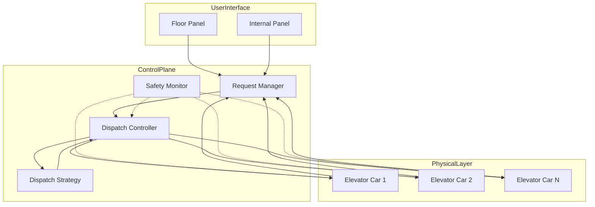

# Solution Guide: High-Performance Elevator Dispatch System

## 1. Requirements & System Constraints

### 1.1 Functional Requirements
*   **Request Handling**: Users can request an elevator from any floor (Up/Down) and select a destination floor from inside the elevator.
*   **Dispatch Logic**: The system must intelligently assign a request to the most optimal elevator based on distance, current direction, and load.
*   **State Management**: Track the real-time position, direction, door status, and load of every elevator car.
*   **Priority Handling**: Support for emergency overrides (fire alarm, medical emergency) and VIP priority.
*   **Capacity Constraints**: Elevators should not accept more passengers than their weight limit allows.
*   **Safety Protocols**: Automatic door closing/opening and emergency stop functionality.

### 1.2 Non-Functional Requirements
*   **Low Latency**: Dispatch decisions must be made in milliseconds to ensure a responsive user experience.
*   **High Availability**: The system cannot have a single point of failure; if the central controller fails, elevators must operate in a basic "local" mode.
*   **Reliability**: Safety is paramount. State consistency between the physical hardware and the software controller is critical.
*   **Efficiency**: Minimize the average wait time (AWT) and total travel time (TTT), while optimizing for energy consumption.

### 1.3 Scale Estimations
*   **Building Scale**: Up to 100 floors.
*   **Elevator Bank**: Up to 16 elevators per bank.
*   **Request Volume**: Peak hours may see hundreds of requests per minute.
*   **Update Frequency**: Position updates every 100ms–500ms per car.

---

## 2. High-Level Architecture

The system follows a **Controller-Worker pattern**. The `ElevatorController` acts as the orchestrator, while `ElevatorCar` instances act as the actuators.

### 2.1 Core Components
*   **DispatchController**: The brain of the system. It implements the `DispatchStrategy` to map requests to cars.
*   **ElevatorCar**: Manages its own internal state machine (Moving, Idle, DoorOpen, OutOfService).
*   **RequestManager**: Maintains the queue of pending floor requests and internal destination requests.
*   **SensorLayer**: Interface with hardware (weight sensors, floor proximity sensors, button presses).
*   **SafetyMonitor**: An independent watchdog service that overrides all commands during emergencies.

### 2.2 Architecture Diagram



### 2.3 Dispatch Logic: The Cost Function
Instead of a simple FIFO queue, the system uses a **Cost-Based Dispatch Algorithm**. When a call comes from floor $f$ in direction $d$, the controller calculates a cost for each elevator $i$:

$$Cost_i = \text{Distance}(current\_floor_i, f) + \text{DirectionPenalty} + \text{StopPenalty} + \text{LoadPenalty}$$

*   **DirectionPenalty**: 0 if moving toward $f$ in direction $d$; high if moving away.
*   **StopPenalty**: Added for every intermediate stop the elevator must make before reaching $f$.
*   **LoadPenalty**: High if the elevator is near max capacity.

---

## 3. Detailed Database Schema Design

While the real-time control loop happens in-memory (Redis/State Machine), a relational database is used for auditing, configuration, and analytics.

### 3.1 Schema Design (SQL)

**Table: `elevators`**
| Field | Type | Constraints | Description |
| :--- | :--- | :--- | :--- |
| `elevator_id` | UUID | PK | Unique identifier for the car |
| `bank_id` | UUID | FK | Reference to the elevator bank |
| `max_capacity` | INT | NOT NULL | Weight limit in kg |
| `status` | ENUM | NOT NULL | (Active, Maintenance, OutOfOrder) |
| `created_at` | TIMESTAMP | | Registration date |

**Table: `elevator_logs`** (Time-series data)
| Field | Type | Constraints | Description |
| :--- | :--- | :--- | :--- |
| `log_id` | BIGINT | PK | Sequential ID |
| `elevator_id` | UUID | FK, Index | Reference to the car |
| `floor` | INT | | Floor level |
| `direction` | ENUM | | (Up, Down, Idle) |
| `timestamp` | TIMESTAMP | Index | Event time |

**Table: `request_history`**
| Field | Type | Constraints | Description |
| :--- | :--- | :--- | :--- |
| `request_id` | UUID | PK | Unique request ID |
| `floor` | INT | | Floor where request originated |
| `direction` | ENUM | | Up/Down |
| `assigned_elevator`| UUID | FK | Elevator that handled the request |
| `wait_time` | INT | | Time from request to pickup (ms) |
| `timestamp` | TIMESTAMP | | Request time |

### 3.2 Storage Reasoning
*   **SQL (PostgreSQL)**: Used for configuration and auditing. Strong ACID properties ensure that maintenance logs and safety audits are immutable and consistent.
*   **In-Memory (Redis)**: Used for the real-time state of elevators (current floor, direction, load). This allows the `DispatchController` to query states with sub-millisecond latency.

---

## 4. Core API Design

The system exposes a REST API for administrative tasks and a WebSocket interface for real-time updates.

### 4.1 Floor Call Request
**Endpoint**: `POST /api/v1/requests`
**Payload**:
```json
{
  "floor": 12,
  "direction": "UP",
  "request_type": "STANDARD", // STANDARD, VIP, EMERGENCY
  "timestamp": "2023-10-27T10:00:00Z"
}
```
**Response**: `202 Accepted`

### 4.2 Internal Destination Selection
**Endpoint**: `POST /api/v1/elevators/{elevator_id}/destination`
**Payload**:
```json
{
  "destination_floor": 45,
  "timestamp": "2023-10-27T10:00:05Z"
}
```
**Response**: `200 OK`

### 4.3 Real-time State Stream (WebSocket)
**Channel**: `/ws/elevator-status`
**Payload (Push)**:
```json
{
  "elevator_id": "uuid-123",
  "current_floor": 14,
  "direction": "UP",
  "door_status": "CLOSED",
  "load_percentage": 65
}
```

---

## 5. Scalability & Advanced Topics

### 5.1 Fault Tolerance & Reliability
*   **Heartbeat Mechanism**: Each `ElevatorCar` sends a heartbeat every 200ms. If the `DispatchController` misses 3 heartbeats, the car is marked `OutOfService` and its assigned requests are redistributed.
*   **Local Mode (Fallback)**: If the central controller crashes, cars switch to a "Local SCAN" algorithm. They independently handle floor calls by moving in one direction until all requests in that direction are cleared.
*   **Safety Interlock**: A hardware-level interrupt is implemented. If the `SafetyMonitor` detects a fire or weight overload, it cuts power to the motor or forces a stop regardless of software commands.

### 5.2 Performance Optimization
*   **Request Batching**: Instead of calculating the cost for every single request instantly, the controller can batch requests arriving within a 50ms window to optimize the global dispatch.
*   **Zoning**: For skyscrapers (100+ floors), the system implements **Zoning**. Elevators are divided into Low-Rise, Mid-Rise, and High-Rise banks. This reduces the travel distance for the majority of trips.

### 5.3 Message Queueing
To decouple the Request Manager from the Dispatch Controller, a message queue (e.g., RabbitMQ or Kafka) is used.
*   **Topic**: `floor_requests` $\rightarrow$ Consumed by `DispatchController`.
*   **Topic**: `elevator_events` $\rightarrow$ Consumed by `AuditService` for logging to SQL.

---

## 6. Trade-off Analysis

| Trade-off | Selection | Reasoning |
| :--- | :--- | :--- |
| **Consistency vs Availability** | **Availability (AP)** | In a safety-critical system, we cannot have the elevator "freeze" because it's waiting for a distributed lock. Local mode ensures availability. |
| **Latency vs Storage** | **Latency** | Real-time position tracking is kept in-memory. Writing every floor change to a disk-based DB in the critical path would introduce unacceptable lag. |
| **SCAN vs SSTF** | **SCAN (Modified)** | Shortest Seek Time First (SSTF) can lead to "starvation" (a request at the top floor is ignored if there's a constant stream of requests at the bottom). SCAN ensures all floors are served. |
| **Centralized vs Distributed** | **Hybrid** | Centralized dispatch for global optimization, distributed execution for failure resilience. |