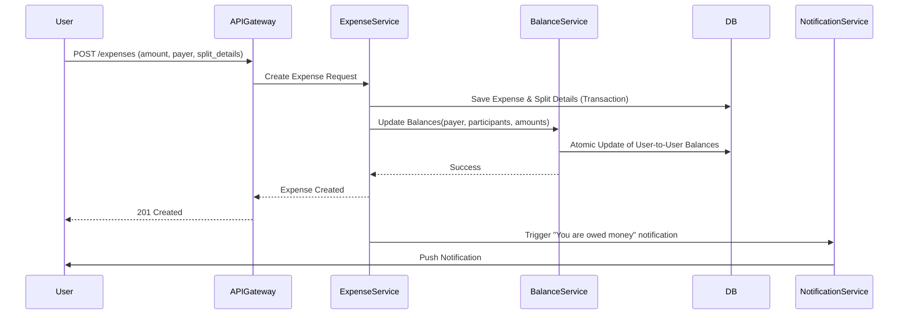

# System Design Document: Splitwise Expense Management System

## 1. Requirements & System Constraints

### 1.1 Functional Requirements
*   **User Management**: Users can create profiles, search for other users, and manage their settings.
*   **Group Management**: Users can create groups, invite members, and manage group membership.
*   **Expense Tracking**:
    *   A user can add an expense, specify the total amount, and designate a "payer."
    *   **Split Methods**:
        *   **Equal**: Amount divided equally among participants.
        *   **Exact**: Specific amounts assigned to each participant.
        *   **Percentage**: Percentage of total assigned to each participant.
    *   Expenses can be added to a group or as a non-group transaction.
*   **Balance Tracking**:
    *   The system must track how much each user owes others.
    *   Ability to view "Net Balance" (total owed to the user minus total user owes).
*   **Settlements**: Users can record payments to settle debts.
*   **Debt Simplification**: An algorithm to minimize the number of transactions required to settle all debts within a group (e.g., if A owes B \$10 and B owes C \$10, A just owes C \$10).

### 1.2 Non-Functional Requirements
*   **Consistency**: Financial data must be strictly consistent (ACID properties). No "lost updates" on balances.
*   **Availability**: High availability for reading balances and adding expenses.
*   **Precision**: No floating-point errors. All currency must be handled as integers (e.g., cents).
*   **Scalability**: Ability to handle millions of users and high volumes of transactions during peak times (e.g., holiday seasons).

### 1.3 Scale Estimations
*   **Users**: 10 Million Monthly Active Users (MAU).
*   **Expenses**: Average 5 expenses per user per month $\approx$ 50M expenses/month.
*   **Read/Write Ratio**: High read-to-write ratio (users check balances more often than they add expenses).

---

## 2. High-Level Architecture

### 2.1 Core Components
*   **API Gateway**: Handles authentication, rate limiting, and request routing.
*   **User Service**: Manages user profiles and friendship graphs.
*   **Group Service**: Manages group metadata and membership.
*   **Expense Service**: Handles the business logic for creating and splitting expenses.
*   **Balance Service**: Manages the "Ledger." It computes the current state of debts and handles the Debt Simplification logic.
*   **Settlement Service**: Processes payments and updates the ledger.
*   **Notification Service**: Alerts users when they are added to an expense or when a debt is simplified.

### 2.2 System Workflow (Mermaid)



---

## 3. Detailed Database Schema Design

### 3.1 Rationale
A **Relational Database (PostgreSQL)** is chosen over NoSQL because:
1.  **ACID Compliance**: Crucial for financial transactions to prevent balance mismatches.
2.  **Complex Queries**: Ability to join Users, Groups, and Expenses for detailed reporting.
3.  **Strong Typing**: Ensuring monetary values are stored as `BIGINT` to prevent rounding errors.

### 3.2 Schema Tables

#### `users`
| Field | Type | Constraints | Description |
| :--- | :--- | :--- | :--- |
| `user_id` | UUID | PK | Unique user identifier |
| `name` | VARCHAR | NOT NULL | Full name |
| `email` | VARCHAR | UNIQUE | User email |
| `currency` | VARCHAR | NOT NULL | Default currency (e.g., USD) |

#### `groups`
| Field | Type | Constraints | Description |
| :--- | :--- | :--- | :--- |
| `group_id` | UUID | PK | Unique group identifier |
| `name` | VARCHAR | NOT NULL | Group name |
| `created_at` | TIMESTAMP | NOT NULL | Creation date |

#### `group_members`
| Field | Type | Constraints | Description |
| :--- | :--- | :--- | :--- |
| `group_id` | UUID | FK $\rightarrow$ groups | Group identifier |
| `user_id` | UUID | FK $\rightarrow$ users | User identifier |
| `joined_at` | TIMESTAMP | NOT NULL | Date of joining |
| **PK** | (group_id, user_id) | | Composite Primary Key |

#### `expenses`
| Field | Type | Constraints | Description |
| :--- | :--- | :--- | :--- |
| `expense_id` | UUID | PK | Unique expense identifier |
| `group_id` | UUID | FK $\rightarrow$ groups (NULLable) | Group ID (NULL for non-group) |
| `description` | TEXT | NOT NULL | Description of expense |
| `total_amount`| BIGINT | NOT NULL | Amount in cents |
| `payer_id` | UUID | FK $\rightarrow$ users | Who paid the bill |
| `split_type` | ENUM | EQUAL, EXACT, PERCENT | Type of split |
| `created_at` | TIMESTAMP | NOT NULL | Timestamp |

#### `expense_splits`
| Field | Type | Constraints | Description |
| :--- | :--- | :--- | :--- |
| `expense_id` | UUID | FK $\rightarrow$ expenses | Reference to expense |
| `user_id` | UUID | FK $\rightarrow$ users | User who owes money |
| `amount_owed` | BIGINT | NOT NULL | Amount user owes in cents |
| **PK** | (expense_id, user_id) | | Composite Primary Key |

#### `user_balances`
| Field | Type | Constraints | Description |
| :--- | :--- | :--- | :--- |
| `user_from` | UUID | FK $\rightarrow$ users | Debtor |
| `user_to` | UUID | FK $\rightarrow$ users | Creditor |
| `amount` | BIGINT | NOT NULL | Current net balance in cents |
| **PK** | (user_from, user_to) | | Composite Primary Key |
| **Index** | user_from | | For fast lookup of debts owed |
| **Index** | user_to | | For fast lookup of money owed to user |

---

## 4. Core API Design

### 4.1 Create Expense
`POST /api/v1/expenses`

**Request Body:**
```json
{
  "description": "Dinner at Nobu",
  "total_amount": 15000, // $150.00
  "payer_id": "user_uuid_1",
  "group_id": "group_uuid_abc", // Optional
  "split_type": "PERCENT",
  "splits": [
    {"user_id": "user_uuid_1", "value": 50},
    {"user_id": "user_uuid_2", "value": 25},
    {"user_id": "user_uuid_3", "value": 25}
  ]
}
```
**Response:** `201 Created`

### 4.2 Get User Balances
`GET /api/v1/users/{userId}/balances`

**Response:**
```json
{
  "userId": "user_uuid_1",
  "net_balance": 5000,
  "details": [
    {"user_id": "user_uuid_2", "balance": 7500, "type": "OWED_TO_ME"},
    {"user_id": "user_uuid_3", "balance": -2500, "type": "I_OWE"}
  ]
}
```

### 4.3 Settle Up
`POST /api/v1/settlements`

**Request Body:**
```json
{
  "payer_id": "user_uuid_2",
  "payee_id": "user_uuid_1",
  "amount": 7500
}
```
**Response:** `200 OK`

---

## 5. Scalability & Advanced Topics

### 5.1 Debt Simplification Algorithm
To minimize transactions, we use a **Net Balance Approach**:
1.  Calculate the net balance for every user in a group (Total Credit - Total Debit).
2.  Create two heaps: `debtors` (negative balance) and `creditors` (positive balance).
3.  While both heaps are not empty:
    *   Pop the largest debtor and largest creditor.
    *   Settle the minimum of the two absolute values.
    *   Update balances and push back into heaps if they still have remaining balances.
    *   Complexity: $O(N \log N)$ where $N$ is the number of users in the group.

### 5.2 Caching Strategy
*   **Balance Cache**: Use Redis to store the `user_balances` for highly active groups.
*   **Cache Invalidation**: Use a **Write-Through Cache** strategy. When an expense is added, the Balance Service updates the DB and immediately invalidates/updates the corresponding Redis keys.

### 5.3 Concurrency Control
To prevent race conditions when multiple users add expenses to the same group:
*   **Pessimistic Locking**: `SELECT FOR UPDATE` on the `user_balances` row for the specific `user_from` and `user_to` pair.
*   **Sequence**:
    1.  Start Transaction.
    2.  Lock rows in `user_balances` (ordered by UUID to avoid deadlocks).
    3.  Update balances.
    4.  Commit Transaction.

### 5.4 Sharding & Partitioning
*   **Database Sharding**: Shard the `expenses` and `expense_splits` tables by `group_id`. Since most queries are group-centric, this ensures all data for a group resides on one shard.
*   **Partitioning**: Use time-based partitioning for the `expenses` table (e.g., monthly partitions) to keep indexes small and manageable.

---

## 6. Trade-off Analysis

| Trade-off | Decision | Reasoning |
| :--- | :--- | :--- |
| **Consistency vs Availability** | **Consistency (CP)** | In a financial app, showing an incorrect balance is worse than a momentary timeout. We prioritize ACID compliance. |
| **Normalization vs Denormalization**| **Partial Denormalization** | While balances can be computed from `expense_splits` (normalized), we maintain a `user_balances` table (denormalized) to avoid $O(N)$ summation on every read. |
| **Floating Point vs Integer** | **Integer (Cents)** | `Double` or `Float` types lead to precision errors (e.g., $0.1 + 0.2 \neq 0.3$). Integers ensure absolute accuracy. |
| **Synchronous vs Asynchronous Update** | **Hybrid** | Expense creation and Balance updates are synchronous (atomic transaction). Debt simplification and Notifications are asynchronous (via Message Queue) to reduce API latency. |