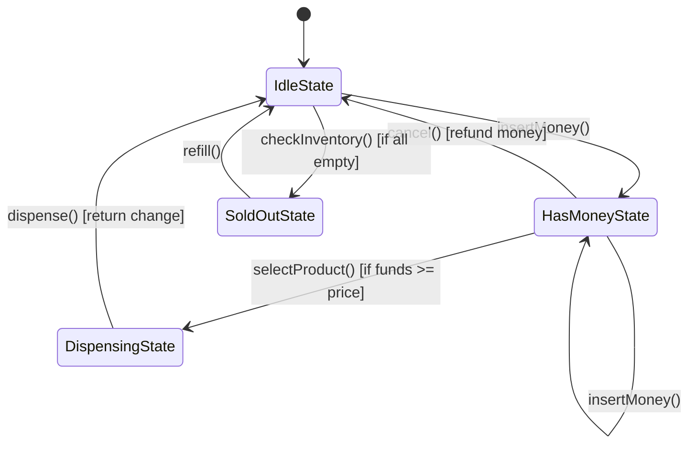

# System Design Document: Vending Machine (State Pattern Implementation)

## 1. Requirements & System Constraints

### 1.1 Functional Requirements
The system must simulate a professional vending machine capable of handling the end-to-end lifecycle of a product purchase.

*   **State Management**: The machine must behave differently based on its current state (e.g., you cannot select a product before inserting money).
*   **Product Management**: Support for multiple products with varying prices and stock levels.
*   **Payment Processing**: Ability to accept coins/bills and track the current balance.
*   **Product Dispensing**: Validate product availability and sufficient funds before dispensing.
*   **Transaction Cancellation**: Allow users to cancel a transaction and receive a full refund of the current balance.
*   **Change Return**: Calculate and return the remaining balance after a successful purchase.
*   **Administrative Actions**: Ability to refill stock and collect cash (handled via an admin interface).

### 1.2 Non-Functional Requirements
*   **Thread Safety**: The machine must handle concurrent inputs (e.g., a user pressing a button while the coin mechanism is processing).
*   **Extensibility**: New states (e.g., `MaintenanceState`, `OutOfOrderState`) should be addable without modifying existing state logic (Open/Closed Principle).
*   **Reliability**: Ensure that the system never dispenses a product without payment or takes payment without dispensing (Atomicity).
*   **Low Latency**: Response time for user interactions must be near-instantaneous (< 100ms).

---

## 2. High-Level Architecture

### 2.1 Design Pattern: The State Pattern
The core of this design is the **State Pattern**. Instead of using massive `if-else` or `switch` blocks to check the current status of the machine, we encapsulate state-specific behavior into separate classes.

#### Components:
1.  **VendingMachine (Context)**: Maintains a reference to the current state object and the shared data (inventory, balance).
2.  **State (Interface)**: Defines the contract for all possible actions (`insertMoney()`, `selectProduct()`, `dispense()`, `refund()`).
3.  **Concrete States**: 
    *   `IdleState`: Waiting for money.
    *   `HasMoneyState`: Money inserted, waiting for selection.
    *   `DispensingState`: Processing the release of the product.
    *   `SoldOutState`: Special state when no products are available.

### 2.2 Interaction Diagram (Mermaid)



---

## 3. Detailed Design

### 3.1 Class Structure (LLD)

#### Core Entities
*   **Product**: `id`, `name`, `price`.
*   **Inventory**: A map of `Product` to `Quantity`.
*   **VendingMachine**: 
    *   `State currentState`
    *   `double currentBalance`
    *   `Inventory inventory`
    *   `setState(State state)`

#### State Interface & Implementation
```java
interface State {
    void insertMoney(VendingMachine vm, double amount);
    void selectProduct(VendingMachine vm, String productId);
    void dispense(VendingMachine vm);
    void refund(VendingMachine vm);
}

class IdleState implements State {
    public void insertMoney(VendingMachine vm, double amount) {
        vm.addBalance(amount);
        vm.setState(new HasMoneyState());
    }
    public void selectProduct(...) { throw new IllegalStateException("Insert money first"); }
    // ... other methods
}
```

### 3.2 Database Schema (For Fleet Management)
While a single machine operates on local state, a fleet of machines requires a centralized database for telemetry and inventory management.

**Reasoning**: SQL is preferred here due to the need for ACID compliance regarding financial transactions and inventory counts.

#### Table: `machines`
| Field | Type | Key | Description |
| :--- | :--- | :--- | :--- |
| `machine_id` | UUID | PK | Unique identifier for the hardware |
| `location` | String | | Physical placement |
| `status` | Enum | | ONLINE, OFFLINE, MAINTENANCE |

#### Table: `products`
| Field | Type | Key | Description |
| :--- | :--- | :--- | :--- |
| `product_id` | UUID | PK | Unique product SKU |
| `name` | String | | Display name |
| `base_price` | Decimal | | Standard MSRP |

#### Table: `inventory`
| Field | Type | Key | Description |
| :--- | :--- | :--- | :--- |
| `machine_id` | UUID | FK | Reference to machine |
| `product_id` | UUID | FK | Reference to product |
| `quantity` | Integer | | Current stock in slot |
| *Index* | `(machine_id, product_id)` | Unique | Fast lookup for stock check |

#### Table: `transactions`
| Field | Type | Key | Description |
| :--- | :--- | :--- | :--- |
| `tx_id` | UUID | PK | Unique transaction ID |
| `machine_id` | UUID | FK | Machine where purchase occurred |
| `product_id` | UUID | FK | Product dispensed |
| `amount_paid` | Decimal | | Total money inserted |
| `change_given` | Decimal | | Balance returned |
| `timestamp` | DateTime | | Time of transaction |

---

## 4. Core API Design (IoT Backend)

The vending machine communicates with a cloud backend via REST or MQTT.

### 4.1 Dispense Event (Telemetry)
**Endpoint**: `POST /api/v1/telemetry/transaction`
**Payload**:
```json
{
  "machine_id": "vm-12345",
  "transaction_id": "tx-98765",
  "product_id": "prod-cola-01",
  "amount_paid": 1.50,
  "change_returned": 0.25,
  "timestamp": "2023-10-27T10:00:00Z"
}
```
**Response**: `202 Accepted`

### 4.2 Inventory Status
**Endpoint**: `GET /api/v1/machines/{machine_id}/inventory`
**Response**:
```json
{
  "machine_id": "vm-12345",
  "items": [
    { "product_id": "prod-cola-01", "quantity": 5, "status": "LOW_STOCK" },
    { "product_id": "prod-chips-02", "quantity": 0, "status": "OUT_OF_STOCK" }
  ]
}
```

### 4.3 Admin Refill
**Endpoint**: `PATCH /api/v1/machines/{machine_id}/refill`
**Payload**:
```json
{
  "refills": [
    { "product_id": "prod-cola-01", "added_quantity": 20 }
  ]
}
```

---

## 5. Scalability & Advanced Topics

### 5.1 Concurrency and Thread Safety
In a physical machine, multiple hardware interrupts can occur. 
*   **Locking**: Use a `ReentrantLock` or `synchronized` block around the `setState()` and `currentBalance` updates to prevent race conditions (e.g., two coins being registered at the exact same microsecond).
*   **Atomic Variables**: Use `AtomicInteger` for inventory counts if using a multi-threaded environment.

### 5.2 Fault Tolerance
*   **Local First**: The machine must operate in **Offline Mode**. State transitions and dispensing should happen locally. Sync with the cloud backend should be asynchronous via a **Write-Ahead Log (WAL)** or a local SQLite buffer.
*   **Retry Mechanism**: If the cloud API is down, the machine queues the transaction telemetry and retries using exponential backoff.

### 5.3 Caching Strategy
*   **Local Cache**: The machine caches product prices and IDs locally to avoid network calls during the "Select Product" phase.
*   **CDN/Edge**: For a global fleet, use edge locations to store machine configurations and update firmware.

---

## 6. Trade-off Analysis

### 6.1 State Pattern vs. Conditional Logic
*   **Trade-off**: State Pattern increases the number of classes (Boilerplate) but drastically reduces complexity in the business logic.
*   **Decision**: State Pattern is chosen because vending machines are "State-Heavy." Adding a new state (like `PaymentProcessingState` for Credit Cards) would require zero changes to the `IdleState` or `DispensingState`.

### 6.2 Consistency vs. Availability (CAP Theorem)
*   **Scenario**: Machine loses internet connectivity.
*   **Trade-off**: Should the machine stop selling (Consistency) or continue selling (Availability)?
*   **Decision**: **Availability** is prioritized. A vending machine is a physical utility. We accept "Eventual Consistency" where the backend is updated once the connection is restored.

### 6.3 Database Selection (SQL vs NoSQL)
*   **Trade-off**: NoSQL (like MongoDB) would allow flexible product attributes (e.g., calories, allergens). SQL ensures strict financial auditing.
*   **Decision**: **SQL** is chosen. Transactional integrity (ACID) is paramount when handling money and inventory. Product attributes can be handled via a JSONB column in PostgreSQL if flexibility is needed.