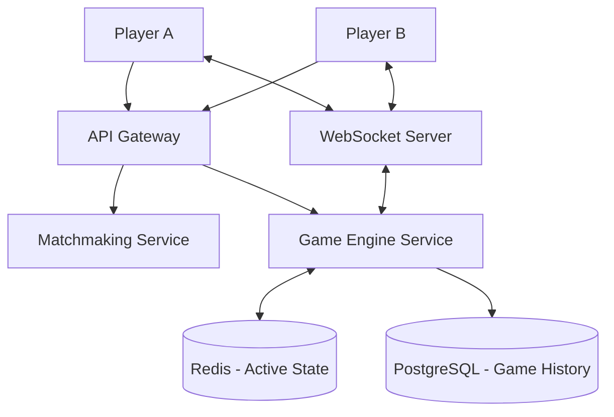

# System Design Document: Online Multiplayer Tic-Tac-Toe

## 1. Requirements & System Constraints

### 1.1 Functional Requirements
*   **Matchmaking:** Users should be able to create a game or join an existing game via a game ID.
*   **Game Play:** Two players (X and O) take turns marking a 3x3 grid.
*   **Win/Draw Logic:** The system must automatically detect a winner (3 in a row, column, or diagonal) or a draw (board full with no winner).
*   **Real-time Updates:** Moves made by one player must be reflected on the opponent's screen in near real-time.
*   **Game State Persistence:** Game history and final results should be stored for auditing and user statistics.
*   **Turn Validation:** The system must enforce turn order and prevent players from marking an already occupied cell.

### 1.2 Non-Functional Requirements
*   **Low Latency:** Move updates should be delivered within < 200ms to ensure a smooth user experience.
*   **Consistency:** Strong consistency is required for move placement; two players cannot occupy the same cell.
*   **Availability:** The system should be highly available to allow users to start games at any time.
*   **Scalability:** The architecture should support thousands of concurrent games.

### 1.3 Scale Estimations
*   **Concurrent Users:** 100k Daily Active Users (DAU).
*   **Peak Concurrent Games:** 10k active games.
*   **Moves per Game:** Max 9 moves.
*   **Throughput:** Low request volume per game, but high frequency of small updates.

---

## 2. High-Level Architecture

The system adopts a **Client-Server architecture** using **WebSockets** for real-time bi-directional communication and a **REST API** for game management.

### 2.1 Core Components
*   **API Gateway:** Handles authentication, rate limiting, and routes requests to the appropriate microservices.
*   **Matchmaking Service:** Manages game creation, invites, and pairs players.
*   **Game Engine Service:** The core logic handler. It validates moves, updates the game state, and checks for win/draw conditions.
*   **State Store (Redis):** An in-memory cache storing active game boards and turn indicators for millisecond latency.
*   **Persistence Layer (PostgreSQL):** Stores user profiles, game history, and final outcomes.
*   **Notification Service (WebSocket Server):** Maintains active connections with clients to push move updates.

### 2.2 Architecture Diagram

### 2.3 Sequence Flow: Making a Move
1. **Player A** sends a move request via WebSocket: `{ gameId: "123", row: 1, col: 1 }`.
2. **Game Engine** receives the move and fetches the current state from **Redis**.
3. **Game Engine** validates:
    *   Is it Player A's turn?
    *   Is cell (1,1) empty?
    *   Is the game still active?
4. If valid, **Game Engine** updates the board in **Redis** and checks for a win/draw.
5. **Game Engine** triggers the **WebSocket Server** to push the updated board to **Player B**.
6. The move is asynchronously persisted to **PostgreSQL**.

---

## 3. Detailed Database Schema Design

### 3.1 Storage Choice
*   **Redis:** Used for active games. The keyspace is small (3x3 grid), and the access pattern is highly frequent.
*   **PostgreSQL:** Used for long-term storage. Relational integrity is important for user statistics and game logs.

### 3.2 Database Tables

#### Table: `users`
| Field | Type | Constraints | Description |
| :--- | :--- | :--- | :--- |
| `user_id` | UUID | PK | Unique identifier for user |
| `username` | VARCHAR(50) | Unique, Not Null | User's display name |
| `created_at` | TIMESTAMP | Not Null | Account creation date |

#### Table: `games`
| Field | Type | Constraints | Description |
| :--- | :--- | :--- | :--- |
| `game_id` | UUID | PK | Unique identifier for the game |
| `player_x` | UUID | FK (users.user_id) | User playing as 'X' |
| `player_o` | UUID | FK (users.user_id) | User playing as 'O' |
| `status` | ENUM | ('ACTIVE', 'X_WIN', 'O_WIN', 'DRAW') | Current game state |
| `start_time` | TIMESTAMP | Not Null | When the game started |
| `end_time` | TIMESTAMP | Nullable | When the game ended |

#### Table: `moves`
| Field | Type | Constraints | Description |
| :--- | :--- | :--- | :--- |
| `move_id` | BIGINT | PK, Auto-increment | Unique move ID |
| `game_id` | UUID | FK (games.game_id) | Reference to the game |
| `player_id` | UUID | FK (users.user_id) | Who made the move |
| `row` | INT | Check (0-2) | Row index |
| `col` | INT | Check (0-2) | Column index |
| `move_order` | INT | Not Null | The turn number (1-9) |
| `timestamp` | TIMESTAMP | Not Null | Exact time of move |

**Indexing Strategy:**
*   `idx_games_status`: To quickly find active games for matchmaking.
*   `idx_moves_game_id`: To retrieve the full move history of a specific game efficiently.

---

## 4. Core API Design

### 4.1 Game Management (REST)

#### Create Game
`POST /api/v1/games`
*   **Request:** `{ "userId": "uuid" }`
*   **Response:** `201 Created` $\rightarrow$ `{ "gameId": "uuid", "playerRole": "X" }`

#### Join Game
`POST /api/v1/games/{gameId}/join`
*   **Request:** `{ "userId": "uuid" }`
*   **Response:** `200 OK` $\rightarrow$ `{ "gameId": "uuid", "playerRole": "O" }`

#### Get Game State
`GET /api/v1/games/{gameId}`
*   **Response:** `200 OK` $\rightarrow$ `{ "board": [["X", "", ""], ["", "O", ""], ...], "turn": "X", "status": "ACTIVE" }`

### 4.2 Game Play (WebSocket)

**Event: `make_move`**
*   **Payload:** `{ "gameId": "uuid", "row": 1, "col": 2 }`
*   **Response (Success):** `{ "type": "MOVE_ACCEPTED", "board": [...], "nextTurn": "O" }`
*   **Response (Error):** `{ "type": "ERROR", "message": "Invalid move or not your turn" }`

**Event: `game_update` (Push)**
*   **Payload:** `{ "gameId": "uuid", "lastMove": { "row": 1, "col": 2 }, "winner": "X" }`

---

## 5. Scalability & Advanced Topics

### 5.1 Concurrency Control
To prevent two players from claiming the same cell simultaneously, we use **Optimistic Locking** in Redis using the `WATCH` command or a **Distributed Lock (Redlock)**.
*   **Process:** `WATCH game_state_{id}` $\rightarrow$ `Check cell availability` $\rightarrow$ `MULTI` $\rightarrow$ `SET board` $\rightarrow$ `EXEC`. If another process modified the state, `EXEC` fails, and the move is rejected.

### 5.2 Scaling the WebSocket Layer
WebSockets are stateful. To scale horizontally:
*   **Sticky Sessions:** Use a Load Balancer with session affinity.
*   **Pub/Sub:** Use **Redis Pub/Sub**. When the Game Engine updates a move, it publishes a message to a channel `game_{id}`. All WebSocket servers subscribed to that channel will push the update to the connected clients.

### 5.3 Fault Tolerance
*   **State Recovery:** If a Game Engine instance crashes, the new instance can reconstruct the current state from Redis.
*   **Write-Behind Caching:** Moves are written to Redis immediately for latency and queued in a Message Queue (e.g., RabbitMQ or Kafka) for asynchronous persistence to PostgreSQL. This prevents DB bottlenecks from affecting game performance.

---

## 6. Trade-off Analysis

### 6.1 CAP Theorem: CP vs AP
For a competitive game, **Consistency (C)** and **Partition Tolerance (P)** are prioritized over Availability (A). 
*   **Reasoning:** It is better for a move to be slightly delayed or rejected (due to a network partition) than to allow two players to occupy the same square, which would corrupt the game integrity.

### 6.2 Latency vs. Durability
*   **Trade-off:** We use an in-memory store (Redis) as the primary source of truth for active games rather than the SQL database.
*   **Risk:** If Redis fails before the move is persisted to PostgreSQL, a move could be lost.
*   **Mitigation:** Enable Redis AOF (Append Only File) persistence to ensure durability without sacrificing the speed of in-memory operations.

### 6.3 Communication: REST vs. WebSockets
*   **REST:** Used for setup/joining because these are infrequent, request-response operations.
*   **WebSockets:** Used for moves because polling the server for "Did my opponent move yet?" would create unnecessary overhead and increase latency.