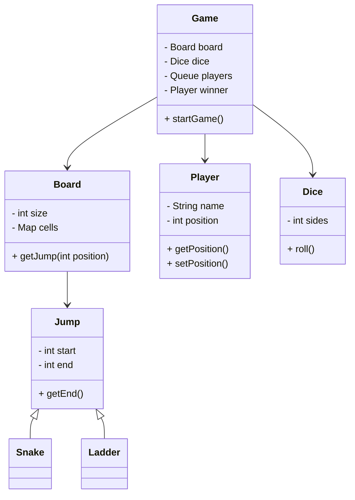

# Snake & Ladder LLD

## 1. Overview & System Requirements
The Snake & Ladder game is a classic board game where players race to reach the final square of a board. The board contains "snakes" (which move the player backward) and "ladders" (which move the player forward). 

### Core Entities
- **Board**: The grid containing cells and the placement of snakes and ladders.
- **Player**: The participant with a unique identity and a current position on the board.
- **Dice**: The mechanism to generate a random move distance.
- **Jump**: An abstraction for both Snakes and Ladders that changes a player's position.
- **Game**: The orchestrator that manages the game loop, turns, and victory conditions.

### Functional Requirements
- **Configurable Board**: Ability to set the board size and the number of snakes and ladders.
- **Multiplayer Support**: The game should support $N$ number of players.
- **Dice Logic**: A standard 6-sided die. Support for multiple dice can be an extension.
- **Movement Logic**: Players move forward by the dice value. If they land on a ladder, they climb; if they land on a snake, they slide down.
- **Winning Condition**: A player wins by reaching exactly the last cell of the board.
- **Turn Management**: Players take turns in a Round-Robin fashion.

---

## 2. Design Principles & Patterns

### OOP Design Principles
- **Single Responsibility Principle (SRP)**: 
    - `Dice` is only responsible for generating numbers.
    - `Board` is only responsible for the layout and jump mappings.
    - `Game` is only responsible for the game flow and turn management.
- **Open/Closed Principle (OCP)**: The `Jump` class is designed such that we can introduce new types of "special cells" (e.g., Portals, Teleports) without modifying the existing `Board` or `Game` logic.
- **Dependency Inversion**: The `Game` class depends on the `Board` and `Dice` abstractions rather than hardcoded logic, allowing us to swap a `StandardDice` for a `WeightedDice` easily.

### Design Patterns Applied
- **Strategy Pattern**: Used for the dice rolling mechanism. If the game evolves to have different dice types (e.g., 12-sided), the rolling strategy can be swapped.
- **Command/State Management**: The movement of the player can be viewed as a state transition from `current_position` $\to$ `new_position`.
- **Composition**: The `Game` class uses composition by holding references to `Board`, `Dice`, and a queue of `Players`.

---

## 3. Class Structure & Relationships

### Class Diagram (Text-Based)


### Attribute Definitions
| Class | Attribute | Type | Description |
| :--- | :--- | :--- | :--- |
| **Player** | `name` | String | Unique identifier for the player. |
| **Player** | `position` | Integer | Current cell index (starts at 0 or 1). |
| **Board** | `size` | Integer | Total cells (e.g., 100). |
| **Board** | `jumps` | Map | Mapping of start cell $\to$ end cell. |
| **Jump** | `start` | Integer | The cell that triggers the jump. |
| **Jump** | `end` | Integer | The destination cell. |
| **Dice** | `sides` | Integer | Max value of a roll (usually 6). |

---

## 4. Step-by-Step Logic & Code Walkthrough

### The Implementation
```python
import random
from collections import deque

class Jump:
    def __init__(self, start, end):
        self.start = start
        self.end = end

class Snake(Jump):
    def __init__(self, start, end):
        super().__init__(start, end)
        if start < end:
            raise ValueError("Snake start must be greater than end")

class Ladder(Jump):
    def __init__(self, start, end):
        super().__init__(start, end)
        if start > end:
            raise ValueError("Ladder start must be less than end")

class Player:
    def __init__(self, name):
        self.name = name
        self.position = 0

class Board:
    def __init__(self, size):
        self.size = size
        self.jumps = {}

    def add_jump(self, jump):
        self.jumps[jump.start] = jump.end

    def get_final_position(self, position):
        # If the position is a snake or ladder, return the destination
        return self.jumps.get(position, position)

class Dice:
    def __init__(self, sides=6):
        self.sides = sides

    def roll(self):
        return random.randint(1, self.sides)

class Game:
    def __init__(self, board_size, players_list, snakes, ladders):
        self.board = Board(board_size)
        self.dice = Dice()
        self.players = deque([Player(p) for p in players_list])
        
        for s in snakes: self.board.add_jump(Snake(*s))
        for l in ladders: self.board.add_jump(Ladder(*l))
        
        self.winner = None

    def play(self):
        while not self.winner:
            player = self.players.popleft()
            roll_val = self.dice.roll()
            
            old_pos = player.position
            new_pos = old_pos + roll_val
            
            if new_pos > self.board.size:
                print(f"{player.name} rolled {roll_val} but needs exact number to win. Stays at {old_pos}")
                self.players.append(player)
                continue
            
            # Apply Jump (Snake/Ladder)
            final_pos = self.board.get_final_position(new_pos)
            player.position = final_pos
            
            print(f"{player.name} rolled {roll_val}: {old_pos} -> {new_pos} -> {final_pos}")
            
            if player.position == self.board.size:
                self.winner = player
                print(f"🎉 {player.name} Wins the Game!")
            else:
                self.players.append(player)

# --- Execution ---
if __name__ == "__main__":
    snakes = [(17, 7), (54, 34), (62, 19), (98, 79)]
    ladders = [(3, 38), (24, 33), (42, 63), (72, 91)]
    game = Game(100, ["Alice", "Bob", "Charlie"], snakes, ladders)
    game.play()
```

### Logic Walkthrough
1.  **Initialization**: We initialize a `Board` and populate a map of `jumps`. Snakes and Ladders are treated as the same entity (`Jump`) but validated differently (Snakes go down, Ladders go up).
2.  **Turn Management**: We use a `deque` (Double-Ended Queue) to manage players. The current player is `popleft()`'ed, and if they don't win, they are `append()`'ed back to the end of the queue.
3.  **Movement Logic**:
    - Calculate `new_position = current + roll`.
    - Check if `new_position` exceeds board size (exact win requirement).
    - Check the `jumps` map: If the cell is a key in the map, the player is teleported to the value.
4.  **Termination**: The loop breaks immediately when a player's position equals the `board_size`.

---

## 5. Complexity Analysis

| Operation | Time Complexity | Space Complexity | Explanation |
| :--- | :--- | :--- | :--- |
| **Initialization** | $O(S + L)$ | $O(S + L)$ | Where $S$ is snakes and $L$ is ladders. |
| **One Turn** | $O(1)$ | $O(1)$ | Dice roll and map lookup are constant time. |
| **Total Game** | $O(T)$ | $O(P + S + L)$ | $T$ is the number of turns until a win; $P$ is number of players. |

---

## 6. Real-World Applications
While Snake & Ladder is a simple game, the LLD patterns used here are prevalent in production systems:
- **Turn-Based Systems**: The `deque` approach to turn management is used in multiplayer game servers (e.g., Hearthstone, Civilization).
- **Grid-Based Movement**: The logic of "landing on a cell and triggering an event" is the foundation of most RPGs and Strategy games (e.g., Monopoly, Fire Emblem).
- **Event Mapping**: Using a Map to store "special cells" is similar to how **Routing Tables** in networking work, where a specific input (IP/Port) triggers a specific destination (Jump).
- **Validation Logic**: The use of inheritance and `ValueError` in `Snake` vs `Ladder` mirrors how **Domain-Driven Design (DDD)** ensures that business entities are always in a valid state.