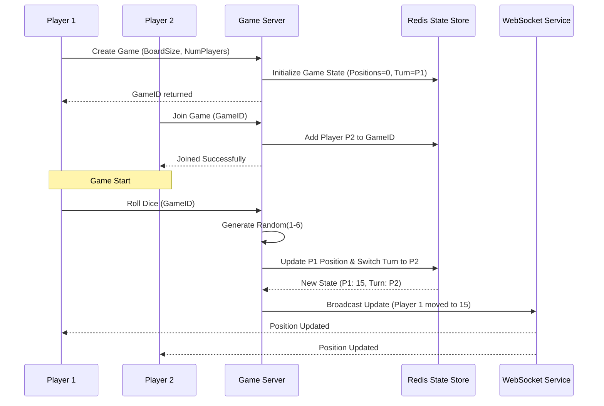

# System Design Document: Snake & Ladder Game

## 1. Requirements & System Constraints

### 1.1 Functional Requirements
*   **Game Initialization**: Support customizable board sizes (default $10 \times 10$) and a configurable number of snakes and ladders.
*   **Player Management**: Support for 2 or more players.
*   **Gameplay Mechanics**:
    *   Players take turns rolling a 6-sided die.
    *   Players move forward by the number shown on the die.
    *   If a player lands on the head of a **Snake**, they move down to the tail.
    *   If a player lands on the base of a **Ladder**, they move up to the top.
    *   A player must land **exactly** on the final square to win. If the roll exceeds the final square, the player stays in place.
*   **Win Condition**: The first player to reach the final square is declared the winner.
*   **State Persistence**: Ability to track the current position of all players and whose turn it is.

### 1.2 Non-Functional Requirements
*   **Consistency**: The sequence of turns and the movement logic must be strictly consistent.
*   **Low Latency**: Dice rolls and position updates should reflect in real-time (sub-100ms).
*   **Extensibility**: The system should easily support different board sizes, different dice (e.g., 8-sided), or new special tiles (e.g., "roll again" or "skip turn").
*   **Fairness**: Dice rolls must be generated server-side to prevent client-side manipulation.

### 1.3 Scale Estimations
*   **Concurrent Games**: Assume $10^5$ concurrent games.
*   **Traffic**: Average of 1 roll every 5 seconds per player. For a 4-player game, that's $\approx 0.8$ requests per second per game.
*   **Total Load**: $\approx 80,000$ requests per second (RPS) at peak. This necessitates a distributed state management approach.

---

## 2. High-Level Architecture

### 2.1 Core Components
1.  **Game Manager**: Orchestrates game creation, player joining, and turn management.
2.  **Board Engine**: Contains the logic for the grid, snakes, ladders, and boundary checks.
3.  **Dice Service**: A utility to generate cryptographically secure random numbers.
4.  **State Store**: A fast, in-memory store (Redis) to maintain active game sessions.
5.  **Notification Service**: Uses WebSockets/Socket.io to push movement updates to all players in a session.

### 2.2 Architecture Diagram (Mermaid)



---

## 3. Detailed Database Schema Design

Since active game states are ephemeral and require high-frequency updates, we use a **Hybrid Storage Strategy**:
*   **Redis**: For active game sessions (Hot Data).
*   **PostgreSQL**: For user profiles, game history, and board configurations (Cold Data).

### 3.1 SQL Schema (PostgreSQL)

**Table: `users`**
| Field | Type | Constraint | Description |
| :--- | :--- | :--- | :--- |
| `user_id` | UUID | PK | Unique identifier for the player |
| `username` | VARCHAR(50) | Unique, Not Null | Display name |
| `created_at` | TIMESTAMP | Not Null | Account creation date |

**Table: `board_configs`**
| Field | Type | Constraint | Description |
| :--- | :--- | :--- | :--- |
| `config_id` | UUID | PK | Unique identifier for a board layout |
| `size` | INT | Not Null | e.g., 100 for $10 \times 10$ |
| `created_at` | TIMESTAMP | Not Null | Layout creation date |

**Table: `special_squares`**
| Field | Type | Constraint | Description |
| :--- | :--- | :--- | :--- |
| `id` | SERIAL | PK | |
| `config_id` | UUID | FK $\to$ board_configs | Links to a specific board |
| `start_pos` | INT | Not Null | Head of snake or base of ladder |
| `end_pos` | INT | Not Null | Tail of snake or top of ladder |
| `type` | ENUM | 'SNAKE', 'LADDER' | Type of jump |

### 3.2 Redis Schema (NoSQL)
We use a Hash structure for each game session:
**Key**: `game:{game_id}`
**Fields**:
*   `board_size`: Integer
*   `current_turn_player_id`: String
*   `status`: `WAITING` | `ACTIVE` | `FINISHED`
*   `player_positions`: JSON String `{"user_1": 12, "user_2": 5}`
*   `turn_order`: JSON List `["user_1", "user_2"]`

---

## 4. Core API Design

### 4.1 API Endpoints

| Method | Endpoint | Description | Payload | Response |
| :--- | :--- | :--- | :--- | :--- |
| `POST` | `/api/v1/game/create` | Initialize a new game | `{ "board_id": "uuid", "players": 2 }` | `{ "game_id": "uuid" }` |
| `POST` | `/api/v1/game/join` | Join an existing game | `{ "game_id": "uuid", "user_id": "uuid" }` | `{ "status": "joined" }` |
| `POST` | `/api/v1/game/roll` | Roll the die for current turn | `{ "game_id": "uuid", "user_id": "uuid" }` | `{ "roll": 4, "new_pos": 18, "next_turn": "user_2" }` |
| `GET` | `/api/v1/game/{id}` | Get current game state | `N/A` | `{ "positions": {...}, "turn": "user_id" }` |

### 4.2 Sample Request/Response (Roll Dice)
**Request:**
```json
{
  "game_id": "game-123",
  "user_id": "user-456"
}
```
**Response:**
```json
{
  "status": "success",
  "data": {
    "dice_value": 4,
    "start_position": 10,
    "end_position": 14,
    "jump_occurred": {
      "type": "LADDER",
      "destination": 25
    },
    "final_position": 25,
    "next_player_id": "user-789",
    "winner": null
  }
}
```

---

## 5. Scalability & Advanced Topics

### 5.1 Concurrency Control
To prevent a player from rolling twice or rolling out of turn:
*   **Distributed Locking**: Use Redis `SET NX` (set if not exists) on a key `lock:game:{game_id}` during the processing of a roll. This ensures that only one request is processed per game at a time.
*   **Optimistic Locking**: Version the game state in Redis. If the version changed between the read and write, the request is rejected.

### 5.2 Real-time Updates
*   **WebSocket Integration**: Instead of polling `/game/{id}`, the server pushes the updated state to a WebSocket room identified by `game_id`.
*   **Pub/Sub**: When a Game Server updates the state in Redis, it publishes a message to a Redis Pub/Sub channel. All WebSocket servers subscribed to that channel push the update to connected clients.

### 5.3 Fault Tolerance
*   **State Recovery**: Since the state is in Redis, if a Game Server instance crashes, another instance can pick up the session seamlessly.
*   **Persistence Backup**: Periodically snapshot the Redis state to the SQL database to allow for game resumption after a total cache failure.

### 5.4 Fairness and RNG
*   Use a cryptographically secure pseudo-random number generator (CSPRNG) on the server side to prevent "roll hacking" via client-side scripts.

---

## 6. Trade-off Analysis

### 6.1 CAP Theorem Priorities
In a Snake & Ladder game, **Consistency (C)** and **Availability (A)** are prioritized over **Partition Tolerance (P)** within a single game session.
*   **Why?** It is unacceptable for two players to think it is their turn simultaneously. We use a centralized state store (Redis) to ensure strong consistency for a specific `game_id`.

### 6.2 Latency vs. Storage
*   **Trade-off**: We store the board configuration (snakes/ladders) in a SQL DB but cache it in the Game Server's local memory upon game start.
*   **Reasoning**: Board configurations rarely change. Caching them locally reduces the need to query the DB on every single roll, reducing latency from $\approx 10\text{ms}$ (DB) to $< 1\text{ms}$ (RAM).

### 6.3 WebSocket vs. Long Polling
*   **Trade-off**: WebSockets increase server memory overhead (keeping connections open).
*   **Reasoning**: For a game, the UX of seeing a piece move in real-time is critical. The overhead is justified by the significantly better user experience.

---

## 7. LLD Class Diagram (Conceptual)

```java
class Game {
    GameId id;
    Board board;
    List<Player> players;
    int currentTurnIndex;
    GameStatus status;
    
    void playTurn(Player player) {
        if (player != players.get(currentTurnIndex)) throw new IllegalTurnException();
        int roll = dice.roll();
        int newPos = board.movePlayer(players.get(currentTurnIndex), roll);
        if (newPos == board.getSize()) {
            this.status = GameStatus.FINISHED;
        } else {
            currentTurnIndex = (currentTurnIndex + 1) % players.size();
        }
    }
}

class Board {
    int size;
    Map<Integer, Jump> jumps; // Stores both Snakes and Ladders
    
    int movePlayer(Player p, int roll) {
        int nextPos = p.getPosition() + roll;
        if (nextPos > size) return p.getPosition(); // Must land exactly
        if (jumps.containsKey(nextPos)) {
            return jumps.get(nextPos).getEndPosition();
        }
        return nextPos;
    }
}

abstract class Jump {
    int startPos;
    int endPos;
    abstract String getType();
}

class Snake extends Jump { String getType() { return "SNAKE"; } }
class Ladder extends Jump { String getType() { return "LADDER"; } }
```