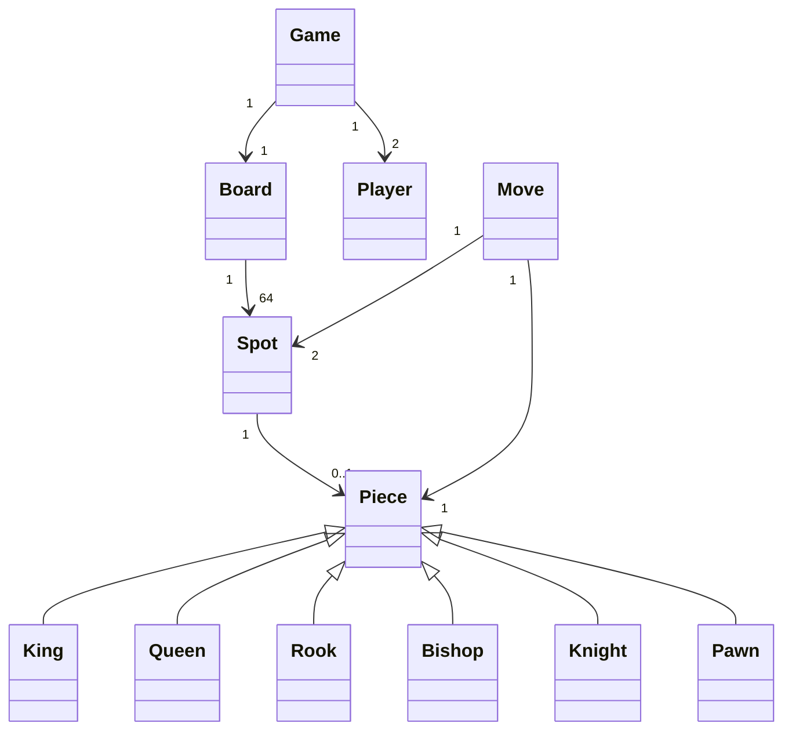

# Chess Game LLD

This study guide provides a professional-grade Low-Level Design (LLD) for a Chess Game. Designing Chess is a classic LLD challenge that tests a candidate's ability to handle complex rule sets, state management, and polymorphic behavior.

---

## 1. Overview & System Requirements

The goal is to design a software system that simulates a standard game of Chess. The system must enforce the rules of movement, track the game state, and determine the outcome (Checkmate, Stalemate, or Draw).

### Core Entities
- **Game**: The orchestrator that manages players, turns, and the game loop.
- **Board**: An $8 \times 8$ grid of cells.
- **Cell/Spot**: A specific coordinate on the board that may or may not hold a piece.
- **Piece**: An abstract entity representing a chess piece (King, Queen, Rook, Bishop, Knight, Pawn).
- **Player**: The actor who makes moves.
- **Move**: A record of a piece moving from one cell to another.

### Functional Requirements
- **Initialization**: Setup the board with standard starting positions for white and black.
- **Move Validation**: 
    - Validate based on the specific movement rules of each piece.
    - Prevent moves that leave the player's own King in check.
- **Special Moves**: Support for **Castling**, **En Passant**, and **Pawn Promotion**.
- **Game State**: Detect **Check**, **Checkmate**, and **Stalemate**.
- **Turn Management**: Strict alternation between White and Black.

---

## 2. Design Principles & Patterns

### OOP Principles Applied
- **Single Responsibility Principle (SRP)**: 
    - `Piece` classes only handle *how* they move.
    - `Board` handles *where* pieces are.
    - `Game` handles *when* moves happen and overall win/loss logic.
- **Open/Closed Principle (OCP)**: The system is open for extension. If we wanted to add a "Chess Variant" (e.g., adding a "Chancellor" piece), we can simply extend the `Piece` class without modifying the `Game` or `Board` logic.
- **Liskov Substitution Principle (LSP)**: Any subclass of `Piece` (e.g., `Knight`) can be used wherever a `Piece` object is expected without breaking the system.

### Design Patterns
| Pattern | Application | Why? |
| :--- | :--- | :--- |
| **Strategy Pattern** | Move Validation | Each piece implements its own movement strategy. The `Board` doesn't need to know the rules for a Knight vs. a Bishop. |
| **Factory Pattern** | Piece Creation | A `PieceFactory` can be used to instantiate pieces based on type and color, decoupling the creation logic from the board setup. |
| **Command Pattern** | Move Execution | By encapsulating a move as an object, we can easily implement "Undo" functionality by keeping a stack of `Move` objects. |
| **Singleton Pattern** | Game Instance | Ensuring only one active game session exists per board instance (optional). |

---

## 3. Class Structure & Relationships

### Class Diagram (Text-Based)



### Relationship Details
- **Composition**: `Board` is composed of `Spot` objects.
- **Inheritance**: `King`, `Queen`, etc., inherit from the abstract `Piece` class.
- **Association**: `Move` associates a `Piece`, a starting `Spot`, and an ending `Spot`.

---

## 4. Step-by-Step Logic & Code Walkthrough

### Implementation

```python
from abc import ABC, abstractmethod
from enum import Enum
from typing import List, Tuple, Optional

class Color(Enum):
    WHITE = 1
    BLACK = 2

class Piece(ABC):
    def __init__(self, color: Color):
        self.color = color

    @abstractmethod
    def can_move(self, board: 'Board', start: Tuple[int, int], end: Tuple[int, int]) -> bool:
        pass

# --- Concrete Piece Implementations ---

class Knight(Piece):
    def can_move(self, board, start, end) -> bool:
        sx, sy = start
        ex, ey = end
        dx, dy = abs(sx - ex), abs(sy - ey)
        # Knight moves in L-shape: (1,2) or (2,1)
        if not ((dx == 1 and dy == 2) or (dx == 2 and dy == 1)):
            return False
        # Check if target is occupied by own piece
        target_piece = board.get_piece(ex, ey)
        if target_piece and target_piece.color == self.color:
            return False
        return True

class Bishop(Piece):
    def can_move(self, board, start, end) -> bool:
        sx, sy = start
        ex, ey = end
        if abs(sx - ex) != abs(sy - ey): return False
        if board.is_path_blocked(start, end): return False
        target_piece = board.get_piece(ex, ey)
        return not (target_piece and target_piece.color == self.color)

class Rook(Piece):
    def can_move(self, board, start, end) -> bool:
        sx, sy = start
        ex, ey = end
        if sx != ex and sy != ey: return False
        if board.is_path_blocked(start, end): return False
        target_piece = board.get_piece(ex, ey)
        return not (target_piece and target_piece.color == self.color)

class Queen(Piece):
    def can_move(self, board, start, end) -> bool:
        # Queen is Rook + Bishop
        return Rook(self.color).can_move(board, start, end) or \
               Bishop(self.color).can_move(board, start, end)

class King(Piece):
    def can_move(self, board, start, end) -> bool:
        sx, sy = start
        ex, ey = end
        if max(abs(sx - ex), abs(sy - ey)) != 1: return False
        target_piece = board.get_piece(ex, ey)
        return not (target_piece and target_piece.color == self.color)

class Pawn(Piece):
    def can_move(self, board, start, end) -> bool:
        sx, sy = start
        ex, ey = end
        direction = -1 if self.color == Color.WHITE else 1
        # Simplified pawn logic for brevity
        if sy == ey and ex == sx + direction:
            return board.get_piece(ex, ey) is None
        # Capture logic
        if abs(sy - ey) == 1 and ex == sx + direction:
            target = board.get_piece(ex, ey)
            return target is not None and target.color != self.color
        return False

# --- Board and Game Orchestration ---

class Board:
    def __init__(self):
        self.grid = [[None for _ in range(8)] for _ in range(8)]
        self._setup_board()

    def _setup_board(self):
        # Standard chess setup logic here
        self.grid[0][0] = Rook(Color.BLACK)
        self.grid[0][1] = Knight(Color.BLACK)
        # ... remaining pieces
        self.grid[7][0] = Rook(Color.WHITE)
        self.grid[7][1] = Knight(Color.WHITE)

    def get_piece(self, x, y) -> Optional[Piece]:
        return self.grid[x][y]

    def move_piece(self, start: Tuple[int, int], end: Tuple[int, int]):
        sx, sy = start
        ex, ey = end
        self.grid[ex][ey] = self.grid[sx][sy]
        self.grid[sx][sy] = None

    def is_path_blocked(self, start: Tuple[int, int], end: Tuple[int, int]) -> bool:
        sx, sy = start
        ex, ey = end
        dx = 1 if ex > sx else -1 if ex < sx else 0
        dy = 1 if ey > sy else -1 if ey < sy else 0
        
        curr_x, curr_y = sx + dx, sy + dy
        while (curr_x, curr_y) != (ex, ey):
            if self.grid[curr_x][curr_y] is not None:
                return True
            curr_x += dx
            curr_y += dy
        return False

class Game:
    def __init__(self):
        self.board = Board()
        self.turn = Color.WHITE
        self.game_over = False

    def make_move(self, start: Tuple[int, int], end: Tuple[int, int]):
        if self.game_over:
            print("Game is already over.")
            return

        piece = self.board.get_piece(*start)
        if not piece or piece.color != self.turn:
            print("Invalid piece selection.")
            return

        if piece.can_move(self.board, start, end):
            self.board.move_piece(start, end)
            self.turn = Color.BLACK if self.turn == Color.WHITE else Color.WHITE
            print(f"Move successful. Next turn: {self.turn.name}")
        else:
            print("Illegal move!")

# --- Execution ---
if __name__ == "__main__":
    chess_game = Game()
    # White Knight moves from (7,1) to (5,2)
    chess_game.make_move((7, 1), (5, 2))
```

### Logic Walkthrough
1.  **`Piece` Hierarchy**: We use an abstract base class `Piece`. Each specific piece implements `can_move`. This ensures that the `Board` doesn't contain a massive `if-elif` block to determine movement rules.
2.  **`Board.is_path_blocked`**: This is a critical helper method. For sliding pieces (Rook, Bishop, Queen), we must check every cell between the start and end coordinates to ensure no other piece is in the way.
3.  **`Game.make_move`**: This acts as the controller. It validates:
    - If the game is still active.
    - If the piece exists and belongs to the current player.
    - If the piece's specific `can_move` logic returns `True`.
4.  **Turn Switching**: After a successful move, the `self.turn` is toggled.

---

## 5. Real-World Applications

While this is a game, the LLD patterns used here are common in enterprise software:

1.  **Strategy Pattern $\rightarrow$ Payment Gateways**: Just as different pieces have different move strategies, different payment methods (PayPal, Stripe, Crypto) have different `process_payment()` strategies.
2.  **Command Pattern $\rightarrow$ Text Editors**: The `Move` object approach is exactly how "Undo/Redo" works in IDEs like VS Code or IntelliJ. Every keystroke/action is encapsulated as a command.
3.  **State Management $\rightarrow$ Workflow Engines**: The turn-based logic of Chess is similar to state machines used in Order Management Systems (e.g., `Ordered` $\rightarrow$ `Paid` $\rightarrow$ `Shipped` $\rightarrow$ `Delivered`).
4.  **Grid-based systems $\rightarrow$ Logistics/Warehouse**: The `Board` and `Spot` logic is used in warehouse management systems to track robot positions and inventory slots in a coordinate system.

## Complexity Analysis

| Operation | Time Complexity | Space Complexity | Note |
| :--- | :--- | :--- | :--- |
| **Piece Movement** | $O(1)$ | $O(1)$ | Constant time for Knight/King. |
| **Sliding Move Validation** | $O(N)$ | $O(1)$ | Where $N$ is the board dimension (max 8). |
| **Board Initialization** | $O(N^2)$ | $O(N^2)$ | Initializing 64 cells. |
| **Check/Checkmate Detection**| $O(P \times N^2)$ | $O(1)$ | $P$ = number of pieces; must scan all possible moves. |