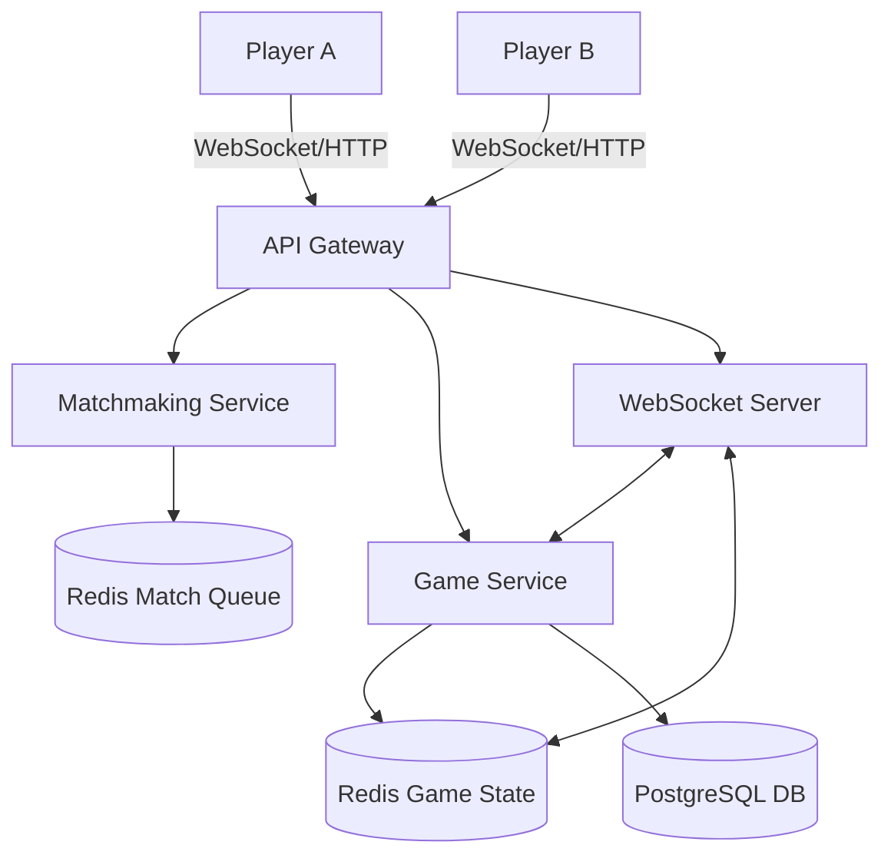

# System Design Document: Online Chess Game

## 1. Requirements & System Constraints

### 1.1 Functional Requirements
*   **Game Lifecycle**: Users should be able to create a game, invite a friend, or join a public matchmaking queue.
*   **Move Validation**: The system must enforce all official FIDE chess rules (e.g., piece movement, castling, en passant, promotion).
*   **Game State Management**: Track turn-based play, check, checkmate, stalemate, and draw conditions (50-move rule, threefold repetition).
*   **Real-time Updates**: Moves must be reflected on the opponent's board in near real-time.
*   **Game History**: Every move must be persisted to allow game replay (PGN format) and analysis.
*   **Player Profiles**: Track player statistics, win/loss ratios, and ELO ratings.
*   **Timer Management**: Support for blitz/rapid clocks with automatic forfeiture on time-out.

### 1.2 Non-Functional Requirements
*   **Low Latency**: Move propagation should be $< 200\text{ms}$ to ensure a seamless experience.
*   **High Consistency**: The board state must be strictly consistent; two players cannot see different versions of the board.
*   **Availability**: The system should be highly available, though consistency takes priority over availability during a move dispute (CAP theorem).
*   **Scalability**: Support millions of concurrent games and users.

### 1.3 Scale Estimations
*   **Concurrent Users**: $10^6$ active users.
*   **Concurrent Games**: $5 \times 10^5$ active games.
*   **Write Volume**: Each game averages 40 moves. $5 \times 10^5$ games $\times$ 40 moves = $2 \times 10^7$ move records per game session.
*   **Read Volume**: High frequency of board state polling or WebSocket pushes.

---

## 2. High-Level Architecture

The system follows a microservices architecture to decouple matchmaking, game logic, and user management.

### 2.1 Core Components
1.  **API Gateway**: Handles authentication, rate limiting, and request routing.
2.  **Matchmaking Service**: Pairs players based on ELO ratings using a queue-based system.
3.  **Game Service**: The "Brain." Validates moves, updates board state, and detects game-over conditions.
4.  **WebSocket Server (Real-time Engine)**: Maintains persistent connections with clients to push moves and clock updates.
5.  **State Store (Redis)**: Stores the active board state for low-latency access.
6.  **Persistence Layer (PostgreSQL)**: Stores user profiles and historical game data.

### 2.2 Architecture Diagram

### 2.3 Sequence Flow: Making a Move
1.  **Player A** sends a move `(from: e2, to: e4)` via WebSocket.
2.  **WebSocket Server** forwards the request to the **Game Service**.
3.  **Game Service** fetches the current state from **Redis**.
4.  **Game Service** validates the move against Chess rules.
5.  If valid:
    *   Updates the board state in **Redis**.
    *   Appends the move to the **PostgreSQL** move history.
    *   Checks for Checkmate/Stalemate.
6.  **Game Service** notifies the **WebSocket Server**.
7.  **WebSocket Server** pushes the updated state/move to **Player B**.

---

## 3. Detailed Database Schema Design

### 3.1 Storage Strategy
*   **Redis (In-Memory)**: Used for "Hot" data. Active games are stored as FEN (Forsyth-Edwards Notation) strings for compactness.
*   **PostgreSQL (Relational)**: Used for "Cold" data. ACID compliance is required for ELO updates and game records.

### 3.2 Schema

#### Table: `users`
| Field | Type | Constraints | Description |
| :--- | :--- | :--- | :--- |
| `user_id` | UUID | PK | Unique identifier |
| `username` | VARCHAR(50) | Unique, Index | Display name |
| `elo_rating` | INT | Default 1200 | Current skill rating |
| `created_at` | TIMESTAMP | | Account creation date |

#### Table: `games`
| Field | Type | Constraints | Description |
| :--- | :--- | :--- | :--- |
| `game_id` | UUID | PK | Unique identifier |
| `white_player_id`| UUID | FK $\rightarrow$ users | Player playing white |
| `black_player_id`| UUID | FK $\rightarrow$ users | Player playing black |
| `status` | ENUM | ACTIVE, WHITE_WIN, BLACK_WIN, DRAW | Current status |
| `start_time` | TIMESTAMP | | Game start time |
| `end_time` | TIMESTAMP | | Game end time |
| `final_pgn` | TEXT | | Full game record in PGN format |

#### Table: `moves`
| Field | Type | Constraints | Description |
| :--- | :--- | :--- | :--- |
| `move_id` | BIGSERIAL | PK | Unique move ID |
| `game_id` | UUID | FK $\rightarrow$ games, Index | Link to game |
| `move_number` | INT | | Sequence of move (1, 2...) |
| `player_id` | UUID | FK $\rightarrow$ users | Who made the move |
| `move_notation` | VARCHAR(10) | | Standard Algebraic Notation (e.g., "Nf3") |
| `board_state` | TEXT | | FEN string after move |
| `timestamp` | TIMESTAMP | | Execution time |

### 3.3 Indexing Strategy
*   `moves(game_id)`: Essential for reconstructing a game history for replay.
*   `games(white_player_id), games(black_player_id)`: To fetch a user's game history.
*   `users(elo_rating)`: To optimize the matchmaking query.

---

## 4. Core API Design

### 4.1 REST Endpoints

#### `POST /api/v1/games`
*   **Description**: Create a new game.
*   **Payload**: `{"opponent_id": "uuid", "time_control": "10+0"}`
*   **Response**: `201 Created` $\rightarrow$ `{"game_id": "uuid", "color": "white"}`

#### `GET /api/v1/games/{game_id}`
*   **Description**: Fetch current game state.
*   **Response**: `200 OK` $\rightarrow$ `{"fen": "rnbqkbnr/pppppppp/8/8/4P3/8/PPPP1PPP/RNBQKBNR b KQkq e3 0 1", "turn": "black"}`

#### `GET /api/v1/users/{user_id}/stats`
*   **Description**: Get player ELO and history.
*   **Response**: `200 OK` $\rightarrow$ `{"elo": 1540, "wins": 45, "losses": 30, "draws": 10}`

### 4.2 WebSocket Events

| Event | Direction | Payload | Description |
| :--- | :--- | :--- | :--- |
| `join_game` | Client $\rightarrow$ Server | `{"game_id": "uuid"}` | Subscribe to game updates |
| `make_move` | Client $\rightarrow$ Server | `{"game_id": "uuid", "move": "e2e4"}` | Submit a move |
| `move_update` | Server $\rightarrow$ Client | `{"move": "e2e4", "fen": "...", "turn": "black"}` | Notify opponent of move |
| `game_over` | Server $\rightarrow$ Client | `{"winner": "white", "reason": "checkmate"}` | Notify end of game |
| `clock_tick` | Server $\rightarrow$ Client | `{"white_time": 300, "black_time": 305}` | Sync timers |

---

## 5. Scalability & Advanced Topics

### 5.1 Real-time Synchronization & Concurrency
To prevent "race conditions" (e.g., both players moving simultaneously due to lag), the Game Service implements **Optimistic Locking** using a version number in Redis.
*   Each game state in Redis has a `version`.
*   The move request must include the `version` the client saw.
*   If `request_version != current_version`, the move is rejected (Out-of-sync).

### 5.2 Matchmaking Algorithm
For high-scale matchmaking:
1.  Users enter a **Redis Sorted Set** where the `score` is their ELO.
2.  A background worker scans the set for players within a range `[ELO - $\Delta$, ELO + $\Delta$]`.
3.  The range $\Delta$ expands over time (e.g., every 5 seconds) to ensure players eventually find a match.

### 5.3 Clock Management
Timers cannot be managed solely on the client.
*   The server maintains a `last_move_timestamp`.
*   On every move, the server calculates: $\text{TimeUsed} = \text{CurrentTime} - \text{last\_move\_timestamp}$.
*   The server deducts this from the player's remaining time in Redis.
*   A heartbeat mechanism triggers a "Timeout" event if no move is received within the remaining time.

### 5.4 Caching & Performance
*   **Board State**: Always cached in Redis. FEN strings are used because they are standard, compact, and easily parsed by chess engines.
*   **ELO Cache**: User ratings are cached in Redis to avoid frequent DB reads during matchmaking.

---

## 6. Trade-off Analysis

### 6.1 Consistency vs. Availability (CAP)
In a competitive game, **Consistency (C)** is non-negotiable. If the network partitions, we prefer to freeze the game (unavailable) rather than allow divergent board states (where Player A thinks they captured a Queen but Player B thinks the Queen moved). We use a **Strong Consistency** model for move validation.

### 6.2 State Storage: SQL vs. NoSQL
*   **Why Redis for Active Games?** Extreme low latency is required for turn-based updates. A relational DB would introduce too much overhead for every single move.
*   **Why PostgreSQL for History?** Game archives and ELO statistics are relational and require complex queries (e.g., "Average ELO of opponents defeated in the last 30 days"). ACID transactions ensure that ELO gains/losses for both players are atomic.

### 6.3 Latency vs. Storage (FEN vs. Move List)
We store the **FEN string** after every move in the `moves` table. 
*   **Trade-off**: This increases storage usage compared to storing only the move notation (e.g., "e4").
*   **Benefit**: It allows the system to restore the board state instantly at any move number without re-simulating the entire game from move 1, significantly reducing latency for "Go back to move X" features.