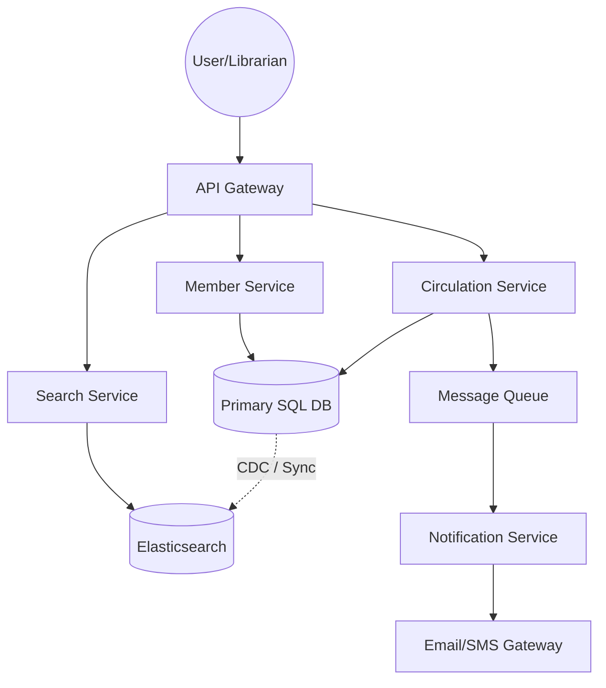

# System Design Document: Library Management System (LMS)

## 1. Requirements & System Constraints

### 1.1 Functional Requirements
*   **Catalog Management:**
    *   Librarians can add, update, and remove books, authors, and categories.
    *   The system must support multiple copies of the same book (Book vs. Book Item).
*   **Search & Discovery:**
    *   Members can search for books by title, author, subject, or publication date.
    *   Users can check the availability of a specific book copy.
*   **Member Management:**
    *   Users can register, update profiles, and view their borrowing history.
    *   Membership levels (e.g., Student, Faculty) may have different borrowing limits.
*   **Circulation (Borrowing & Returning):**
    *   Members can check out books (if they have no overdue fines and haven't reached their limit).
    *   Members can return books.
    *   The system automatically calculates due dates and overdue fines.
*   **Reservations:**
    *   Members can reserve a book that is currently checked out.
    *   The system notifies the member when the reserved book becomes available.
*   **Notifications:**
    *   Automatic reminders for upcoming due dates and overdue alerts.

### 1.2 Non-Functional Requirements
*   **Strong Consistency:** Ensuring a book cannot be borrowed by two people simultaneously (Race condition prevention).
*   **High Availability:** The search functionality should be available 24/7.
*   **Auditability:** Every loan and return must be logged for auditing.
*   **Extensibility:** Easy to add new rules (e.g., different fine structures for different book types).

### 1.3 Scale Estimations (Medium Scale)
*   **Users:** 100,000 registered members.
*   **Books:** 500,000 unique titles, 1 million physical copies.
*   **Traffic:** 10,000 Daily Active Users (DAU).
*   **Peak Load:** High traffic during university exam seasons or new releases.

---

## 2. High-Level Architecture

The system follows a **Layered Architecture** (Controller $\rightarrow$ Service $\rightarrow$ Repository).

### 2.1 Component Interaction
1.  **API Gateway:** Handles authentication, rate limiting, and request routing.
2.  **Search Service:** Utilizes an inverted index (like Elasticsearch) for fast full-text searching.
3.  **Circulation Service:** Manages the business logic for borrowing, returning, and reservations.
4.  **Member Service:** Manages user profiles and authentication.
5.  **Notification Service:** Asynchronous service that sends emails/SMS via a Message Queue.

### 2.2 Architecture Diagram (Mermaid)



---

## 3. Detailed Database Schema Design

### 3.1 Rationale for SQL
A Relational Database (PostgreSQL) is chosen because the system requires **ACID compliance**, particularly for the `Loans` and `BookItems` tables, to prevent double-booking and ensure financial accuracy for fines.

### 3.2 Schema Definition

#### `Books` (Core Metadata)
| Field | Type | Constraints | Description |
| :--- | :--- | :--- | :--- |
| `book_id` | UUID | PK | Unique identifier for the title |
| `isbn` | VARCHAR(13)| Unique, Indexed | International Standard Book Number |
| `title` | VARCHAR(255)| Indexed | Title of the book |
| `author_id` | UUID | FK $\rightarrow$ Authors | Reference to the author |
| `category_id` | UUID | FK $\rightarrow$ Categories| Reference to the category |
| `pub_date` | DATE | | Date of publication |

#### `BookItems` (Physical Copies)
| Field | Type | Constraints | Description |
| :--- | :--- | :--- | :--- |
| `barcode` | VARCHAR(50) | PK | Unique barcode on the physical book |
| `book_id` | UUID | FK $\rightarrow$ Books | Reference to the metadata |
| `status` | Enum | | AVAILABLE, LOANED, RESERVED, LOST |
| `rack_location`| VARCHAR(20) | | Physical location in the library |

#### `Members`
| Field | Type | Constraints | Description |
| :--- | :--- | :--- | :--- |
| `member_id` | UUID | PK | Unique member ID |
| `name` | VARCHAR(100)| | Full name |
| `email` | VARCHAR(100)| Unique | User email |
| `member_type` | Enum | | STUDENT, FACULTY, STAFF |
| `joined_date` | DATE | | Registration date |

#### `Loans`
| Field | Type | Constraints | Description |
| :--- | :--- | :--- | :--- |
| `loan_id` | UUID | PK | Unique loan ID |
| `barcode` | VARCHAR(50) | FK $\rightarrow$ BookItems| The specific copy borrowed |
| `member_id` | UUID | FK $\rightarrow$ Members | The member who borrowed it |
| `loan_date` | TIMESTAMP | | Date/Time of checkout |
| `due_date` | TIMESTAMP | | Expected return date |
| `return_date` | TIMESTAMP | Nullable | Actual return date |

#### `Reservations`
| Field | Type | Constraints | Description |
| :--- | :--- | :--- | :--- |
| `res_id` | UUID | PK | Unique reservation ID |
| `book_id` | UUID | FK $\rightarrow$ Books | The title requested |
| `member_id` | UUID | FK $\rightarrow$ Members | Member waiting |
| `request_date` | TIMESTAMP | | When the hold was placed |
| `status` | Enum | | PENDING, COMPLETED, CANCELLED |

### 3.3 Indexing Strategy
*   **B-Tree Index** on `Books(title)` and `Books(isbn)` for fast lookup.
*   **Composite Index** on `Loans(member_id, return_date)` to quickly find active loans for a user.
*   **Index** on `BookItems(status)` to quickly filter available books.

---

## 4. Core API Design

### 4.1 Search Books
`GET /api/v1/books?title=...&author=...&category=...`
*   **Response:** `200 OK`
*   **Payload:**
    ```json
    [
      {
        "bookId": "uuid-123",
        "title": "Designing Data-Intensive Applications",
        "author": "Martin Kleppmann",
        "availableCopies": 2,
        "totalCopies": 5
      }
    ]
    ```

### 4.2 Checkout Book
`POST /api/v1/loans`
*   **Request:**
    ```json
    {
      "memberId": "uuid-member-1",
      "barcode": "BC-998877"
    }
    ```
*   **Response:** `201 Created` (or `400 Bad Request` if user has fines or book is unavailable).

### 4.3 Return Book
`POST /api/v1/loans/return`
*   **Request:**
    ```json
    {
      "barcode": "BC-998877"
    }
    ```
*   **Response:** `200 OK` with fine calculation details.

### 4.4 Reserve Book
`POST /api/v1/reservations`
*   **Request:**
    ```json
    {
      "memberId": "uuid-member-1",
      "bookId": "uuid-123"
    }
    ```
*   **Response:** `201 Created`.

---

## 5. Scalability & Advanced Topics

### 5.1 Concurrency Control
To prevent two users from borrowing the last copy of a book simultaneously:
*   **Optimistic Locking:** Use a `version` column in the `BookItems` table.
    *   `UPDATE BookItems SET status = 'LOANED', version = version + 1 WHERE barcode = '...' AND version = 5 AND status = 'AVAILABLE';`
*   If the update returns 0 rows, the system notifies the user that the book was just taken.

### 5.2 Search Optimization
*   **Elasticsearch:** Since SQL `LIKE %query%` is slow, sync the `Books` and `Authors` tables to Elasticsearch. Use a **Change Data Capture (CDC)** tool like Debezium to keep the search index updated in near real-time.

### 5.3 Caching Strategy
*   **Redis:** Cache frequently accessed book metadata and member session data.
*   **TTL:** Use a short TTL (e.g., 1 hour) for book availability since it changes frequently.

### 5.4 Async Notifications
*   Use a **Message Queue (RabbitMQ/Kafka)**. When a book is returned, the `Circulation Service` publishes a `BOOK_RETURNED` event. The `Notification Service` consumes this event and emails the first person in the `Reservations` queue.

---

## 6. Trade-off Analysis

### 6.1 Consistency vs. Availability (CAP Theorem)
In this system, **Consistency (C)** is prioritized over **Availability (A)** for circulation operations. It is unacceptable to allow two members to check out the same physical book. Therefore, we use a RDBMS with strong ACID guarantees for the loaning process.

### 6.2 Latency vs. Storage
We accept increased storage costs (by using Elasticsearch in addition to PostgreSQL) to achieve sub-second search latency. Indexing every title and author ensures that as the catalog grows to millions of books, the user experience remains fluid.

### 6.3 Normalization vs. Denormalization
The schema is highly normalized (3NF) to ensure data integrity (e.g., changing an author's name in one place updates all their books). However, for the Search API, we denormalize the data into a single Document in Elasticsearch to avoid expensive joins at query time.