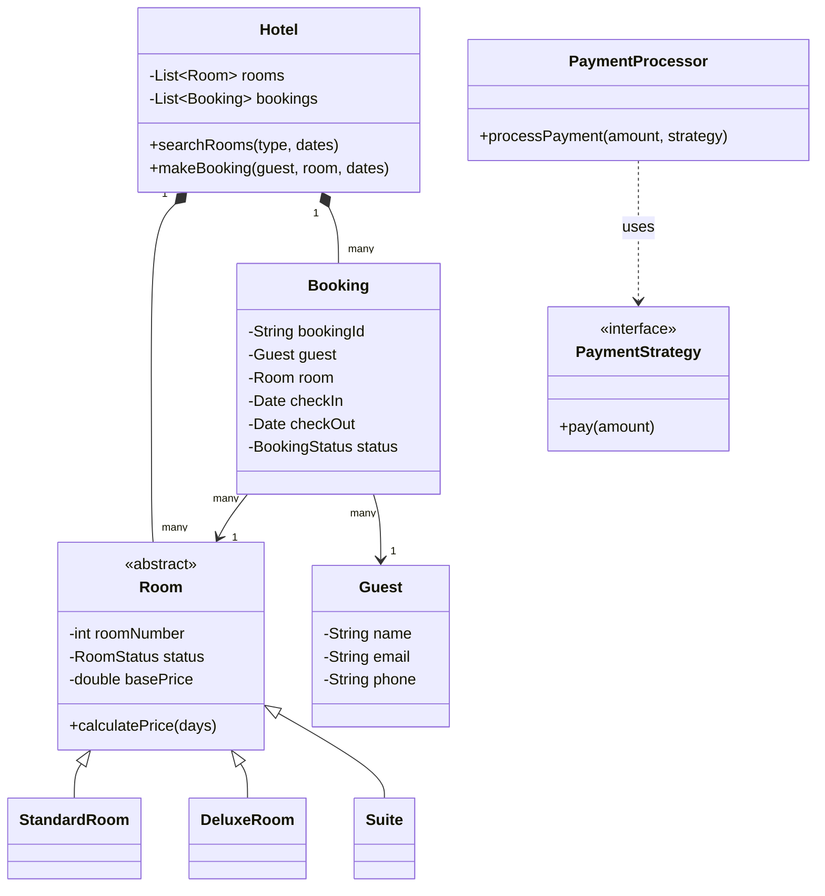

# Hotel Management System LLD

## 1. Overview & System Requirements

The **Hotel Management System (HMS)** is a classic Low-Level Design problem that focuses on managing the lifecycle of a room reservation, from searching for available rooms to checkout and billing. The system must handle multiple room types, guests, and booking statuses while ensuring that no room is double-booked.

### Core Actors
- **Guest**: The customer who searches for rooms, makes bookings, and pays bills.
- **Receptionist/Admin**: The staff member who manages room assignments, handles check-ins/outs, and updates room statuses.
- **System/Hotel Manager**: The core engine that orchestrates the interaction between rooms, bookings, and payments.

### Functional Requirements
- **Room Management**: Ability to categorize rooms (e.g., Single, Double, Suite) and track their status (Available, Occupied, Cleaning).
- **Booking Engine**: Search for available rooms based on date ranges and room types; create and cancel reservations.
- **Check-in/Check-out**: Process the physical arrival and departure of guests.
- **Billing & Payment**: Generate bills based on the duration of stay and room rate; support multiple payment methods.
- **Housekeeping**: Mark rooms as "Under Maintenance" or "Cleaning" after checkout.

---

## 2. Design Principles & Patterns

To ensure the system is scalable and maintainable, the following OOP principles and design patterns are applied:

### Design Principles (SOLID)
- **Single Responsibility Principle (SRP)**: The `BookingManager` handles only the logic of reservations, while the `PaymentProcessor` handles financial transactions.
- **Open/Closed Principle (OCP)**: The system is open for extension (e.g., adding a new `LuxurySuite` room type) without modifying the existing `Room` base class.
- **Liskov Substitution Principle (LSP)**: Any subclass of `Room` (e.g., `DeluxeRoom`) can be used wherever a `Room` object is expected without breaking the system.
- **Interface Segregation**: Payment methods are defined via a `PaymentStrategy` interface, so the system doesn't depend on specific payment provider implementations.

### Design Patterns
| Pattern | Application | Reason |
| :--- | :--- | :--- |
| **Singleton** | `Hotel` Class | Ensures there is only one instance of the hotel management system managing the global state of rooms and bookings. |
| **Factory Method** | `RoomFactory` | Decouples the creation of specific room types (Standard, Deluxe, Suite) from the main business logic. |
| **Strategy Pattern** | `PaymentStrategy` | Allows the system to switch between payment methods (Credit Card, PayPal, UPI) at runtime. |
| **State Pattern** | `RoomStatus` | Manages the transition of a room from `Available` $\rightarrow$ `Booked` $\rightarrow$ `Occupied` $\rightarrow$ `Cleaning`. |

---

## 3. Class Structure & Relationships

### Class Diagram (Conceptual)



### Key Attributes & Relationships
- **Composition**: `Hotel` contains `Room` and `Booking` objects.
- **Inheritance**: `StandardRoom`, `DeluxeRoom`, and `Suite` inherit from the abstract `Room` class.
- **Association**: `Booking` links a `Guest` to a specific `Room` for a specific time interval.

---

## 4. Step-by-Step Logic & Code Walkthrough

### Implementation in Python

```python
from abc import ABC, abstractmethod
from enum import Enum
from datetime import date

# --- Enums and Constants ---
class RoomStatus(Enum):
    AVAILABLE = 1
    OCCUPIED = 2
    CLEANING = 3
    MAINTENANCE = 4

class BookingStatus(Enum):
    CONFIRMED = 1
    CHECKED_IN = 2
    COMPLETED = 3
    CANCELLED = 4

# --- Room Hierarchy (Factory + Strategy) ---
class Room(ABC):
    def __init__(self, room_number, base_price):
        self.room_number = room_number
        self.base_price = base_price
        self.status = RoomStatus.AVAILABLE

    @abstractmethod
    def get_price(self, days):
        pass

class StandardRoom(Room):
    def get_price(self, days):
        return self.base_price * days

class DeluxeRoom(Room):
    def get_price(self, days):
        return (self.base_price * 1.5) * days

class Suite(Room):
    def get_price(self, days):
        return (self.base_price * 2.0) * days

class RoomFactory:
    @staticmethod
    def create_room(room_type, room_number, base_price):
        if room_type == "Standard": return StandardRoom(room_number, base_price)
        if room_type == "Deluxe": return DeluxeRoom(room_number, base_price)
        if room_type == "Suite": return Suite(room_number, base_price)
        raise ValueError("Invalid Room Type")

# --- Entities ---
class Guest:
    def __init__(self, guest_id, name, email):
        self.guest_id = guest_id
        self.name = name
        self.email = email

class Booking:
    def __init__(self, booking_id, guest, room, check_in, check_out):
        self.booking_id = booking_id
        self.guest = guest
        self.room = room
        self.check_in = check_in
        self.check_out = check_out
        self.status = BookingStatus.CONFIRMED

# --- Payment Strategy ---
class PaymentStrategy(ABC):
    @abstractmethod
    def pay(self, amount):
        pass

class CreditCardPayment(PaymentStrategy):
    def pay(self, amount):
        print(f"Paid ${amount} using Credit Card.")

class UPIPayment(PaymentStrategy):
    def pay(self, amount):
        print(f"Paid ${amount} using UPI.")

# --- Singleton Hotel Management System ---
class Hotel:
    _instance = None

    def __new__(cls):
        if cls._instance is None:
            cls._instance = super(Hotel, cls).__new__(cls)
            cls._instance.rooms = {}
            cls._instance.bookings = {}
        return cls._instance

    def add_room(self, room):
        self.rooms[room.room_number] = room

    def search_available_rooms(self, room_type=None):
        # Simplified search: returns rooms that are currently AVAILABLE
        return [r for r in self.rooms.values() if r.status == RoomStatus.AVAILABLE 
                and (room_type is None or type(r).__name__ == f"{room_type}Room")]

    def create_booking(self, booking_id, guest, room_number, check_in, check_out):
        room = self.rooms.get(room_number)
        if room and room.status == RoomStatus.AVAILABLE:
            booking = Booking(booking_id, guest, room, check_in, check_out)
            room.status = RoomStatus.OCCUPIED # Simplified state transition
            self.bookings[booking_id] = booking
            return booking
        return None

    def checkout(self, booking_id, payment_strategy):
        booking = self.bookings.get(booking_id)
        if booking:
            days = (booking.check_out - booking.check_in).days
            amount = booking.room.get_price(days)
            payment_strategy.pay(amount)
            booking.status = BookingStatus.COMPLETED
            booking.room.status = RoomStatus.CLEANING
            print(f"Checkout successful for Room {booking.room.room_number}")

# --- Execution ---
if __name__ == "__main__":
    hotel = Hotel()
    
    # Setup Rooms
    hotel.add_room(RoomFactory.create_room("Standard", 101, 100))
    hotel.add_room(RoomFactory.create_room("Deluxe", 201, 200))
    
    # Guest Action
    guest1 = Guest("G1", "Alice", "alice@example.com")
    available = hotel.search_available_rooms("Deluxe")
    
    if available:
        room_to_book = available[0]
        hotel.create_booking("B1", guest1, room_to_book.room_number, date(2023, 10, 1), date(2023, 10, 5))
        print(f"Booking confirmed for {guest1.name} in Room {room_to_book.room_number}")

    # Checkout Process
    hotel.checkout("B1", UPIPayment())
```

### Logic Walkthrough
1.  **Room Creation**: The `RoomFactory` ensures that when we add rooms to the `Hotel`, we create the specific subclass (Standard/Deluxe) which carries its own pricing logic.
2.  **Booking Flow**: The `Hotel` singleton checks if the requested `room_number` exists and is `AVAILABLE`. If so, it creates a `Booking` object and marks the room as `OCCUPIED`.
3.  **Dynamic Pricing**: During checkout, the `Booking` object refers to the `Room` object. The `Room` object calculates the total cost based on its specific subclass implementation of `get_price()`.
4.  **Payment Execution**: The `checkout` method accepts a `PaymentStrategy`. This allows the guest to pay via UPI or Credit Card without the `Hotel` class knowing the internal details of the payment gateway.
5.  **Post-Stay State**: Once checked out, the room status moves to `CLEANING` instead of immediately becoming `AVAILABLE`, simulating a real-world operational flow.

---

## 5. Real-World Applications

The architectural patterns used in this Hotel Management LLD are prevalent in several production-grade systems:

- **Airbnb / Booking.com**: Use similar "Availability Search" patterns and "Payment Strategy" patterns to handle global currencies and payment methods.
- **Cloud Resource Management (AWS/Azure)**: The concept of "Room Types" is similar to "Instance Types" (t2.micro, m5.large). The "Booking" is similar to "Provisioning" a resource for a specific duration.
- **Ride-Hailing Apps (Uber/Lyft)**: The `RoomFactory` is analogous to the `VehicleFactory` (UberX, UberBlack, UberPool), where pricing is calculated differently based on the vehicle type.
- **Hospital Management Systems**: Managing bed availability, patient check-ins, and billing based on ward types (General, Semi-Private, ICU).

### Complexity Analysis

| Operation | Time Complexity | Space Complexity | Note |
| :--- | :--- | :--- | :--- |
| **Search Room** | $O(R)$ | $O(1)$ | $R$ = Total number of rooms. |
| **Create Booking** | $O(1)$ | $O(1)$ | Direct lookup via Room ID. |
| **Checkout** | $O(1)$ | $O(1)$ | Direct lookup via Booking ID. |
| **Room Storage** | $O(R)$ | $O(R)$ | Stored in a hash map for fast access. |