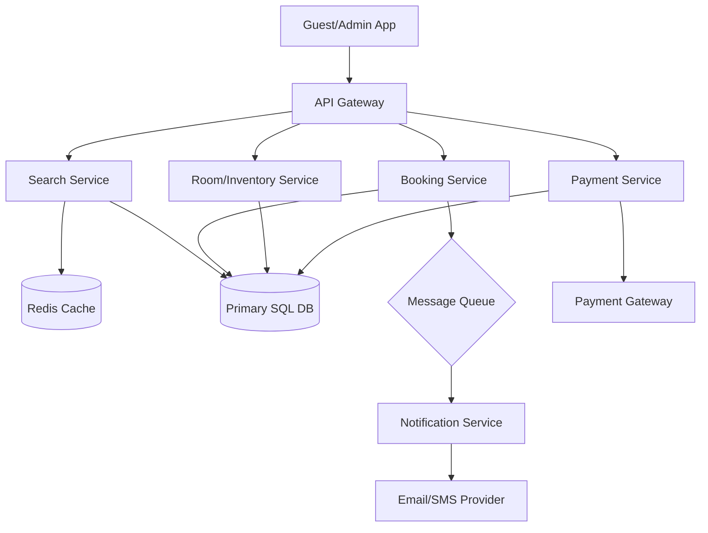

# Hotel Management System (HMS) - System Design Document

## 1. Requirements & System Constraints

The Hotel Management System is designed to handle the end-to-end lifecycle of hotel operations, from room inventory management and guest bookings to check-in/check-out and billing.

### 1.1 Functional Requirements
*   **Room Management:**
    *   Administrators can add, update, and remove room types (e.g., Deluxe, Suite, Single) and individual rooms.
    *   Ability to manage room pricing dynamically (seasonal pricing).
*   **Booking Management:**
    *   Users can search for available rooms based on dates, location, and guest count.
    *   Users can book, modify, or cancel reservations.
    *   **Concurrency Control:** Prevent double-booking of the same room for overlapping dates.
*   **Guest Management:**
    *   Maintain guest profiles, contact details, and booking history.
    *   Handle check-in and check-out processes.
*   **Billing & Payments:**
    *   Generate invoices based on room rates, taxes, and additional services.
    *   Integrate with payment gateways for secure transactions.
*   **Housekeeping:**
    *   Staff can update room status (e.g., Clean, Dirty, Under Maintenance).

### 1.2 Non-Functional Requirements
*   **Strong Consistency:** Booking status must be consistent. Two users cannot book the same room for the same slot.
*   **High Availability:** The booking engine must be available 24/7.
*   **Low Latency:** Room search and availability checks should be near-instant.
*   **Scalability:** System should support multiple hotel properties across different regions.

### 1.3 Scale Estimations (Medium Scale)
*   **Hotels:** 1,000 properties.
*   **Rooms per Hotel:** Average 100 $\rightarrow$ Total $10^5$ rooms.
*   **Daily Bookings:** $\sim 50,000$ bookings.
*   **Peak Load:** During holidays, search queries may spike 10x.

---

## 2. High-Level Architecture

The system follows a **Modular Monolith** or **Microservices** architecture to decouple the booking engine from the administrative and payment modules.

### 2.1 Core Components
1.  **API Gateway:** Entry point for all clients (Web/Mobile), handling authentication and rate limiting.
2.  **Search Service:** Handles queries for room availability using a read-optimized cache.
3.  **Booking Service:** Manages the reservation lifecycle and ensures transactional integrity.
4.  **Room/Inventory Service:** Manages room metadata, types, and current status.
5.  **Payment Service:** Handles third-party payment gateway integrations and invoice generation.
6.  **Notification Service:** Asynchronous service for sending booking confirmations via Email/SMS.

### 2.2 Architecture Diagram (Mermaid)



---

## 3. Detailed Database Schema Design

A Relational Database (RDBMS) like **PostgreSQL** is chosen because the system requires **ACID transactions** to prevent double-booking and maintain financial integrity.

### 3.1 Tables Design

#### `Hotels`
| Field | Type | Constraint | Description |
| :--- | :--- | :--- | :--- |
| `hotel_id` | UUID | PK | Unique identifier for the hotel |
| `name` | VARCHAR(255) | NOT NULL | Hotel name |
| `address` | TEXT | NOT NULL | Physical address |
| `city` | VARCHAR(100) | INDEX | For search filtering |
| `star_rating` | INT | CHECK(1-5) | Hotel rating |

#### `RoomTypes`
| Field | Type | Constraint | Description |
| :--- | :--- | :--- | :--- |
| `type_id` | UUID | PK | Unique identifier for room type |
| `hotel_id` | UUID | FK $\rightarrow$ Hotels | Reference to hotel |
| `type_name` | VARCHAR(50) | NOT NULL | e.g., "Deluxe King" |
| `base_price` | DECIMAL | NOT NULL | Standard price per night |
| `capacity` | INT | NOT NULL | Max guests allowed |

#### `Rooms`
| Field | Type | Constraint | Description |
| :--- | :--- | :--- | :--- |
| `room_id` | UUID | PK | Unique identifier for the room |
| `type_id` | UUID | FK $\rightarrow$ RoomTypes | Reference to type |
| `room_number` | VARCHAR(10) | NOT NULL | Physical room number |
| `status` | ENUM | NOT NULL | AVAILABLE, OCCUPIED, DIRTY, MAINTENANCE |

#### `Guests`
| Field | Type | Constraint | Description |
| :--- | :--- | :--- | :--- |
| `guest_id` | UUID | PK | Unique identifier for guest |
| `first_name` | VARCHAR(100) | NOT NULL | Guest first name |
| `email` | VARCHAR(255) | UNIQUE, INDEX | Contact email |
| `phone` | VARCHAR(20) | NOT NULL | Contact phone |

#### `Bookings`
| Field | Type | Constraint | Description |
| :--- | :--- | :--- | :--- |
| `booking_id` | UUID | PK | Unique identifier for booking |
| `guest_id` | UUID | FK $\rightarrow$ Guests | Guest who booked |
| `room_id` | UUID | FK $\rightarrow$ Rooms | Specific room allocated |
| `check_in` | DATE | NOT NULL | Check-in date |
| `check_out` | DATE | NOT NULL | Check-out date |
| `total_amount`| DECIMAL | NOT NULL | Total cost |
| `status` | ENUM | NOT NULL | PENDING, CONFIRMED, CANCELLED, COMPLETED |
| `created_at` | TIMESTAMP | DEFAULT NOW | Booking timestamp |

#### `Payments`
| Field | Type | Constraint | Description |
| :--- | :--- | :--- | :--- |
| `payment_id` | UUID | PK | Unique identifier for payment |
| `booking_id` | UUID | FK $\rightarrow$ Bookings | Reference to booking |
| `amount` | DECIMAL | NOT NULL | Amount paid |
| `payment_status`| ENUM | NOT NULL | SUCCESS, FAILED, REFUNDED |
| `transaction_id`| VARCHAR(255) | UNIQUE | Gateway transaction ID |

### 3.2 Indexing Strategy
*   **`Hotels(city)`**: To speed up searches by location.
*   **`Bookings(guest_id)`**: To retrieve booking history for a guest.
*   **`Bookings(room_id, check_in, check_out)`**: A composite index to quickly check room availability for a date range.

---

## 4. Core API Design

### 4.1 Room Search
`GET /api/v1/rooms/search?city=London&checkin=2023-12-01&checkout=2023-12-05&guests=2`

**Response:**
```json
[
  {
    "hotel_name": "Grand Plaza",
    "room_type": "Deluxe King",
    "price_per_night": 200.00,
    "available_rooms": 5,
    "room_type_id": "uuid-123"
  }
]
```

### 4.2 Create Booking
`POST /api/v1/bookings`

**Request:**
```json
{
  "guest_id": "uuid-guest-1",
  "room_id": "uuid-room-101",
  "check_in": "2023-12-01",
  "check_out": "2023-12-05",
  "payment_method": "CREDIT_CARD"
}
```

**Response:**
```json
{
  "booking_id": "uuid-book-999",
  "status": "PENDING",
  "total_price": 800.00,
  "message": "Booking initiated. Please complete payment."
}
```

### 4.3 Check-in/Check-out
`PATCH /api/v1/bookings/{booking_id}/status`

**Request:**
```json
{
  "status": "CHECKED_IN" // or "CHECKED_OUT"
}
```

---

## 5. Scalability & Advanced Topics

### 5.1 Handling Concurrency (Preventing Double Booking)
To prevent two people from booking the same room at the exact same millisecond, we use **Optimistic Locking** or **Pessimistic Locking**.

*   **Pessimistic Locking:** Use `SELECT ... FOR UPDATE` in SQL. This locks the room row until the transaction is committed. Best for high-contention scenarios.
*   **Optimistic Locking:** Add a `version` column to the `Rooms` or `RoomAvailability` table. Update only if the version matches the one read.

### 5.2 Caching Strategy
*   **Availability Cache:** Use **Redis** to store availability bit-maps for rooms. A bit-map where each bit represents a day of the year allows for extremely fast `AND` operations to find available dates.
*   **Hotel Metadata:** Cache hotel details, room descriptions, and images using a CDN or Redis since they rarely change.

### 5.3 Asynchronous Processing
*   **Payment & Notifications:** Once a booking is confirmed, the `Booking Service` publishes an event to **Kafka/RabbitMQ**. The `Notification Service` consumes this to send emails, and the `Analytics Service` consumes it to track revenue.

### 5.4 Database Sharding
As the system grows to thousands of hotels:
*   **Sharding Key:** `hotel_id`. Since most queries are scoped to a specific hotel or city, sharding by `hotel_id` ensures that all data for one hotel resides on one shard, avoiding cross-shard joins.

---

## 6. Trade-off Analysis

### 6.1 CAP Theorem Priority
In a Hotel Management System, **Consistency (C)** and **Partition Tolerance (P)** are prioritized over Availability (A).
*   **Why?** It is better to tell a user "System is temporarily unavailable" or "Booking failed" than to allow two guests to be assigned to the same room (Overbooking), which creates a poor guest experience and operational chaos.

### 6.2 Latency vs. Storage
*   **Denormalization:** We may denormalize `RoomType` names into the `Bookings` table. This increases storage usage but reduces the need for complex joins during invoice generation, lowering read latency.

### 6.3 SQL vs. NoSQL
*   **SQL (Chosen):** Used for bookings and payments due to the need for ACID transactions.
*   **NoSQL (Alternative):** Could be used for **Guest Preferences** (e.g., "prefers high floor", "extra pillows") where the schema is flexible and doesn't require strict transactional integrity.