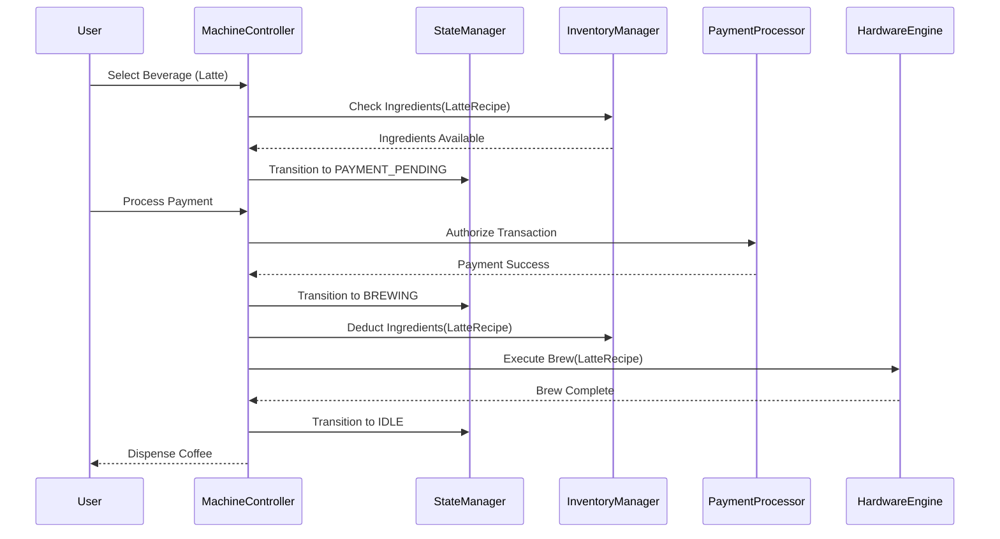

# System Design Document: Coffee Vending Machine

## 1. Requirements & System Constraints

The goal is to design a robust, extensible, and maintainable software system for a Coffee Vending Machine. Modern vending machines are IoT-enabled, meaning they require both local control logic (for hardware interaction) and a cloud-based management layer (for monitoring and payments).

### 1.1 Functional Requirements
- **Beverage Selection**: Users can view a menu of available coffee types (e.g., Espresso, Latte, Cappuccino) and select one.
- **Recipe Management**: Each beverage has a specific recipe (e.g., Latte = 1 shot espresso + 200ml milk + 1 cup).
- **Payment Processing**: Support for multiple payment methods (Cash, Credit Card, Digital Wallet).
- **Inventory Management**: Track levels of ingredients (coffee beans, milk, water, sugar, cups). Prevent selection if ingredients are insufficient.
- **Dispensing Logic**: Orchestrate the hardware to dispense ingredients in the correct order.
- **Administrative Controls**: Allow technicians to refill ingredients, update pricing, and view machine health.
- **Error Handling**: Handle scenarios like payment failure, hardware jams, or ingredient depletion during brewing.

### 1.2 Non-Functional Requirements
- **Reliability**: High availability. The machine should not charge a user if it cannot dispense the drink.
- **Low Latency**: User interface responses must be near-instantaneous.
- **Consistency**: Strict consistency for inventory and payments (no "phantom" ingredients).
- **Extensibility**: Easy to add new beverage types or payment gateways without rewriting core logic.
- **Robustness**: Ability to recover to a safe state after a power failure or hardware crash.

---

## 2. High-Level Architecture

The system follows a **Layered Architecture** combining an embedded control system (on the machine) and a Cloud Backend (for fleet management).

### 2.1 Core Components
- **Machine Controller (Singleton)**: The central brain coordinating the state transitions.
- **State Manager**: Implements the State Design Pattern to handle transitions (Idle $\rightarrow$ Selecting $\rightarrow$ Paying $\rightarrow$ Brewing $\rightarrow$ Dispensing).
- **Inventory Manager**: Tracks real-time stock levels and validates recipe availability.
- **Payment Gateway Interface**: An abstraction layer to handle various payment providers.
- **Brewing Engine**: The low-level hardware abstraction layer (HAL) that sends signals to pumps, heaters, and grinders.
- **Recipe Store**: A registry of beverage compositions.

### 2.2 Sequence Diagram (Ordering Flow)

---

## 3. Detailed Database Schema Design

Since this is an IoT system, data is split between a **Local Cache (SQLite/Key-Value)** for offline operation and a **Cloud Database (PostgreSQL)** for fleet management and analytics.

### 3.1 Cloud Database (Relational - PostgreSQL)
Chosen for ACID compliance, ensuring payment and inventory records are never corrupted.

#### Table: `beverages`
| Field | Type | Constraints | Description |
| :--- | :--- | :--- | :--- |
| `beverage_id` | UUID | PK | Unique identifier for the drink |
| `name` | VARCHAR(50) | NOT NULL | e.g., "Vanilla Latte" |
| `price` | DECIMAL(10,2) | NOT NULL | Price per unit |
| `is_active` | BOOLEAN | DEFAULT True | Soft delete/availability |

#### Table: `ingredients`
| Field | Type | Constraints | Description |
| :--- | :--- | :--- | :--- |
| `ingredient_id` | UUID | PK | Unique identifier (e.g., Beans, Milk) |
| `name` | VARCHAR(50) | UNIQUE | Name of the ingredient |
| `unit` | VARCHAR(10) | NOT NULL | ml, grams, units |

#### Table: `recipes`
| Field | Type | Constraints | Description |
| :--- | :--- | :--- | :--- |
| `recipe_id` | UUID | PK | Unique identifier |
| `beverage_id` | UUID | FK $\rightarrow$ beverages | Link to beverage |
| `ingredient_id`| UUID | FK $\rightarrow$ ingredients | Link to ingredient |
| `quantity` | DECIMAL(10,2) | NOT NULL | Amount required for 1 cup |

#### Table: `machine_inventory`
| Field | Type | Constraints | Description |
| :--- | :--- | :--- | :--- |
| `machine_id` | UUID | PK/FK | Unique machine identifier |
| `ingredient_id`| UUID | PK/FK | Ingredient identifier |
| `current_qty` | DECIMAL(10,2) | NOT NULL | Current stock in the machine |
| `last_updated` | TIMESTAMP | NOT NULL | For synchronization |

#### Table: `transactions`
| Field | Type | Constraints | Description |
| :--- | :--- | :--- | :--- |
| `tx_id` | UUID | PK | Transaction ID |
| `machine_id` | UUID | FK | Which machine sold it |
| `beverage_id` | UUID | FK | What was sold |
| `amount` | DECIMAL(10,2) | NOT NULL | Final price paid |
| `status` | ENUM | SUCCESS, FAILED | Transaction status |
| `timestamp` | TIMESTAMP | NOT NULL | Time of purchase |

### 3.2 Indexing Strategy
- **Index on `transactions(machine_id, timestamp)`**: To quickly generate sales reports per machine.
- **Index on `recipes(beverage_id)`**: To quickly fetch all ingredients needed for a selected drink.

---

## 4. Core API Design

The machine communicates with the Cloud Backend via a REST or gRPC API.

### 4.1 Beverage & Inventory API
- **`GET /v1/beverages`**: Fetch the current menu and pricing.
- **`GET /v1/machine/{id}/status`**: Get current ingredient levels and hardware health.
- **`POST /v1/machine/{id}/refill`**: Update inventory levels after a technician visit.

### 4.2 Transaction API
- **`POST /v1/payments/process`**
    - **Request**: `{ "machine_id": "uuid", "amount": 4.50, "payment_token": "tok_...", "beverage_id": "uuid" }`
    - **Response**: `{ "transaction_id": "uuid", "status": "APPROVED" }`

### 4.3 Telemetry API
- **`POST /v1/telemetry/heartbeat`**
    - **Request**: `{ "machine_id": "uuid", "temp": 92, "water_level": 40, "error_code": 0 }`
    - **Response**: `{ "status": "OK", "pending_updates": ["recipe_v2.json"] }`

---

## 5. Scalability & Advanced Topics

### 5.1 Handling Concurrency & State
To prevent "Double Dispensing" or race conditions:
- **Local Mutex**: The `MachineController` uses a mutex lock during the `BREWING` state to ensure no other inputs are processed until the cycle finishes.
- **State Pattern**: By using a state machine, we eliminate complex `if-else` blocks. For example, the `PaymentState` only allows transitions to `BrewingState` (on success) or `IdleState` (on cancel).

### 5.2 Fault Tolerance
- **Atomic Transactions**: The system follows the "Commit then Act" pattern. Payment is authorized $\rightarrow$ Inventory is reserved $\rightarrow$ Brewing starts. If brewing fails, a "Refund" event is triggered automatically.
- **Offline Mode**: The machine caches the menu and recipes locally. If the cloud is unreachable, it can accept cash (if hardware exists) and queue the transaction logs to sync later.
- **Watchdog Timer**: A hardware timer that resets the system if the software hangs during a brew cycle to prevent overheating.

### 5.3 IoT Optimization
- **MQTT for Telemetry**: Instead of HTTP, use MQTT for heartbeats and alerts to reduce overhead and allow the server to "push" price updates to machines in real-time.
- **Edge Computing**: Recipe validation happens at the edge (on the machine) to ensure zero latency for the user.

---

## 6. Trade-off Analysis

### 6.1 State Pattern vs. Simple Conditional Logic
- **Trade-off**: State pattern increases the number of classes (Boilerplate).
- **Decision**: Chosen State Pattern because the machine has distinct, mutually exclusive modes. This makes adding a "Maintenance Mode" or "Cleaning Mode" trivial without breaking existing logic.

### 6.2 Local vs. Cloud Inventory
- **Trade-off**: Updating cloud inventory on every cup dispensed creates high network dependency.
- **Decision**: **Eventual Consistency**. The machine tracks inventory locally for real-time decisions and syncs the aggregate usage to the cloud every 10 transactions or once per hour. This ensures the machine remains functional during network outages.

### 6.3 CAP Theorem Priority
- **Priority**: **Consistency (C) and Partition Tolerance (P)**.
- **Reasoning**: In a vending machine, Availability (A) of the *Cloud* is secondary to Consistency. We cannot risk charging a customer for a drink that doesn't exist (Inventory inconsistency) or failing to record a payment. If the cloud is partitioned, the machine switches to a "Limited Offline Mode."