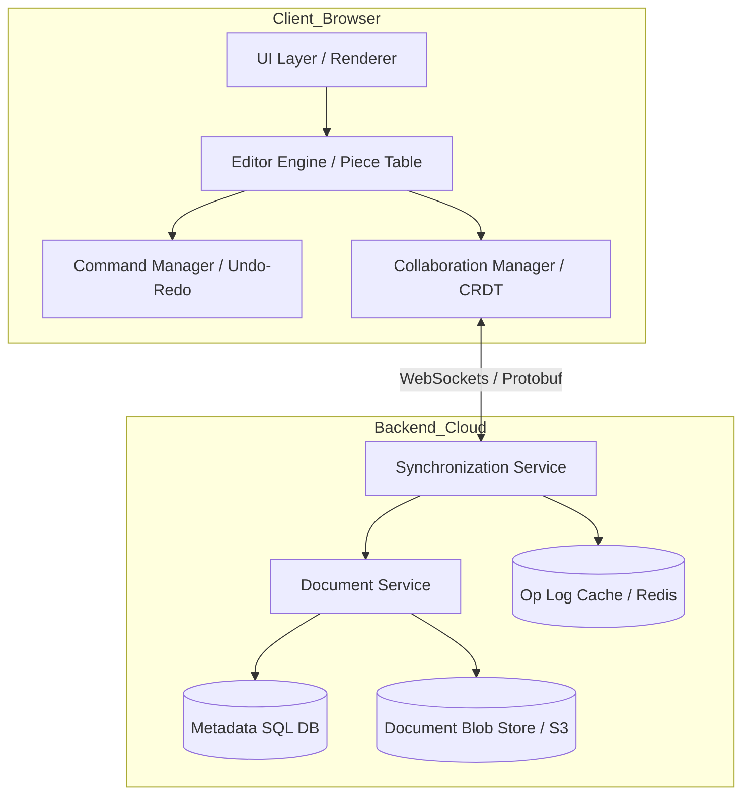

# System Design Document: Professional Text Editor / Word Processor

## 1. Requirements & System Constraints

### 1.1 Functional Requirements
*   **Core Editing:** Ability to insert, delete, and replace text at any cursor position.
*   **Rich Text Support:** Support for formatting (Bold, Italic, Underline, Font Size, Colors) and embedded objects (Images, Tables).
*   **Cursor Management:** Support for multiple cursors, text selection, and navigation.
*   **Undo/Redo:** Comprehensive history management to revert or re-apply changes.
*   **Document Persistence:** Ability to save, load, and version documents.
*   **Real-time Collaboration:** Multiple users editing the same document simultaneously with conflict resolution.
*   **Search & Replace:** Efficient searching and bulk replacement of text patterns.

### 1.2 Non-Functional Requirements
*   **Ultra-Low Latency:** Local typing must be instantaneous (sub-10ms latency).
*   **High Availability:** The document service must be available for retrieval and editing.
*   **Strong Eventual Consistency:** In a collaborative environment, all users must eventually converge to the same document state.
*   **Scalability:** Support for documents ranging from a few KB to several MBs without performance degradation.
*   **Fault Tolerance:** Auto-save mechanisms to prevent data loss during crashes.

### 1.3 Scale Estimations
*   **Concurrency:** Support for 10,000+ concurrent users per document cluster.
*   **Document Size:** Up to 100MB per document.
*   **Operation Rate:** Hundreds of keystrokes per second per active user.

---

## 2. High-Level Architecture

The system follows a **Client-Server Architecture** with a heavy emphasis on the **Client-side Engine** to ensure zero-latency typing.

### 2.1 Core Components
1.  **Editor Engine (Client):** Manages the local representation of the document using an efficient data structure (Piece Table).
2.  **Rendering Engine (Client):** Converts the internal document model into a visual representation (DOM/Canvas).
3.  **Command Manager:** Implements the Command Pattern to handle Undo/Redo logic.
4.  **Collaboration Manager:** Handles synchronization between the client and server using **CRDTs (Conflict-free Replicated Data Types)** or **OT (Operational Transformation)**.
5.  **Document Service (Server):** Manages document metadata, permissions, and persistence.
6.  **Synchronization Service (Server):** A WebSocket-based service that broadcasts operations to collaborating peers.

### 2.2 Architecture Diagram



---

## 3. Detailed Design

### 3.1 Internal Data Structure: The Piece Table
Standard strings or arrays are inefficient for large documents ($O(N)$ for insertions). We utilize a **Piece Table**.

*   **Original Buffer:** A read-only string containing the document as it was when opened.
*   **Add Buffer:** An append-only string containing all new text typed by the user.
*   **Piece Table:** A list of "Pieces" (descriptors). Each piece contains:
    *   `Buffer Source` (Original or Add)
    *   `Start Offset`
    *   `Length`

**Complexity:**
*   **Insertion:** $O(1)$ to append to Add Buffer, $O(P)$ to split a piece (where $P$ is the number of pieces, much smaller than $N$ characters).
*   **Deletion:** $O(P)$ to split and remove references to pieces.
*   **Undo/Redo:** Extremely efficient as the Original and Add buffers are never modified; only the Piece Table descriptors are rolled back.

### 3.2 Database Schema Design

We use a polyglot persistence approach: SQL for metadata and NoSQL/Blob for content.

#### Table: `Documents` (SQL - PostgreSQL)
Used for ownership, permissions, and metadata.
| Field | Type | Constraints | Description |
| :--- | :--- | :--- | :--- |
| `doc_id` | UUID | PK | Unique Document ID |
| `title` | VARCHAR(255) | NOT NULL | Document Title |
| `owner_id` | UUID | FK | Reference to User Table |
| `created_at` | TIMESTAMP | DEFAULT NOW() | Creation date |
| `updated_at` | TIMESTAMP | INDEX | Last modification date |
| `version` | BIGINT | NOT NULL | Sequence number for OT/CRDT |

#### Table: `Document_Content` (Blob Store / S3)
Since a word processor document can be large and contains rich text/binary objects:
*   **Storage:** S3 or Google Cloud Storage.
*   **Format:** Compressed JSON or Protobuf representing the Piece Table state and metadata.
*   **Key:** `documents/{doc_id}/current_version.bin`

#### Table: `Operation_Log` (NoSQL - Cassandra/DynamoDB)
Used for real-time synchronization and version history.
| Field | Type | Index | Description |
| :--- | :--- | :--- | :--- |
| `doc_id` | UUID | Partition Key | Document ID |
| `seq_num` | BIGINT | Sort Key | Monotonically increasing version |
| `user_id` | UUID | - | Who made the change |
| `operation` | JSON/Binary | - | The actual delta (Insert/Delete/Format) |

---

## 4. Core API Design

### 4.1 REST APIs (Management)
**Create Document**
`POST /v1/documents`
*   Request: `{ "title": "Project Spec" }`
*   Response: `{ "doc_id": "uuid-123", "status": "created" }`

**Fetch Document**
`GET /v1/documents/{doc_id}`
*   Response: `{ "title": "...", "content_url": "s3://...", "version": 450 }`

### 4.2 WebSocket Events (Real-time)
To minimize overhead, we use **Protocol Buffers (Protobuf)** over WebSockets.

**Client $\rightarrow$ Server: `SEND_OP`**
```json
{
  "doc_id": "uuid-123",
  "seq_num": 451,
  "op": {
    "type": "INSERT",
    "position": 1024,
    "text": "Hello",
    "attributes": { "bold": true }
  },
  "user_id": "user-789"
}
```

**Server $\rightarrow$ Client: `BROADCAST_OP`**
The server validates the `seq_num`, applies the operation to the log, and broadcasts it to all other connected clients.

---

## 5. Scalability & Advanced Topics

### 5.1 Real-time Collaboration: CRDT vs OT
To handle concurrent edits without a central locking mechanism:
*   **Choice: CRDT (Conflict-free Replicated Data Types).** Specifically, a sequence CRDT like **LSEQ** or **Automerge**.
*   **Reasoning:** CRDTs are mathematically guaranteed to converge regardless of the order of operations received, making them superior for offline-first capabilities and peer-to-peer syncing.
*   **Mechanism:** Every character is assigned a unique, immutable identifier (a fractional index). Deleting a character marks it as a "tombstone" rather than shifting indices, avoiding the coordinate shift problem.

### 5.2 Rich Text Formatting (Composite Pattern)
To support varied content, the document model is treated as a tree:
*   **Root (Document)** $\rightarrow$ **Block (Paragraph/Table)** $\rightarrow$ **Inline (Text/Image)**.
*   Formatting is applied as "spans" (e.g., `Range(10, 20): {bold: true}`).

### 5.3 Caching & Performance
*   **Redis for Op-Logs:** The last $N$ operations of a document are cached in Redis to allow fast synchronization for users joining a session.
*   **Snapshotting:** Periodically, the server collapses the `Operation_Log` into a new base snapshot in S3 to prevent clients from having to replay millions of operations.
*   **Debounced Auto-save:** Client-side changes are buffered and flushed to the server every few seconds or upon idle.

---

## 6. Trade-off Analysis

| Trade-off | Selection | Justification |
| :--- | :--- | :--- |
| **Data Structure** | Piece Table vs Rope | Piece Table is chosen because it offers superior Undo/Redo performance by preserving the original file and all additions in append-only buffers. |
| **Sync Strategy** | CRDT vs OT | CRDT is chosen over OT for better support of asynchronous/offline editing and easier scaling (no need for a single central sequencer for all operations). |
| **Consistency** | Eventual vs Strong | Eventual Consistency is accepted for the content. Local updates are optimistic to ensure zero typing lag; the system converges in the background. |
| **Storage** | SQL vs NoSQL | Polyglot: SQL for relational metadata (who owns what) and NoSQL/Blob for the high-volume, unstructured operation logs and document bodies. |
| **Transport** | JSON vs Protobuf | Protobuf is used for WebSocket traffic to reduce payload size and serialization CPU overhead, critical for high-frequency keystroke events. |