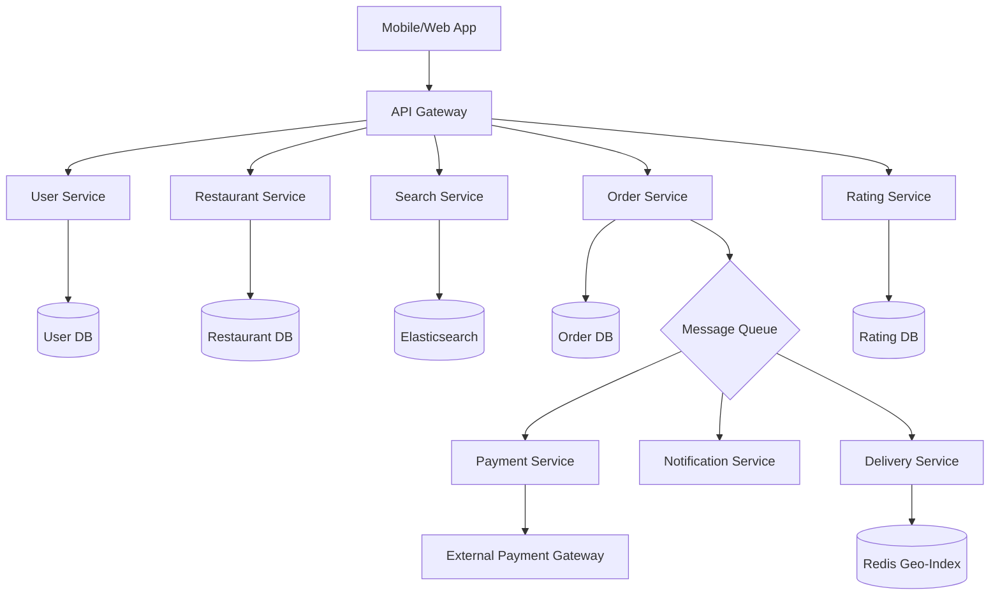

# System Design Document: Food Ordering and Ratings System (Zomato/Swiggy)

## 1. Requirements & System Constraints

### 1.1 Functional Requirements
*   **User Management:** Users can create profiles, manage addresses, and view order history.
*   **Restaurant Management:** Restaurant owners can manage their profiles, update menus (items, prices, availability), and manage order requests.
*   **Search & Discovery:** Users can search for restaurants by name, cuisine, or location. Search must be filtered by distance/geography.
*   **Ordering System:** Users can add items to a cart, apply coupons, and place an order.
*   **Payment Integration:** Secure payment processing through third-party gateways.
*   **Delivery Management:** Automatic assignment of the nearest available delivery partner to an order. Real-time tracking of the delivery partner.
*   **Ratings & Reviews:** Users can rate the restaurant and the delivery partner after order completion.
*   **Notifications:** Real-time updates on order status (Placed $\rightarrow$ Preparing $\rightarrow$ Out for Delivery $\rightarrow$ Delivered).

### 1.2 Non-Functional Requirements
*   **High Availability:** The system must be available 24/7, especially during peak meal times.
*   **Low Latency:** Search results and menu loading must be near-instantaneous.
*   **Consistency:** 
    *   **Strong Consistency:** Required for payments and order status.
    *   **Eventual Consistency:** Acceptable for restaurant ratings and search index updates.
*   **Scalability:** Must handle sudden spikes (e.g., weekends, holidays, sports events).
*   **Reliability:** No order should be lost; payment must be idempotent.

### 1.3 Scale Estimations (High-Level)
*   **Daily Active Users (DAU):** 10 Million.
*   **Orders per Day:** 2 Million.
*   **Peak QPS (Queries Per Second):** 50k - 100k during lunch/dinner peaks.
*   **Data Growth:** Millions of ratings and orders monthly, requiring a robust partitioning strategy.

---

## 2. High-Level Architecture

The system follows a **Microservices Architecture** to decouple the domain logic and allow independent scaling of high-traffic services (like Search and Ordering).

### 2.1 Core Components
*   **API Gateway:** Entry point for all clients. Handles Authentication, Rate Limiting, and Request Routing.
*   **User Service:** Manages user profiles and addresses.
*   **Restaurant Service:** Manages restaurant metadata and menu catalogs.
*   **Search Service:** Powered by Elasticsearch for geo-spatial queries and full-text search.
*   **Order Service:** Manages the order lifecycle, state transitions, and cart logic.
*   **Payment Service:** Handles transactions and interacts with external gateways (Stripe/PayPal).
*   **Delivery/Dispatch Service:** Manages delivery partner availability and matching using geo-sharding.
*   **Rating Service:** Collects and aggregates ratings for restaurants and drivers.
*   **Notification Service:** Sends Push/SMS/Email via a message queue.

### 2.2 Architecture Diagram (Mermaid)



---

## 3. Detailed Database Schema Design

### 3.1 Database Selection
*   **Relational DB (PostgreSQL):** Used for User, Restaurant, and Order services. These require ACID properties for transactions (especially payments and order status).
*   **NoSQL (Elasticsearch):** Used for the Search service to handle complex geo-spatial queries (e.g., "find Italian restaurants within 5km").
*   **In-Memory (Redis):** Used for caching menus, session management, and storing real-time coordinates of delivery partners.

### 3.2 Schema Tables

#### Restaurant Service (SQL)
| Table | Fields | Keys/Indexes |
| :--- | :--- | :--- |
| `restaurants` | `id` (PK), `name`, `cuisine`, `address`, `lat`, `long`, `avg_rating`, `is_active` | Index on `(lat, long)` |
| `menu_items` | `id` (PK), `restaurant_id` (FK), `name`, `description`, `price`, `category`, `is_available` | Index on `restaurant_id` |

#### Order Service (SQL)
| Table | Fields | Keys/Indexes |
| :--- | :--- | :--- |
| `orders` | `id` (PK), `user_id` (FK), `restaurant_id` (FK), `total_amount`, `status`, `created_at`, `delivery_address` | Index on `user_id`, `status` |
| `order_items` | `id` (PK), `order_id` (FK), `menu_item_id` (FK), `quantity`, `price_at_time` | Index on `order_id` |

#### Delivery Service (SQL + Redis)
| Table | Fields | Keys/Indexes |
| :--- | :--- | :--- |
| `delivery_partners` | `id` (PK), `name`, `phone`, `vehicle_type`, `current_status` (IDLE, BUSY) | Index on `current_status` |
| `deliveries` | `id` (PK), `order_id` (FK), `partner_id` (FK), `assigned_at`, `delivered_at` | Index on `order_id` |
| **Redis Geo** | `key: partner_locations`, `member: partner_id`, `coord: (lat, long)` | Geo-spatial index |

#### Rating Service (NoSQL - MongoDB/Cassandra)
*Reasoning: Ratings are write-heavy and don't require complex joins. A document store allows flexible schema for reviews.*
| Collection | Fields | Index |
| :--- | :--- | :--- |
| `ratings` | `rating_id`, `order_id`, `user_id`, `target_id` (Rest/Partner), `score` (1-5), `comment`, `timestamp` | Index on `target_id` |

---

## 4. Core API Design

### 4.1 Search & Discovery
`GET /v1/restaurants?lat={lat}&long={long}&radius=5&cuisine=italian`
*   **Response:** `200 OK`
*   **Payload:** `[{"id": "r1", "name": "Pasta Place", "rating": 4.5, "distance": "1.2km"}, ...]`

### 4.2 Ordering
`POST /v1/orders`
*   **Request:**
    ```json
    {
      "restaurant_id": "r1",
      "items": [{"menu_item_id": "m1", "quantity": 2}, {"menu_item_id": "m5", "quantity": 1}],
      "address_id": "addr_123",
      "payment_method": "CREDIT_CARD"
    }
    ```
*   **Response:** `201 Created` $\rightarrow$ `{"order_id": "ord_999", "status": "PENDING_PAYMENT"}`

### 4.3 Ratings
`POST /v1/ratings`
*   **Request:**
    ```json
    {
      "order_id": "ord_999",
      "restaurant_rating": 5,
      "restaurant_comment": "Delicious food!",
      "partner_rating": 4,
      "partner_comment": "Fast delivery."
    }
    ```
*   **Response:** `200 OK`

---

## 5. Scalability & Advanced Topics

### 5.1 Geo-Spatial Indexing (Delivery Matching)
To find the nearest delivery partner, the system cannot query a SQL DB with `ORDER BY distance` for every order.
*   **Solution:** Use **Google S2 Geometry** or **Uber H3**. Divide the map into hexagonal/rectangular cells. 
*   **Redis GeoHash:** Store partner locations in Redis using `GEOADD`. When an order is placed, use `GEORADIUS` to find partners within $X$ kilometers.

### 5.2 Handling Peak Traffic
*   **Read Path:** Cache restaurant menus and search results in Redis. Use a **CDN** for static images of food.
*   **Write Path:** Use **Kafka** to decouple the Order service from Payment, Notification, and Delivery services. This prevents a bottleneck in the payment gateway from crashing the order placement flow.
*   **Database Sharding:** Shard the `orders` table by `user_id` or `order_date` to distribute the load.

### 5.3 Delivery Partner Assignment (The "Matching" Problem)
*   Use a **State Machine** to track order status.
*   **Dispatch Logic:** When an order is "Ready," the Dispatcher queries Redis for the 10 nearest `IDLE` partners and sends a request. If the first partner rejects, it moves to the second. This is handled asynchronously via a worker pool.

### 5.4 Rating Aggregation
Updating the `avg_rating` in the `restaurants` table on every single review would cause lock contention.
*   **Strategy:** Write ratings to a NoSQL store. Use a **Scheduled Job (Cron)** or a **Stream Processor (Flink/Spark)** to aggregate ratings every 15-30 minutes and update the main `restaurants` table in bulk.

---

## 6. Trade-off Analysis

### 6.1 CAP Theorem Priorities
*   **Ordering/Payment:** Prioritize **Consistency (C)** and **Partition Tolerance (P)**. We cannot have a scenario where a user is charged but the order is not recorded.
*   **Search/Discovery:** Prioritize **Availability (A)** and **Partition Tolerance (P)**. It is acceptable if a user sees a restaurant that just went offline or a rating that is 10 minutes old.

### 6.2 Latency vs. Storage
*   **Trade-off:** We store redundant data (Denormalization). For example, the `orders` table stores `price_at_time` instead of just linking to the `menu_items` table. 
*   **Reasoning:** Menu prices change. To maintain a historical record of the transaction, we trade storage space for data integrity and faster read performance (no need to join with a versioned menu table).

### 6.3 Synchronous vs. Asynchronous Processing
*   **Synchronous:** User $\rightarrow$ Order Service $\rightarrow$ Payment (Wait for Success).
*   **Asynchronous:** Order Success $\rightarrow$ Kafka $\rightarrow$ [Notification, Delivery Dispatch, Analytics].
*   **Reasoning:** This reduces the API response time for the user and ensures that a failure in the Notification service does not roll back a successful payment.