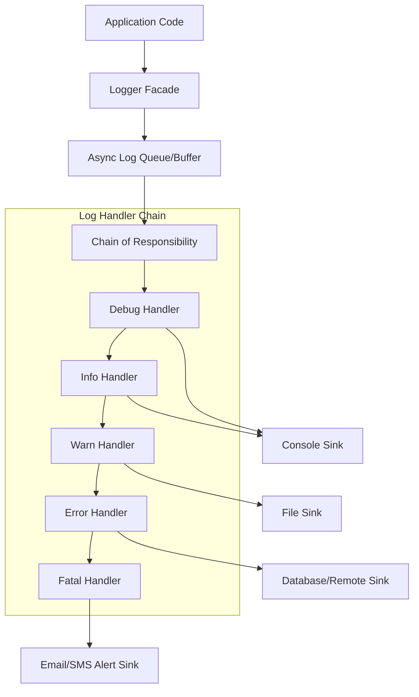

# Design Document: Extensible Logger Framework

## 1. Requirements & System Constraints

The goal is to design a flexible, extensible logging framework that allows developers to log messages at various severity levels. The framework must employ the **Chain of Responsibility** pattern to ensure that log messages are handled by the appropriate sinks based on their severity.

### 1.1 Functional Requirements
*   **Log Levels**: Support standard log levels: `DEBUG`, `INFO`, `WARNING`, `ERROR`, `FATAL`.
*   **Pluggable Sinks**: Ability to route logs to different destinations (Console, File, Database, Remote API, Email/PagerDuty).
*   **Configurable Routing**: A specific log level should be handled by its corresponding logger and potentially passed down to loggers of higher severity (e.g., a `FATAL` log should likely be logged to the Console, written to a File, and sent via Email).
*   **Custom Formatting**: Support for customizable log formats (e.g., JSON, Plain Text).
*   **Asynchronous Processing**: Logging should not block the main application execution thread.

### 1.2 Non-Functional Requirements
*   **Low Latency**: The overhead added to the application's critical path must be minimal.
*   **Extensibility**: Adding a new logging sink (e.g., Slack integration) should require minimal code changes (Open/Closed Principle).
*   **Thread Safety**: The framework must be thread-safe to handle concurrent log requests from multiple application threads.
*   **Reliability**: Failure of a non-critical sink (e.g., a remote API timeout) should not crash the application.

---

## 2. High-Level Architecture

The system is designed as a library integrated into an application, which can optionally push logs to a centralized logging server.

### 2.1 Core Components
1.  **Logger Facade**: The entry point for the application. It hides the complexity of the chain from the client.
2.  **Log Message**: A Data Transfer Object (DTO) containing the message, timestamp, log level, and thread ID.
3.  **Abstract Log Handler**: The base class for the Chain of Responsibility. It defines the `setNext()` method and the `handle()` logic.
4.  **Concrete Handlers**: Specific implementations (e.g., `ConsoleLogger`, `FileLogger`, `RemoteLogger`) that process the log if the level matches.
5.  **Log Dispatcher (Async Buffer)**: An internal queue (e.g., Ring Buffer/LMAX Disruptor) that decouples the application thread from the I/O-heavy logging sinks.

### 2.2 Architecture Diagram



---

## 3. Detailed Design

### 3.1 Class Design (LLD)
The core of the framework is the `AbstractLogger`.

*   **`LogLevel` (Enum)**: `DEBUG(1), INFO(2), WARNING(3), ERROR(4), FATAL(5)`.
*   **`LogMessage` (Class)**: Contains `timestamp`, `level`, `message`, `contextMap`.
*   **`AbstractLogger` (Abstract Class)**:
    *   `protected AbstractLogger nextLogger;`
    *   `public void setNext(AbstractLogger next)`
    *   `public void logMessage(LogLevel level, String msg)` $\rightarrow$ Checks if `level >= this.level`. If yes, calls `write()` and then calls `nextLogger.logMessage()`.

### 3.2 Database Schema Design (Centralized Logging Backend)
When logs are sent to a remote sink, they are stored in a time-series optimized database. For high-volume logs, **ClickHouse** or **Elasticsearch** is preferred over SQL.

**Table: `application_logs`**

| Field | Type | Constraint | Description |
| :--- | :--- | :--- | :--- |
| `log_id` | UUID | PK | Unique identifier for the log entry |
| `timestamp` | DateTime64 | Indexed | Precision timestamp of the event |
| `level` | Enum/String | Indexed | DEBUG, INFO, etc. |
| `service_id` | String | Indexed | Identifier for the microservice |
| `trace_id` | String | Indexed | For distributed tracing (Correlation ID) |
| `message` | Text | - | The actual log message |
| `payload` | JSON/BSON | - | Structured context (e.g., user_id, request_params) |
| `host` | String | - | Server hostname where log originated |

**Indexing Strategy**:
*   **Partitioning**: Partition by `timestamp` (daily or monthly) to allow efficient TTL (Time-to-Live) deletion of old logs.
*   **Primary Key**: `(service_id, timestamp, level)` to optimize common queries (e.g., "Show me all ERRORs for Service A in the last hour").

---

## 4. Core API Design

### 4.1 Application Interface (Internal API)
```java
Logger logger = LoggerFactory.getLogger();
logger.info("User logged in", Map.of("userId", "123"));
logger.error("Database connection failed", exception);
```

### 4.2 Remote Ingestion API (External API)
If the framework pushes logs to a remote collector (like Logstash or a custom collector), the following REST/gRPC API is used:

**Endpoint**: `POST /v1/logs/ingest`

**Request Payload**:
```json
{
  "batch_id": "batch-998877",
  "logs": [
    {
      "timestamp": "2023-10-27T10:00:00.123Z",
      "level": "ERROR",
      "service_id": "payment-gateway",
      "trace_id": "a1-b2-c3-d4",
      "message": "Timeout connecting to Bank API",
      "payload": {
        "endpoint": "/v1/charge",
        "timeout_ms": 5000
      },
      "host": "pod-payment-01"
    }
  ]
}
```

**Response**:
```json
{
  "status": "success",
  "processed_count": 1
}
```

---

## 5. Scalability & Advanced Topics

### 5.1 Asynchronous Logging (The Performance Key)
To prevent the application from slowing down during I/O spikes, the framework implements an **Async Appender**:
*   **Internal Queue**: Use a `BlockingQueue` or a `RingBuffer` (LMAX Disruptor).
*   **Worker Thread**: A background daemon thread consumes the queue and traverses the Chain of Responsibility.
*   **Backpressure Strategy**: If the queue is full, the framework can either:
    *   *Drop logs* (preferable for DEBUG/INFO).
    *   *Block the caller* (preferable for FATAL).
    *   *Spill to a local temporary file*.

### 5.2 Log Aggregation & Distribution
*   **Batching**: Instead of sending one HTTP request per log, the `RemoteLogger` buffers logs and sends them in batches (e.g., every 5 seconds or 1000 logs).
*   **Compression**: Use GZip or Zstd compression for batch uploads to reduce network bandwidth.
*   **Sidecar Pattern**: In Kubernetes, the framework writes to `stdout` or a local file, and a sidecar container (like FluentBit) ships the logs to the backend.

### 5.3 Fault Tolerance
*   **Circuit Breaker**: If the Remote API is down, the `RemoteLogger` should open the circuit and fallback to local file logging to prevent memory buildup in the queue.
*   **Retry Logic**: Implement exponential backoff for transient network failures.

---

## 6. Trade-off Analysis

| Trade-off | Decision | Reasoning |
| :--- | :--- | :--- |
| **Sync vs Async** | **Asynchronous** | Logging is a cross-cutting concern; it should never be the bottleneck of the primary business logic. |
| **SQL vs NoSQL** | **NoSQL/TSDB** | Logs are write-heavy and read-infrequent. ClickHouse/Elasticsearch provide superior write throughput and full-text search compared to PostgreSQL/MySQL. |
| **Chain vs Map** | **Chain of Responsibility** | While a Map of handlers is faster ($O(1)$), the Chain allows for "cascading" logs (e.g., an Error is both logged to file AND sent to an alert system) without duplicating calls. |
| **Latency vs Reliability** | **Latency Priority** | In high-throughput systems, dropping a few DEBUG logs is acceptable to ensure the application remains responsive. |

### CAP Theorem Application
The logging backend prioritizes **Availability** and **Partition Tolerance** (AP). It is acceptable if a log entry takes a few seconds to appear in the dashboard (Eventual Consistency), but it is unacceptable for the ingestion API to reject logs because it is waiting for a global synchronous write across all replicas.