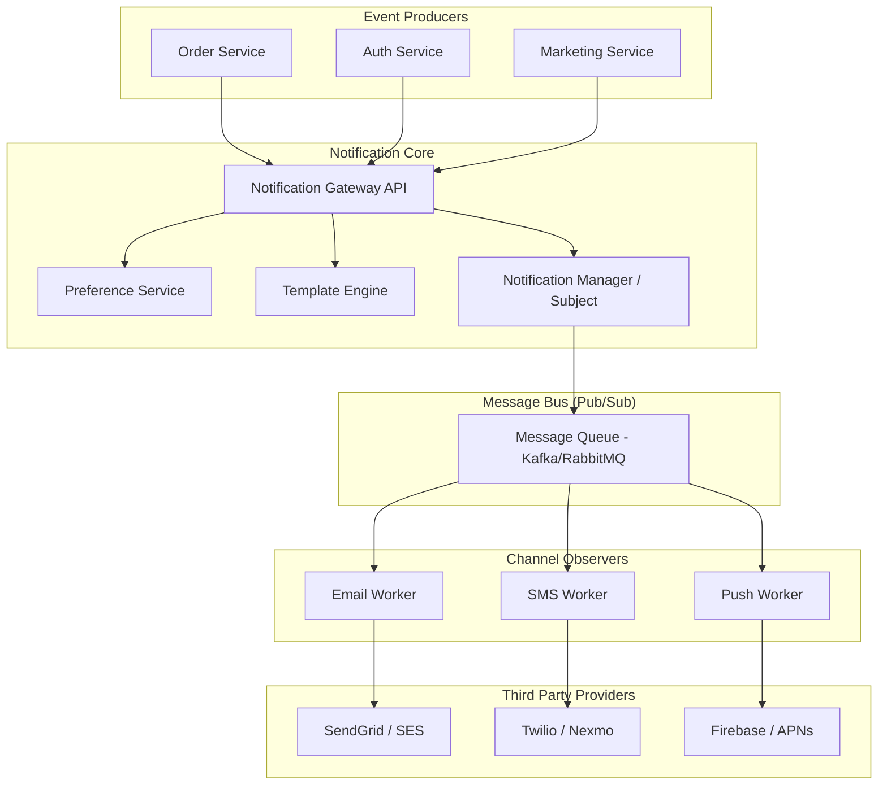

# System Design Document: Notification Service

## 1. Requirements & System Constraints

The Notification Service is a cross-cutting concern in a microservices architecture. Its primary goal is to decouple the business logic (Event Producers) from the delivery mechanism (Notification Channels).

### 1.1 Functional Requirements
*   **Multi-Channel Support:** Ability to send notifications via Email, SMS, and Push Notifications.
*   **Template Management:** Support for dynamic templates with placeholders (e.g., "Hello {{name}}, your order {{orderId}} has shipped").
*   **User Preferences:** Users must be able to opt-in or opt-out of specific notification types per channel.
*   **Priority Handling:** Support for different priorities (e.g., `HIGH` for OTPs, `LOW` for marketing).
*   **Delivery Tracking:** Ability to track the status of a notification (Sent, Delivered, Failed, Read).
*   **Pluggable Providers:** Ability to switch providers (e.g., moving from Twilio to MessageBird) without changing core business logic.

### 1.2 Non-Functional Requirements
*   **High Availability:** The service must be available to receive notification requests even if a specific downstream provider is down.
*   **Scalability:** Must handle bursts of traffic (e.g., a flash sale triggering millions of push notifications).
*   **Reliability (At-least-once Delivery):** Ensuring that critical notifications (like password resets) are eventually delivered.
*   **Low Latency:** Transactional notifications should be delivered within seconds.

### 1.3 Scale Estimations (Example)
*   **Daily Volume:** 100 million notifications/day.
*   **Average Throughput:** ~1,150 requests per second (RPS).
*   **Peak Throughput:** ~10,000+ RPS during marketing campaigns.
*   **Storage:** Notification logs for 30 days $\approx 100M \times 30 \times 500 \text{ bytes} \approx 1.5 \text{ TB}$.

---

## 2. High-Level Architecture

The system implements the **Observer Pattern** at a distributed scale. The "Subject" is the Notification Manager, and the "Observers" are the specific Channel Providers. Instead of in-memory observers, we use a Message Queue to achieve asynchronous decoupling.

### 2.1 Architecture Diagram



### 2.2 Component Interactions
1.  **Gateway API:** Receives a request containing `userId`, `notificationType`, and `metadata`.
2.  **Preference Service:** Validates if the user has enabled the specific `notificationType` for the requested channels.
3.  **Template Engine:** Fetches the template associated with the `notificationType` and hydrates it with the provided `metadata`.
4.  **Notification Manager:** Acts as the Subject. It wraps the final payload into an event and publishes it to the Message Queue.
5.  **Channel Workers:** Act as Observers. They subscribe to specific topics/queues, pull the messages, and invoke the third-party provider APIs.

---

## 3. Detailed Database Schema Design

### 3.1 Database Selection
*   **Relational DB (PostgreSQL):** Used for `UserPreferences` and `Templates`. These require strong consistency and complex querying.
*   **NoSQL DB (Cassandra or MongoDB):** Used for `NotificationLogs`. This table is write-heavy and grows linearly; a NoSQL store allows for better horizontal scaling and TTL (Time-to-Live) for old logs.

### 3.2 Schema

#### Table: `notification_templates` (SQL)
| Field | Type | Constraints | Description |
| :--- | :--- | :--- | :--- |
| `template_id` | UUID | PK | Unique identifier for the template |
| `type` | String | Index, Unique | e.g., `ORDER_CONFIRMATION` |
| `channel` | Enum | Index | `EMAIL`, `SMS`, `PUSH` |
| `content` | Text | - | Template string with placeholders |
| `subject` | String | - | Used primarily for Email |

#### Table: `user_preferences` (SQL)
| Field | Type | Constraints | Description |
| :--- | :--- | :--- | :--- |
| `user_id` | UUID | PK, FK | Link to User Service |
| `type` | String | PK | Notification type |
| `channel` | Enum | PK | `EMAIL`, `SMS`, `PUSH` |
| `is_enabled` | Boolean | - | Opt-in/Opt-out status |

#### Table: `notification_logs` (NoSQL)
| Field | Type | Constraints | Description |
| :--- | :--- | :--- | :--- |
| `notification_id`| UUID | Partition Key | Unique delivery ID |
| `user_id` | UUID | Clustering Key | For querying user history |
| `channel` | String | - | Channel used |
| `status` | Enum | - | `QUEUED`, `SENT`, `DELIVERED`, `FAILED` |
| `retry_count` | Int | - | Number of attempts |
| `created_at` | Timestamp | Index | For cleanup/archiving |

---

## 4. Core API Design

### 4.1 Send Notification
`POST /v1/notifications/send`

**Request Payload:**
```json
{
  "userId": "u-12345",
  "notificationType": "ORDER_SHIPPED",
  "priority": "MEDIUM",
  "metadata": {
    "customerName": "John Doe",
    "orderId": "ORD-9988",
    "trackingUrl": "https://ship.it/123"
  },
  "overrideChannels": ["EMAIL", "PUSH"] 
}
```

**Response Payload:**
```json
{
  "notificationId": "notif-abc-123",
  "status": "ACCEPTED",
  "estimatedDelivery": "2023-10-27T10:00:05Z"
}
```

### 4.2 Update Preferences
`PATCH /v1/preferences`

**Request Payload:**
```json
{
  "userId": "u-12345",
  "preferences": [
    { "type": "MARKETING", "channel": "EMAIL", "enabled": false },
    { "type": "TRANSACTIONAL", "channel": "SMS", "enabled": true }
  ]
}
```

---

## 5. Scalability & Advanced Topics

### 5.1 Asynchronous Processing & Buffering
To prevent the system from crashing during traffic spikes, we use a **Message Queue (Kafka)**.
*   **Topic Partitioning:** Separate topics for `Email`, `SMS`, and `Push` to ensure a bottleneck in the SMS provider doesn't delay Email delivery.
*   **Consumer Groups:** Scale workers horizontally based on the lag in each queue.

### 5.2 Rate Limiting & Throttling
*   **Provider Limits:** Third-party APIs (like Twilio) have strict rate limits. We implement a **Token Bucket** algorithm at the Worker level to throttle requests.
*   **User-level Throttling:** To prevent spamming users, we track the number of notifications sent to a specific `userId` within a sliding window.

### 5.3 Reliability & Fault Tolerance
*   **Exponential Backoff:** If a provider returns a $5xx$ error, the worker retries with increasing delays ($2^n$).
*   **Dead Letter Queue (DLQ):** If a notification fails after $X$ retries, it is moved to a DLQ for manual inspection or alerting.
*   **Idempotency:** Each request is assigned a `notificationId`. Workers check a distributed cache (Redis) to ensure the same ID isn't processed twice.

### 5.4 Caching Strategy
*   **Template Cache:** Templates are cached in Redis as they change infrequently.
*   **Preference Cache:** User preferences are cached with a short TTL to avoid hitting the SQL DB for every single notification.

---

## 6. Trade-off Analysis

### 6.1 CAP Theorem
The Notification Service prioritizes **Availability** and **Partition Tolerance (AP)**. 
*   It is acceptable if a "Notification Read" status is eventually consistent.
*   It is NOT acceptable for the system to stop accepting notifications because the log database is momentarily unavailable.

### 6.2 Latency vs. Durability
By introducing a Message Queue, we trade off **immediate confirmation** (the API returns "Accepted", not "Delivered") for **durability and system stability**. The producer doesn't wait for the actual network call to the third-party provider, significantly reducing API latency.

### 6.3 SQL vs. NoSQL for Logs
We chose NoSQL for logs because the volume of data is massive and the access pattern is primarily write-heavy or range-scans by `userId`. Using a relational database for logs would lead to massive index overhead and expensive vacuuming/maintenance operations.