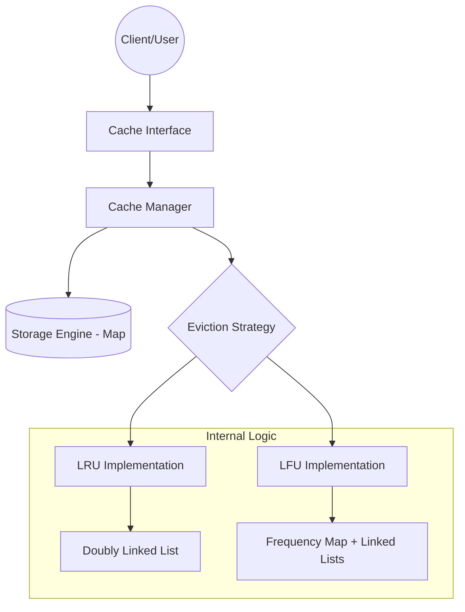

# Solution Guide: Generic Thread-Safe Caching Framework

## 1. Requirements & System Constraints

The objective is to design a professional-grade, generic caching framework that allows developers to store key-value pairs in memory with a defined eviction policy to prevent memory exhaustion.

### 1.1 Functional Requirements
*   **Generic Support**: The cache must support any data type for keys (`K`) and values (`V`).
*   **Basic Operations**:
    *   `put(K key, V value)`: Insert or update a value. If the cache is at capacity, trigger eviction.
    *   `get(K key)`: Retrieve a value. This operation should update the "recency" or "frequency" of the key.
    *   `remove(K key)`: Explicitly remove an item from the cache.
*   **Eviction Policies**:
    *   **LRU (Least Recently Used)**: Discard the least recently accessed items first.
    *   **LFU (Least Frequently Used)**: Discard items with the lowest access frequency first.
*   **Capacity Management**: A fixed maximum size must be configurable at initialization.

### 1.2 Non-Functional Requirements
*   **Time Complexity**: Both `get` and `put` operations must operate in $O(1)$ average time complexity.
*   **Thread Safety**: The framework must be safe for concurrent access by multiple threads without corrupting the internal state.
*   **Extensibility**: It should be easy to add new eviction policies (e.g., FIFO, MRU) using the Strategy Pattern.
*   **Low Overhead**: Minimal memory overhead beyond the storage of the data itself.

---

## 2. High-Level Architecture

The system is designed using a decoupled architecture where the cache management logic is separated from the specific eviction strategy.

### 2.1 Component Overview
*   **`Cache<K, V>`**: The primary interface providing the API to the user.
*   **`EvictionPolicy<K>`**: An interface/abstract class that defines how keys are tracked and which key should be evicted.
*   **`LRUEvictionPolicy` / `LFUEvictionPolicy`**: Concrete implementations of the eviction logic.
*   **`StorageEngine`**: A thread-safe map (e.g., `ConcurrentHashMap`) that stores the actual data.
*   **`CacheManager`**: Orchestrates the interaction between the storage engine and the eviction policy.

### 2.2 Architecture Diagram



---

## 3. Detailed Design (Data Structures)

Since this is a Low-Level Design (LLD), we replace "Database Schema" with "Internal Data Structure Design."

### 3.1 LRU Implementation Design
To achieve $O(1)$ for both access and update, we combine a **HashMap** with a **Doubly Linked List (DLL)**.

*   **HashMap**: Stores `Key -> Node` mapping. Provides $O(1)$ access to any node in the DLL.
*   **Doubly Linked List**: Maintains the order of usage. 
    *   **Head**: Most Recently Used (MRU).
    *   **Tail**: Least Recently Used (LRU).
*   **Operation Logic**:
    *   `get(key)`: Find node via map $\rightarrow$ Move node to Head $\rightarrow$ Return value.
    *   `put(key, value)`: 
        *   If key exists: Update value $\rightarrow$ Move node to Head.
        *   If key is new: Create node $\rightarrow$ Add to Head $\rightarrow$ If size > capacity, remove node at Tail $\rightarrow$ Remove Tail key from map.

### 3.2 LFU Implementation Design
LFU is more complex because it requires tracking the number of hits. We use a **HashMap** for values and a **Frequency Map** containing sets of keys.

*   **Value Map**: `Map<K, CacheNode>` where `CacheNode` contains the value and current frequency.
*   **Frequency Map**: `Map<Integer, DoublyLinkedList<K>>`.
    *   Key: The frequency count (e.g., 1, 2, 5).
    *   Value: A doubly linked list of all keys that have been accessed that many times.
*   **Min Frequency Tracker**: An integer `minFreq` to track the lowest current frequency for $O(1)$ eviction.
*   **Operation Logic**:
    *   `get(key)`: 
        1. Access node $\rightarrow$ current frequency $f$.
        2. Remove key from `FreqMap.get(f)`.
        3. If `FreqMap.get(f)` is empty and $f == minFreq$, increment `minFreq`.
        4. Add key to `FreqMap.get(f + 1)`.
    *   `put(key, value)`: 
        1. If key exists: Update value $\rightarrow$ Perform `get(key)` logic to update frequency.
        2. If key is new:
           - If size == capacity: Evict the first node from `FreqMap.get(minFreq)`.
           - Insert new node $\rightarrow$ Set freq = 1 $\rightarrow$ Add to `FreqMap.get(1)` $\rightarrow$ Set `minFreq = 1`.

### 3.3 Thread-Safety Mechanism
To ensure thread safety while maintaining high throughput:
1.  **Fine-Grained Locking**: Instead of synchronizing the entire `put`/`get` methods (which creates a bottleneck), use a `ReentrantReadWriteLock`.
    *   `ReadLock`: Allows multiple threads to perform `get()` if the eviction policy doesn't require a structural write (though LRU/LFU usually do, making `get` effectively a write operation).
2.  **Concurrent Collections**: Use `ConcurrentHashMap` for the primary storage to handle concurrent bucket access.
3.  **Synchronized Blocks**: Use synchronization specifically around the manipulation of the Doubly Linked List pointers to prevent race conditions.

---

## 4. Core API Design

The framework is designed as a generic library.

### 4.1 Interface Definitions (Java-style)

```java
public interface Cache<K, V> {
    V get(K key);
    void put(K key, V value);
    void remove(K key);
    void clear();
    int size();
}

public interface EvictionPolicy<K> {
    void keyAccessed(K key);
    K evict();
    void keyAdded(K key);
    void keyRemoved(K key);
}
```

### 4.2 Example Usage

```java
// Create a thread-safe LRU Cache with capacity of 1000
Cache<String, UserProfile> userCache = CacheFactory.createCache(
    1000, 
    EvictionStrategy.LRU, 
    ConcurrencyLevel.HIGH
);

userCache.put("user_123", profileObj);
UserProfile profile = userCache.get("user_123");
```

---

## 5. Scalability & Advanced Topics

### 5.1 Memory Management & GC
*   **Soft References**: To prevent `OutOfMemoryError`, values can be wrapped in `SoftReference<V>`. This allows the JVM Garbage Collector to reclaim cache memory if the heap is full, even before the eviction policy triggers.
*   **Off-Heap Storage**: For extremely large caches, use `DirectByteBuffer` or libraries like Ohc to move data outside the JVM heap, reducing GC pause times.

### 5.2 Distributed Caching (Expansion)
If this LLD needs to scale to a distributed environment:
*   **Consistent Hashing**: Use consistent hashing to distribute keys across multiple cache nodes to minimize reshuffling when nodes are added/removed.
*   **Cache Protocols**:
    *   **Write-through**: Write to cache and DB simultaneously.
    *   **Write-behind (Write-back)**: Write to cache, then asynchronously update DB.
    *   **Cache-aside**: Application checks cache; on miss, loads from DB and populates cache.

### 5.3 Performance Optimizations
*   **Striping**: Divide the cache into segments (similar to `ConcurrentHashMap` in Java 7) to reduce lock contention. Each segment has its own lock and eviction list.
*   **Approximate LRU**: Instead of a perfect DLL (which requires a lock on every `get`), use a "Clock Algorithm" or "Segmented LRU" to reduce synchronization overhead.

---

## 6. Trade-off Analysis

| Trade-off | Choice | Reasoning |
| :--- | :--- | :--- |
| **LRU vs LFU** | LRU (Default) | LRU is generally better for workloads with "temporal locality" (recently accessed items are likely to be accessed again). LFU is better for "frequency-based" patterns but suffers from "cache pollution" (items accessed many times in the past but no longer needed). |
| **Locking vs Lock-Free** | ReadWriteLock | While lock-free structures (using CAS) are faster, the complexity of maintaining a Doubly Linked List lock-free is extremely high. `ReadWriteLock` provides a balance of safety and performance. |
| **Time vs Space** | $O(1)$ Time | We sacrifice space (storing pointers in DLL and keys in a Map) to ensure that cache lookups do not become the bottleneck of the application. |
| **Strong vs Eventual Consistency** | Strong | Since this is an in-memory framework, we prioritize strong consistency for `put` and `get` operations within a single JVM instance. |

### Complexity Summary
| Operation | LRU Time | LFU Time | Space Complexity |
| :--- | :--- | :--- | :--- |
| `get(key)` | $O(1)$ | $O(1)$ | $O(N)$ |
| `put(key, val)` | $O(1)$ | $O(1)$ | $O(N)$ |
| `evict()` | $O(1)$ | $O(1)$ | $O(N)$ |