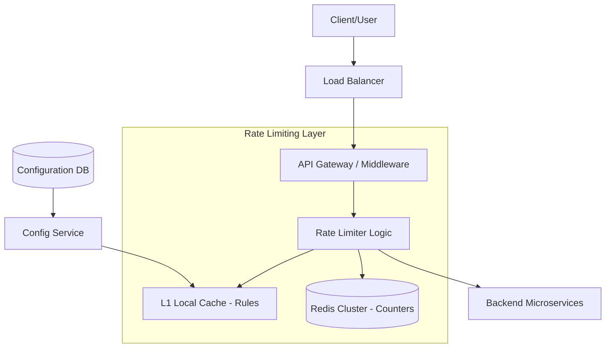

# Design Document: Distributed Rate Limiter

## 1. Requirements & System Constraints

### 1.1 Functional Requirements
*   **Request Throttling:** Limit the number of requests a user/client can make to an API within a specific time window.
*   **Multi-tenant Support:** Apply different rate limits based on user tiers (e.g., Free: 100 req/min, Premium: 1000 req/min).
*   **Granular Control:** Ability to set limits per API endpoint, per user ID, or per IP address.
*   **Standard Response:** Return `HTTP 429 Too Many Requests` when the limit is exceeded, including headers indicating the remaining quota and reset time.
*   **Dynamic Configuration:** Update rate limits without requiring a service restart.

### 1.2 Non-Functional Requirements
*   **Low Latency:** The rate limiting check must add negligible overhead (typically < 2ms) to the request pipeline.
*   **High Availability:** The system must be highly available. If the rate limiter fails, the system should "fail-open" (allow requests) to ensure user experience isn't broken.
*   **Distributed Accuracy:** The count must be synchronized across multiple application nodes in a distributed cluster.
*   **Scalability:** Handle millions of unique users and hundreds of thousands of requests per second (RPS).

### 1.3 Scale Estimations (Example)
*   **Traffic:** 100,000 RPS.
*   **Users:** 10 million active users.
*   **Storage:** If using a sliding window log with 100 requests per window, we might store $10^7 \times 100$ timestamps. However, using a counter-based approach reduces this significantly.
*   **Latency Budget:** $\approx 1 \text{ms}$ for Redis lookup + $\approx 0.5 \text{ms}$ for network round-trip.

---

## 2. High-Level Architecture

The Distributed Rate Limiter is implemented as a middleware layer (or a sidecar) that intercepts requests before they reach the backend business logic.

### 2.1 Component Interaction
1.  **Client** sends a request.
2.  **API Gateway / Middleware** intercepts the request and extracts the identifier (API Key, User ID, or IP).
3.  **Rate Limiter Service** fetches the applicable rule for that identifier.
4.  **Distributed Cache (Redis)** stores the current counters/buckets. The service executes an atomic operation (via Lua script) to check if the request is allowed.
5.  **Decision:**
    *   **Allowed:** Request is forwarded to the **Backend Service**.
    *   **Throttled:** Request is rejected with `HTTP 429`.

### 2.2 Architecture Diagram



---

## 3. Detailed Design

### 3.1 Algorithm Selection

We will implement a hybrid approach supporting both **Token Bucket** (for bursty traffic) and **Sliding Window Counter** (for smooth limiting).

#### A. Token Bucket (Best for Bursts)
*   **Concept:** A bucket has a maximum capacity $C$. Tokens are added at a constant rate $R$. Each request consumes one token.
*   **Distributed Logic:** Instead of a background timer to refill tokens, we calculate the refill amount lazily upon request:
    $$\text{tokens\_to\_add} = (\text{current\_time} - \text{last\_refill\_time}) \times \text{refill\_rate}$$

#### B. Sliding Window Counter (Best for Precision)
*   **Concept:** Divide time into small buckets (e.g., 1 minute divided into 60 one-second buckets). 
*   **Logic:** Current window count = $\text{count in current bucket} + (\text{count in previous bucket} \times \text{overlap percentage})$.

### 3.2 Database & Storage Design

#### 3.2.1 Configuration Store (SQL)
Used for managing rate limit rules. A relational database is chosen for strong consistency and easy querying.

**Table: `rate_limit_rules`**
| Field | Type | Description |
| :--- | :--- | :--- |
| `rule_id` | UUID (PK) | Unique identifier for the rule |
| `resource_path` | String | API endpoint (e.g., `/v1/payment`) |
| `tier` | Enum | FREE, PREMIUM, ENTERPRISE |
| `limit` | Integer | Max requests allowed |
| `window_size` | Integer | Time window in seconds |
| `algorithm` | Enum | TOKEN_BUCKET, SLIDING_WINDOW |

**Index:** `idx_resource_tier` on `(resource_path, tier)`.

#### 3.2.2 Distributed State Store (Redis)
Redis is used for counters due to its in-memory speed and atomic operations.

**Token Bucket Key Schema:**
*   **Key:** `rl:token_bucket:{userId}:{resourceId}`
*   **Value:** Hash map `{ "tokens": 45, "last_updated": 1625000000 }`

**Sliding Window Key Schema:**
*   **Key:** `rl:sliding_window:{userId}:{resourceId}`
*   **Value:** Sorted Set (ZSET). Member = `unique_request_id`, Score = `timestamp`.

### 3.3 Core API Design (Management)

These endpoints allow administrators to modify rate limits dynamically.

**1. Create/Update Rule**
`POST /admin/rate-limits`
```json
{
  "resource_path": "/api/v1/upload",
  "tier": "FREE",
  "limit": 50,
  "window_size": 3600,
  "algorithm": "TOKEN_BUCKET"
}
```

**2. Get Current Limit Status (Internal/Debug)**
`GET /admin/rate-limits/status?userId=123&resource=/api/v1/upload`
```json
{
  "userId": "123",
  "remaining": 12,
  "reset_time": "2023-10-27T10:05:00Z",
  "limit": 50
}
```

---

## 4. Scalability & Advanced Topics

### 4.1 Atomicity and Race Conditions
In a distributed environment, a "read-modify-write" cycle leads to race conditions. To prevent this, we use **Redis Lua Scripts**. Lua scripts are executed atomically in Redis, ensuring that the check and the decrement of tokens happen as a single operation.

**Example Lua Logic for Token Bucket:**
```lua
local key = KEYS[1]
local rate = tonumber(ARGV[1])
local capacity = tonumber(ARGV[2])
local now = tonumber(ARGV[3])
local requested = tonumber(ARGV[4])

local bucket = redis.call('hmget', key, 'tokens', 'last_updated')
local tokens = tonumber(bucket[1]) or capacity
local last_updated = tonumber(bucket[2]) or now

local delta = math.max(0, now - last_updated) * rate
tokens = math.min(capacity, tokens + delta)

if tokens >= requested then
    redis.call('hmset', key, 'tokens', tokens - requested, 'last_updated', now)
    return 1 -- Allowed
else
    return 0 -- Throttled
end
```

### 4.2 Optimization Strategies
*   **L1 Local Cache:** To avoid hitting Redis for every request just to fetch the *rule* (e.g., "FREE tier = 100 req/min"), we cache rules in the application memory for 1-5 minutes.
*   **Redis Sharding:** Partition the Redis cluster based on the `userId` hash to ensure load is distributed across multiple Redis nodes.
*   **Batching:** For extremely high volume, use a "local aggregation" strategy where the middleware counts requests locally and syncs with Redis every 100ms. (Trade-off: slight loss in accuracy).

### 4.3 Fault Tolerance
*   **Fail-Open Mechanism:** If the Redis cluster is unreachable, the middleware should log an error and allow the request to pass. It is better to allow a few extra requests than to take down the entire API.
*   **Redis Sentinel/Cluster:** Use Redis Sentinel for automatic failover and Redis Cluster for horizontal scaling.

---

## 5. Trade-off Analysis

| Trade-off | Choice | Reasoning |
| :--- | :--- | :--- |
| **Consistency vs. Latency** | Eventual Consistency (for rules) / Strong (for counters) | Rules change rarely, so L1 caching is fine. Counters must be accurate to prevent API abuse, hence Redis Lua scripts. |
| **Accuracy vs. Memory** | Sliding Window Counter | A Sliding Window Log (ZSET) is perfectly accurate but consumes $O(N)$ memory per user. A Counter approach uses $O(1)$ memory per window. |
| **Availability vs. Strictness** | Fail-Open | In a production environment, denying legitimate traffic due to a rate-limiter outage is a higher business risk than allowing a temporary burst of traffic. |
| **Storage: SQL vs NoSQL** | Hybrid | SQL for structured, relational rule management; NoSQL (Redis) for high-throughput, ephemeral state. |

## 6. Summary of Time and Space Complexity

*   **Time Complexity:** $O(1)$ for Token Bucket and Sliding Window Counter per request.
*   **Space Complexity:** $O(U \times R)$ where $U$ is the number of unique users and $R$ is the number of resources being limited.