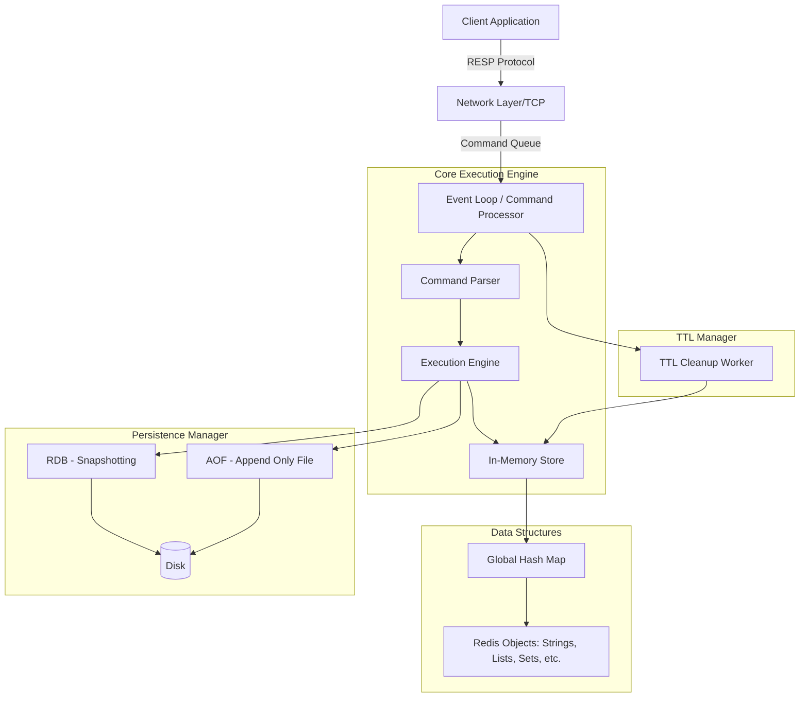

# Low-Level Design: Distributed Key-Value Store (Redis-like)

## 1. Requirements & System Constraints

### 1.1 Functional Requirements
*   **Core Operations**: Support basic CRUD operations: `GET(key)`, `SET(key, value)`, `DEL(key)`.
*   **TTL (Time-to-Live)**: Ability to set an expiration time on keys.
*   **Diverse Data Types**: Support for Strings, Lists, Sets, Sorted Sets, and Hashes.
*   **Persistence**: Options to persist in-memory data to disk to prevent data loss on restart (Snapshotting and Append-only logs).
*   **Atomic Operations**: Ensure that individual commands are executed atomically.

### 1.2 Non-Functional Requirements
*   **Ultra-Low Latency**: Sub-millisecond response times for basic operations.
*   **High Throughput**: Ability to handle hundreds of thousands of requests per second per node.
*   **High Availability**: Support for replication and automatic failover.
*   **Scalability**: Support for horizontal scaling via sharding.
*   **Consistency**: Strong consistency for single-key operations; eventual consistency for replicated data.

### 1.3 Scale Estimations (Typical Production Node)
*   **Memory**: 64GB - 256GB per node.
*   **Request Rate**: ~100k to 1M ops/sec.
*   **Network**: 10Gbps NIC to handle high throughput.

---

## 2. High-Level Architecture

The system follows a **Single-Threaded Event-Loop** architecture for the core execution engine to eliminate locking overhead and context switching, while using background threads for heavy I/O tasks (persistence and deletion).

### 2.1 Component Diagram



### 2.2 Interaction Flow
1.  **Request**: Client sends a command (e.g., `SET name "John" EX 60`) via TCP using the RESP (Redis Serialization Protocol).
2.  **Parsing**: The Event Loop picks up the request, and the Command Parser converts it into an executable operation.
3.  **Execution**: The Execution Engine interacts with the `GlobalHash` map to store/retrieve the value.
4.  **TTL**: If an expiration is set, the key is added to a priority queue or a randomized sampling list for the TTL Worker.
5.  **Persistence**: The command is logged to the AOF buffer and periodically flushed to disk.

---

## 3. Detailed Low-Level Design

### 3.1 In-Memory Data Structures
Instead of a traditional database schema, we design the internal memory representation.

#### A. The Global Key Map
The core is a **Hash Table** where:
*   **Key**: `String`
*   **Value**: `RedisObject` (a wrapper containing metadata and the actual data structure).

#### B. RedisObject Structure
```cpp
struct RedisObject {
    ObjectType type;       // STRING, LIST, SET, ZSET, HASH
    void* data;            // Pointer to the actual data structure
    long long expiryTime;  // Epoch timestamp for TTL (0 if no expiry)
    int refCount;          // For memory management/garbage collection
};
```

#### C. Specialized Data Structures
| Type | Implementation | Reasoning |
| :--- | :--- | :--- |
| **String** | SDS (Simple Dynamic String) | Pre-allocated buffers to avoid frequent reallocations. |
| **List** | Quicklist (Doubly Linked List of ziplists) | Balance between random access and efficient insertions. |
| **Set** | IntSet (for ints) or Hash Table | $O(1)$ lookup and uniqueness. |
| **Sorted Set** | Skip List + Hash Map | Hash map for $O(1)$ score lookup; Skip List for $O(\log N)$ range queries. |
| **Hash** | ZipList (small) or Hash Table (large) | Memory efficiency for small objects, performance for large. |

### 3.2 Persistence Strategy

#### RDB (Redis Database File)
*   **Mechanism**: Point-in-time snapshot.
*   **LLD Implementation**: Use `fork()` to create a child process. The child has a "copy-on-write" view of the memory and writes the entire dataset to a binary file.
*   **Trade-off**: Fast restart, but potential data loss between snapshots.

#### AOF (Append Only File)
*   **Mechanism**: Logs every write operation.
*   **LLD Implementation**: A write-ahead log (WAL). Commands are appended to a buffer and flushed to disk based on policies (`always`, `everysec`, `no`).
*   **AOF Rewrite**: To prevent the file from growing indefinitely, the system reads the current memory state and writes a condensed version of the AOF.

---

## 4. Core API Design

Since this is a KV store, the "API" is the protocol. We use a request-response model.

### 4.1 Command Set

| Command | Payload | Response | Description |
| :--- | :--- | :--- | :--- |
| `SET` | `key, value, [EX seconds]` | `OK` | Sets key to value with optional TTL. |
| `GET` | `key` | `value` or `nil` | Retrieves value of the key. |
| `DEL` | `key...` | `integer (count)` | Deletes one or more keys. |
| `EXPIRE`| `key, seconds` | `integer (1/0)` | Sets a timeout on a key. |
| `HSET` | `key, field, value` | `integer` | Sets value of a field in a hash. |
| `ZADD` | `key, score, member` | `integer` | Adds member to a sorted set. |

### 4.2 Protocol Example (RESP)
**Request (`SET key "val"`)**:
```text
*3\r\n$3\r\nSET\r\n$3\r\nkey\r\n$3\r\nval\r\n
```
*(Explanation: Array of 3 elements: "SET", "key", "val")*

---

## 5. Scalability & Advanced Topics

### 5.1 Sharding (Horizontal Scaling)
To scale beyond one node, we implement **Consistent Hashing**.
*   **Slot-based Sharding**: The keyspace is divided into 16,384 hash slots.
*   `slot = CRC16(key) mod 16384`.
*   Each node in the cluster is responsible for a range of slots.
*   **Redirection**: If a client hits Node A for a key belonging to Node B, Node A returns a `MOVED` error with Node B's address.

### 5.2 Replication & High Availability
*   **Leader-Follower**: One Master handles writes; multiple Replicas handle reads.
*   **Asynchronous Replication**: Master streams the AOF to replicas.
*   **Sentinel/Quorum**: A separate monitoring process tracks health. If the Master fails, a Sentinel triggers an election among Replicas to promote a new Master.

### 5.3 Eviction Policies (Memory Management)
When `maxmemory` is reached, the system must evict keys:
*   **LRU (Least Recently Used)**: Approximate LRU by sampling $N$ keys and evicting the oldest.
*   **LFU (Least Frequently Used)**: Tracks access frequency using a logarithmic counter.
*   **TTL Eviction**: Actively delete keys that have expired.

---

## 6. Trade-off Analysis

### 6.1 CAP Theorem
*   **Priority**: Redis prioritizes **Availability (A)** and **Partition Tolerance (P)**.
*   **Consistency**: It provides **Eventual Consistency**. In a master-replica setup, a write is acknowledged by the master before it reaches replicas. If the master crashes before replication, data loss occurs.

### 6.2 Latency vs. Durability
*   **fsync always**: Maximum durability, but latency increases to disk I/O speed (Slow).
*   **fsync everysec**: Balance; max 1 second of data loss, but maintains high throughput (Standard).
*   **No fsync**: Maximum performance, high risk of data loss (Caching use-case).

### 6.3 Single-Threaded vs. Multi-Threaded
*   **Single-Threaded (Core)**: Eliminates locking/mutex contention and race conditions. Simplifies the implementation of atomic operations.
*   **Multi-Threaded (I/O)**: Modern Redis (6.0+) uses multiple threads for reading/writing to sockets, but the **Execution Engine** remains single-threaded to maintain the simplicity of the data model.