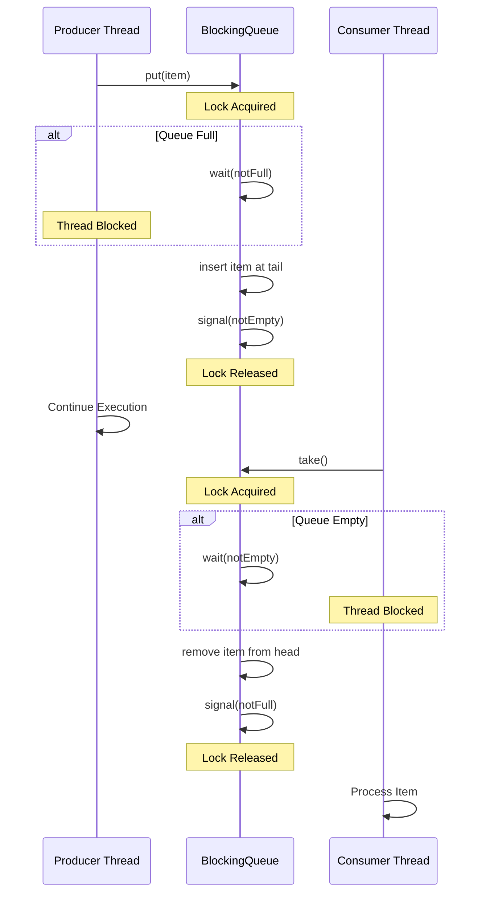

# Design Document: Thread-Safe Blocking Queue

## 1. Requirements & System Constraints

### 1.1 Functional Requirements
A Blocking Queue is a thread-safe queue that supports operations that wait for the queue to become non-empty when retrieving an element, and wait for space to become available when storing an element.

*   **`put(item)`**: Adds an item to the tail of the queue. If the queue is full, the calling thread must block until space becomes available.
*   **`take()`**: Removes and returns the item from the head of the queue. If the queue is empty, the calling thread must block until an item is added.
*   **`offer(item, timeout)`**: Attempts to add an item. If the queue is full, it waits for the specified timeout before returning `false`.
*   **`poll(timeout)`**: Attempts to remove an item. If the queue is empty, it waits for the specified timeout before returning `null`.
*   **`size()`**: Returns the current number of elements in the queue.
*   **`isEmpty()`**: Returns true if the queue contains no elements.

### 1.2 Non-Functional Requirements
*   **Thread Safety**: Multiple producers and multiple consumers must be able to access the queue concurrently without data corruption.
*   **Liveness**: The system must be free of deadlocks and livelocks.
*   **Ordering**: Must maintain First-In-First-Out (FIFO) semantics.
*   **Low Latency**: Minimizing the overhead of lock acquisition and context switching.
*   **Fairness (Optional)**: Ability to ensure that threads are served in the order they arrived to prevent thread starvation.

### 1.3 Scale Estimations
Since this is a Low-Level Design (LLD) for a data structure:
*   **Time Complexity**: `put` and `take` should be $O(1)$.
*   **Space Complexity**: $O(N)$ where $N$ is the capacity of the queue.

---

## 2. High-Level Architecture

### 2.1 Core Components
1.  **Storage Mechanism**: A circular buffer (array) or a doubly linked list to store elements.
2.  **Synchronization Primitive**: A Mutex/Lock to ensure mutual exclusion.
3.  **Condition Variables**: 
    *   `notFull`: Used to signal producers that space has been vacated.
    *   `notEmpty`: Used to signal consumers that an item has been added.
4.  **Concurrency Controller**: Manages the blocking and waking of threads based on queue state.

### 2.2 Interaction Diagram



---

## 3. Detailed Design

### 3.1 Storage Selection
For a professional implementation, we choose a **Circular Array**.
*   **Reasoning**: Arrays provide better cache locality compared to linked lists and avoid the overhead of creating new node objects for every `put` operation, reducing GC pressure in languages like Java.

### 3.2 State Management
*   `T[] buffer`: The array storing elements.
*   `int head`: Index of the next element to be taken.
*   `int tail`: Index where the next element will be put.
*   `int count`: Current number of elements.
*   `Lock lock`: Reentrant lock for thread safety.
*   `Condition notFull`, `Condition notEmpty`: Condition variables.

### 3.3 Persistence (Optional)
Typically, a Blocking Queue is in-memory. However, for "Durability" requirements:
*   **Write-Ahead Log (WAL)**: Every `put` operation is logged to a sequential disk file before updating the memory buffer.
*   **Recovery**: Upon restart, the system replays the WAL to rebuild the queue state.
*   **Database**: A SQL table `queue_items (id BIGINT PRIMARY KEY, payload BLOB, status VARCHAR, created_at TIMESTAMP)` could be used, but this would introduce significant latency and move the design from LLD to HLD.

---

## 4. Core API Design

Since this is an LLD challenge, the "API" refers to the Class Interface.

### 4.1 Interface Definition (Java-style)

```java
public interface IBlockingQueue<T> {
    /** Blocks if full */
    void put(T item) throws InterruptedException;

    /** Blocks if empty */
    T take() throws InterruptedException;

    /** Waits for timeout if full, returns false if timeout expires */
    boolean offer(T item, long timeout, TimeUnit unit) throws InterruptedException;

    /** Waits for timeout if empty, returns null if timeout expires */
    T poll(long timeout, TimeUnit unit) throws InterruptedException;

    int size();
    boolean isEmpty();
}
```

### 4.2 Implementation Logic (Pseudo-code)

```python
class BlockingQueue<T>:
    def __init__(self, capacity):
        self.buffer = array of size capacity
        self.head = 0
        self.tail = 0
        self.count = 0
        self.lock = ReentrantLock()
        self.notFull = self.lock.newCondition()
        self.notEmpty = self.lock.newCondition()

    def put(self, item):
        with self.lock:
            while self.count == self.capacity:
                self.notFull.wait()
            
            self.buffer[self.tail] = item
            self.tail = (self.tail + 1) % self.capacity
            self.count += 1
            
            self.notEmpty.signal()

    def take(self):
        with self.lock:
            while self.count == 0:
                self.notEmpty.wait()
            
            item = self.buffer[self.head]
            self.buffer[self.head] = null # avoid memory leak
            self.head = (self.head + 1) % self.capacity
            self.count -= 1
            
            self.notFull.signal()
            return item
```

---

## 5. Scalability & Advanced Topics

### 5.1 Fine-Grained Locking (Two-Lock Queue)
A single lock creates a bottleneck because producers and consumers contend for the same lock.
*   **Optimization**: Use two separate locks: `putLock` and `takeLock`.
*   **Mechanism**: The `putLock` protects the `tail` and `put` operations; the `takeLock` protects the `head` and `take` operations. 
*   **Atomic Integer**: Use an `AtomicInteger` for the `count` to allow both locks to track the size without interfering with each other.

### 5.2 Lock-Free Implementation
For extreme performance, use a **Non-blocking Queue** based on the Michael-Scott algorithm.
*   **CAS (Compare-And-Swap)**: Use `AtomicReference` to update the head and tail.
*   **Pros**: No thread suspension, no context switching overhead.
*   **Cons**: Extremely complex to implement correctly; "Spinning" can consume high CPU if the queue is empty/full.

### 5.3 Fairness
By default, `ReentrantLock` is non-fair. In high-contention scenarios, some threads might be starved.
*   **Solution**: Initialize the lock with `new ReentrantLock(true)`. This ensures a FIFO grant of the lock to waiting threads.

---

## 6. Trade-off Analysis

| Trade-off | Single Lock (Coarse) | Two-Lock (Fine) | Lock-Free (CAS) |
| :--- | :--- | :--- | :--- |
| **Complexity** | Low | Medium | High |
| **Throughput** | Low (High contention) | Medium/High | Very High |
| **CPU Usage** | Low (Threads sleep) | Low (Threads sleep) | High (Spinning/Retry) |
| **Fairness** | Easy to implement | Moderate | Difficult |

### 6.1 CAP Theorem Application
While CAP is typically for distributed systems, in a concurrent data structure context:
*   **Consistency**: This design prioritizes **Strong Consistency**. Every `take` is guaranteed to see the latest `put`.
*   **Availability**: By using blocking calls, we trade off immediate availability (the thread stops) for correctness and resource efficiency.

### 6.2 Space vs. Time
*   **Circular Array**: Fixed space, $O(1)$ time, excellent cache locality.
*   **Linked List**: Dynamic space, $O(1)$ time, but higher overhead due to pointer storage and frequent object allocation/deallocation.