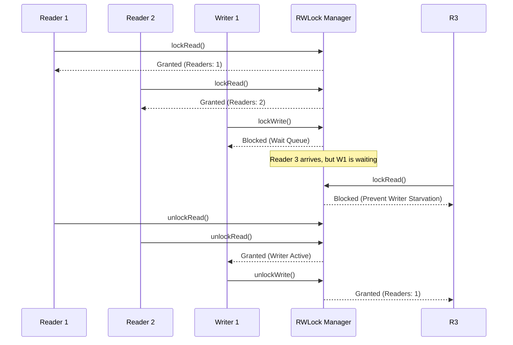

# Solution Guide: Readers-Writers Lock Design

## 1. Requirements & System Constraints

The Readers-Writers (RW) lock is a synchronization primitive used in concurrent programming to manage access to a shared resource. The fundamental goal is to allow maximum concurrency for read-only operations while ensuring exclusive access for write operations.

### Functional Requirements
*   **Multiple Readers:** Multiple threads should be able to hold the read lock simultaneously, provided no thread holds the write lock.
*   **Exclusive Writer:** Only one thread can hold the write lock at a time.
*   **Mutual Exclusion:** When a writer holds the lock, no other readers or writers can access the resource.
*   **Lock/Unlock API:** Provide mechanisms to acquire and release both read and write locks.

### Non-Functional Requirements
*   **Thread Safety:** The lock must be atomic and prevent race conditions.
*   **Starvation Prevention:** The design must address "Writer Starvation" (where a constant stream of readers prevents a writer from ever acquiring the lock) or "Reader Starvation."
*   **Low Overhead:** The locking mechanism should introduce minimal latency to the critical section.
*   **Deadlock Avoidance:** The implementation must not lead to circular dependencies.

---

## 2. High-Level Architecture

At its core, a Readers-Writers lock is a state machine managed by a synchronization primitive (like a Mutex or Semaphore) and condition variables to signal availability.

### Core Components
1.  **State Tracker:** Keeps track of the number of active readers, whether a writer is active, and the number of waiting writers.
2.  **Synchronization Primitive (Mutex):** Ensures that updates to the State Tracker are atomic.
3.  **Condition Variables:** Used to put threads to sleep and wake them up when the lock state changes (e.g., `can_read`, `can_write`).

### Interaction Flow (Writer-Preference Logic)



---

## 3. Internal State Design

Since this is a Low-Level Design (LLD) challenge, we replace the "Database Schema" with the **Internal Memory State** and **Data Structure Design**.

### State Variables
| Variable | Type | Description |
| :--- | :--- | :--- |
| `activeReaders` | `Integer` | Number of threads currently holding the read lock. |
| `writerActive` | `Boolean` | True if a writer currently holds the lock. |
| `waitingWriters` | `Integer` | Number of threads queued up to write (used to prevent starvation). |
| `mutex` | `Mutex` | Ensures atomic access to the state variables above. |
| `readCondition` | `Condition` | Signals waiting readers that they can now acquire the lock. |
| `writeCondition` | `Condition` | Signals waiting writers that they can now acquire the lock. |

### Logic for State Transitions
*   **Read Lock Acquisition:** Allowed if `writerActive == false` AND `waitingWriters == 0`.
*   **Write Lock Acquisition:** Allowed if `writerActive == false` AND `activeReaders == 0`.
*   **Read Unlock:** Decrement `activeReaders`. If `activeReaders == 0`, signal `writeCondition`.
*   **Write Unlock:** Set `writerActive = false`. Signal `writeCondition` (priority) or `readCondition`.

---

## 4. Core API Design

The API is designed as a class interface.

### Interface Definition (Pseudocode)

```java
interface IRWLock {
    /**
     * Acquires the read lock. Blocks if a writer is active 
     * or if writers are waiting (in writer-preference mode).
     */
    void lockRead();

    /**
     * Releases the read lock.
     */
    void unlockRead();

    /**
     * Acquires the write lock. Blocks if any readers 
     * or another writer are active.
     */
    void lockWrite();

    /**
     * Releases the write lock.
     */
    void unlockWrite();
}
```

### Implementation Logic (Writer-Preference)

```java
class RWLock implements IRWLock {
    private int activeReaders = 0;
    private int waitingWriters = 0;
    private boolean writerActive = false;
    private final Lock mutex = new ReentrantLock();
    private final Condition canRead = mutex.newCondition();
    private final Condition canWrite = mutex.newCondition();

    public void lockRead() {
        mutex.lock();
        try {
            // Block if a writer is active OR if writers are waiting
            while (writerActive || waitingWriters > 0) {
                canRead.await();
            }
            activeReaders++;
        } finally {
            mutex.unlock();
        }
    }

    public void unlockRead() {
        mutex.lock();
        try {
            activeReaders--;
            if (activeReaders == 0) {
                canWrite.signal(); // Wake up one waiting writer
            }
        } finally {
            mutex.unlock();
        }
    }

    public void lockWrite() {
        mutex.lock();
        try {
            waitingWriters++;
            while (writerActive || activeReaders > 0) {
                canWrite.await();
            }
            waitingWriters--;
            writerActive = true;
        } finally {
            mutex.unlock();
        }
    }

    public void unlockWrite() {
        mutex.lock();
        try {
            writerActive = false;
            // Prioritize waking up writers, then readers
            if (waitingWriters > 0) {
                canWrite.signal();
            } else {
                canRead.signalAll();
            }
        } finally {
            mutex.unlock();
        }
    }
}
```

---

## 5. Scalability & Advanced Topics

### Preventing Starvation
*   **Reader Preference:** Readers can enter as long as no writer is active. This can starve writers.
*   **Writer Preference:** If a writer is waiting, new readers are blocked. This prevents writer starvation but can starve readers if writes are frequent.
*   **Fair Lock (FIFO):** Use a queue to track the order of arrival. Threads are granted access strictly in the order they requested it, regardless of whether they are readers or writers.

### Reentrancy
A standard RW lock can deadlock if a thread holding a read lock attempts to acquire a write lock (Upgrade) or if a thread holding a write lock attempts to acquire a read lock (Downgrade).
*   **Downgrading:** Safe. A writer can release the write lock and immediately acquire a read lock.
*   **Upgrading:** Dangerous. If two readers both try to upgrade to a write lock, they will deadlock. This requires a specific `upgradeToWrite()` method with deadlock detection.

### Spin-locks vs. Mutexes
*   **Spin-locks:** Use atomic `Compare-And-Swap` (CAS) operations. Better for extremely short critical sections to avoid the overhead of context switching.
*   **Mutex/Condition Variables:** Better for longer critical sections as they put the thread in a `WAITING` state, freeing the CPU.

---

## 6. Trade-off Analysis

| Trade-off | Choice | Reasoning |
| :--- | :--- | :--- |
| **Throughput vs. Fairness** | Writer-Preference | In most systems, data consistency (updates) is more critical than read latency. Blocking new readers ensures updates are applied promptly. |
| **Latency vs. CPU Usage** | Mutex over Spin-lock | While spin-locks have lower latency, they consume 100% CPU while waiting. For a general-purpose RW lock, OS-level blocking is more resource-efficient. |
| **Complexity vs. Reentrancy** | Non-reentrant | Implementing reentrant RW locks requires tracking thread IDs and recursion counts, significantly increasing the memory footprint and complexity per lock. |
| **CAP Theorem Context** | Consistency (C) | In a single-node concurrency primitive, we prioritize Strong Consistency. Every reader must see the latest write, and writes must be atomic. |