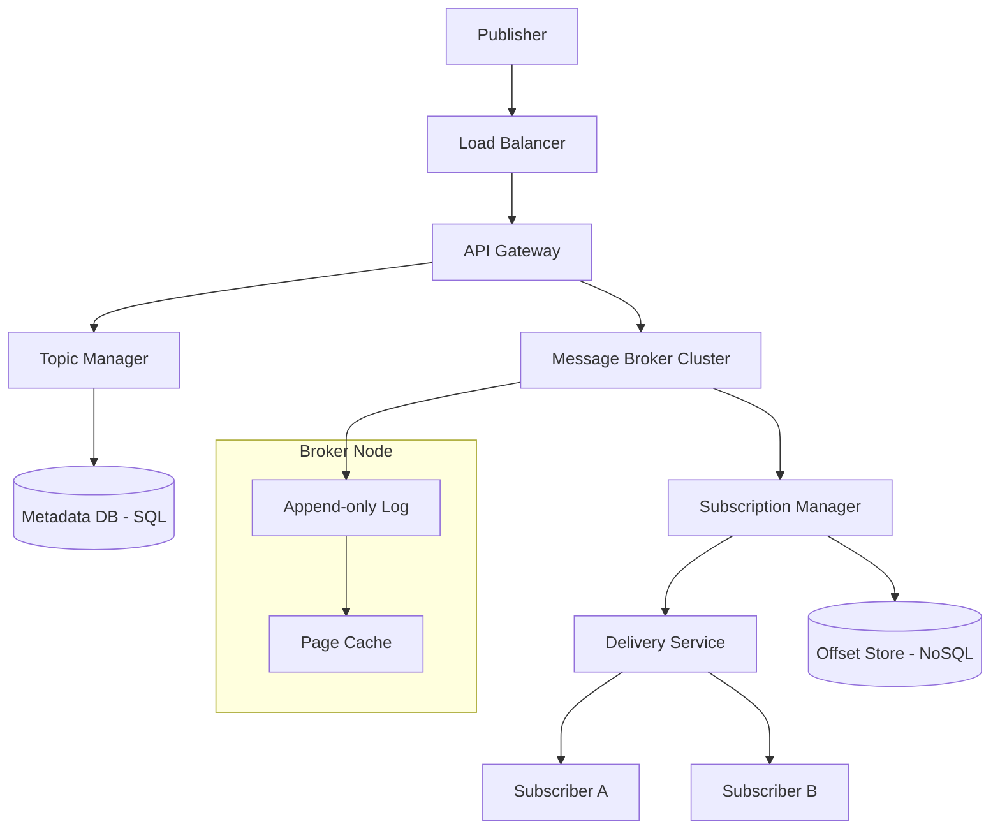

# System Design Document: Distributed Pub-Sub System

## 1. Requirements & System Constraints

The goal is to design a highly scalable, fault-tolerant Publish-Subscribe (Pub-Sub) system that allows publishers to send messages to topics and subscribers to receive messages from those topics without knowing the publishers.

### 1.1 Functional Requirements
- **Topic Management**: Ability to create, update, and delete topics.
- **Publishing**: Publishers can send messages to a specific topic.
- **Subscription**: Subscribers can register interest in one or more topics.
- **Message Delivery**: 
    - **Push Model**: System pushes messages to subscribers (e.g., via Webhooks or WebSockets).
    - **Pull Model**: Subscribers poll the system for new messages (e.g., using an offset).
- **Persistence**: Messages must be persisted for a configurable retention period.
- **Filtering**: (Optional/Advanced) Ability to subscribe to a subset of messages within a topic based on attributes.

### 1.2 Non-Functional Requirements
- **High Throughput**: Support millions of messages per second.
- **Low Latency**: End-to-end latency (publish to receive) should be in the millisecond range.
- **Scalability**: Horizontal scaling of brokers and metadata stores.
- **Durability**: Messages should not be lost once acknowledged by the system.
- **Availability**: High availability ensuring the system remains operational despite node failures.

### 1.3 Scale Estimations (HLD Context)
- **Throughput**: $10^6$ messages/sec.
- **Fan-out**: Average 100 subscribers per topic; Max 10,000.
- **Storage**: If average message size is 1KB and retention is 7 days $\rightarrow$ $10^6 \times 86400 \times 7 \times 1\text{KB} \approx 600\text{TB}$ of storage.
- **Read/Write Ratio**: Write-heavy at the broker level, Read-heavy at the delivery level.

---

## 2. High-Level Architecture

The system follows a decoupled architecture where the **Broker** acts as the intermediary.

### 2.1 Core Components
1. **API Gateway / Load Balancer**: Routes requests to the appropriate service and handles authentication/rate limiting.
2. **Topic Manager (Control Plane)**: Manages topic metadata, partition assignments, and subscription lists.
3. **Message Broker (Data Plane)**:
    - **Ingestion Engine**: Receives messages from publishers and appends them to a commit log.
    - **Storage Engine**: Manages the physical persistence of messages on disk.
4. **Subscription Manager**: Tracks the "offset" or "cursor" for every subscriber for every topic.
5. **Delivery Service**: Handles the logic of pushing messages to subscribers or serving pull requests.

### 2.2 Architecture Diagram



---

## 3. Detailed Database Schema Design

The system utilizes two distinct storage layers: one for metadata (configuration) and one for the message stream (data).

### 3.1 Metadata Store (SQL - e.g., PostgreSQL)
Used for configuration where strong consistency is required.

**Table: `topics`**
| Field | Type | Constraint | Description |
| :--- | :--- | :--- | :--- |
| `topic_id` | UUID | PK | Unique identifier for the topic |
| `name` | String | Unique, Indexed | Human-readable name |
| `partition_count`| Int | Not Null | Number of shards for the topic |
| `retention_ms` | BigInt | Not Null | How long to keep messages |
| `created_at` | Timestamp | Not Null | Creation time |

**Table: `subscriptions`**
| Field | Type | Constraint | Description |
| :--- | :--- | :--- | :--- |
| `sub_id` | UUID | PK | Unique subscription ID |
| `topic_id` | UUID | FK $\rightarrow$ topics | Topic being subscribed to |
| `subscriber_id` | String | Indexed | Unique ID of the consumer |
| `delivery_mode` | Enum | Push/Pull | Method of delivery |
| `created_at` | Timestamp | Not Null | Subscription start time |

### 3.2 Message Store (Distributed Commit Log)
Messages are not stored in a traditional relational database. They are stored in **append-only segments** on disk to maximize sequential I/O.

**Log Format (Physical)**:
- **Segment File**: Each partition is split into segments (e.g., 1GB each).
- **Message Record**: `[Offset (8 bytes)][Timestamp (8 bytes)][Payload Size (4 bytes)][Payload (N bytes)][Checksum (4 bytes)]`.

### 3.3 Offset Store (NoSQL - e.g., Cassandra or Redis)
Used to track the current position of each subscriber.

**Key-Value Schema**:
- **Key**: `topic_id : subscriber_group_id : partition_id`
- **Value**: `offset_integer`
- **Reasoning**: Extremely high write volume as offsets are updated frequently. NoSQL provides the required linear scalability and low latency.

---

## 4. Core API Design

### 4.1 Topic Management
`POST /v1/topics`
- **Request**: `{"name": "user-signups", "partitions": 3, "retention_ms": 604800000}`
- **Response**: `201 Created { "topic_id": "..." }`

### 4.2 Publishing Messages
`POST /v1/publish`
- **Request**: 
  ```json
  {
    "topic": "user-signups",
    "payload": { "user_id": "123", "email": "test@example.com" },
    "partition_key": "user_123" 
  }
  ```
- **Response**: `202 Accepted { "offset": 1024, "partition": 1 }`

### 4.3 Subscription
`POST /v1/subscriptions`
- **Request**:
  ```json
  {
    "topic": "user-signups",
    "subscriber_id": "email-service-1",
    "mode": "pull",
    "endpoint": "https://email-service/webhook" 
  }
  ```
- **Response**: `201 Created { "sub_id": "..." }`

### 4.4 Consuming Messages (Pull Model)
`GET /v1/messages?topic=user-signups&subscriber_id=email-service-1&offset=1024&limit=100`
- **Response**: 
  ```json
  {
    "messages": [
      { "offset": 1024, "payload": { ... }, "timestamp": "..." },
      ...
    ],
    "next_offset": 1124
  }
  ```

---

## 5. Scalability & Advanced Topics

### 5.1 Partitioning & Sharding
To avoid a single broker becoming a bottleneck, topics are split into **partitions**.
- **Partitioning Strategy**: 
    - **Round Robin**: Even distribution.
    - **Key-based Hashing**: `hash(partition_key) % num_partitions`. Ensures all messages for a specific entity (e.g., `user_id`) go to the same partition, maintaining strict ordering per key.

### 5.2 Replication & Fault Tolerance
- **Leader-Follower Model**: Each partition has one leader and multiple followers.
- **ISR (In-Sync Replicas)**: A message is considered "committed" only after it is written to the leader and a quorum of ISRs.
- **Failover**: If the leader fails, the Topic Manager triggers an election to promote the most up-to-date follower.

### 5.3 Delivery Guarantees
- **At-most-once**: Message is sent; subscriber acknowledges before processing. (Fastest, data loss possible).
- **At-least-once**: Subscriber acknowledges *after* successful processing. (No data loss, duplicates possible).
- **Exactly-once**: Achieved via **Idempotent Producers** (Sequence IDs) and **Atomic Transactions** (updating offset and processing result in one transaction).

### 5.4 Performance Optimizations
- **Zero-Copy (sendfile)**: Instead of copying data from kernel space $\rightarrow$ user space $\rightarrow$ kernel space (socket), the broker uses the `sendfile` system call to move data directly from the disk cache to the NIC.
- **Batching**: Publishers batch messages to reduce the number of network requests.
- **Page Cache**: Leveraging the OS page cache for frequently read "tail" of the log.

---

## 6. Trade-off Analysis

### 6.1 CAP Theorem
The system is designed as an **AP (Availability and Partition Tolerance)** system for the data plane.
- **Availability**: In the event of a network partition, we allow reads/writes to available replicas to ensure the system doesn't halt.
- **Consistency**: We accept **Eventual Consistency** for followers. While the leader is strictly consistent, followers might lag slightly.

### 6.2 Latency vs. Durability
- **Sync Write**: Writing to disk and waiting for `fsync` before acknowledging. (High durability, high latency).
- **Async Write**: Writing to the OS page cache and acknowledging. (Low latency, risk of data loss on power failure).
- **Decision**: Provide a configurable `acks` parameter (0: No ack, 1: Leader ack, all: Full ISR ack).

### 6.3 Push vs. Pull
| Feature | Push (Webhooks) | Pull (Polling) |
| :--- | :--- | :--- |
| **Latency** | Extremely Low | Dependent on polling interval |
| **Overhead** | High (Broker must manage state) | Low (Subscriber manages state) |
| **Backpressure** | Hard to manage (Overwhelms sub) | Natural (Sub pulls what it can handle) |
| **Use Case** | Real-time alerts, Notifications | Data pipelines, ETL, Batch processing |