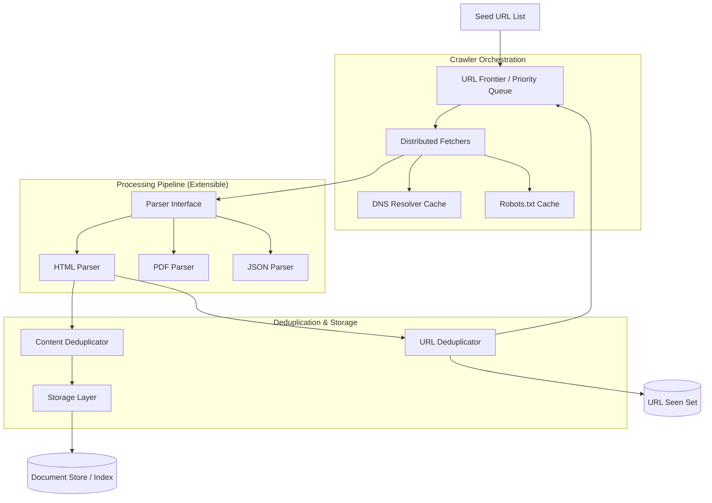

# System Design Document: Extensible Web Crawler

## 1. Requirements & System Constraints

The objective is to design a highly scalable, extensible web crawler capable of discovering and indexing billions of web pages while adhering to politeness protocols and maintaining high throughput.

### 1.1 Functional Requirements
- **Seed URL Processing**: Ability to start crawling from a predefined set of seed URLs.
- **URL Frontier**: Manage a queue of URLs to be visited, supporting prioritization.
- **Content Fetching**: Download page content via HTTP/HTTPS.
- **Link Extraction**: Parse HTML to find and extract new URLs for further crawling.
- **Content Deduplication**: Avoid crawling the same content multiple times (even if URLs differ).
- **URL Deduplication**: Avoid visiting the same URL multiple times.
- **Politeness**: Respect `robots.txt` and implement per-domain rate limiting.
- **Extensibility**: Support for different content types (HTML, PDF, JSON), various storage backends, and custom parsing logic.

### 1.2 Non-Functional Requirements
- **Scalability**: Scale horizontally to handle billions of pages.
- **Fault Tolerance**: Recover from network failures, timeouts, and crawler crashes.
- **Robustness**: Handle malformed HTML, "spider traps" (infinite URL loops), and huge files.
- **Efficiency**: Optimize bandwidth, CPU, and memory usage.

### 1.3 Scale Estimations (High-Level)
- **Target**: 1 Billion pages per month.
- **Daily Throughput**: $\approx 33$ million pages/day.
- **Per Second**: $\approx 385$ pages/second.
- **Average Page Size**: 100 KB.
- **Bandwidth Requirement**: $385 \times 100\text{ KB} \approx 38.5\text{ MB/s}$ (Continuous).
- **Storage**: If storing metadata and a hash for 1 Billion pages, we need TBs of storage for the URL index.

---

## 2. High-Level Architecture

The system follows a decoupled, producer-consumer architecture utilizing a distributed message queue to ensure extensibility and scalability.

### 2.1 Component Diagram



### 2.2 Component Interactions
1. **URL Frontier**: Stores URLs to be crawled. It prioritizes URLs based on page rank or freshness. It handles "politeness" by ensuring URLs from the same domain are not fetched simultaneously.
2. **Distributed Fetchers**: Worker nodes that pick URLs from the Frontier, resolve DNS, check `robots.txt`, and download the raw bytes.
3. **Extensible Parser**: A plugin-based system. Based on the `Content-Type` header from the Fetcher, the system routes the data to the appropriate parser (e.g., `HTMLParser`, `PDFParser`).
4. **Deduplicators**: 
    - **URL Deduplicator**: Uses a Bloom Filter or a distributed Key-Value store to check if a URL has been visited.
    - **Content Deduplicator**: Uses SimHash or MinHash to detect near-duplicate content to avoid indexing mirrored sites.
5. **Storage Layer**: An extensible sink that can write to an ElasticSearch index, a S3 data lake, or a relational DB.

---

## 3. Detailed Database Schema Design

We use a hybrid approach: **NoSQL** for high-volume page data and **Key-Value stores** for fast lookups.

### 3.1 URL Status Store (Key-Value / NoSQL)
Used by the Frontier to track the state of every discovered URL.
- **Table**: `url_metadata`
- **Primary Key**: `url_hash` (SHA-256 of the URL)
- **Fields**:
    - `url`: String
    - `status`: Enum (Pending, Crawling, Completed, Failed)
    - `priority`: Integer
    - `last_crawled_at`: Timestamp
    - `depth`: Integer
    - `etag`: String (for conditional GET requests)

### 3.2 Content Store (Document Store - MongoDB/Cassandra)
Stores the actual processed data.
- **Table**: `page_content`
- **Primary Key**: `url_hash`
- **Fields**:
    - `url`: String
    - `title`: String
    - `body_text`: Text
    - `content_hash`: String (SimHash for deduplication)
    - `metadata`: JSON (headers, timestamps)
    - `created_at`: Timestamp

### 3.3 Politeness Store (Redis)
Tracks the last access time per domain to prevent DOS attacks.
- **Key**: `last_access:{domain}`
- **Value**: `timestamp`
- **TTL**: Set to the required politeness delay (e.g., 1-5 seconds).

### 3.4 Reasoning
- **NoSQL (Cassandra/Mongo)**: Chosen for content because web pages have highly variable structures and require high write throughput.
- **Redis**: Chosen for the politeness store and DNS cache due to sub-millisecond latency.
- **Bloom Filter**: Used in-memory (or via RedisBloom) for the `SeenSet` to reduce DB hits for URL deduplication.

---

## 4. Core API Design

While the crawler is primarily an internal system, an Administrative API is required for control and monitoring.

### 4.1 Seed Management
`POST /api/v1/seeds`
- **Request**:
  ```json
  {
    "urls": ["https://example.com", "https://wikipedia.org"],
    "priority": 10,
    "depth_limit": 5
  }
  ```
- **Response**: `202 Accepted`

### 4.2 Crawler Status
`GET /api/v1/status/{url_hash}`
- **Response**:
  ```json
  {
    "url": "https://example.com",
    "status": "Completed",
    "last_crawled": "2023-10-27T10:00:00Z",
    "depth": 1
  }
  ```

### 4.3 System Metrics
`GET /api/v1/metrics`
- **Response**:
  ```json
  {
    "pages_crawled_per_second": 412,
    "frontier_size": 15000000,
    "failure_rate": "0.02%",
    "active_workers": 50
  }
  ```

---

## 5. Scalability & Advanced Topics

### 5.1 Extensibility via Strategy Pattern
To make the design extensible, we use the **Strategy Design Pattern** for Fetching and Parsing.

```java
interface ContentParser {
    ParseResult parse(byte[] data);
    boolean canHandle(String contentType);
}

class HTMLParser implements ContentParser { ... }
class PDFParser implements ContentParser { ... }

class ParserFactory {
    List<ContentParser> plugins;
    public ContentParser getParser(String contentType) {
        return plugins.stream().filter(p -> p.canHandle(contentType)).findFirst().orElse(DefaultParser.INSTANCE);
    }
}
```

### 5.2 Distributed URL Frontier
To prevent a single bottleneck, the Frontier is sharded by domain.
- **Sharding Logic**: `shard_id = hash(domain) % total_shards`.
- This ensures that all URLs for a specific domain are handled by the same queue/worker, making it easier to enforce politeness (rate limiting) without global locks.

### 5.3 DNS Resolution Optimization
DNS resolution is a major bottleneck.
- **Local DNS Cache**: Implement a local cache on each fetcher node.
- **Custom DNS Resolver**: Use an asynchronous DNS resolver to avoid blocking threads.

### 5.4 Fault Tolerance & Reliability
- **Checkpointing**: The Frontier persists its state to a distributed queue (e.g., Kafka) so that if a worker fails, the message is redelivered.
- **Dead Letter Queue (DLQ)**: URLs that fail repeatedly (404, 500) are moved to a DLQ for analysis rather than clogging the main pipeline.
- **Circuit Breaker**: If a specific domain returns a high rate of 5xx errors, the crawler trips a circuit breaker for that domain for a period of time.

---

## 6. Trade-off Analysis

| Trade-off | Decision | Reasoning |
| :--- | :--- | :--- |
| **Consistency vs Availability** | **Availability (AP)** | In a web crawler, missing a few pages or indexing a slightly outdated version of a page is acceptable. High availability ensures the crawl continues. |
| **Storage vs Compute** | **Storage Priority** | We store content hashes (SimHash) to avoid re-downloading and re-parsing similar pages, trading disk space for bandwidth and CPU. |
| **BFS vs DFS** | **BFS (Breadth-First)** | Breadth-First Search is preferred to ensure a broad coverage of the web and to avoid getting stuck in deep "spider traps" of a single site. |
| **Centralized vs Distributed Frontier** | **Distributed** | A centralized queue would become a bottleneck at $10^9$ pages. Sharding by domain enables horizontal scaling. |
| **Strict vs Near Deduplication** | **Near Deduplication** | Exact hash matches fail if a page has a dynamic timestamp. SimHash allows us to identify "nearly identical" pages. |