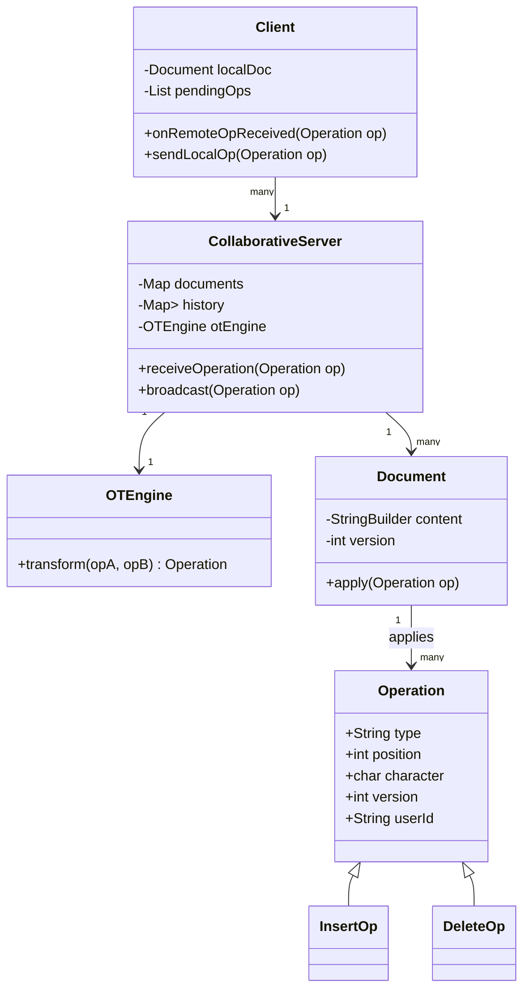

# Collaborative Editor LLD

A **Collaborative Editor** is a complex distributed system where multiple users can edit a shared document simultaneously. The primary challenge is maintaining **Consistency** (all users see the same content) and **Convergence** (all users eventually arrive at the same state) despite network latency and concurrent edits.

---

## 1. Overview & System Requirements

### Core Goal
Design a system that allows multiple clients to perform insertions and deletions on a shared string, ensuring that the final state is identical across all clients regardless of the order in which operations were received.

### Functional Requirements
- **Real-time Editing**: Users can insert or delete characters at specific indices.
- **Concurrency Control**: Handle simultaneous edits from multiple users without data loss or corruption.
- **Synchronization**: The server must synchronize state across all connected clients.
- **Version Tracking**: Maintain a version history to determine which operations need transformation.

### Non-Functional Requirements
- **Low Latency**: Local edits must be reflected immediately (Optimistic UI).
- **Consistency**: Eventual consistency is mandatory.
- **Scalability**: Ability to handle multiple documents and multiple users per document.

---

## 2. Design Principles & Patterns

### Design Patterns Applied
- **Command Pattern**: Every edit (Insert/Delete) is encapsulated as an `Operation` object. This allows operations to be queued, sent over the network, and transformed.
- **Observer Pattern**: The `CollaborativeServer` acts as the subject, and `Clients` act as observers. When the server processes a transformed operation, it notifies all other clients.
- **Strategy Pattern**: Used to implement the **Transformation Engine**. Different conflict resolution strategies (e.g., Operational Transformation vs. CRDT) can be swapped.
- **Singleton Pattern**: The `DocumentManager` is typically a singleton to ensure a single point of truth for all active documents on a server.

### OOP Principles (SOLID)
- **Single Responsibility (SRP)**: The `Document` class manages state, the `OTEngine` handles the math of index shifting, and the `Server` handles communication.
- **Open/Closed Principle**: The system is open for new operation types (e.g., `FormatOperation` for bold/italic) without modifying the core `TransformationEngine` logic.
- **Interface Segregation**: Clients interact with a simplified `EditorInterface` rather than the complex internal server logic.

---

## 3. Class Structure & Relationships

### Class Diagram (Textual)



### Key Entities
| Entity | Responsibility |
| :--- | :--- |
| **Operation** | Represents a change (Insert/Delete) with metadata (position, char, version). |
| **OTEngine** | The "Brain." Adjusts the index of an operation based on a concurrent operation. |
| **Document** | Maintains the current text state and the current version number. |
| **Server** | The central authority that sequences operations and manages the global history. |
| **Client** | Maintains a local copy of the document and handles optimistic updates. |

---

## 4. Step-by-Step Logic & Code Walkthrough

### The Operational Transformation (OT) Logic
The heart of this design is the `transform` function. If User A and User B both edit at the same time:
1. User A inserts 'X' at index 5.
2. User B inserts 'Y' at index 2.
3. If the server processes A first, when it sends A's operation to User B, User B must shift their own pending operation (at index 2) if A's edit happened *before* their index.

**Transformation Rule:**
- If `Op A` is an insertion at `posA` and `Op B` is an insertion at `posB`:
    - If `posA < posB`, `Op B`'s position becomes `posB + 1`.
    - If `posA > posB`, `Op B`'s position remains `posB`.

### Implementation

```python
from dataclasses import dataclass
from typing import List, Optional

@dataclass
class Operation:
    type: str  # "INSERT" or "DELETE"
    position: int
    char: Optional[str] = None
    version: int = 0
    user_id: str = ""

class OTEngine:
    """Operational Transformation Engine to resolve conflicts."""
    @staticmethod
    def transform(op_to_transform: Operation, concurrent_op: Operation) -> Operation:
        new_pos = op_to_transform.position
        
        if concurrent_op.type == "INSERT":
            # If someone inserted a character before us, shift our index right
            if concurrent_op.position <= op_to_transform.position:
                new_pos += 1
        elif concurrent_op.type == "DELETE":
            # If someone deleted a character before us, shift our index left
            if concurrent_op.position < op_to_transform.position:
                new_pos -= 1
                
        return Operation(
            type=op_to_transform.type,
            position=new_pos,
            char=op_to_transform.char,
            version=op_to_transform.version + 1,
            user_id=op_to_transform.user_id
        )

class Document:
    def __init__(self):
        self.content = []
        self.version = 0

    def apply(self, op: Operation):
        if op.type == "INSERT":
            self.content.insert(op.position, op.char)
        elif op.type == "DELETE":
            if 0 <= op.position < len(self.content):
                self.content.pop(op.position)
        self.version += 1

    def get_text(self):
        return "".join(self.content)

class CollaborativeServer:
    def __init__(self):
        self.doc = Document()
        self.history: List[Operation] = []
        self.ot_engine = OTEngine()

    def handle_operation(self, incoming_op: Operation) -> Operation:
        # 1. Find all operations that happened since the version the client had
        concurrent_ops = self.history[incoming_op.version:]
        
        # 2. Transform the incoming operation against all concurrent operations
        transformed_op = incoming_op
        for op in concurrent_ops:
            transformed_op = self.ot_engine.transform(transformed_op, op)
        
        # 3. Apply to the server's master document
        self.doc.apply(transformed_op)
        
        # 4. Add to history and return for broadcasting
        self.history.append(transformed_op)
        return transformed_op

# --- Execution Example ---
if __name__ == "__main__":
    server = CollaborativeServer()
    
    # Initial state: "Hello"
    for i, char in enumerate("Hello"):
        server.handle_operation(Operation("INSERT", i, char))
    
    print(f"Initial: {server.doc.get_text()}") # Hello

    # User A wants to insert '!' at the end (pos 5), version is 5
    op_a = Operation("INSERT", 5, "!", version=5, user_id="UserA")
    
    # User B wants to insert ' ' at pos 5 (before the '!'), version is 5
    op_b = Operation("INSERT", 5, " ", version=5, user_id="UserB")

    # Server processes A then B
    res_a = server.handle_operation(op_a)
    res_b = server.handle_operation(op_b)

    print(f"Final State: '{server.doc.get_text()}'") 
    # Expected: "Hello !" (User B's space was transformed to pos 5, '!' shifted to 6)
```

---

## 5. Complexity Analysis

| Operation | Time Complexity | Space Complexity | Reasoning |
| :--- | :--- | :--- | :--- |
| **Local Edit** | $O(1)$ | $O(1)$ | Immediate update to local buffer. |
| **Transformation** | $O(H)$ | $O(1)$ | $H$ is the number of concurrent operations in history since the client's version. |
| **Applying Op** | $O(N)$ | $O(1)$ | Array insertion/deletion in a string of length $N$. |
| **Server Memory** | $O(Ops)$ | $O(Ops)$ | Server must store history of all operations to transform lagging clients. |

---

## 6. Real-World Applications & Extensions

### Production Implementation
In a production-grade system like **Google Docs**, raw OT is often replaced or augmented by:
1. **CRDTs (Conflict-free Replicated Data Types)**: Instead of transforming indices, every character is assigned a unique, fractional, immutable ID (e.g., `LSEQ` or `Yjs`). This eliminates the need for a central server to sequence operations.
2. **WebSockets**: For full-duplex, low-latency communication between clients and servers.
3. **Snapshotting**: To prevent the `history` list from growing infinitely, the server takes periodic snapshots of the document and prunes old history.

### Comparison: OT vs CRDT

| Feature | Operational Transformation (OT) | CRDT |
| :--- | :--- | :--- |
| **Control** | Centralized (Requires Server) | Decentralized (Peer-to-Peer possible) |
| **Complexity** | High (Edge cases in transformation) | Medium (Metadata overhead) |
| **Performance** | Low metadata per op | High metadata (Unique IDs for every char) |
| **Convergence** | Guaranteed by server sequencing | Mathematically guaranteed by data structure |