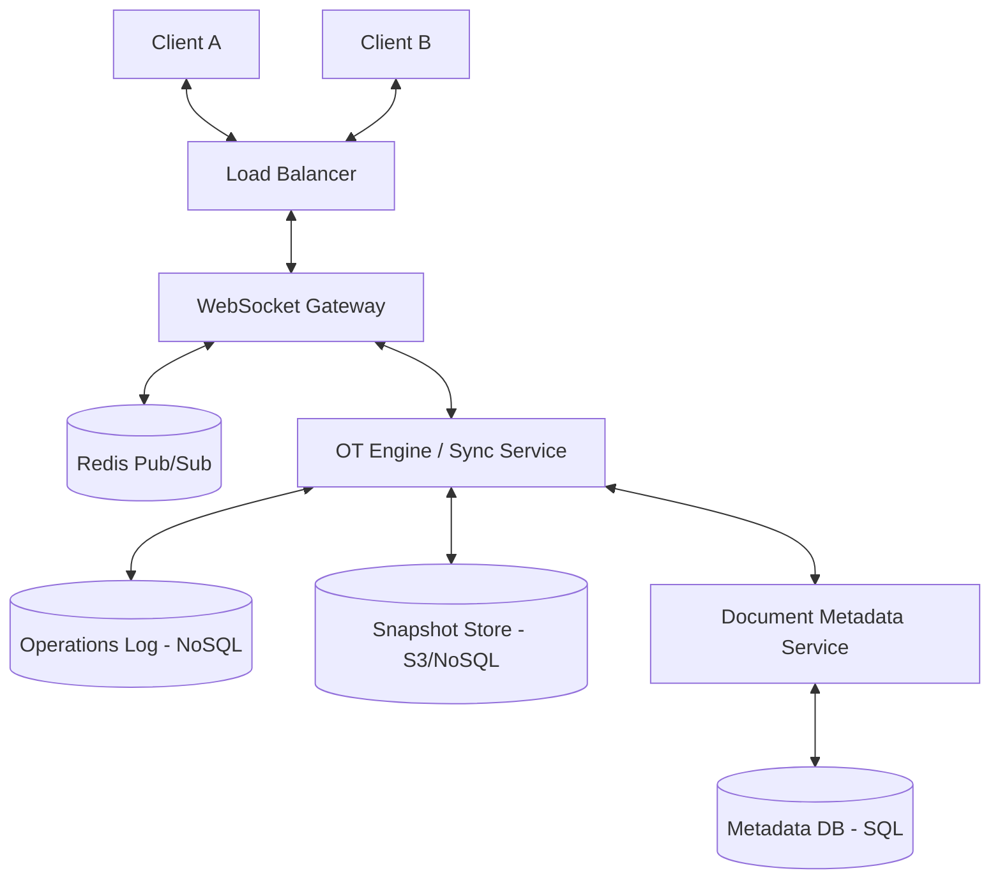

# System Design: Collaborative Document Editor

## 1. Requirements & System Constraints

### 1.1 Functional Requirements
*   **Real-time Collaborative Editing:** Multiple users must be able to edit the same document simultaneously with near-instant synchronization.
*   **Concurrency Control:** The system must resolve conflicts when two users edit the same character or block of text.
*   **Presence Indicators:** Users should see who else is currently editing the document and the real-time position of their cursors.
*   **Persistence & Versioning:** Documents must be saved automatically. Users should be able to view and revert to previous versions of the document.
*   **Permissions & Access Control:** Support for private documents, shared documents, and role-based access (Viewer, Editor, Owner).
*   **Offline Mode:** Users should be able to edit offline and sync changes upon reconnection.

### 1.2 Non-Functional Requirements
*   **Low Latency:** The "keystroke-to-screen" latency should be minimal (< 100ms) to ensure a fluid user experience.
*   **High Availability:** The system must be available 24/7; a failure in one region should not bring down the entire service.
*   **Strong Eventual Consistency:** All clients must converge to the same state after all operations are processed.
*   **Scalability:** Support millions of concurrent documents and thousands of concurrent users per document.

### 1.3 Scale Estimations
*   **Daily Active Users (DAU):** 10 Million.
*   **Average Document Size:** 50 KB.
*   **Concurrent Users per Document:** Average 2, Peak 100.
*   **Write Throughput:** Assuming a user types 2 characters per second, 1M concurrent users $\approx$ 2M operations per second.
*   **Storage:** 10M users $\times$ 10 docs/user $\times$ 50 KB $\approx$ 5 TB for current state. Version history will increase this significantly.

---

## 2. High-Level Architecture

The system utilizes a **Centralized Operational Transformation (OT)** approach. While CRDTs (Conflict-free Replicated Data Types) are an alternative, OT is preferred for a centralized server model to ensure a canonical history and easier snapshotting.

### 2.1 Core Components
1.  **Client Application:** Maintains a local copy of the document, a local buffer of pending operations, and handles the transformation of incoming server operations.
2.  **Load Balancer:** Distributes WebSocket and HTTP traffic.
3.  **WebSocket Gateway (Connection Manager):** Maintains persistent bidirectional connections with clients for real-time updates and cursor movements.
4.  **OT Engine (Operation Service):** The heart of the system. It sequences operations, transforms them against concurrent operations, and updates the document version.
5.  **Document Service:** Manages document metadata, ownership, and sharing permissions.
6.  **Snapshot Service:** Periodically collapses the operation log into a full document state to speed up initial loading.
7.  **Pub/Sub (Redis):** Coordinates updates between multiple WebSocket server instances.

### 2.2 Architecture Diagram (Text-based)



### 2.3 Sequence Flow for an Edit
1.  **Client A** performs an edit (Insert 'X' at index 5).
2.  **Client A** applies the edit locally (optimistic update) and sends the operation `Op(type: insert, char: 'X', pos: 5, version: 10)` to the server.
3.  **OT Engine** receives the operation. If the server is already at version 12, it transforms Client A's operation against the operations that happened between version 10 and 12.
4.  **OT Engine** commits the transformed operation to the **Operations Log** and increments the version to 13.
5.  **OT Engine** publishes the transformed operation to **Redis**.
6.  **WebSocket Gateway** picks up the event and broadcasts `Op(type: insert, char: 'X', pos: 6, version: 13)` to **Client B**.
7.  **Client B** transforms the incoming operation against its own pending local edits and updates the UI.

---

## 3. Detailed Database Schema Design

### 3.1 Metadata Store (Relational - PostgreSQL)
Used for structured data requiring ACID compliance (Permissions, User profiles).

**Table: `users`**
*   `user_id` (UUID, PK)
*   `email` (String, Unique)
*   `display_name` (String)

**Table: `documents`**
*   `doc_id` (UUID, PK)
*   `owner_id` (UUID, FK -> users.user_id)
*   `title` (String)
*   `created_at` (Timestamp)
*   `last_modified` (Timestamp)

**Table: `permissions`**
*   `permission_id` (UUID, PK)
*   `doc_id` (UUID, FK -> documents.doc_id)
*   `user_id` (UUID, FK -> users.user_id)
*   `role` (Enum: VIEWER, EDITOR, OWNER)
*   *Index: (doc_id, user_id)*

### 3.2 Operations Log (NoSQL - Cassandra/DynamoDB)
We need high write throughput and the ability to fetch operations in a range for a specific document.

**Table: `operations`**
*   `doc_id` (Partition Key)
*   `version` (Sort Key / Clustering Key)
*   `user_id` (UUID)
*   `operation_data` (JSON: `{type: 'insert'|'delete', pos: Int, char: String}`)
*   `timestamp` (Timestamp)

*Reasoning:* NoSQL is used because the operation log grows linearly and is append-only. Cassandra provides the necessary write scale and efficient range queries by `version`.

### 3.3 Snapshot Store (Blob Store / Document DB)
Storing every single operation since the dawn of the document is inefficient for loading.

**Table: `snapshots`**
*   `snapshot_id` (UUID, PK)
*   `doc_id` (UUID, Index)
*   `version` (Int)
*   `content` (Text/Blob)
*   `timestamp` (Timestamp)

---

## 4. Core API Design

### 4.1 REST APIs (Document Management)
| Endpoint | Method | Payload | Description |
| :--- | :--- | :--- | :--- |
| `/v1/docs` | POST | `{title: string}` | Create a new document. |
| `/v1/docs/{id}` | GET | N/A | Fetch metadata and latest snapshot. |
| `/v1/docs/{id}/share` | POST | `{user_id: uuid, role: string}` | Share document with user. |

**Request Payload (`POST /v1/docs`):**
```json
{
  "title": "System Design Specs"
}
```

**Response Payload (`GET /v1/docs/{id}`):**
```json
{
  "doc_id": "uuid-123",
  "title": "System Design Specs",
  "content": "Hello World...",
  "version": 154,
  "permissions": "EDITOR"
}
```

### 4.2 WebSocket Events (Real-time Editing)
**Client $\rightarrow$ Server: `send_operation`**
```json
{
  "type": "EDIT",
  "doc_id": "uuid-123",
  "op": { "type": "insert", "pos": 12, "char": "a" },
  "version": 154
}
```

**Server $\rightarrow$ Client: `broadcast_operation`**
```json
{
  "type": "UPDATE",
  "op": { "type": "insert", "pos": 13, "char": "a" },
  "version": 155,
  "user_id": "uuid-456"
}
```

**Client $\rightarrow$ Server: `cursor_move`**
```json
{
  "type": "CURSOR",
  "doc_id": "uuid-123",
  "pos": 42
}
```

---

## 5. Scalability & Advanced Topics

### 5.1 Scaling the OT Engine
*   **Document Sharding:** Since operations for `Doc A` are independent of `Doc B`, we shard by `doc_id`.
*   **Sticky Sessions/Routing:** Use a consistent hashing mechanism at the Load Balancer or a Routing Layer to ensure all users editing the same document are connected to the same OT Engine instance. This avoids complex distributed locking.
*   **Redis Pub/Sub:** If a document's users are spread across multiple WebSocket servers, Redis acts as the message bus to synchronize the servers.

### 5.2 Caching Strategy
*   **L1 Cache (Client):** Local buffer for optimistic UI updates.
*   **L2 Cache (Server):** Redis stores the current "Active State" of the document (the last 100 operations and the latest snapshot) to avoid hitting the database for every keystroke.

### 5.3 Handling Offline Edits
*   The client maintains a **Pending Queue** of operations.
*   When the connection is restored, the client sends all pending operations.
*   The server transforms these operations against all versions that occurred during the offline period. If the gap is too large, the server may force a full document reload (snapshot) to the client.

### 5.4 Presence & Cursor Tracking
*   Cursor positions are transient and don't need to be persisted in the DB.
*   Use an in-memory store (Redis) with a short TTL (e.g., 30 seconds) to track `user_id -> {doc_id, cursor_pos}`.
*   Heartbeats are sent every few seconds to keep the presence alive.

---

## 6. Trade-off Analysis

### 6.1 OT vs. CRDT
| Feature | Operational Transformation (OT) | Conflict-free Replicated Data Types (CRDT) |
| :--- | :--- | :--- |
| **Complexity** | Complex server-side logic. | Complex data structure logic. |
| **State** | Requires a central server to sequence. | Decentralized; works peer-to-peer. |
| **Overhead** | Low storage overhead (just the op). | High overhead (each char has a unique ID). |
| **Consistency** | Strong Eventual Consistency. | Strong Eventual Consistency. |
*   **Decision:** OT is chosen for this design to maintain a canonical version history and lower memory overhead on the client.

### 6.2 CAP Theorem Priorities
*   **Availability vs. Consistency:** In a collaborative editor, **Availability** and **Partition Tolerance** are prioritized (AP). We cannot block a user's typing just because the server is lagging.
*   **Consistency Model:** We use **Eventual Consistency**. Every client might see slightly different states for a few milliseconds, but the OT algorithm ensures they all converge to the same final state.

### 6.3 Latency vs. Storage
*   We trade storage for latency by implementing **Snapshots**. Instead of replaying 10,000 operations to load a document, we load the latest snapshot and replay only the operations that occurred after that snapshot. This increases storage costs but drastically reduces initial load time.