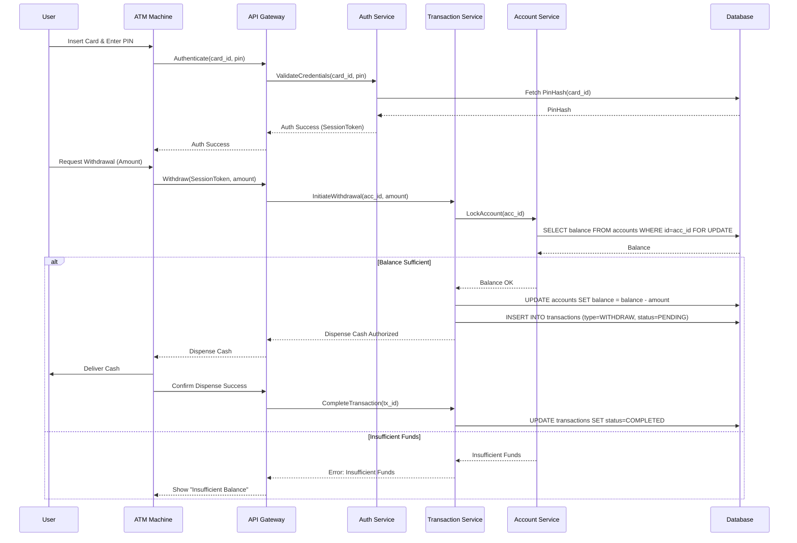

# System Design Document: ATM / Banking System

## 1. Requirements & System Constraints

### 1.1 Functional Requirements
*   **Authentication**: User must be able to authenticate using a physical card and a secret PIN.
*   **Balance Inquiry**: Users should be able to check the current available balance of their account.
*   **Cash Withdrawal**: Users can withdraw cash if the account has sufficient funds and the ATM has sufficient cash.
*   **Cash Deposit**: Users can deposit cash/checks into their account.
*   **Fund Transfer**: Users can transfer money between two accounts within the same bank.
*   **ATM Management**: Bank admins must be able to refill cash in the ATM and monitor ATM health/status.
*   **Transaction History**: Users should be able to view a list of recent transactions.

### 1.2 Non-Functional Requirements
*   **Strong Consistency (ACID)**: Financial transactions must be atomic. A user cannot withdraw money that isn't there, and money cannot "disappear" during a transfer.
*   **High Availability**: The system should be available 24/7. However, consistency takes precedence over availability (CP in CAP theorem) for ledger updates.
*   **Security**: End-to-end encryption (TLS), secure PIN hashing (bcrypt/scrypt), and PCI DSS compliance.
*   **Auditability**: Every action must be logged in an immutable audit trail for regulatory compliance.
*   **Idempotency**: Network failures during a withdrawal should not result in double-charging the user or double-dispensing cash.

### 1.3 Scale Estimations
*   **Users**: 10 Million active customers.
*   **ATMs**: 50,000 deployed globally.
*   **TPS (Transactions Per Second)**: 
    *   Average: 1,000 TPS.
    *   Peak: 5,000 TPS (e.g., payday or holiday season).
*   **Storage**: With 10M users and an average of 10 transactions per month, we generate 100M records monthly. This requires a partitioned database strategy.

---

## 2. High-Level Architecture

The system follows a layered architecture: **ATM Client $\rightarrow$ API Gateway $\rightarrow$ Banking Core Services $\rightarrow$ Database**.

### 2.1 Core Components
1.  **ATM Client (Hardware/Software)**: Manages the physical card reader, keypad, cash dispenser, and screen.
2.  **ATM Gateway/Controller**: Acts as a secure proxy. It handles session management and routes requests to the internal banking services.
3.  **Auth Service**: Validates card numbers and PINs.
4.  **Account Service**: Manages account metadata and balance queries.
5.  **Transaction Service**: The core engine that handles the orchestration of deposits, withdrawals, and transfers using distributed transactions.
6.  **ATM Management Service**: Tracks the "Cash Inventory" of each physical ATM machine.
7.  **Notification Service**: Sends SMS/Email alerts for transactions.

### 2.2 Sequence Diagram (Cash Withdrawal)

---

## 3. Detailed Database Schema Design

A **Relational Database (RDBMS)** like PostgreSQL is chosen because of the absolute requirement for ACID transactions.

### 3.1 Tables

#### `Users`
| Field | Type | Constraints | Description |
| :--- | :--- | :--- | :--- |
| `user_id` | UUID | PK | Unique identifier for the customer |
| `full_name` | VARCHAR | NOT NULL | User's legal name |
| `email` | VARCHAR | UNIQUE | Contact email |
| `phone` | VARCHAR | UNIQUE | Contact phone |
| `created_at` | TIMESTAMP | NOT NULL | Account creation date |

#### `Accounts`
| Field | Type | Constraints | Description |
| :--- | :--- | :--- | :--- |
| `account_id` | UUID | PK | Unique account number |
| `user_id` | UUID | FK (Users) | Owner of the account |
| `account_type`| ENUM | ('Savings', 'Current') | Type of account |
| `balance` | DECIMAL(15,2)| NOT NULL, $\ge 0$ | Current balance (Using Decimal for precision) |
| `status` | ENUM | ('Active', 'Frozen') | Account state |
| `version` | INT | NOT NULL | For Optimistic Locking |

#### `Cards`
| Field | Type | Constraints | Description |
| :--- | :--- | :--- | :--- |
| `card_number` | VARCHAR(16) | PK | 16-digit card number |
| `account_id` | UUID | FK (Accounts) | Linked account |
| `pin_hash` | VARCHAR | NOT NULL | Salted hash of the PIN |
| `expiry_date` | DATE | NOT NULL | Card expiration |
| `cvv_hash` | VARCHAR | NOT NULL | Hashed CVV |
| `status` | ENUM | ('Active', 'Blocked') | Card state |

#### `Transactions`
| Field | Type | Constraints | Description |
| :--- | :--- | :--- | :--- |
| `tx_id` | UUID | PK | Unique transaction ID |
| `from_acc` | UUID | FK (Accounts) | Source account (null for deposits) |
| `to_acc` | UUID | FK (Accounts) | Target account (null for withdrawals) |
| `amount` | DECIMAL(15,2)| NOT NULL | Transaction amount |
| `tx_type` | ENUM | ('Withdraw', 'Deposit', 'Transfer') | Type of action |
| `status` | ENUM | ('Pending', 'Success', 'Failed') | State of the transaction |
| `atm_id` | UUID | FK (ATMs) | The ATM machine used |
| `timestamp` | TIMESTAMP | INDEX | Transaction time |

#### `ATMs`
| Field | Type | Constraints | Description |
| :--- | :--- | :--- | :--- |
| `atm_id` | UUID | PK | Unique ATM identifier |
| `location` | TEXT | NOT NULL | Address/GPS |
| `cash_balance`| DECIMAL(15,2)| NOT NULL | Total cash currently in machine |
| `status` | ENUM | ('Online', 'Out of Cash', 'Maintenance')| Machine status |

### 3.2 Indexing Strategy
*   **`Transactions(timestamp)`**: For fast retrieval of history.
*   **`Cards(card_number)`**: For $O(1)$ lookup during authentication.
*   **`Accounts(user_id)`**: To quickly find all accounts belonging to a user.

---

## 4. Core API Design

All endpoints are secured via TLS and require a `SessionToken` (JWT) after authentication.

### 4.1 Authentication
`POST /api/v1/auth/login`
*   **Request**: `{ "card_number": "1234...", "pin": "1234" }`
*   **Response**: `{ "session_token": "eyJ...", "expires_in": 300 }`

### 4.2 Balance Inquiry
`GET /api/v1/account/{account_id}/balance`
*   **Response**: `{ "account_id": "...", "balance": 1500.50, "currency": "USD" }`

### 4.3 Cash Withdrawal
`POST /api/v1/transaction/withdraw`
*   **Request**: `{ "account_id": "...", "amount": 200.00, "atm_id": "..." }`
*   **Response**: `{ "tx_id": "...", "status": "AUTHORIZED", "message": "Please collect cash" }`

### 4.4 Fund Transfer
`POST /api/v1/transaction/transfer`
*   **Request**: `{ "from_account": "...", "to_account": "...", "amount": 500.00 }`
*   **Response**: `{ "tx_id": "...", "status": "SUCCESS" }`

---

## 5. Scalability & Advanced Topics

### 5.1 Concurrency Control
To prevent the "Double Spend" problem:
1.  **Pessimistic Locking**: Use `SELECT FOR UPDATE` in SQL to lock the account row during the transaction. This ensures no other process can modify the balance until the current transaction commits.
2.  **Optimistic Locking**: Use a `version` column. `UPDATE accounts SET balance = balance - 100, version = version + 1 WHERE id = ? AND version = ?`. If the row was modified, the update fails.

### 5.2 Distributed Transactions (The Saga Pattern)
For transfers between accounts residing on different database shards:
*   **Saga Pattern**: 
    1.  Deduct money from Account A (Local Tx).
    2.  Credit money to Account B (Local Tx).
    3.  If Step 2 fails, trigger a **Compensating Transaction** to refund Account A.

### 5.3 Idempotency
Every request from the ATM includes a unique `request_id` (UUID). The backend stores this ID in an `Idempotency` table. If a request with the same ID arrives again, the system returns the cached result of the first operation instead of executing it twice.

### 5.4 Caching Strategy
*   **Redis** is used for:
    *   **Session Management**: Storing `SessionToken` $\rightarrow$ `UserID` mapping.
    *   **ATM Metadata**: Locations and status of ATMs (read-heavy).
*   *Note*: Account balances are **not** cached in Redis to avoid stale data risks.

### 5.5 Fault Tolerance & Reliability
*   **Dead Letter Queues (DLQ)**: If the Notification Service fails to send a transaction alert, the message is moved to a DLQ for retry.
*   **Circuit Breaker**: If the Auth Service is down, the Gateway trips the circuit to prevent cascading failures, returning a "Service Unavailable" message immediately.

---

## 6. Trade-off Analysis

### 6.1 CAP Theorem: Consistency vs. Availability
In a banking system, **Consistency (C)** and **Partition Tolerance (P)** are prioritized over **Availability (A)**. It is better to tell a customer "System Unavailable" than to allow them to withdraw the same $\$100$ twice from two different ATMs due to an eventual consistency lag.

### 6.2 Latency vs. Storage
*   **Audit Logs**: We store every single event (even failed attempts). This increases storage costs significantly but is a mandatory trade-off for regulatory compliance and forensic analysis.
*   **Write Latency**: Using strong ACID transactions and locking increases latency compared to NoSQL. However, the correctness of the ledger is more critical than millisecond-level response times.

### 6.3 SQL vs. NoSQL
*   **SQL (Chosen)**: Essential for multi-row atomic transactions (e.g., moving money from Account A to Account B).
*   **NoSQL (Rejected for Core Ledger)**: While DynamoDB or Cassandra scale better, they typically offer eventual consistency. While they could be used for "Transaction History" (Read-only view), the "Source of Truth" for balances must be relational.