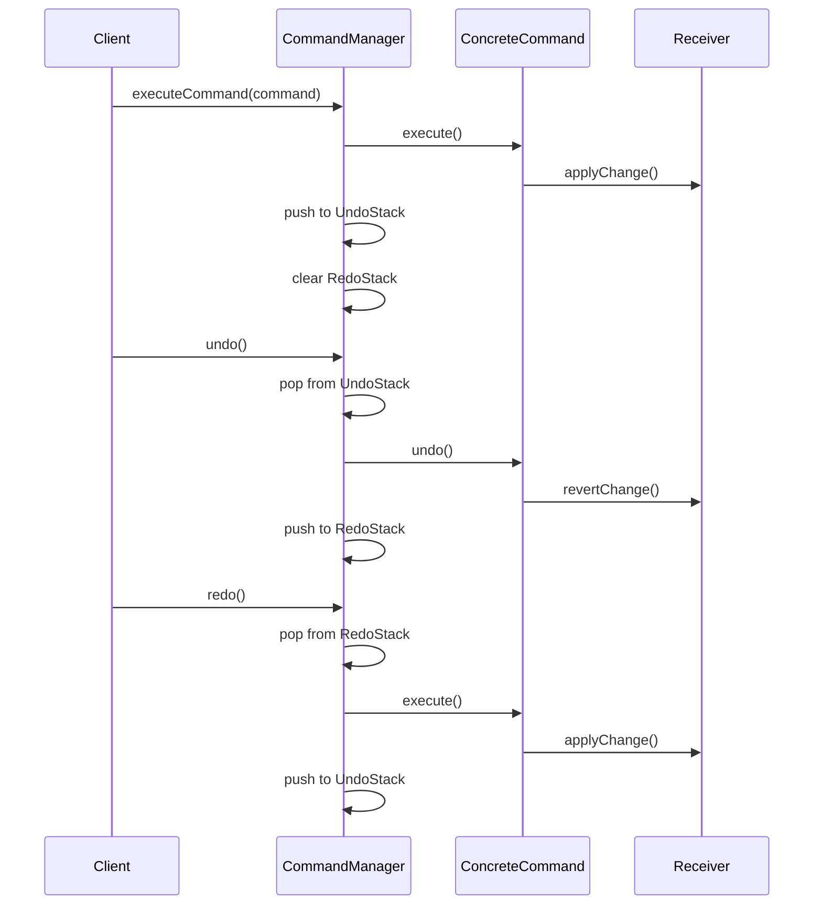

# Design Document: Undo-Redo Framework (Command Pattern)

## 1. Requirements & System Constraints

### 1.1 Functional Requirements
*   **Execution:** The system must be able to execute a variety of operations (commands).
*   **Undo:** The system must support reversing the most recently executed operation.
*   **Redo:** The system must support re-applying an operation that was previously undone.
*   **History Limit:** To prevent memory leaks, the system should maintain a configurable maximum limit on the number of undo/redo steps.
*   **Atomic Grouping:** Ability to group multiple small operations into a single "Composite Command" so they can be undone/redone as one unit.
*   **Extensibility:** New types of operations should be addable without modifying the core framework logic (Open/Closed Principle).

### 1.2 Non-Functional Requirements
*   **Consistency:** The `undo()` operation must return the system to the exact state it was in before the `execute()` call.
*   **Low Latency:** Undo/Redo operations should be near-instantaneous, as they typically happen in the UI thread.
*   **Memory Efficiency:** Store only the necessary delta or state required to reverse the action, rather than full system snapshots.

### 1.3 Scale Estimations
*   **Complexity:** $O(1)$ time complexity for push/pop operations on the history stacks.
*   **Space:** $O(N \times S)$ where $N$ is the history limit and $S$ is the average size of the command metadata.

---

## 2. High-Level Architecture

The system is based on the **Command Design Pattern**. In this pattern, an object is used to encapsulate all information needed to perform an action or trigger an event at a later time.

### 2.1 Core Components
1.  **Command Interface:** Defines the contract for all operations (`execute` and `undo`).
2.  **Concrete Commands:** Implement the specific logic for an action (e.g., `InsertTextCommand`, `DeleteShapeCommand`).
3.  **Receiver:** The actual object that performs the business logic (e.g., `Document`, `Canvas`).
4.  **Command Manager (Invoker):** Manages the `Undo Stack` and `Redo Stack`. It triggers the commands and handles the history lifecycle.
5.  **Memento (Optional):** Used within commands to capture the state of the receiver before execution for precise restoration.

### 2.2 Interaction Diagram (Mermaid)



---

## 3. Detailed Design

### 3.1 Class Design (LLD)

Since this is a framework, the "Schema" is defined by the class structure.

#### Command Interface
```java
public interface Command {
    void execute();
    void undo();
}
```

#### Concrete Command Implementation
```java
public class InsertTextCommand implements Command {
    private Document receiver;
    private String text;
    private int position;

    public InsertTextCommand(Document receiver, String text, int position) {
        this.receiver = receiver;
        this.text = text;
        this.position = position;
    }

    @Override
    public void execute() {
        receiver.insert(position, text);
    }

    @Override
    public void undo() {
        receiver.delete(position, text.length());
    }
}
```

#### Command Manager
```java
public class CommandManager {
    private Deque<Command> undoStack = new ArrayDeque<>();
    private Deque<Command> redoStack = new ArrayDeque<>();
    private final int maxHistory;

    public CommandManager(int maxHistory) {
        this.maxHistory = maxHistory;
    }

    public void executeCommand(Command cmd) {
        cmd.execute();
        undoStack.push(cmd);
        redoStack.clear(); // New action invalidates redo history

        if (undoStack.size() > maxHistory) {
            undoStack.removeLast();
        }
    }

    public void undo() {
        if (undoStack.isEmpty()) return;
        Command cmd = undoStack.pop();
        cmd.undo();
        redoStack.push(cmd);
    }

    public void redo() {
        if (redoStack.isEmpty()) return;
        Command cmd = redoStack.pop();
        cmd.execute();
        undoStack.push(cmd);
    }
}
```

### 3.2 Composite Command (Macro)
To support grouping multiple actions (e.g., "Replace All"), we implement a `CompositeCommand`.
```java
public class CompositeCommand implements Command {
    private List<Command> commands = new ArrayList<>();

    public void addCommand(Command cmd) {
        commands.add(cmd);
    }

    @Override
    public void execute() {
        for (Command cmd : commands) cmd.execute();
    }

    @Override
    public void undo() {
        // Undo in reverse order of execution
        for (int i = commands.size() - 1; i >= 0; i--) {
            commands.get(i).undo();
        }
    }
}
```

---

## 4. Persistence Layer (Optional)

If the Undo/Redo state must survive a restart (e.g., in a professional IDE), the commands must be persisted.

### 4.1 Database Schema (SQL)
We use a **Command Log (Event Sourcing)** approach. Instead of saving the document state, we save the sequence of commands.

**Table: `command_history`**
| Field | Type | Constraint | Description |
| :--- | :--- | :--- | :--- |
| `id` | BIGINT | PK | Unique Command ID |
| `session_id` | UUID | Index | Groups commands for a specific document/session |
| `command_type` | VARCHAR | - | e.g., "INSERT_TEXT", "MOVE_OBJECT" |
| `payload` | JSONB | - | Arguments (e.g., `{"text": "hello", "pos": 10}`) |
| `sequence_num`| INT | - | Ensures strict ordering |
| `created_at` | TIMESTAMP | - | Audit trail |

**Reasoning:**
*   **SQL (Postgres):** Chosen for ACID compliance. If we save a command to the log, we must be certain it was applied to the state.
*   **JSONB:** Allows flexibility as different commands have different payloads.

---

## 5. Scalability & Advanced Topics

### 5.1 Memory Management
*   **Bounded Stacks:** Using a `Deque` with a fixed capacity prevents `OutOfMemoryError` during long-running sessions.
*   **Flyweight Pattern:** If many commands share the same metadata, the Flyweight pattern can be used to reduce memory footprint.

### 5.2 State Management (Command vs. Memento)
*   **Command-based (Delta):** Stores "how" to reverse the action (e.g., `delete(pos, len)`). More memory efficient.
*   **Memento-based (Snapshot):** Stores the state "before" the action. Safer for complex transformations where calculating the inverse is mathematically difficult.
*   **Hybrid Approach:** Use Command for simple edits and Memento for "heavy" operations (e.g., "Apply Complex Filter to Image").

### 5.3 Concurrency
*   **Command Locking:** In a multi-threaded environment, the `CommandManager` must be thread-safe. Use `ReentrantLock` or `synchronized` blocks around stack operations to prevent state corruption during simultaneous Undo/Redo requests.

### 5.4 Distributed Undo (Collaboration)
For tools like Google Docs, a simple stack is insufficient. **Operational Transformation (OT)** or **Conflict-free Replicated Data Types (CRDTs)** are required to handle concurrent undoes across different clients.

---

## 6. Trade-off Analysis

| Trade-off | Selection | Reasoning |
| :--- | :--- | :--- |
| **Storage: Delta vs Snapshot** | **Delta** | Snapshots of large documents are too expensive in terms of RAM/Disk. Deltas are $O(1)$ or $O(\text{change size})$. |
| **Undo Limit: Fixed vs Dynamic** | **Fixed** | A hard limit (e.g., 100 steps) ensures predictable memory usage and prevents performance degradation in the UI. |
| **Complexity: Command Pattern vs State Saving** | **Command Pattern** | While the Command pattern adds more classes (boilerplate), it provides superior extensibility and allows for "Redo" functionality without keeping multiple full copies of the state. |
| **Latency vs Durability** | **Latency** | In-memory stacks are prioritized for immediate UI responsiveness. Persistence to DB happens asynchronously via a write-behind cache. |