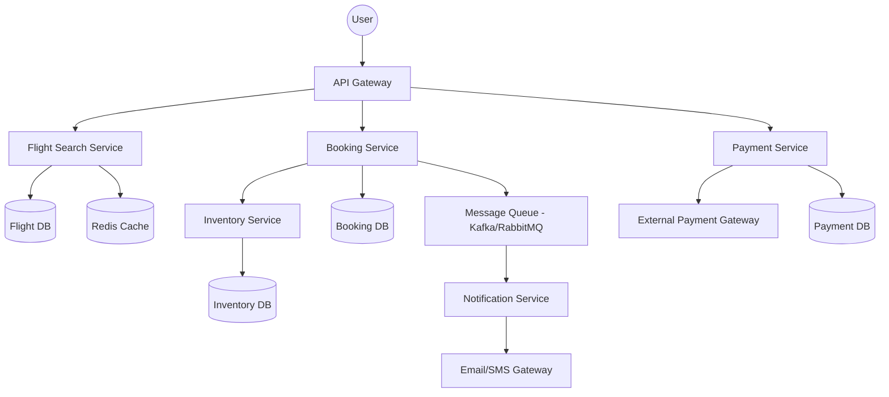

# System Design Document: Airline Reservation System

## 1. Requirements & System Constraints

### 1.1 Functional Requirements
*   **Flight Search:** Users can search for available flights based on origin, destination, date, and class (Economy, Business, First).
*   **Seat Selection:** Users can view a real-time seat map and select specific seats.
*   **Booking Management:** 
    *   Reserve a seat temporarily (TTL) to prevent others from booking it during the payment process.
    *   Confirm booking upon successful payment.
    *   Cancel or modify existing bookings.
*   **Payment Integration:** Process payments through third-party gateways.
*   **Flight Management (Admin):** Administrators can add/update flights, manage aircraft assignments, and handle scheduling.
*   **Notifications:** Send booking confirmations and flight updates via Email/SMS.

### 1.2 Non-Functional Requirements
*   **Strong Consistency:** Double-booking of the same seat must be impossible (ACID compliance is critical).
*   **High Availability:** The search and browsing functionality must be available 24/7.
*   **Low Latency:** Flight searches should return results in milliseconds.
*   **Scalability:** The system must handle massive spikes in traffic during holiday seasons or promotional sales.
*   **Reliability:** Payment and booking state transitions must be durable and recoverable.

### 1.3 Scale Estimations (HLD Context)
*   **Daily Active Users (DAU):** 1 Million.
*   **Search Queries:** 100k requests per minute (Read-heavy).
*   **Bookings:** 10k requests per minute (Write-heavy during peaks).
*   **Data Volume:** Millions of flight segments and booking records per year.

---

## 2. High-Level Architecture

The system follows a **Microservices Architecture** to decouple the read-heavy search functionality from the write-heavy booking logic.

### 2.1 Core Components
*   **API Gateway:** Handles authentication, rate limiting, and request routing.
*   **Flight Search Service:** Manages flight schedules and availability. Optimized for reads using a distributed cache.
*   **Booking Service:** Manages the lifecycle of a reservation (Pending $\rightarrow$ Confirmed $\rightarrow$ Cancelled).
*   **Inventory Service:** Tracks seat-level availability. Uses distributed locking to prevent overbooking.
*   **Payment Service:** Integrates with external PSPs (Stripe, PayPal) and manages transaction states.
*   **Notification Service:** Asynchronously sends alerts via a Message Queue.

### 2.2 Architecture Diagram (Mermaid)



---

## 3. Detailed Database Schema Design

### 3.1 Reasoning: SQL vs NoSQL
*   **Relational Database (PostgreSQL):** Used for Bookings, Payments, and Inventory. These require **ACID** properties to ensure that a seat is not sold twice and that payments are mapped correctly to bookings.
*   **NoSQL/Cache (Redis):** Used for flight availability and session management to ensure low-latency search results.

### 3.2 Schema Definition

#### `Airports`
| Field | Type | Constraint | Description |
| :--- | :--- | :--- | :--- |
| airport_id | UUID | PK | Unique Identifier |
| iata_code | VARCHAR(3) | Unique, Indexed | e.g., JFK, LHR |
| city | VARCHAR(100) | Not Null | City Name |
| timezone | VARCHAR(50) | Not Null | UTC Offset |

#### `Flights`
| Field | Type | Constraint | Description |
| :--- | :--- | :--- | :--- |
| flight_id | UUID | PK | Unique Identifier |
| flight_number | VARCHAR(10) | Indexed | e.g., AA101 |
| departure_airport_id| UUID | FK $\rightarrow$ Airports | Origin |
| arrival_airport_id | UUID | FK $\rightarrow$ Airports | Destination |
| departure_time | TIMESTAMP | Indexed | Scheduled departure |
| arrival_time | TIMESTAMP | Not Null | Scheduled arrival |
| aircraft_id | UUID | FK $\rightarrow$ Aircraft | Aircraft type/ID |

#### `Seats`
| Field | Type | Constraint | Description |
| :--- | :--- | :--- | :--- |
| seat_id | UUID | PK | Unique Identifier |
| flight_id | UUID | FK $\rightarrow$ Flights | Associated flight |
| seat_number | VARCHAR(5) | Not Null | e.g., 12A |
| class | ENUM | Economy, Business, First | Seat Class |
| status | ENUM | Available, Reserved, Booked | Current state |
| version | INT | Not Null | For Optimistic Locking |

#### `Bookings`
| Field | Type | Constraint | Description |
| :--- | :--- | :--- | :--- |
| booking_id | UUID | PK | Unique Identifier |
| user_id | UUID | FK $\rightarrow$ Users | Customer ID |
| flight_id | UUID | FK $\rightarrow$ Flights | Flight ID |
| status | ENUM | Pending, Confirmed, Cancelled | Booking state |
| total_amount | DECIMAL | Not Null | Final price |
| created_at | TIMESTAMP | Not Null | Booking timestamp |

#### `Tickets`
| Field | Type | Constraint | Description |
| :--- | :--- | :--- | :--- |
| ticket_id | UUID | PK | Unique Identifier |
| booking_id | UUID | FK $\rightarrow$ Bookings | Booking reference |
| seat_id | UUID | FK $\rightarrow$ Seats | Assigned seat |
| passenger_name | VARCHAR(100) | Not Null | Passenger detail |

---

## 4. Core API Design

### 4.1 Flight Search
`GET /api/v1/flights/search?from=SFO&to=JFK&date=2023-12-01&class=Economy`
**Response:**
```json
[
  {
    "flight_id": "f123",
    "flight_number": "AA101",
    "departure": "2023-12-01T10:00Z",
    "arrival": "2023-12-01T18:00Z",
    "price": 450.00,
    "available_seats": 15
  }
]
```

### 4.2 Reserve Seat (Temporary Lock)
`POST /api/v1/bookings/reserve`
**Request:**
```json
{
  "flight_id": "f123",
  "seat_id": "s456",
  "user_id": "u789"
}
```
**Response:** `201 Created`
```json
{
  "booking_id": "b987",
  "expires_at": "2023-12-01T10:15Z",
  "status": "Pending"
}
```

### 4.3 Confirm Booking (Payment)
`POST /api/v1/bookings/confirm`
**Request:**
```json
{
  "booking_id": "b987",
  "payment_method_id": "pm_123",
  "amount": 450.00
}
```
**Response:** `200 OK`
```json
{
  "ticket_id": "t001",
  "status": "Confirmed",
  "confirmation_code": "XYZ789"
}
```

---

## 5. Scalability & Advanced Topics

### 5.1 Preventing Double Booking (Concurrency Control)
To prevent two users from booking the same seat simultaneously, the system employs a two-layer strategy:
1.  **Distributed Locking (Redis):** When a user selects a seat, a key is created: `lock:flight_{id}:seat_{id}` with a TTL of 10-15 minutes. If the lock exists, other users cannot reserve it.
2.  **Optimistic Locking (Database):** The `Seats` table contains a `version` column.
    `UPDATE Seats SET status = 'Booked', version = version + 1 WHERE seat_id = :id AND version = :old_version;`
    If the update returns 0 rows, a concurrent modification occurred, and the request is rejected.

### 5.2 Caching Strategy
*   **Flight Schedules:** Cached in Redis with a long TTL, as schedules change infrequently.
*   **Availability:** Cached with short TTLs. The "Search Service" reads from Redis; the "Inventory Service" updates Redis whenever a seat status changes (Write-through cache).

### 5.3 Handling Payment Failures & Timeouts
*   **Saga Pattern:** Since Booking and Payment are separate services, a Saga pattern (Choreography) is used. 
    *   `BookingSvc` creates a "Pending" booking $\rightarrow$ `PaymentSvc` processes payment.
    *   If payment fails, `PaymentSvc` emits a `PaymentFailed` event $\rightarrow$ `BookingSvc` marks booking as "Cancelled" and `InventorySvc` releases the seat.

### 5.4 Sharding & Partitioning
*   **Booking DB:** Sharded by `user_id` to distribute the load.
*   **Inventory DB:** Sharded by `flight_id` to ensure all seats for a specific flight reside on the same partition, making transactions more efficient.

---

## 6. Trade-off Analysis

| Trade-off | Choice | Reasoning |
| :--- | :--- | :--- |
| **Consistency vs Availability** | **Consistency (CP)** | In a reservation system, availability of the *search* is important, but consistency of the *booking* is non-negotiable. Double-booking leads to severe business loss and customer dissatisfaction. |
| **Latency vs Storage** | **Latency** | We use denormalized views in Redis for flight searches to avoid complex joins across `Flights`, `Airports`, and `Seats` tables during peak search times. |
| **Synchronous vs Asynchronous** | **Mixed** | Booking and Payment are synchronous (user needs immediate confirmation). Notifications are asynchronous (Email can arrive 30 seconds later without impacting UX). |
| **Pessimistic vs Optimistic Locking** | **Optimistic** | Since the probability of two users clicking the *exact* same seat at the *exact* same millisecond is relatively low compared to total traffic, optimistic locking reduces database lock contention. |