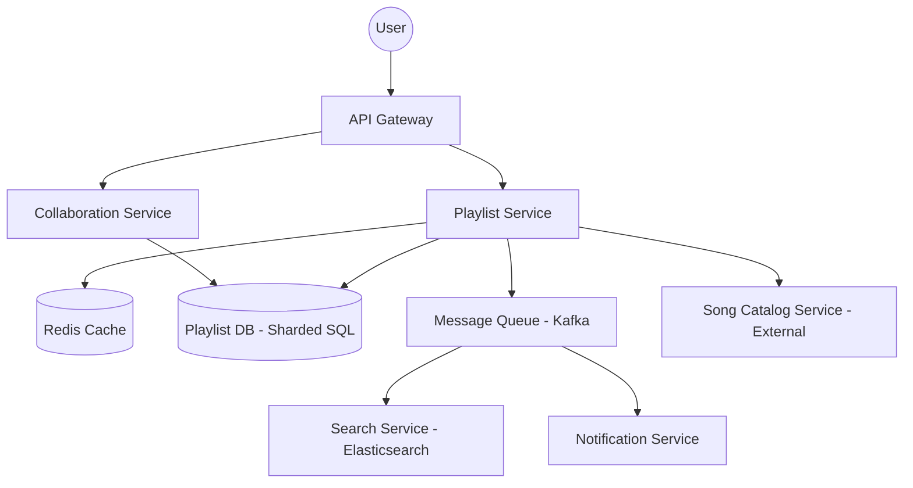

# System Design Document: Spotify Playlist Manager

## 1. Requirements & System Constraints

The Spotify Playlist Manager is a specialized component responsible for the creation, modification, and discovery of song collections. While it interacts with a global song catalog, its primary focus is the relationship between users, playlists, and songs.

### 1.1 Functional Requirements
- **Playlist Lifecycle:** Users can create, update (metadata), and delete playlists.
- **Song Management:** Users can add songs to a playlist, remove songs, and reorder songs.
- **Visibility Control:** Playlists can be marked as Public (discoverable by others) or Private.
- **Collaboration:** Owners can invite other users as collaborators to add/remove songs.
- **Discovery:** Users can search for public playlists by name or tags.
- **Persistence:** Changes must be durable and consistent for the owner.

### 1.2 Non-Functional Requirements
- **High Availability:** Reading playlists should be highly available, as this is the most frequent operation.
- **Low Latency:** Adding/removing songs should feel instantaneous to the user.
- **Scalability:** The system must handle millions of users and billions of "playlist-song" associations.
- **Consistency:** 
    - **Strong Consistency** for the playlist owner (they should see their changes immediately).
    - **Eventual Consistency** for public followers of a playlist.
- **Concurrency:** Handle multiple collaborators editing the same playlist simultaneously without data corruption.

### 1.3 Scale Estimations
- **Users:** 500M Monthly Active Users (MAU).
- **Playlists per User:** Average 10 playlists.
- **Songs per Playlist:** Average 50 songs.
- **Read/Write Ratio:** Read-heavy (e.g., 100:1).
- **Total Playlist-Song Mappings:** $\approx 500\text{M} \times 10 \times 50 = 250\text{B}$ records. This necessitates a distributed database approach.

---

## 2. High-Level Architecture

The system follows a microservices architecture to decouple playlist management from the song catalog and user identity services.

### 2.1 Core Components
- **API Gateway:** Handles authentication, rate limiting, and request routing.
- **Playlist Service:** The core business logic for CRUD operations on playlists and songs.
- **Collaboration Service:** Manages permissions, roles (Owner, Editor, Viewer), and invitations.
- **Search Service:** An indexed search engine (e.g., Elasticsearch) for discovering public playlists.
- **Cache Layer:** Distributed cache (Redis) for frequently accessed playlists.
- **Message Queue:** Asynchronous updates for search indexing and notification services.

### 2.2 Architecture Diagram

---

## 3. Detailed Database Schema Design

Given the need for ACID compliance during song reordering and ownership transfers, a Relational Database (PostgreSQL) is chosen, with horizontal sharding based on `playlist_id`.

### 3.1 Table Definitions

#### Table: `playlists`
Stores metadata about the playlist.
| Field | Type | Constraints | Description |
| :--- | :--- | :--- | :--- |
| `playlist_id` | UUID | PK | Unique identifier |
| `owner_id` | UUID | FK (Users) | User who created the playlist |
| `name` | VARCHAR(255)| NOT NULL | Playlist title |
| `description` | TEXT | | Optional description |
| `is_public` | BOOLEAN | DEFAULT False | Visibility flag |
| `created_at` | TIMESTAMP | NOT NULL | Creation time |
| `updated_at` | TIMESTAMP | NOT NULL | Last modified time |

#### Table: `playlist_songs`
The junction table mapping songs to playlists with ordering.
| Field | Type | Constraints | Description |
| :--- | :--- | :--- | :--- |
| `playlist_id` | UUID | FK, Composite PK | Reference to playlist |
| `song_id` | UUID | FK, Composite PK | Reference to song catalog |
| `position` | DOUBLE | NOT NULL | For sorting (Fractional Indexing) |
| `added_at` | TIMESTAMP | NOT NULL | Time song was added |
| `added_by` | UUID | FK (Users) | User who added the song |

#### Table: `playlist_collaborators`
Manages access control for collaborative playlists.
| Field | Type | Constraints | Description |
| :--- | :--- | :--- | :--- |
| `playlist_id` | UUID | FK, Composite PK | Reference to playlist |
| `user_id` | UUID | FK, Composite PK | Collaborating user |
| `role` | ENUM | ('EDITOR', 'VIEWER') | Permissions level |
| `joined_at` | TIMESTAMP | NOT NULL | Time joined |

### 3.2 Indexing Strategy
- **`playlists`**: Index on `owner_id` to quickly fetch all playlists for a specific user.
- **`playlist_songs`**: Composite index on `(playlist_id, position)` to retrieve songs in the correct order efficiently.
- **`playlist_collaborators`**: Index on `user_id` to find all collaborative playlists a user is part of.

### 3.3 NoSQL vs SQL Reasoning
- **Why SQL?** We require strict consistency for song ordering and permission management. Transactional integrity ensures that adding a song and updating the playlist's `updated_at` timestamp happen atomically.
- **Why Sharding?** A single SQL instance cannot handle 250B records. We shard by `playlist_id` so all songs for a single playlist reside on the same physical node, avoiding cross-shard joins.

---

## 4. Core API Design

### 4.1 Playlist Management
| Endpoint | Method | Description | Payload |
| :--- | :--- | :--- | :--- |
| `/v1/playlists` | `POST` | Create a new playlist | `{ "name": "Chill", "is_public": true }` |
| `/v1/playlists/{id}` | `GET` | Get playlist metadata & songs | `N/A` |
| `/v1/playlists/{id}` | `PATCH` | Update name/visibility | `{ "name": "Chill Vibes" }` |
| `/v1/playlists/{id}` | `DELETE`| Delete playlist | `N/A` |

### 4.2 Song Management
| Endpoint | Method | Description | Payload |
| :--- | :--- | :--- | :--- |
| `/v1/playlists/{id}/songs`| `POST` | Add song to playlist | `{ "song_id": "abc-123" }` |
| `/v1/playlists/{id}/songs`| `DELETE`| Remove song | `{ "song_id": "abc-123" }` |
| `/v1/playlists/{id}/reorder`| `PATCH` | Change song order | `{ "song_id": "abc", "after_id": "def" }` |

### 4.3 Collaboration
| Endpoint | Method | Description | Payload |
| :--- | :--- | :--- | :--- |
| `/v1/playlists/{id}/collabs`| `POST` | Invite user to collab | `{ "user_id": "xyz", "role": "EDITOR" }` |

---

## 5. Scalability & Advanced Topics

### 5.1 Handling Song Reordering (Fractional Indexing)
Using an integer `position` (1, 2, 3...) is inefficient because moving a song to the top requires updating $O(N)$ records.
- **Solution:** Use **Fractional Indexing** (Floating point numbers). 
- To place a song between position `1.0` and `2.0`, assign it `1.5`. 
- This allows $O(1)$ updates for reordering. If precision limits are hit, a background job triggers a "normalization" to reset indices to whole numbers.

### 5.2 Caching Strategy
- **Cache-Aside Pattern:** When `GET /playlists/{id}` is called, check Redis first.
- **Data Structure:** Use a **Redis Sorted Set (ZSET)** where the `score` is the `position` and the `value` is the `song_id`. This allows fast range queries and reordering.
- **Eviction:** TTL (Time-to-Live) of 24 hours; invalidate cache on `POST/PATCH/DELETE` operations.

### 5.3 Search Implementation
Synchronous updates to a search index would slow down the API.
1. User updates a public playlist $\rightarrow$ Playlist Service updates SQL DB.
2. Playlist Service pushes an event to **Kafka** (`PlaylistUpdatedEvent`).
3. **Search Consumer** reads from Kafka and updates the **Elasticsearch** index.
4. Users search via Elasticsearch, which returns `playlist_id`s, which are then hydrated via the Playlist Service.

### 5.4 Concurrency Control
To prevent "lost updates" when two collaborators edit the same playlist:
- **Optimistic Locking:** Add a `version` column to the `playlists` table.
- Request: `PATCH /playlists/{id} { "name": "New Name", "version": 5 }`
- If the current version in DB is `6`, the request is rejected with `409 Conflict`, forcing the client to refresh.

---

## 6. Trade-off Analysis

### 6.1 CAP Theorem
The system prioritizes **Availability** and **Partition Tolerance (AP)** for read operations. It is acceptable if a follower sees a song added to a public playlist a few seconds late (Eventual Consistency). However, for the owner's operations (CRUD), it behaves as a **CP** system to ensure they never see an inconsistent state of their own data.

### 6.2 Latency vs. Storage
- **Trade-off:** We store playlist data in both the Sharded SQL DB and Elasticsearch.
- **Reasoning:** This duplication increases storage costs but reduces search latency from $O(N)$ (scanning DB) to $O(\log N)$ (inverted index).

### 6.3 Database Choice: SQL vs NoSQL
- **NoSQL (e.g., Cassandra)** would offer better write scaling for the `playlist_songs` table.
- **Decision:** We chose **Sharded SQL** because the complexity of managing song ordering and ACID transactions for collaborative roles in NoSQL (which lacks joins and complex transactions) would outweigh the scaling benefits. Sharding provides the necessary scale while keeping relational guarantees.