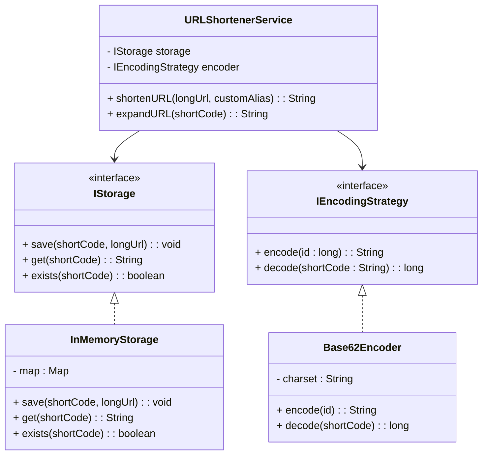

# URL Shortener LLD

A URL Shortener (like bit.ly or tinyurl.com) is a classic Low-Level Design problem that tests a developer's ability to handle **data encoding**, **mapping**, and **extensibility**. The goal is to map a long, cumbersome URL to a short, unique alphanumeric string and redirect users back to the original destination when the short string is accessed.

---

## 1. Overview & System Requirements

### Core Entities
- **Long URL**: The original destination address.
- **Short URL (Alias)**: The generated unique identifier (e.g., `bit.ly/3xKz2L`).
- **URL Mapping**: The association between the short code and the long URL.

### Functional Requirements
- **Shorten URL**: Convert a long URL into a short, unique alphanumeric code.
- **Expand URL**: Retrieve the original long URL given a short code and redirect the user.
- **Custom Alias**: Allow users to provide their own short code (if not already taken).
- **Expiration**: (Optional but recommended) Support a Time-to-Live (TTL) for shortened links.

### Non-Functional Requirements
- **Uniqueness**: No two long URLs should result in the same short code (unless intentionally designed for deduplication).
- **Efficiency**: Shortening and expansion should occur in constant time $O(1)$.
- **Scalability**: The design should allow switching from in-memory storage to a database without changing business logic.

---

## 2. Design Principles & Patterns

### Design Principles (SOLID)
- **Single Responsibility Principle (SRP)**: The `EncodingStrategy` handles the math of shortening, the `Storage` handles persistence, and the `URLShortenerService` orchestrates the process.
- **Open/Closed Principle (OCP)**: By using an interface for the encoding strategy, we can introduce new algorithms (e.g., Hash-based vs. Counter-based) without modifying the service class.
- **Dependency Inversion Principle (DIP)**: The high-level `URLShortenerService` depends on abstractions (`IStorage`, `IEncodingStrategy`) rather than concrete implementations.

### Design Patterns Applied
1. **Strategy Pattern**: Used for the encoding logic. Since there are multiple ways to generate a short code (Base62, MD5 hashing, etc.), the Strategy pattern allows the system to switch algorithms at runtime.
2. **Singleton Pattern**: The `URLShortenerService` is typically implemented as a singleton to maintain a consistent state of the counter and storage across the application.
3. **Factory Pattern**: (Optional) Can be used to instantiate different storage types (e.g., `RedisStorage` vs. `SQLStorage`).

---

## 3. Class Structure & Relationships

### Class Diagram (Text-Based)


### Relationships
- **Composition**: `URLShortenerService` *has-a* `IStorage` and *has-a* `IEncodingStrategy`.
- **Realization**: `Base62Encoder` implements `IEncodingStrategy`; `InMemoryStorage` implements `IStorage`.

---

## 4. Step-by-Step Logic & Code Walkthrough

### The Logic: Base62 Encoding
Instead of hashing (which can have collisions), the most robust LLD approach uses a **Global Unique ID (Counter)**.
1. Every long URL is assigned a unique numeric ID (1, 2, 3...).
2. This ID is converted from Base10 (decimal) to **Base62** (characters `[a-z, A-Z, 0-9]`).
3. A Base62 string of length 7 can support $62^7 \approx 3.5$ trillion unique URLs.

### Implementation

```python
import threading

# --- Strategy Pattern for Encoding ---
class IEncodingStrategy:
    def encode(self, numeric_id: int) -> str:
        pass

class Base62Encoder(IEncodingStrategy):
    def __init__(self):
        self.charset = "abcdefghijklmnopqrstuvwxyzABCDEFGHIJKLMNOPQRSTUVWXYZ0123456789"

    def encode(self, numeric_id: int) -> str:
        if numeric_id == 0:
            return self.charset[0]
        
        arr = []
        while numeric_id:
            arr.append(self.charset[numeric_id % 62])
            numeric_id //= 62
        return "".join(reversed(arr))

# --- Storage Interface ---
class IStorage:
    def save(self, short_code: str, long_url: str):
        pass
    def get(self, short_code: str) -> str:
        pass
    def exists(self, short_code: str) -> bool:
        pass

class InMemoryStorage(IStorage):
    def __init__(self):
        self._store = {}

    def save(self, short_code: str, long_url: str):
        self._store[short_code] = long_url

    def get(self, short_code: str) -> str:
        return self._store.get(short_code)

    def exists(self, short_code: str) -> bool:
        return short_code in self._store

# --- Main Service ---
class URLShortenerService:
    _instance = None
    _lock = threading.Lock()

    def __new__(cls, *args, **kwargs):
        with cls._lock:
            if not cls._instance:
                cls._instance = super(URLShortenerService, cls).__new__(cls)
        return cls._instance

    def __init__(self, storage: IStorage, encoder: IEncodingStrategy):
        # Prevent re-initialization in Singleton
        if hasattr(self, 'initialized'): return
        self.storage = storage
        self.encoder = encoder
        self.counter = 1000000000  # Start from a high number for consistent length
        self.counter_lock = threading.Lock()
        self.initialized = True

    def shorten_url(self, long_url: str, custom_alias: str = None) -> str:
        if custom_alias:
            if self.storage.exists(custom_alias):
                raise ValueError("Custom alias already exists!")
            self.storage.save(custom_alias, long_url)
            return custom_alias

        with self.counter_lock:
            short_code = self.encoder.encode(self.counter)
            self.counter += 1
        
        self.storage.save(short_code, long_url)
        return short_code

    def expand_url(self, short_code: str) -> str:
        url = self.storage.get(short_code)
        if not url:
            raise ValueError("Short URL not found!")
        return url

# --- Execution ---
if __name__ == "__main__":
    storage = InMemoryStorage()
    encoder = Base62Encoder()
    service = URLShortenerService(storage, encoder)

    # Case 1: Standard Shortening
    url1 = "https://www.google.com/search?q=low+level+design+patterns"
    code1 = service.shorten_url(url1)
    print(f"Long: {url1} -> Short: {code1}")
    print(f"Expand: {service.expand_url(code1)}")

    # Case 2: Custom Alias
    url2 = "https://github.com/openai"
    code2 = service.shorten_url(url2, custom_alias="openai-git")
    print(f"Long: {url2} -> Short: {code2}")
    print(f"Expand: {service.expand_url(code2)}")
```

---

## 5. Complexity Analysis

| Operation | Time Complexity | Space Complexity | Note |
| :--- | :--- | :--- | :--- |
| **Shorten URL** | $O(1)$ | $O(1)$ | Base62 encoding takes $\log_{62}(N)$ time, which is constant for a fixed max ID. |
| **Expand URL** | $O(1)$ | $O(1)$ | Hash map lookup is constant time. |
| **Storage** | N/A | $O(N)$ | Space grows linearly with the number of URLs stored. |

---

## 6. Real-World Applications

1. **Bitly / TinyURL**: These services use the exact Base62 encoding and distributed ID generation (e.g., Snowflake IDs) to ensure uniqueness across multiple servers.
2. **Marketing Campaigns**: Using custom aliases (e.g., `brand.ly/summer-sale`) for tracking and branding.
3. **API Gateways**: Shortening complex internal resource paths to provide cleaner external endpoints.
4. **Social Media**: Platforms like Twitter (X) automatically shorten long links to save character space and track click-through rates (CTR).

### Production Considerations (Beyond LLD)
- **Distributed ID Generation**: In a real distributed system, a single `counter` variable is a bottleneck. Engineers use **Zookeeper** or **Twitter Snowflake** to generate unique IDs across multiple nodes.
- **Caching**: Use **Redis** to cache the most frequently accessed `shortCode -> longUrl` mappings to reduce database load.
- **Database**: Use a **NoSQL Key-Value store** (like DynamoDB or Cassandra) because the access pattern is a simple key-value lookup.