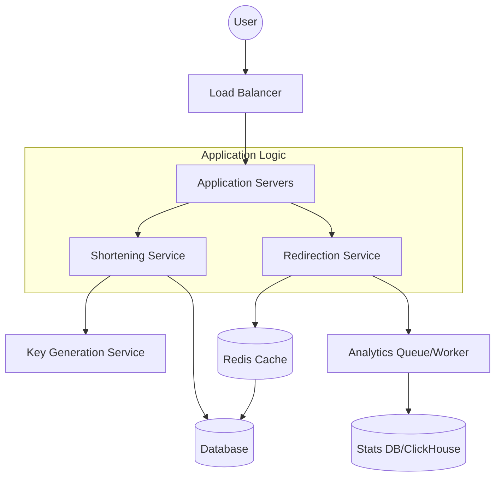

# System Design Document: URL Shortener (bit.ly)

## 1. Requirements & System Constraints

### 1.1 Functional Requirements
*   **URL Shortening:** The system should take a long URL and return a shorter, unique alias.
*   **URL Redirection:** When a user accesses the short URL, the system should redirect them to the original long URL with minimum latency.
*   **Custom Aliases:** Users should be able to provide a custom string for their short URL.
*   **Expiration:** URLs should have a default or user-defined expiration date.
*   **Analytics:** The system should track the number of clicks and basic metadata (timestamp, location) for each short URL.

### 1.2 Non-Functional Requirements
*   **High Availability:** The redirection service must be available 24/7; downtime results in broken links across the web.
*   **Low Latency:** Redirection should happen in milliseconds.
*   **Uniqueness:** No two different long URLs should result in the same short URL (unless explicitly intended).
*   **Scalability:** The system must handle a high volume of read requests (redirections) compared to write requests (shortening).

### 1.3 Scale Estimations
*   **Write Volume:** Assume 100 million URLs created per month.
*   **Read Volume:** Assume a 10:1 read-to-write ratio $\rightarrow$ 1 billion redirections per month.
*   **Storage:** If each record is $\sim 500$ bytes, 100M records/month $\times 12$ months $\times 5$ years $\approx 3$ TB of data.
*   **TPS (Transactions Per Second):** 
    *   Write: $100M / (30 \times 24 \times 3600) \approx 38$ writes/sec.
    *   Read: $1B / (30 \times 24 \times 3600) \approx 385$ reads/sec.
    *   *Note: Peak loads can be $10\times$ higher.*

---

## 2. High-Level Architecture

### 2.1 Core Components
1.  **API Gateway/Load Balancer:** Distributes incoming traffic across multiple application servers.
2.  **Shortening Service:** Handles the logic of generating unique short keys and storing the mapping.
3.  **Redirection Service:** High-performance service that resolves short keys to long URLs and handles HTTP redirects.
4.  **Key Generation Service (KGS):** A dedicated service to provide unique IDs to avoid collisions in a distributed environment.
5.  **Cache (Redis):** Stores frequently accessed URL mappings to reduce database load.
6.  **Database:** Persistent storage for URL mappings and user data.

### 2.2 Architecture Diagram


---

## 3. Detailed Database Schema Design

### 3.1 Database Selection
Since the data model is a simple Key-Value pair (ShortURL $\rightarrow$ LongURL) and we require massive scalability and high availability, a **NoSQL Database (like Cassandra or DynamoDB)** is preferred. 
*   **Reasoning:** NoSQL scales horizontally more easily than SQL. We do not need complex joins. The primary access pattern is a point lookup by the short key.

### 3.2 Schema Definition

#### Table: `url_mapping`
| Field | Type | Constraints | Description |
| :--- | :--- | :--- | :--- |
| `short_key` | `VARCHAR(10)` | **PK** | The unique Base62 encoded string. |
| `original_url` | `TEXT` | Not Null | The destination long URL. |
| `user_id` | `UUID` | Indexed | Owner of the URL for management. |
| `created_at` | `TIMESTAMP` | Not Null | Creation timestamp. |
| `expires_at` | `TIMESTAMP` | Indexed | Expiration date. |

#### Table: `url_analytics`
| Field | Type | Constraints | Description |
| :--- | :--- | :--- | :--- |
| `short_key` | `VARCHAR(10)` | **PK/Partition** | Foreign key to `url_mapping`. |
| `timestamp` | `TIMESTAMP` | **Sort Key** | When the click occurred. |
| `ip_address` | `VARCHAR(45)` | - | User's IP. |
| `user_agent` | `TEXT` | - | Browser/OS info. |
| `referrer` | `TEXT` | - | Where the user came from. |

### 3.3 Indexing Strategy
*   **Primary Key:** `short_key` ensures $O(1)$ lookup.
*   **Secondary Index:** `user_id` allows users to list all URLs they have shortened.
*   **TTL Index:** In MongoDB or DynamoDB, a TTL index on `expires_at` can automatically purge expired records.

---

## 4. Core API Design

### 4.1 Shorten URL
`POST /api/v1/shorten`

**Request Body:**
```json
{
  "longUrl": "https://www.example.com/some/very/long/path/to/article?id=123",
  "customAlias": "my-promo-2024", 
  "expiryDate": "2025-12-31T23:59:59Z"
}
```

**Response (201 Created):**
```json
{
  "shortUrl": "https://bit.ly/my-promo-2024",
  "createdAt": "2024-01-01T10:00:00Z"
}
```

### 4.2 Redirect URL
`GET /{shortKey}`

**Response:** 
*   **302 Found (Temporary Redirect):** Used so that every click is tracked by our servers (doesn't get cached by the browser permanently).
*   **Header:** `Location: https://www.example.com/some/very/long/path...`

### 4.3 Get Analytics
`GET /api/v1/stats/{shortKey}`

**Response (200 OK):**
```json
{
  "shortKey": "my-promo-2024",
  "totalClicks": 1540,
  "topReferrers": [
    {"source": "twitter.com", "count": 800},
    {"source": "facebook.com", "count": 740}
  ]
}
```

---

## 5. Scalability & Advanced Topics

### 5.1 Key Generation Logic (The Core Challenge)
To avoid collisions in a distributed system, we use **Base62 Encoding** ($[0-9, a-z, A-Z]$). 
A 7-character string gives $62^7 \approx 3.5$ trillion combinations.

**The Approach: Distributed ID Generation (KGS)**
1.  We use a distributed counter (e.g., via **Apache ZooKeeper**).
2.  The KGS maintains a range of IDs (e.g., Server A gets 1-1000, Server B gets 1001-2000).
3.  When a request comes, the application server takes the next available integer ID and converts it to Base62.
4.  This eliminates the need for "check-then-insert" database calls, preventing race conditions.

### 5.2 Caching Strategy
Since the read-to-write ratio is high, a caching layer is mandatory.
*   **Technology:** Redis.
*   **Eviction Policy:** LRU (Least Recently Used).
*   **Flow:** `RedirSrv` $\rightarrow$ `Redis` $\rightarrow$ (if miss) $\rightarrow$ `DB` $\rightarrow$ `Populate Redis`.

### 5.3 Data Sharding
To handle growth, we shard the database based on the hash of the `short_key`.
*   **Consistent Hashing:** Ensures that adding/removing database nodes doesn't result in massive data migration.

### 5.4 Rate Limiting
To prevent API abuse (spamming the shorten endpoint), we implement a Rate Limiter (Token Bucket algorithm) at the API Gateway, keyed by `user_id` or `IP address`.

### 5.5 Asynchronous Analytics
Writing analytics data to the database on every redirect would bottleneck the `Redirection Service`.
*   **Pipeline:** `RedirSrv` $\rightarrow$ `Kafka/RabbitMQ` $\rightarrow$ `Analytics Consumer` $\rightarrow$ `ClickHouse/Cassandra`.
*   This decouples the critical path (redirecting the user) from the non-critical path (logging the click).

---

## 6. Trade-off Analysis

| Trade-off | Selection | Justification |
| :--- | :--- | :--- |
| **Redirect Type** | `302 Found` vs `301 Moved Permanently` | **302** is chosen. 301 is cached by browsers, meaning we lose analytics for subsequent visits. 302 ensures every request hits our server. |
| **CAP Theorem** | Availability over Consistency (AP) | In a global system, the user's ability to be redirected is more important than seeing the "exact" click count in real-time. |
| **ID Generation** | KGS vs Hashing (MD5/SHA) | **KGS** is chosen. Hashing long URLs requires collision handling (appending salts and re-hashing), which increases latency and DB load. |
| **Storage** | NoSQL vs SQL | **NoSQL** is chosen for horizontal scalability and the simplicity of the key-value access pattern. |
| **Latency vs Storage** | Memory Cache vs DB | We prioritize **Latency**. We use significant RAM (Redis) to ensure that the "hot" 20% of URLs (which drive 80% of traffic) are resolved in $<10\text{ms}$. |