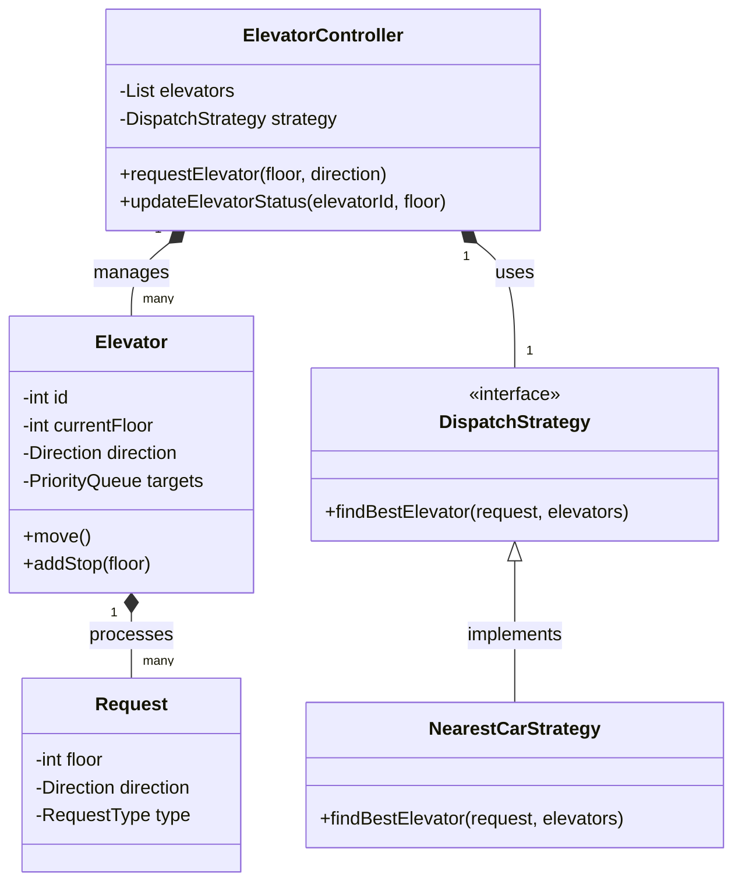

# Elevator Group Control LLD

Designing an **Elevator Group Control System** is a classic "Hard" LLD challenge because it transitions from a simple state-machine problem (single elevator) to a complex **resource allocation and optimization problem** (multiple elevators). The primary goal is to minimize the **Average Waiting Time (AWT)** and **Average Travel Time (ATT)** while maximizing energy efficiency.

---

## 1. Overview & System Requirements

### Core Entities
- **Elevator Group**: A collection of elevators serving the same set of floors.
- **Elevator Car**: The physical unit that moves between floors.
- **Floor/Hall**: The landing area where users request elevators.
- **Dispatch Controller**: The "brain" that decides which elevator handles which request.
- **Request**: A signal indicating a desire to move (External: Floor $\rightarrow$ Direction; Internal: Floor $\rightarrow$ Target).

### Functional Requirements
1. **Request Handling**: 
   - External requests (Up/Down buttons on a floor).
   - Internal requests (Destination buttons inside the car).
2. **Dispatching Logic**: Efficiently assign the "best" elevator based on distance, direction, and current load.
3. **Movement Control**: Elevators must stop at all requested floors in their path (SCAN algorithm).
4. **State Management**: Track whether an elevator is `IDLE`, `MOVING_UP`, `MOVING_DOWN`, or `OUT_OF_SERVICE`.
5. **Concurrency**: Handle simultaneous requests from multiple floors and multiple cars reporting their positions.

### Non-Functional Requirements
- **Scalability**: Ability to add more elevators or floors without rewriting the controller.
- **Reliability**: Ensuring no request is "forgotten" (guaranteed delivery).
- **Efficiency**: Minimizing the number of stops and empty travels.

---

## 2. Design Principles & Patterns

### OOP Design Principles
- **Single Responsibility Principle (SRP)**: The `Elevator` class handles movement and state; the `Dispatcher` handles the logic of assignment; the `Request` class encapsulates the data.
- **Open/Closed Principle (OCP)**: The system is open for new dispatching strategies (e.g., changing from "Nearest Car" to "Zoning") without modifying the `Elevator` class.
- **Interface Segregation**: Dispatch strategies are defined via an interface, allowing the controller to swap algorithms at runtime.

### Design Patterns Applied
| Pattern | Application | Reason |
| :--- | :--- | :--- |
| **Strategy Pattern** | `DispatchStrategy` | Allows switching between different algorithms (e.g., FCFS, SCAN, Optimal) based on building traffic patterns. |
| **State Pattern** | `ElevatorState` | Manages the transition between `IDLE`, `UP`, and `DOWN`, ensuring that an elevator doesn't suddenly change direction without stopping. |
| **Observer Pattern** | `Elevator` $\rightarrow$ `Controller` | The Controller observes the elevators to know when they have reached a floor to trigger the next assignment. |
| **Singleton Pattern** | `ElevatorController` | There is typically only one central controller managing a specific group of elevators. |

---

## 3. Class Structure & Relationships

### Class Diagram (Text-Based)



### Key Attributes
- **Elevator**: 
    - `targets`: A `PriorityQueue` or two sets (one for up, one for down) to manage stops.
    - `currentFloor`: Integer tracking position.
- **Request**: 
    - `type`: `INTERNAL` (car button) or `EXTERNAL` (hall button).
    - `direction`: `UP`, `DOWN`, or `NONE`.

---

## 4. Step-by-Step Logic & Code Walkthrough

### The Dispatching Algorithm (The "Hard" Part)
The core logic lies in the `findBestElevator` method. A naive approach is "Nearest Car," but an advanced system uses a **Cost Function**:

$$Cost = \text{Distance} + \text{Direction Penalty} + \text{Stop Penalty}$$

1. **Distance**: Absolute difference between `elevator.currentFloor` and `request.floor`.
2. **Direction Penalty**:
    - If Elevator is `IDLE`: Penalty = 0.
    - If Elevator is moving toward the request floor in the same direction: Penalty = 0.
    - If Elevator is moving away: Penalty = High (must complete current trip first).
    - If Elevator is moving toward the floor but in the opposite direction: Penalty = Medium.
3. **Stop Penalty**: Each existing stop the elevator must make before reaching the new request adds a small penalty.

### Code Implementation Logic

```python
from enum import Enum
from heapq import heappush, heappop

class Direction(Enum):
    UP = 1
    DOWN = -1
    IDLE = 0

class Request:
    def __init__(self, floor, direction=Direction.IDLE):
        self.floor = floor
        self.direction = direction

class Elevator:
    def __init__(self, id):
        self.id = id
        self.current_floor = 0
        self.direction = Direction.IDLE
        self.stops = [] # Min-heap for UP, Max-heap for DOWN

    def add_stop(self, floor):
        self.stops.append(floor)
        self.stops.sort() # Simplified: keep stops sorted

    def move(self):
        if not self.stops:
            self.direction = Direction.IDLE
            return
        
        target = self.stops[0]
        if target > self.current_floor:
            self.direction = Direction.UP
            self.current_floor += 1
        elif target < self.current_floor:
            self.direction = Direction.DOWN
            self.current_floor -= 1
        
        if self.current_floor == target:
            self.stops.pop(0)
            print(f"Elevator {self.id} stopped at floor {self.current_floor}")

class ElevatorController:
    def __init__(self, elevators):
        self.elevators = elevators

    def handle_external_request(self, floor, direction):
        best_elevator = self.select_best_elevator(floor, direction)
        best_elevator.add_stop(floor)
        print(f"Assigned Elevator {best_elevator.id} to floor {floor}")

    def select_best_elevator(self, floor, direction):
        # Implementation of Cost Function
        min_cost = float('inf')
        selected = self.elevators[0]

        for e in self.elevators:
            cost = abs(e.current_floor - floor)
            # Penalty if elevator is moving away
            if (e.direction == Direction.UP and floor < e.current_floor) or \
               (e.direction == Direction.DOWN and floor > e.current_floor):
                cost += 20 # High penalty
            
            if cost < min_cost:
                min_cost = cost
                selected = e
        return selected
```

### Concurrency Handling
In a real production system, the `ElevatorController` would operate on a **Priority Queue** of requests and utilize **Mutex Locks** (or `synchronized` blocks in Java) when updating `elevator.current_floor` or `elevator.stops` to prevent race conditions where two threads assign the same elevator to conflicting tasks.

---

## 5. Real-World Applications

1. **Smart Building Management**: Modern skyscrapers use "Destination Control Systems" (DCS). Instead of pressing Up/Down, users enter their destination floor at a kiosk. The controller groups users going to the same floor into the same car, significantly reducing the number of stops.
2. **Warehouse Automation (Kiva/Amazon Robotics)**: The "Elevator Group" logic is used to dispatch robots to pick up pods. The "Cost Function" is used to determine which robot is closest and has the least congestion in its path.
3. **Cloud Resource Scheduling**: Assigning a task (request) to a server (elevator) based on current load (stops) and proximity/latency (distance).

### Complexity Analysis

| Operation | Time Complexity | Space Complexity | Note |
| :--- | :--- | :--- | :--- |
| **Dispatching** | $O(E)$ | $O(1)$ | $E$ = Number of elevators in the group. |
| **Stop Management** | $O(\log S)$ | $O(S)$ | $S$ = Number of stops; using Priority Queues. |
| **Movement** | $O(1)$ | $O(1)$ | Constant time per floor tick. |