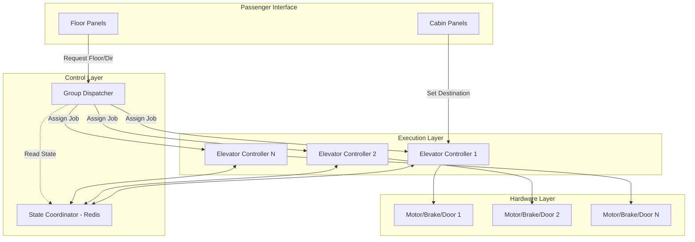

# Solution Guide: Advanced Elevator Group Control System

## 1. Requirements & System Constraints

The goal is to design a group control system (GCS) that manages a fleet of elevators in a high-rise building to optimize passenger throughput, minimize average wait times, and reduce energy consumption.

### 1.1 Functional Requirements
*   **Request Handling**:
    *   **External Call**: Passengers press "Up" or "Down" buttons at a floor.
    *   **Internal Call**: Passengers select a destination floor inside the cabin.
*   **Dispatching Logic**: The system must intelligently assign an elevator to an external call based on proximity, direction, and current load.
*   **Group Optimization**: 
    *   Minimize Average Wait Time (AWT).
    *   Minimize Average Time to Destination (ATD).
*   **Capacity Management**: Elevators should stop accepting calls if they reach weight capacity (overload sensor).
*   **Special Modes**:
    *   **Emergency Mode**: Fire alarm triggers all elevators to descend to the ground floor and open doors.
    *   **VIP/Service Mode**: Dedicated elevator for priority access.
    *   **Maintenance Mode**: Ability to take a specific elevator offline.
    *   **Energy Saving**: Elevators park at strategic floors during low-traffic periods.
*   **Zoning**: Ability to divide a building into zones (e.g., Floors 1-20 served by Group A, 21-40 by Group B).

### 1.2 Non-Functional Requirements
*   **Reliability & Safety**: The system must be fail-safe. Hardware interrupts must override software commands.
*   **Low Latency**: The dispatching decision must be made in milliseconds.
*   **High Availability**: The Group Controller should not be a single point of failure (SPOF).
*   **Scalability**: Support varying building heights (10 to 100+ floors) and group sizes (2 to 20+ elevators).

### 1.3 Constraints & Scale
*   **Typical Building**: 50 floors, 6-8 elevators.
*   **Peak Load**: Morning rush (all going up), Evening rush (all going down).
*   **Response Time**: $< 200\text{ms}$ for request processing.

---

## 2. High-Level Architecture

The system follows a hierarchical control pattern: **Group Controller $\rightarrow$ Elevator Controller $\rightarrow$ Actuators**.

### 2.1 Core Components
1.  **Group Dispatcher (The Brain)**: Implements the allocation algorithm. It maintains the global state of all elevators and pending requests.
2.  **Elevator Controller (The Executor)**: Manages the local state of a single cabin (current floor, direction, door status, weight).
3.  **Floor Panel Interface**: Handles inputs from the hall buttons and outputs to the floor displays.
4.  **Cabin Panel Interface**: Handles floor selections inside the elevator.
5.  **Safety Monitor**: A hard-wired subsystem that monitors door sensors, cable tension, and emergency stops.

### 2.2 Architecture Diagram (Mermaid)



### 2.3 Dispatching Algorithm: Cost-Based Allocation
Instead of a simple SCAN (Elevator) algorithm, we use a **Cost Function** to assign the "best" elevator $E$ for a request $R$:

$$\text{Cost}(E, R) = w_1 \cdot \text{Distance} + w_2 \cdot \text{StopCount} + w_3 \cdot \text{DirectionPenalty} + w_4 \cdot \text{LoadFactor}$$

*   **Distance**: Absolute difference between current floor and request floor.
*   **StopCount**: Number of existing stops the elevator must make before reaching $R$.
*   **DirectionPenalty**: High cost if the elevator is moving away from $R$.
*   **LoadFactor**: High cost if the elevator is nearly full.

---

## 3. Detailed Database Schema Design

Since elevator state changes every second, we use a hybrid approach: **Redis** for real-time state and **PostgreSQL** for configuration and auditing.

### 3.1 Real-Time State (Redis - Key-Value/Hash)
Redis is used for the "Current State of the World."
*   **Key**: `elevator:{id}` $\rightarrow$ **Value**: `{floor: 12, direction: UP, status: MOVING, load: 450kg, target_floors: [15, 20, 25]}`
*   **Key**: `floor_requests` $\rightarrow$ **Value**: `Sorted Set {floor: request_time}`

### 3.2 Persistent Store (PostgreSQL)
Used for auditing, maintenance logs, and building configuration.

#### Table: `elevators`
| Field | Type | Constraint | Description |
| :--- | :--- | :--- | :--- |
| `id` | UUID | PK | Unique elevator ID |
| `group_id` | UUID | FK | Reference to group |
| `max_capacity` | INT | NOT NULL | Max weight in kg |
| `status` | ENUM | NOT NULL | ACTIVE, MAINTENANCE, OUT_OF_SERVICE |
| `created_at` | TIMESTAMP | DEFAULT NOW() | Installation date |

#### Table: `floor_configs`
| Field | Type | Constraint | Description |
| :--- | :--- | :--- | :--- |
| `floor_number` | INT | PK | Floor index |
| `zone_id` | INT | INDEX | Zoning for group distribution |
| `is_emergency_exit`| BOOL | DEFAULT FALSE | Special floor properties |

#### Table: `request_logs` (Partitioned by Date)
| Field | Type | Constraint | Description |
| :--- | :--- | :--- | :--- |
| `request_id` | BIGINT | PK | Unique request ID |
| `floor` | INT | NOT NULL | Requesting floor |
| `direction` | ENUM | NOT NULL | UP, DOWN |
| `assigned_elevator`| UUID | FK | Which elevator took the call |
| `wait_time` | INT | - | Time from press to arrival (ms) |
| `timestamp` | TIMESTAMP | INDEX | For analytics |

---

## 4. Core API Design

The system uses a mix of REST for configuration and WebSockets for real-time updates.

### 4.1 External Call API
`POST /api/v1/requests`
*   **Payload**:
    ```json
    {
      "floor": 15,
      "direction": "UP",
      "timestamp": "2023-10-27T10:00:00Z"
    }
    ```
*   **Response**: `202 Accepted` (Dispatcher acknowledges and begins allocation).

### 4.2 Internal Destination API
`POST /api/v1/elevator/{id}/destination`
*   **Payload**:
    ```json
    {
      "destination_floor": 22
    }
    ```
*   **Response**: `200 OK` (Elevator adds floor to its internal queue).

### 4.3 System Status API
`GET /api/v1/status`
*   **Response**:
    ```json
    {
      "elevators": [
        { "id": "E1", "floor": 10, "direction": "UP", "load": "300kg", "stops": [12, 15] },
        { "id": "E2", "floor": 1, "direction": "IDLE", "load": "0kg", "stops": [] }
      ],
      "pending_requests": [ { "floor": 5, "direction": "DOWN" } ]
    }
    ```

---

## 5. Scalability & Advanced Topics

### 5.1 Fault Tolerance & High Availability
*   **Active-Passive Dispatchers**: Two Group Dispatchers run in parallel. The Passive one monitors a heartbeat from the Active one. If the heartbeat fails, the Passive takes over via a virtual IP (VIP).
*   **Local Intelligence**: If the Group Dispatcher fails entirely, Elevator Controllers fall back to a "Simple SCAN" mode, where they independently pick up requests from their current floor and direction.

### 5.2 Message Queues for Asynchronous Processing
To prevent the API from blocking during heavy traffic, a Message Queue (e.g., RabbitMQ/Kafka) is used:
`Floor Panel` $\rightarrow$ `Request API` $\rightarrow$ `Request Queue` $\rightarrow$ `Dispatcher` $\rightarrow$ `Elevator Controller`.

### 5.3 Traffic Pattern Optimization (Machine Learning)
*   **Predictive Parking**: Analyze historical data to identify patterns (e.g., 8:00 AM $\rightarrow$ Most people go from Floor 1 to 10-30). The system pre-positions elevators at the ground floor.
*   **Dynamic Zoning**: During peak hours, automatically shift Elevator E3 from Group B to Group A to handle higher demand.

### 5.4 Safety Interlocks (Hard-Wired)
The software cannot override safety sensors. If a "Door Obstructed" signal is received at the hardware level, the `Elevator Controller` is physically prevented from engaging the motor, regardless of the `Group Dispatcher` command.

---

## 6. Trade-off Analysis

### 6.1 CAP Theorem: Consistency vs. Availability
In this system, **Consistency (CP)** is prioritized over Availability. It is better for an elevator to stop moving for a second while resolving a state conflict than to move to the wrong floor or open doors between floors, which would be a critical safety failure.

### 6.2 Latency vs. Optimal Allocation
*   **Greedy Approach**: Assign the first available elevator. (Low latency, high AWT).
*   **Global Optimization**: Calculate costs for all elevators. (Slightly higher latency, low AWT).
*   **Decision**: We use the **Cost-Based Approach** because the computation time ($O(N)$ where $N$ is the number of elevators) is negligible compared to the mechanical travel time of the elevator.

### 6.3 Storage: SQL vs. NoSQL
*   **SQL**: Used for `elevators` and `floor_configs` because these require ACID properties and relational integrity (e.g., you cannot assign a request to a non-existent elevator).
*   **NoSQL (Redis)**: Used for the real-time state because the write-volume is extremely high (updates every few milliseconds as the elevator moves). Relational databases would suffer from lock contention.