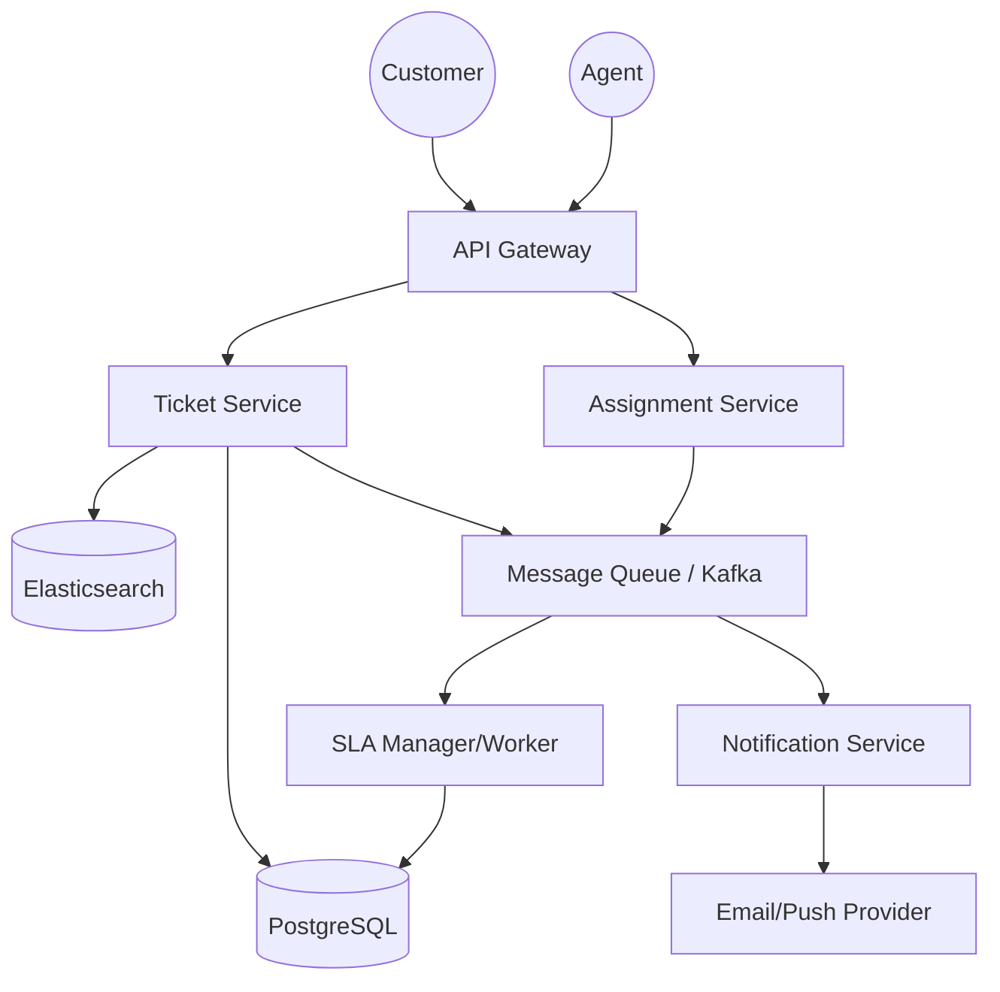

# Design Document: Ticket Resolution System

## 1. Requirements & System Constraints

### 1.1 Functional Requirements
*   **Ticket Lifecycle Management**: Users must be able to create tickets, update them, and view their status.
*   **Ticket Assignment**: 
    *   **Automatic**: Based on round-robin or skill-based routing.
    *   **Manual**: Admins or lead agents can assign tickets to specific agents.
*   **Communication**: Threaded comments/conversations between the customer and the agent.
*   **Prioritization & Categorization**: Tickets must be categorized (e.g., Billing, Technical, Feature Request) and assigned a priority (Low, Medium, High, Urgent).
*   **SLA Tracking**: Define Service Level Agreements (SLAs) based on priority (e.g., "High" priority must be responded to within 4 hours).
*   **Notifications**: Real-time alerts (Email/Push) when a ticket is created, assigned, or updated.
*   **Audit Trail**: Every change to a ticket (status change, assignee change) must be logged.

### 1.2 Non-Functional Requirements
*   **Availability**: The system must be highly available; users should always be able to submit tickets.
*   **Durability**: No ticket or comment should be lost once acknowledged.
*   **Auditability**: Complete history of ticket transitions for compliance and performance reviews.
*   **Scalability**: Must handle spikes in ticket volume (e.g., during a major service outage).
*   **Consistency**: Ticket assignment must be consistent (avoiding "double-assignment" where two agents believe they own the same ticket).

### 1.3 Scale Estimations (High-Level)
*   **Daily Active Users (DAU)**: 100k customers, 1k agents.
*   **Ticket Volume**: 10k tickets/day.
*   **Comment Volume**: 50k comments/day.
*   **Read/Write Ratio**: Read-heavy (Customers checking status, Agents scanning queues).

---

## 2. High-Level Architecture

The system follows a microservices-oriented architecture to decouple the ticket management from the assignment logic and notification delivery.

### 2.1 Component Diagram


### 2.2 Core Component Interactions
1.  **Ticket Service**: Handles CRUD operations for tickets and comments. It publishes events to the Message Bus (e.g., `TICKET_CREATED`).
2.  **Assignment Service**: Listens for `TICKET_CREATED`. It evaluates the category and agent availability to assign the ticket and updates the `tickets` table.
3.  **SLA Manager**: A background worker that monitors tickets. If a ticket remains in `OPEN` status beyond the SLA threshold, it triggers an escalation event.
4.  **Search Index**: Asynchronously indexed from the DB to allow agents to search through thousands of historical tickets using keywords.

---

## 3. Detailed Database Schema Design

A Relational Database (PostgreSQL) is chosen because the system requires strong ACID properties for ticket state transitions and complex relational queries for reporting.

### 3.1 Tables

#### `users`
| Field | Type | Constraints | Description |
| :--- | :--- | :--- | :--- |
| `user_id` | UUID | PK | Unique identifier |
| `email` | VARCHAR | Unique, Index | User email |
| `role` | ENUM | NOT NULL | CUSTOMER, AGENT, ADMIN |
| `skill_set` | TEXT[] | - | Skills for routing (e.g., ['Java', 'Billing']) |
| `status` | ENUM | - | ACTIVE, AWAY, OFFLINE |

#### `tickets`
| Field | Type | Constraints | Description |
| :--- | :--- | :--- | :--- |
| `ticket_id` | UUID | PK | Unique identifier |
| `creator_id` | UUID | FK $\rightarrow$ users | User who raised the ticket |
| `assignee_id`| UUID | FK $\rightarrow$ users (Null) | Agent assigned to the ticket |
| `category_id`| UUID | FK $\rightarrow$ categories | Technical, Billing, etc. |
| `priority` | ENUM | NOT NULL | LOW, MEDIUM, HIGH, URGENT |
| `status` | ENUM | Index | OPEN, IN_PROGRESS, RESOLVED, CLOSED |
| `subject` | VARCHAR | NOT NULL | Brief summary |
| `description`| TEXT | NOT NULL | Detailed issue |
| `created_at` | TIMESTAMP | Index | Creation time |
| `updated_at` | TIMESTAMP | - | Last modification time |

#### `ticket_comments`
| Field | Type | Constraints | Description |
| :--- | :--- | :--- | :--- |
| `comment_id` | UUID | PK | Unique identifier |
| `ticket_id` | UUID | FK $\rightarrow$ tickets | Link to ticket |
| `user_id` | UUID | FK $\rightarrow$ users | Author of the comment |
| `body` | TEXT | NOT NULL | The message content |
| `is_internal`| BOOLEAN | DEFAULT False | Internal note (invisible to customer) |
| `created_at` | TIMESTAMP | - | Time of posting |

#### `ticket_audit_log`
| Field | Type | Constraints | Description |
| :--- | :--- | :--- | :--- |
| `log_id` | BIGINT | PK | Auto-increment |
| `ticket_id` | UUID | FK $\rightarrow$ tickets | Link to ticket |
| `changed_by` | UUID | FK $\rightarrow$ users | Who made the change |
| `field_name` | VARCHAR | - | e.g., "status", "assignee_id" |
| `old_value` | TEXT | - | Previous value |
| `new_value` | TEXT | - | Updated value |
| `timestamp` | TIMESTAMP | - | Time of change |

#### `sla_policies`
| Field | Type | Constraints | Description |
| :--- | :--- | :--- | :--- |
| `policy_id` | UUID | PK | Unique identifier |
| `category_id`| UUID | FK $\rightarrow$ categories | Link to category |
| `priority` | ENUM | - | Priority level |
| `resolution_time_hrs`| INT | - | Max hours to resolve |
| `response_time_hrs` | INT | - | Max hours for first response |

### 3.2 Indexing Strategy
*   **B-Tree Index** on `tickets(status, created_at)`: For agents to fetch the oldest open tickets.
*   **B-Tree Index** on `tickets(assignee_id)`: To fetch all tickets assigned to a specific agent.
*   **Full-Text Search Index (Elasticsearch)**: On `tickets(subject, description)` and `ticket_comments(body)`.

---

## 4. Core API Design

### 4.1 Ticket Operations
**Create Ticket**
`POST /api/v1/tickets`
```json
{
  "subject": "Cannot access payment gateway",
  "description": "Receiving 500 error on checkout page since 10 AM.",
  "category_id": "cat-123",
  "priority": "HIGH"
}
```
$\rightarrow$ `201 Created` | `{ "ticket_id": "tkt-999", "status": "OPEN" }`

**Update Ticket Status/Assignee**
`PATCH /api/v1/tickets/{ticket_id}`
```json
{
  "status": "IN_PROGRESS",
  "assignee_id": "agent-456"
}
```
$\rightarrow$ `200 OK`

**Add Comment**
`POST /api/v1/tickets/{ticket_id}/comments`
```json
{
  "body": "I have checked the logs and it seems to be a DB connection timeout.",
  "is_internal": true
}
```
$\rightarrow$ `201 Created`

### 4.2 Agent Operations
**Fetch Agent Queue**
`GET /api/v1/agent/tickets?status=OPEN&sort=created_at_asc`
$\rightarrow$ `200 OK` | `[ { "ticket_id": "...", "subject": "..." }, ... ]`

---

## 5. Scalability & Advanced Topics

### 5.1 Assignment Logic (The "Brain")
To avoid race conditions when assigning tickets:
*   **Distributed Locking**: Use Redis (Redlock) to ensure a ticket is not assigned to two agents simultaneously.
*   **Skill-Based Routing**: The `AssignmentSvc` queries for agents who have the required `skill_set` for the ticket's `category_id` and are currently `ACTIVE`.
*   **Round-Robin**: Maintain a pointer/counter in Redis per category to distribute tickets evenly.

### 5.2 SLA Management & Escalation
*   **Delayed Queues**: When a ticket is created, the SLA Manager schedules a check event in a delayed queue (e.g., RabbitMQ TTL or Temporal workflow) for the `response_time_hrs` duration.
*   **Polling/Scanning**: A cron job scans for tickets where `status != RESOLVED` and `updated_at < (now - SLA_duration)`.

### 5.3 Caching Strategy
*   **User Profiles**: Cache agent status and skill sets in Redis.
*   **Read-Through Cache**: Cache the most recently viewed tickets for a specific user to reduce DB load.

### 5.4 Fault Tolerance
*   **Dead Letter Queues (DLQ)**: If the Notification Service fails to send an email, the message is moved to a DLQ for retry.
*   **Database Read Replicas**: Use read replicas for reporting dashboards and history views to keep the primary DB performant for writes.

---

## 6. Trade-off Analysis

| Trade-off | Decision | Reasoning |
| :--- | :--- | :--- |
| **SQL vs NoSQL** | **SQL (PostgreSQL)** | Ticket systems are highly relational. Strong consistency is required for status changes and audit logs. Joins are necessary for complex agent reporting. |
| **Sync vs Async Assignment** | **Async (via Queue)** | Assigning a ticket might involve complex logic (calculating agent load, skill matching). Doing this synchronously would increase API latency for the customer. |
| **Consistency vs Availability** | **Consistency (CP)** | In ticket assignment, it is better to have a slight delay in assignment than to have two agents conflict on the same ticket, leading to duplicate work and customer confusion. |
| **Search: DB vs Elasticsearch** | **Elasticsearch** | SQL `LIKE` queries are too slow for large volumes of unstructured text in descriptions and comments. External indexing allows for fuzzy search and better performance. |
| **Audit Log: Table vs JSONB** | **Dedicated Table** | While JSONB is flexible, a structured audit table allows for easier querying of "Who changed X to Y" across the entire system for performance analytics. |