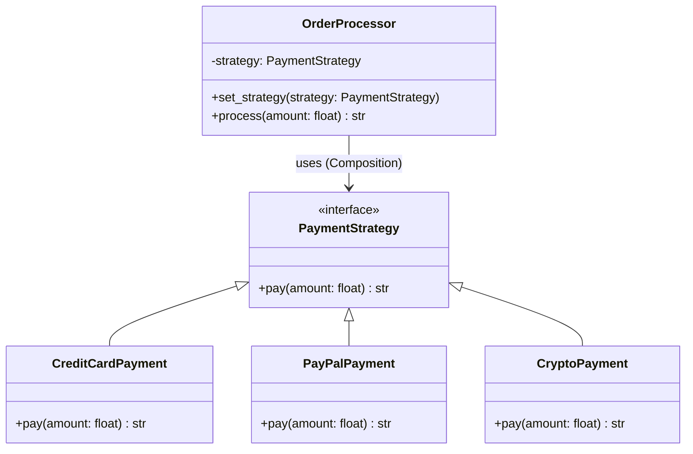

# Strategy Pattern LLD: Dynamic Payment Billing Integrations

The **Strategy Pattern** is a behavioral design pattern that enables selecting an algorithm's implementation at runtime. Instead of implementing a single algorithm directly inside a class (which leads to massive conditional statements), the Strategy pattern defines a family of algorithms, encapsulates each one, and makes them interchangeable.

In the context of **Payment Billing Integrations**, this allows a system to support various payment methods (Credit Card, PayPal, Bitcoin, etc.) without altering the core order processing logic.

---

## 1. Overview & System Requirements

### Core Objective
The system must process payments for orders. Since different users prefer different payment methods, the system must be flexible enough to switch the payment logic dynamically without modifying the `OrderProcessor` class.

### Functional Requirements
- **Dynamic Selection**: The system must allow the user/client to choose a payment method at runtime.
- **Extensibility**: Adding a new payment method (e.g., Apple Pay) should not require changes to existing business logic.
- **Encapsulation**: The specific details of how a payment is processed (API keys, encryption, vendor-specific logic) should be hidden from the order processor.

### Actors
- **Client**: The application layer that decides which payment method to use.
- **Context (`OrderProcessor`)**: The class that maintains a reference to a strategy and delegates the work to it.
- **Strategy (`PaymentStrategy`)**: The interface common to all supported algorithms.
- **Concrete Strategies**: The actual implementations of the payment algorithms.

---

## 2. Design Principles & Patterns

The Strategy Pattern is a masterclass in applying **SOLID** principles:

| Principle | Application in Strategy Pattern | Problem Solved |
| :--- | :--- | :--- |
| **Open/Closed Principle (OCP)** | New payment methods can be added by creating new classes without modifying `OrderProcessor`. | Prevents "Regression Bugs" caused by editing a huge `if/else` block every time a new feature is added. |
| **Single Responsibility (SRP)** | `OrderProcessor` handles order flow; `CreditCardPayment` handles credit card logic. | Prevents the "God Class" anti-pattern where one class knows too much about every single payment vendor. |
| **Dependency Inversion (DIP)** | `OrderProcessor` depends on the `PaymentStrategy` abstraction, not concrete classes. | Decouples high-level policy from low-level implementation details. |
| **Composition over Inheritance** | The Context *has a* strategy rather than *being a* specific type of processor. | Avoids rigid class hierarchies and "class explosion." |

---

## 3. Class Structure & Relationships

### Relationship Diagram


### Key Components
1. **Strategy Interface**: Defines the `pay()` method. Every concrete strategy must implement this.
2. **Concrete Strategies**: `CreditCardPayment`, `PayPalPayment`, etc. These contain the actual vendor-specific logic.
3. **Context**: `OrderProcessor`. It holds a reference to a `PaymentStrategy` object. It doesn't know *which* strategy it has; it only knows that the strategy can `pay()`.

---

## 4. Step-by-Step Logic & Code Walkthrough

### Implementation

```python
from abc import ABC, abstractmethod

# 1. Strategy Interface
class PaymentStrategy(ABC):
    @abstractmethod
    def pay(self, amount: float) -> str:
        """Abstract method to be implemented by all concrete strategies."""
        pass

# 2. Concrete Strategy A: Credit Card
class CreditCardPayment(PaymentStrategy):
    def __init__(self, card_number: str, cvv: str):
        self.card_number = card_number
        self.cvv = cvv

    def pay(self, amount: float) -> str:
        # In a real system, this would call a Stripe/Braintree API
        return f"Paid {amount} using Credit Card (Card: {self.card_number[-4:]})"

# 3. Concrete Strategy B: PayPal
class PayPalPayment(PaymentStrategy):
    def __init__(self, email: str):
        self.email = email

    def pay(self, amount: float) -> str:
        # In a real system, this would redirect to PayPal OAuth
        return f"Paid {amount} using PayPal (Email: {self.email})"

# 4. Concrete Strategy C: Crypto (Added for Extensibility Demo)
class CryptoPayment(PaymentStrategy):
    def __init__(self, wallet_address: str):
        self.wallet_address = wallet_address

    def pay(self, amount: float) -> str:
        return f"Paid {amount} using Bitcoin (Wallet: {self.wallet_address[:8]}...)"

# 5. Context: OrderProcessor
class OrderProcessor:
    def __init__(self, strategy: PaymentStrategy = None):
        self._strategy = strategy

    def set_strategy(self, strategy: PaymentStrategy):
        """Allows changing the payment method at runtime."""
        self._strategy = strategy

    def process(self, amount: float) -> str:
        if not self._strategy:
            raise ValueError("Payment strategy not set!")
        
        # Delegation: The context delegates the work to the strategy object
        return self._strategy.pay(amount)

# --- Client Code ---
if __name__ == "__main__":
    # User chooses Credit Card initially
    cc_payment = CreditCardPayment("1234-5678-9012-3456", "123")
    processor = OrderProcessor(cc_payment)
    print(processor.process(100.0))  # Output: Paid 100.0 using Credit Card (Card: 3456)

    # User decides to switch to PayPal at checkout
    pp_payment = PayPalPayment("user@example.com")
    processor.set_strategy(pp_payment)
    print(processor.process(250.0))  # Output: Paid 250.0 using PayPal (Email: user@example.com)
```

### Logic Walkthrough
1. **Initialization**: The `OrderProcessor` is initialized. It doesn't contain logic for "how" to pay; it only contains a slot for a `PaymentStrategy`.
2. **Strategy Injection**: The client creates a concrete object (e.g., `PayPalPayment`) and passes it to the processor.
3. **Delegation**: When `processor.process(amount)` is called, the processor doesn't execute the payment. Instead, it calls `self._strategy.pay(amount)`. 
4. **Polymorphism**: Because all strategies inherit from `PaymentStrategy`, Python calls the implementation belonging to the currently active object.
5. **Dynamic Switching**: By calling `set_strategy()`, we swap the behavior of the `OrderProcessor` instantly without reinstantiating the processor.

---

## 5. Complexity & Real-World Applications

### Complexity Analysis

| Operation | Time Complexity | Space Complexity | Note |
| :--- | :--- | :--- | :--- |
| **Switching Strategy** | $O(1)$ | $O(1)$ | Simple pointer assignment. |
| **Executing Payment** | $O(1)$ | $O(1)$ | Direct method call via polymorphism. |
| **Adding New Strategy** | $O(1)$ | $O(1)$ | No change to existing code; only a new class. |

### Real-World Applications

1. **Payment Gateways**: This is the textbook example. Switching between Stripe, PayPal, Square, and Adyen based on the user's country or currency.
2. **Compression Tools**: A file archiver that can switch between `ZipCompressionStrategy`, `RarCompressionStrategy`, and `GZipCompressionStrategy`.
3. **Sorting Algorithms**: A data processing library that chooses `QuickSort` for small datasets and `MergeSort` for massive datasets to optimize performance.
4. **Validation Frameworks**: A form validator that applies different rules (`EmailValidationStrategy`, `PhoneNumberValidationStrategy`) depending on the input field type.
5. **Logging Systems**: Switching output targets (Console, File, Database, CloudWatch) using different logging strategies.