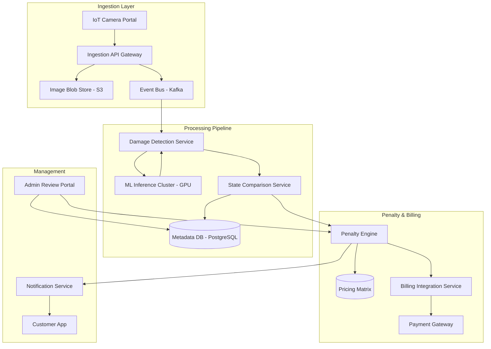

# System Design: Automated Vehicle Damage Auto-Penalty Pipeline

## 1. Requirements & System Constraints

### 1.1 Functional Requirements
*   **Image/Video Ingestion:** The system must ingest high-resolution images or video streams from vehicle entry/exit portals.
*   **Automated Damage Detection:** Use Computer Vision (CV) to identify damages (scratches, dents, cracks, broken glass).
*   **State Comparison:** Compare the "Post-trip" state against the "Pre-trip" baseline to identify *new* damage.
*   **Penalty Calculation:** Map detected damages to a predefined pricing matrix to calculate a financial penalty.
*   **Automated Billing:** Integrate with a payment gateway to trigger charges.
*   **Human-in-the-Loop (HITL):** Provide a dashboard for administrators to review, override, or approve penalties in case of disputes.
*   **Notification:** Alert the user via Push/Email/SMS regarding the detected damage and the associated charge.

### 1.2 Non-Functional Requirements
*   **High Availability:** The ingestion system must be 99.99% available to avoid blocking vehicle movement at portals.
*   **Scalability:** Support thousands of portals globally and millions of vehicle inspections per day.
*   **Eventual Consistency:** While image ingestion must be fast, the penalty calculation can be asynchronous (processed within minutes).
*   **Durability:** Images must be stored securely for legal and dispute purposes (audit trail).
*   **Accuracy:** Low False Positive Rate (FPR) is critical to avoid customer dissatisfaction.

### 1.3 Scale Estimations (HLD)
*   **Daily Volume:** 1 Million inspections/day.
*   **Images per Inspection:** ~10-20 high-res images.
*   **Storage:** $10^6 \text{ inspections} \times 15 \text{ images} \times 5\text{MB/image} \approx 75\text{TB/day}$.
*   **Peak Load:** 10x average during morning/evening rush hours.

---

## 2. High-Level Architecture

The system follows an event-driven, microservices-based architecture to decouple the heavy compute load (AI inference) from the ingestion and billing processes.

### 2.1 Architecture Diagram



### 2.2 Component Interactions
1.  **Ingestion:** The Portal uploads images to S3 and sends a metadata event (VehicleID, TripID, Timestamp) to Kafka.
2.  **Detection:** The `Damage Detection Service` consumes the event, pulls images from S3, and runs them through an ML model to identify damage coordinates and types.
3.  **Comparison:** The `Comparison Service` fetches the baseline (pre-trip) damage records from the DB. It filters out pre-existing damage, leaving only "New Damage."
4.  **Penalization:** The `Penalty Engine` maps "New Damage" (e.g., "Front Bumper Scratch - Medium") to a dollar value using the `Pricing Matrix`.
5.  **Closing the Loop:** The `Billing Service` processes the payment, and the `Notification Service` alerts the user.

---

## 3. Detailed Database Schema Design

We use a hybrid approach: **PostgreSQL** for relational metadata (strong consistency for billing/state) and **S3** for unstructured image data.

### 3.1 Relational Schema (PostgreSQL)

#### Table: `vehicles`
| Field | Type | Constraints | Description |
| :--- | :--- | :--- | :--- |
| `vehicle_id` | UUID | PK | Unique identifier |
| `vin` | VARCHAR(17) | Unique, Index | Vehicle Identification Number |
| `model_id` | UUID | FK | Reference to vehicle model specs |

#### Table: `inspections`
| Field | Type | Constraints | Description |
| :--- | :--- | :--- | :--- |
| `inspection_id` | UUID | PK | Unique identifier |
| `vehicle_id` | UUID | FK, Index | Reference to vehicle |
| `trip_id` | UUID | Index | Link to the rental/trip session |
| `type` | ENUM | PRE_TRIP, POST_TRIP | Stage of inspection |
| `timestamp` | TIMESTAMPTZ | Index | When the inspection occurred |
| `s3_folder_path`| TEXT | - | Path to images in S3 |

#### Table: `damage_records`
| Field | Type | Constraints | Description |
| :--- | :--- | :--- | :--- |
| `damage_id` | UUID | PK | Unique identifier |
| `inspection_id` | UUID | FK, Index | Reference to inspection |
| `damage_type` | VARCHAR(50) | - | e.g., 'dent', 'scratch', 'crack' |
| `severity` | ENUM | LOW, MED, HIGH | Impact level |
| `location` | VARCHAR(50) | - | e.g., 'left_door', 'windshield' |
| `confidence` | FLOAT | - | ML confidence score (0.0 - 1.0) |
| `bbox` | JSONB | - | Bounding box coordinates [x, y, w, h] |

#### Table: `penalties`
| Field | Type | Constraints | Description |
| :--- | :--- | :--- | :--- |
| `penalty_id` | UUID | PK | Unique identifier |
| `damage_id` | UUID | FK, Unique | Reference to specific damage |
| `amount` | DECIMAL(10,2)| - | Calculated penalty amount |
| `status` | ENUM | PENDING, PAID, DISPUTED, VOID | Payment status |
| `created_at` | TIMESTAMPTZ | - | Record creation time |

### 3.2 Indexing Strategy
*   **B-Tree Index on `vehicle_id` & `trip_id`**: To quickly retrieve the pre-trip state for a specific vehicle during post-trip processing.
*   **B-Tree Index on `timestamp`**: For auditing and reporting.
*   **GIN Index on `damage_records.bbox` (Optional)**: If spatial queries are needed for heatmaps of vehicle damage.

---

## 4. Core API Design

### 4.1 Ingestion API
`POST /v1/inspections`
*   **Payload:**
    ```json
    {
      "vehicle_id": "uuid-123",
      "trip_id": "trip-456",
      "type": "POST_TRIP",
      "images": [
        {"image_id": "img_1", "url": "s3://bucket/path/1.jpg"},
        {"image_id": "img_2", "url": "s3://bucket/path/2.jpg"}
      ],
      "metadata": { "portal_id": "portal_nyc_01", "timestamp": "2023-10-01T10:00:00Z" }
    }
    ```
*   **Response:** `202 Accepted` (Processing is async).

### 4.2 Penalty Management API (Admin/User)
`GET /v1/penalties/{penalty_id}`
*   **Response:**
    ```json
    {
      "penalty_id": "pen-789",
      "amount": 150.00,
      "status": "PENDING",
      "evidence": {
        "pre_trip_image": "s3://.../pre.jpg",
        "post_trip_image": "s3://.../post.jpg",
        "damage_type": "dent",
        "location": "rear_bumper"
      }
    }
    ```

`PATCH /v1/penalties/{penalty_id}/status`
*   **Payload:** `{"status": "VOID", "reason": "Customer provided proof of pre-existing damage"}`
*   **Response:** `200 OK`.

---

## 5. Scalability & Advanced Topics

### 5.1 ML Pipeline Optimization
*   **GPU Batching:** Instead of processing one image at a time, the `Damage Detection Service` should group images into batches to maximize GPU throughput.
*   **Model Tiering:** Use a lightweight "Screening Model" (e.g., MobileNet) to check if *any* damage exists. Only trigger the "Heavy Model" (e.g., Mask R-CNN or ViT) if damage is suspected.

### 5.2 Handling Large Data Volume
*   **S3 Lifecycle Policies:** Move images to *S3 Intelligent-Tiering* or *Glacier* after 90 days, as they are rarely accessed unless a dispute is raised.
*   **Database Sharding:** Shard the `inspections` and `damage_records` tables by `vehicle_id` or `trip_id` to distribute load across multiple PostgreSQL instances.

### 5.3 Fault Tolerance & Reliability
*   **Dead Letter Queues (DLQ):** If the ML service fails to process an image after 3 retries, move the message to a DLQ for manual inspection or system debugging.
*   **Idempotency:** Use `trip_id` as an idempotency key in the Billing Service to ensure a customer isn't charged twice for the same damage.
*   **Circuit Breaker:** Implement a circuit breaker (e.g., Resilience4j) on the Payment Gateway integration to prevent system cascading failure if the gateway is down.

### 5.4 Caching Strategy
*   **Redis:** Cache the `Pricing Matrix` (small, read-heavy) to avoid frequent DB lookups during penalty calculation.
*   **CDN:** Use a CDN (CloudFront) for serving evidence images to the Admin Review Portal to reduce latency.

---

## 6. Trade-off Analysis

### 6.1 CAP Theorem Priorities
The system prioritizes **Availability** and **Partition Tolerance** (AP) during the ingestion phase. It is more important that the vehicle clears the portal than for the penalty to be calculated in real-time. We accept **Eventual Consistency** for the penalty state.

### 6.2 Latency vs. Accuracy
*   **Trade-off:** Higher accuracy in CV requires larger models (Transformers/Deep CNNs) which increase inference latency.
*   **Decision:** We move inference to an asynchronous background pipeline. This removes the latency from the user's critical path (exiting the parking lot) while allowing us to use the most accurate, compute-heavy models.

### 6.3 SQL vs. NoSQL
*   **Decision:** SQL (PostgreSQL) was chosen over NoSQL (MongoDB).
*   **Reasoning:** The relationship between Vehicle $\rightarrow$ Inspection $\rightarrow$ Damage $\rightarrow$ Penalty is highly relational. Financial transactions require ACID compliance to ensure that a penalty is never "lost" or "double-counted," which is more naturally handled by a relational database.