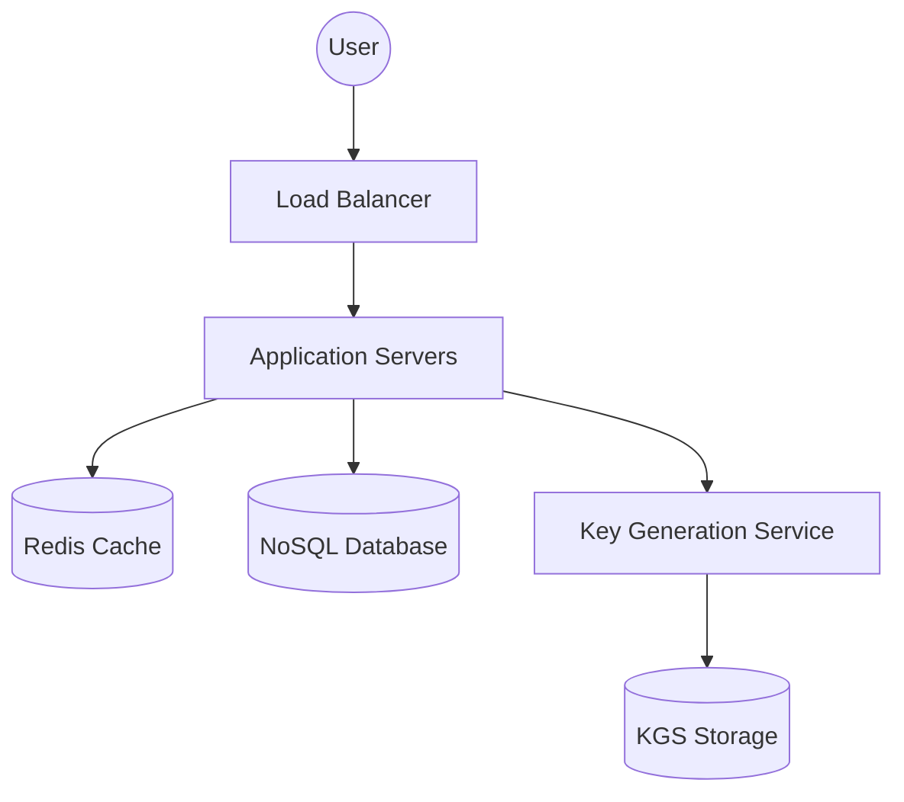

# System Design Document: High-Scale URL Shortener (TinyURL)

## 1. Requirements & System Constraints

### 1.1 Functional Requirements
*   **URL Shortening**: The system should take a long URL and return a unique, shorter alias.
*   **Redirection**: When a user accesses the short URL, the system should redirect them to the original long URL with minimum latency.
*   **Custom Aliases**: Users should be able to provide a custom string for their short URL.
*   **Expiration**: URLs should have an optional expiration date after which the link becomes invalid.
*   **Analytics**: (Optional/Bonus) Track the number of clicks and basic geographic data for the URLs.

### 1.2 Non-Functional Requirements
*   **High Availability**: The redirection service must be available 24/7; downtime directly impacts user experience.
*   **Low Latency**: Redirection should happen in milliseconds.
*   **Scalability**: The system must handle a massive volume of reads (redirections) and a steady stream of writes (shortening).
*   **Uniqueness**: No two different long URLs should map to the same short URL unless intended.
*   **Predictability**: The short URL should be non-guessable to prevent "scraping" of the database.

### 1.3 Scale Estimations
*   **Traffic Volume**:
    *   New URLs created: 100 Million per month.
    *   Read/Write Ratio: 100:1 (Redirection is far more common than creation).
    *   Total Reads: $100\text{M} \times 100 = 10\text{B}$ redirections per month.
*   **QPS (Queries Per Second)**:
    *   Write QPS: $100\text{M} / (30 \times 24 \times 3600) \approx 40 \text{ req/sec}$.
    *   Read QPS: $10\text{B} / (30 \times 24 \times 3600) \approx 3,800 \text{ req/sec}$.
*   **Storage**:
    *   Assume 5 years of data retention.
    *   Total records: $100\text{M} \times 12 \times 5 = 6\text{B}$ records.
    *   Avg record size: $\sim 500$ bytes (Long URL, short URL, metadata).
    *   Total storage: $6\text{B} \times 500\text{B} \approx 3\text{TB}$.

---

## 2. High-Level Architecture

### 2.1 Core Components
1.  **Load Balancer**: Distributes incoming traffic across multiple application servers.
2.  **API Gateway/App Servers**: Handles the business logic for shortening and redirection.
3.  **Key Generation Service (KGS)**: A dedicated service to provide unique, pre-generated IDs to avoid collisions and database checks during the write path.
4.  **Caching Layer (Redis)**: Stores frequently accessed URL mappings to reduce database load.
5.  **Database**: Stores the mapping between short keys and long URLs.

### 2.2 Architecture Diagram



### 2.3 Sequence Flow
**Write Path (Shortening):**
1. Client sends a `POST` request with the `longUrl`.
2. App server requests a unique key from the **KGS**.
3. App server stores the mapping `{shortKey: longUrl}` in the **Database**.
4. App server returns the short URL to the client.

**Read Path (Redirection):**
1. Client hits `GET /{shortKey}`.
2. App server checks the **Cache**. If hit, it returns the `longUrl`.
3. If cache miss, App server queries the **Database**.
4. App server updates the cache and returns a `302 Found` redirect to the `longUrl`.

---

## 3. Detailed Database Schema Design

### 3.1 Storage Choice: NoSQL vs SQL
For this use case, a **NoSQL Key-Value or Wide-Column store** (e.g., DynamoDB, Cassandra) is preferred over RDBMS for the following reasons:
*   **Scalability**: NoSQL scales horizontally more easily to handle billions of records.
*   **Simple Access Pattern**: The primary operation is a simple key-lookup.
*   **Availability**: NoSQL databases typically offer better availability and partition tolerance (AP in CAP).

### 3.2 Table Design: `url_mapping`

| Field | Type | Constraint | Description |
| :--- | :--- | :--- | :--- |
| `short_key` | String (PK) | Unique, Indexed | The Base62 encoded unique ID |
| `long_url` | String | Not Null | The original destination URL |
| `user_id` | String | Indexed | Reference to the creator |
| `created_at` | Timestamp | Not Null | Creation date for cleanup |
| `expires_at` | Timestamp | Indexed | Expiration date for TTL |

**Indexing Strategy**:
*   Primary Key on `short_key` for $\mathcal{O}(1)$ lookup.
*   Secondary index on `expires_at` to facilitate a background cleanup job for expired links.

---

## 4. Core API Design

### 4.1 Create Short URL
`POST /api/v1/shorten`

**Request Body:**
```json
{
  "longUrl": "https://www.example.com/very/long/path/to/resource",
  "customAlias": "my-promo-link", 
  "expireAt": "2025-12-31T23:59:59Z"
}
```

**Response (201 Created):**
```json
{
  "shortUrl": "https://tiny.url/aB12c3D",
  "createdAt": "2023-10-01T10:00:00Z"
}
```

### 4.2 Redirect to Long URL
`GET /{shortKey}`

**Response:**
*   **Success**: `302 Found` (Temporary Redirect) $\rightarrow$ Header `Location: https://www.example.com/...`
*   **Not Found**: `404 Not Found`
*   **Expired**: `410 Gone`

---

## 5. Scalability & Advanced Topics

### 5.1 Key Generation Service (KGS)
To avoid generating the same key and checking the database (which would add latency), we use a KGS:
*   **Algorithm**: Use a 64-bit counter $\rightarrow$ Convert to **Base62** (`[a-z, A-Z, 0-9]`). A 7-character string provides $62^7 \approx 3.5 \text{ Trillion}$ unique combinations.
*   **Pre-generation**: KGS pre-generates keys and stores them in a table.
*   **Buffering**: To prevent the KGS from becoming a bottleneck, App Servers load a "chunk" of keys (e.g., 1,000 keys) into local memory.

### 5.2 Caching Strategy
*   **Cache Policy**: Use an **LRU (Least Recently Used)** eviction policy.
*   **Data Store**: Redis.
*   **Optimization**: Since the read/write ratio is 100:1, caching the top 20% of "hot" URLs will likely handle 80% of the traffic (Pareto Principle).

### 5.3 Partitioning & Sharding
If the database grows beyond a single node's capacity:
*   **Hash-based Partitioning**: Partition the data based on the hash of the `short_key`. This ensures a uniform distribution of requests across shards.
*   **Range-based Partitioning**: Not recommended here as it can lead to "hotspots" if certain key ranges are more popular.

### 5.4 Rate Limiting
To prevent abuse (e.g., a bot creating millions of URLs):
*   Implement a **Token Bucket** or **Leaky Bucket** algorithm.
*   Limit by `user_id` or `IP address`.

---

## 6. Trade-off Analysis

### 6.1 CAP Theorem
In the context of the CAP Theorem, this system prioritizes **Availability** and **Partition Tolerance (AP)**.
*   **Reasoning**: If a database node goes down or a network partition occurs, it is better to serve a slightly stale redirect (or a temporary error for a brand new link) than to bring down the entire redirection engine.

### 6.2 Redirect Status Codes: 301 vs 302
*   **301 (Permanent Redirect)**: Browsers cache the destination. This reduces load on our servers but removes our ability to track analytics (clicks) for subsequent visits.
*   **302 (Temporary Redirect)**: Every request hits our server. This allows for precise analytics and the ability to change the destination URL later.
*   **Decision**: Use **302** to support the "Analytics" functional requirement.

### 6.3 Storage vs Latency
By introducing the KGS and Redis Cache, we increase the system's architectural complexity (more moving parts) and storage overhead (pre-generated keys). However, this significantly reduces the write-path latency (no DB check for collision) and read-path latency (avoiding DB hits for hot URLs).