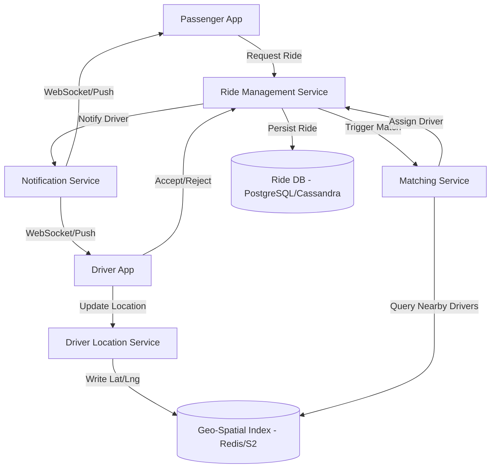

# System Design: Ride-Sharing Dispatch & Matching Service

## 1. Requirements & System Constraints

### 1.1 Functional Requirements
*   **Driver Location Updates:** Drivers must be able to send their real-time GPS coordinates to the system frequently (e.g., every 3-5 seconds).
*   **Ride Request:** Passengers can request a ride by providing their current location and destination.
*   **Matching Logic:** The system must find the "best" available driver based on proximity and availability.
*   **Dispatch Process:** The system notifies a driver of a ride request. The driver can accept or reject the request.
*   **Ride Lifecycle:** Track ride states from `REQUESTED` $\rightarrow$ `MATCHED` $\rightarrow$ `ARRIVED` $\rightarrow$ `IN_PROGRESS` $\rightarrow$ `COMPLETED`.

### 1.2 Non-Functional Requirements
*   **Low Latency:** Matching and dispatching must happen in near real-time (< 2 seconds).
*   **High Availability:** The system must be available 24/7; a downtime means lost revenue and stranded users.
*   **Scalability:** Must handle millions of concurrent drivers and passengers across multiple global cities.
*   **Consistency:** Strict consistency for the matching process to ensure a driver is not assigned to two rides simultaneously.

### 1.3 Scale Estimations (HLD)
*   **Active Drivers:** 1 Million.
*   **Location Updates:** 1M drivers updating every 3 seconds $\approx$ 333k writes/sec.
*   **Ride Requests:** ~100k requests per minute $\approx$ 1.6k requests/sec.
*   **Data Volume:** Location data is ephemeral, but ride history is permanent. Ride history grows linearly with usage.

---

## 2. High-Level Architecture

The system adopts a microservices architecture to decouple high-write location ingestion from the complex matching logic.

### 2.1 Core Components
1.  **Driver Location Service:** Handles high-frequency GPS pings. It updates a fast, geo-spatial index.
2.  **Ride Management Service:** Manages the lifecycle of a ride request (creation, state transitions).
3.  **Matching Service:** The "Brain." It queries the Location Service for nearby drivers and applies the matching algorithm.
4.  **Dispatch/Notification Service:** Manages real-time communication with drivers and passengers via WebSockets or Push Notifications.
5.  **Geo-Index (Redis/S2):** A specialized storage for spatial queries to find drivers within a specific radius.

### 2.2 Architecture Diagram



---

## 3. Detailed Database Schema Design

### 3.1 Storage Strategy
*   **Ephemeral Data (Location):** Redis is used for driver locations because the data changes every few seconds and we only care about the *current* state.
*   **Persistent Data (User/Ride):** A relational database (PostgreSQL) is used for ride records and user profiles to ensure ACID compliance for billing and trip history.

### 3.2 Schema

#### Table: `drivers` (SQL)
| Field | Type | Constraints | Note |
| :--- | :--- | :--- | :--- |
| `driver_id` | UUID | PK | Unique Driver ID |
| `name` | VARCHAR | NOT NULL | |
| `status` | ENUM | NOT NULL | `ONLINE`, `OFFLINE`, `BUSY` |
| `rating` | FLOAT | | |
| `city_id` | INT | FK | For regional partitioning |

#### Table: `rides` (SQL)
| Field | Type | Constraints | Note |
| :--- | :--- | :--- | :--- |
| `ride_id` | UUID | PK | Unique Ride ID |
| `passenger_id`| UUID | FK | |
| `driver_id` | UUID | FK, Nullable | Assigned driver |
| `pickup_loc` | Point | NOT NULL | PostGIS Point (lat, lng) |
| `dropoff_loc`| Point | NOT NULL | PostGIS Point (lat, lng) |
| `status` | ENUM | NOT NULL | `REQUESTED`, `MATCHED`, `COMPLETED`, etc. |
| `created_at` | Timestamp| NOT NULL | |

#### Geo-Spatial Index (Redis)
*   **Structure:** `GEOADD` (Sorted Set)
*   **Key:** `drivers:locations:{city_id}`
*   **Member:** `driver_id`
*   **Score:** `longitude, latitude`
*   **Query:** `GEORADIUS` or `GEOSEARCH` to find drivers within $X$ km.

---

## 4. Core API Design

### 4.1 Driver Location Update
`PATCH /v1/driver/location`
**Payload:**
```json
{
  "driver_id": "d-123",
  "latitude": 40.7128,
  "longitude": -74.0060,
  "timestamp": "2023-10-27T10:00:00Z"
}
```
**Response:** `204 No Content`

### 4.2 Request Ride
`POST /v1/ride/request`
**Payload:**
```json
{
  "passenger_id": "p-456",
  "pickup": {"lat": 40.7130, "lng": -74.0070},
  "destination": {"lat": 40.7580, "lng": -73.9855},
  "ride_type": "UberX"
}
```
**Response:** `201 Created`
```json
{
  "ride_id": "r-789",
  "status": "SEARCHING"
}
```

### 4.3 Accept Ride
`POST /v1/ride/accept`
**Payload:**
```json
{
  "ride_id": "r-789",
  "driver_id": "d-123"
}
```
**Response:** `200 OK` or `409 Conflict` (if ride already taken).

---

## 5. Scalability & Advanced Topics

### 5.1 Geo-Sharding (The S2/Geohash approach)
To avoid a single Redis instance becoming a bottleneck, we partition the world into cells.
*   **Google S2 Geometry:** Divides the earth into a hierarchy of cells. We can map each driver to a `CellID`.
*   **Partitioning:** Drivers in different cities or regions are stored in different Redis clusters. The Matching Service calculates the S2 cell of the passenger and queries the corresponding cluster.

### 5.2 Matching Algorithm (Greedy vs. Batching)
*   **Greedy Matching:** The first available driver within $X$ radius is picked. This is fast but can lead to sub-optimal global wait times.
*   **Batch Matching:** The system collects all requests and available drivers over a short window (e.g., 2-5 seconds) and solves a **Bipartite Matching Problem** (using the Hungarian Algorithm or Kuhn-Munkres) to minimize the total aggregate wait time for all passengers.

### 5.3 Handling High Write Volume
*   **Write-back Cache:** Driver locations are written to Redis. A background worker asynchronously persists sampled location data to a Cold Store (Cassandra/HBase) for historical analysis/dispute resolution.
*   **Load Balancing:** Use a Layer 7 Load Balancer (NGINX/Envoy) to distribute GPS pings across multiple instances of the Location Service.

### 5.4 Concurrency & Race Conditions
To prevent two drivers from accepting the same ride:
1.  **Optimistic Locking:** Use a version column in the `rides` table.
    `UPDATE rides SET driver_id = 'd-123', status = 'MATCHED' WHERE ride_id = 'r-789' AND driver_id IS NULL;`
2.  **Distributed Lock:** Use Redlock (Redis) to lock the `ride_id` for the duration of the acceptance processing.

---

## 6. Trade-off Analysis

| Trade-off | Choice | Reasoning |
| :--- | :--- | :--- |
| **Consistency vs Availability** | Availability for Location; Consistency for Matching | If a location update is lost, the next one arrives in 3s (Low impact). If a ride is double-booked, it's a terrible UX (High impact). |
| **SQL vs NoSQL** | Hybrid | SQL (PostgreSQL) for ACID compliance on payments/rides; Redis for low-latency spatial queries; Cassandra for massive location logs. |
| **Latency vs Accuracy** | Latency (Approximate Proximity) | Calculating exact road distance (ETA) for 100 drivers is too slow. We use "as-the-crow-flies" (Euclidean/Haversine) distance to filter the top 10 candidates, then call a Routing Engine (OSRM/Google Maps) for exact ETAs. |
| **Pull vs Push** | Push (WebSockets) | Drivers cannot poll the server every second for rides. WebSockets allow the server to push the match instantly. |