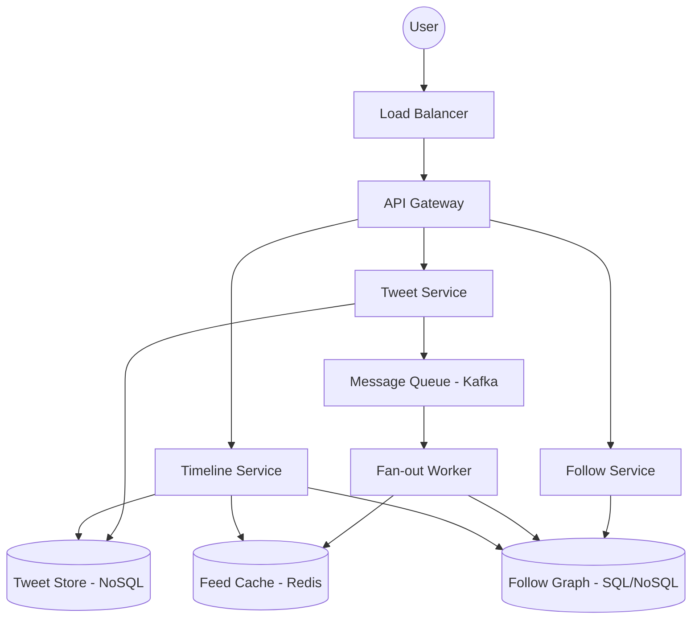

# System Design: Twitter Feed Timeline Aggregation

## 1. Requirements & System Constraints

### 1.1 Functional Requirements
*   **Tweet Posting:** Users can publish short text updates (tweets).
*   **Following:** Users can follow and unfollow other users.
*   **Home Timeline:** Users can view a chronological feed of tweets from everyone they follow.
*   **User Timeline:** Users can view a chronological feed of their own tweets.
*   **Timeline Pagination:** The feed must support pagination (loading more tweets as the user scrolls).

### 1.2 Non-Functional Requirements
*   **High Availability:** The system must be available for reads even if some components are lagging.
*   **Low Latency:** Home timeline retrieval should be near-instant (< 200ms).
*   **Eventual Consistency:** It is acceptable if a tweet takes a few seconds to appear in a follower's feed.
*   **Scalability:** Must handle hundreds of millions of Daily Active Users (DAU) and billions of tweets.

### 1.3 Scale Estimations (HLD)
*   **DAU:** 300 Million.
*   **Average Tweets/Day:** 500 Million.
*   **Average Follows:** Assume an average user follows 200 people.
*   **Read/Write Ratio:** Extremely read-heavy (e.g., 100:1).
*   **Feed Reads:** 300M users $\times$ 10 feed refreshes/day = 3 Billion reads/day.
*   **Throughput:**
    *   Write QPS: $500M / 86400 \approx 5,800$ tweets/sec.
    *   Read QPS: $3B / 86400 \approx 35,000$ requests/sec (peak could be 10x higher).

---

## 2. High-Level Architecture

The core challenge is the **Fan-out** process: how to deliver a single tweet to millions of followers efficiently. We employ a **Hybrid Approach** (Push for normal users, Pull for celebrities).

### 2.1 Architecture Diagram (Mermaid)



### 2.2 Core Component Interactions
1.  **Write Path (Posting a Tweet):**
    *   User posts a tweet $\rightarrow$ `Tweet Service` $\rightarrow$ Persisted in `Tweet Store`.
    *   `Tweet Service` pushes an event to `Kafka`.
    *   `Fan-out Workers` consume the event, look up the author's followers in `Follow DB`, and inject the Tweet ID into the `Feed Cache` (Redis) of each follower.
2.  **Read Path (Viewing Home Feed):**
    *   `Timeline Service` checks the user's `Feed Cache`.
    *   If the cache exists, it fetches the list of Tweet IDs and hydrates them with full content from the `Tweet Store`.
    *   **The Celebrity Twist:** For users following "celebrities" (high follower count), the `Timeline Service` pulls celebrity tweets directly from the `Tweet Store` at read-time and merges them with the cached feed.

---

## 3. Detailed Database Schema Design

### 3.1 Tweet Store (NoSQL - Cassandra/HBase)
We use a Wide-Column store because tweets are immutable, write-heavy, and retrieved by user ID in chronological order.
*   **Table:** `tweets`
*   **Partition Key:** `user_id` (groups all tweets of a user together on a node).
*   **Clustering Key:** `tweet_id` (descending, usually a Snowflake ID containing a timestamp).
*   **Fields:** `tweet_id (bigint)`, `user_id (bigint)`, `content (text)`, `created_at (timestamp)`.

### 3.2 Follow Graph (SQL - PostgreSQL or NoSQL - DynamoDB)
Requires fast lookups of "Who do I follow?" and "Who follows me?".
*   **Table:** `follows`
*   **Fields:** `follower_id (bigint)`, `followee_id (bigint)`, `created_at (timestamp)`.
*   **Indices:** 
    *   Primary Key: `(follower_id, followee_id)`
    *   Secondary Index on `followee_id` to find all followers of a user.

### 3.3 Feed Cache (In-Memory - Redis)
Stores the pre-computed Home Timeline for active users.
*   **Data Structure:** `Redis Sorted Set (ZSet)`
*   **Key:** `feed:user_id`
*   **Score:** `tweet_id` (or timestamp).
*   **Value:** `tweet_id`.
*   **Retention:** Limit to the most recent 1,000 tweet IDs per user to save memory.

---

## 4. Core API Design

### 4.1 Post a Tweet
`POST /v1/tweets`
*   **Request:**
    ```json
    {
      "text": "Hello world! #systemdesign",
      "media_ids": ["m123", "m456"]
    }
    ```
*   **Response:** `201 Created` with `tweet_id`.

### 4.2 Follow User
`POST /v1/follows/{userId}`
*   **Response:** `204 No Content`.

### 4.3 Get Home Timeline
`GET /v1/timeline/home?limit=20&max_id=1712345678`
*   **Request Params:** `limit` (number of tweets), `max_id` (for pagination/cursor).
*   **Response:**
    ```json
    {
      "tweets": [
        {
          "tweet_id": "1712345678",
          "user": { "id": "u1", "name": "Alice" },
          "content": "Latest news!",
          "created_at": "2023-10-01T10:00:00Z"
        },
        ...
      ],
      "next_cursor": "1712345000"
    }
    ```

---

## 5. Scalability & Advanced Topics

### 5.1 The "Celebrity" Problem (Fan-out Optimization)
If a user has 50 million followers, pushing a tweet to 50 million Redis lists is too slow and causes "write amplification" (the "Thundering Herd" on the cache).
*   **Hybrid Strategy:** 
    *   **Normal Users:** Use the **Push Model**. Tweet is pushed to followers' caches.
    *   **Celebrities:** Use the **Pull Model**. Their tweets are NOT pushed. Instead, when a follower requests their feed, the `Timeline Service` fetches the celebrity's recent tweets and merges them into the result set.

### 5.2 Caching Strategy
*   **User Timeline Cache:** Cache a user's own tweets in Redis to avoid hitting the `Tweet Store` for profile page loads.
*   **LRU Eviction:** Evict feed caches for users who haven't logged in for 30 days.

### 5.3 Sharding and Partitioning
*   **Tweet Store:** Shard by `user_id`. This ensures all tweets for a single user are co-located, making the "User Timeline" query extremely efficient.
*   **Follow DB:** Shard by `follower_id` to quickly retrieve the list of people a user follows.

### 5.4 Reliability & Fault Tolerance
*   **Kafka for Decoupling:** If the `Fan-out Worker` crashes, events remain in Kafka. Once recovered, it resumes processing from the last offset.
*   **Read-through Cache:** If the `Feed Cache` is empty, the system falls back to a "Pull" approach (querying `Follow DB` $\rightarrow$ `Tweet Store`), then populates the cache.

---

## 6. Trade-off Analysis

| Trade-off | Decision | Reasoning |
| :--- | :--- | :--- |
| **Latency vs. Storage** | Favor Latency | Pre-computing feeds in Redis consumes significant RAM but ensures $O(1)$ or $O(\log N)$ retrieval, which is critical for UX. |
| **Consistency vs. Availability** | Availability (AP) | In a social feed, it's better to show a slightly stale feed than to show an error page. Eventual consistency is acceptable. |
| **Push vs. Pull** | Hybrid | Pure Push fails for celebrities; Pure Pull fails for read latency. Hybrid optimizes for the 99% of users while handling outliers. |
| **SQL vs. NoSQL** | Polyglot Persistence | SQL is used for relationships (Follows) where integrity matters; NoSQL is used for Tweets (time-series/high volume) for horizontal scalability. |