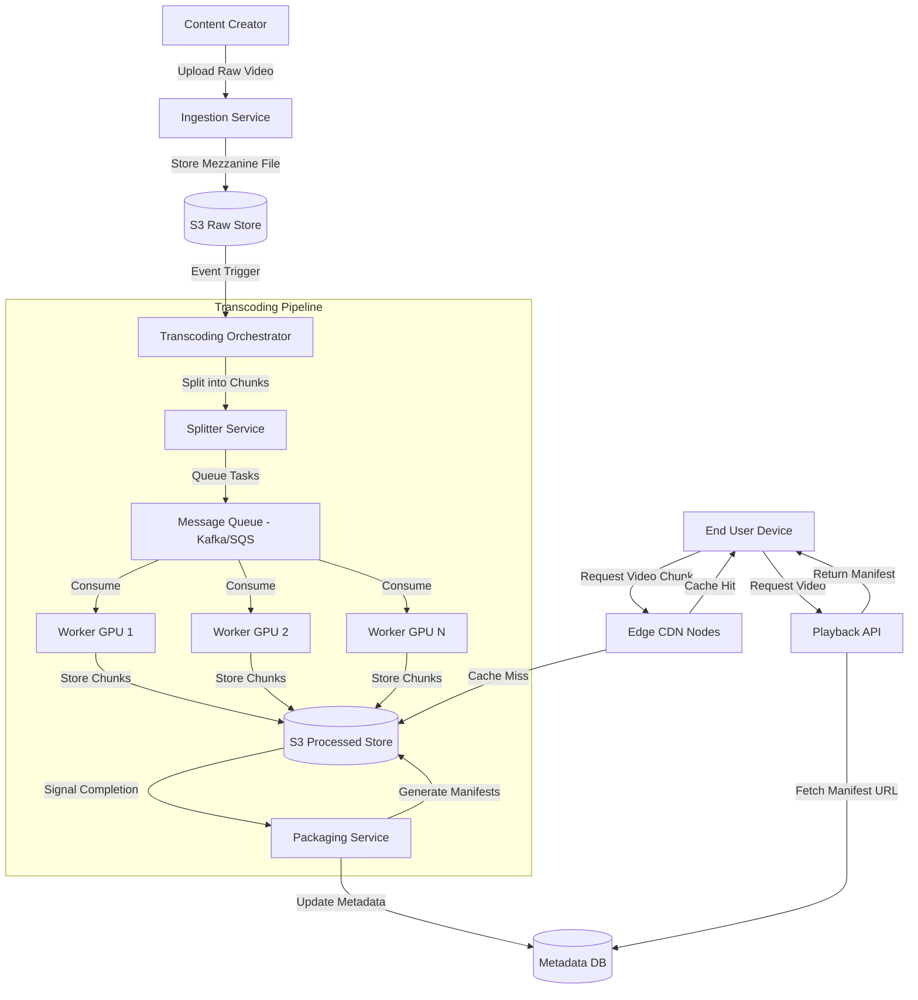

# System Design: Video Transcoding and Delivery Pipeline (Netflix Scale)

## 1. Requirements & System Constraints

### 1.1 Functional Requirements
*   **Content Ingestion:** Ability for content creators to upload high-bitrate, high-resolution source files (Mezzanine files).
*   **Transcoding Pipeline:** Automatic conversion of source videos into multiple resolutions (4K, 1080p, 720p, 480p) and various codecs (H.264, HEVC, VP9, AV1) to support diverse devices.
*   **Adaptive Bitrate Streaming (ABS):** Implementation of HLS (HTTP Live Streaming) or DASH (Dynamic Adaptive Streaming over HTTP) to adjust quality based on user network conditions.
*   **Global Delivery:** Low-latency delivery of video chunks to users globally via a distributed CDN.
*   **Playback Tracking:** Ability to resume video from where the user left off across devices.

### 1.2 Non-Functional Requirements
*   **High Availability:** The system must be available 24/7; playback failure is a critical outage.
*   **Low Latency:** Minimal "Time to First Frame" (TTFF) and zero buffering during playback.
*   **Scalability:** Support for hundreds of millions of users and tens of millions of concurrent streams.
*   **Reliability:** Ensure no data loss during the transcoding process; failed chunks must be retried.
*   **Durability:** Source files and processed assets must be stored redundantly.

### 1.3 Scale Estimations (HLD)
*   **Daily Active Users (DAU):** 200 Million.
*   **Concurrent Streams:** 10 Million.
*   **Average Bitrate (HD):** 5 Mbps.
*   **Total Egress Bandwidth:** $10M \text{ streams} \times 5 \text{ Mbps} = 50 \text{ Tbps}$.
*   **Storage:** Thousands of titles, each transcoded into ~10-20 variations. Total storage in the exabyte range.

---

## 2. High-Level Architecture

### 2.1 Core Components
1.  **Ingestion Service:** Handles the upload of massive raw files to a "Landing Zone" in Object Storage.
2.  **Transcoding Orchestrator:** A workflow manager that breaks the video into chunks and schedules transcoding jobs.
3.  **Transcoding Workers:** A fleet of GPU/CPU optimized workers that perform the actual encoding of video segments.
4.  **Packaging Service:** Aggregates transcoded chunks and creates manifest files (`.m3u8` for HLS, `.mpd` for DASH).
5.  **Metadata Store:** Stores video details, available profiles, and manifest locations.
6.  **CDN (Content Delivery Network):** A global network of edge caches (e.g., Netflix Open Connect) that stores chunks closer to the user.
7.  **Playback API:** Provides the client with the correct manifest URL based on device and location.

### 2.2 Architecture Diagram



---

## 3. Detailed Database Schema Design

### 3.1 Database Selection
*   **Relational (PostgreSQL):** Used for `Movies` and `VideoProfiles` where strong consistency and structured queries are needed.
*   **NoSQL (Cassandra/DynamoDB):** Used for `UserPlaybackState` due to the extreme volume of write-heavy updates (heartbeats every few seconds).
*   **Object Store (S3/GCS):** Used for the actual binary video files (blobs).

### 3.2 Schema Definitions

#### Table: `Movies` (PostgreSQL)
| Field | Type | Key | Description |
| :--- | :--- | :--- | :--- |
| `movie_id` | UUID | PK | Unique identifier for the movie. |
| `title` | VARCHAR | | Movie title. |
| `description` | TEXT | | Synopsis. |
| `release_date` | DATE | | Release date. |
| `status` | ENUM | | `Processing`, `Ready`, `Failed`. |

#### Table: `VideoProfiles` (PostgreSQL)
| Field | Type | Key | Description |
| :--- | :--- | :--- | :--- |
| `profile_id` | UUID | PK | Unique profile ID. |
| `movie_id` | UUID | FK | Link to `Movies`. |
| `resolution` | VARCHAR | | e.g., "1080p", "4K". |
| `codec` | VARCHAR | | e.g., "HEVC", "AV1". |
| `bitrate` | INT | | Target bitrate in kbps. |
| `manifest_url` | TEXT | | Path to the `.m3u8` or `.mpd` file. |

#### Table: `UserPlaybackState` (Cassandra)
| Field | Type | Key | Description |
| :--- | :--- | :--- | :--- |
| `user_id` | UUID | PK (Partition) | User identifier. |
| `movie_id` | UUID | PK (Clustering) | Movie identifier. |
| `timestamp` | TIMESTAMP | | Last updated time. |
| `offset_seconds` | BIGINT | | Current playback position. |
| `device_id` | VARCHAR | | Last device used. |

**Indexing Strategy:**
*   `Movies`: Index on `title` for search.
*   `VideoProfiles`: Composite index on `(movie_id, resolution)` for fast profile lookup.
*   `UserPlaybackState`: Partitioned by `user_id` to ensure all playback history for a user is co-located.

---

## 4. Core API Design

### 4.1 Playback Initiation
**Endpoint:** `GET /v1/playback/{movieId}`

**Request Parameters:**
*   `device_type`: (e.g., "SmartTV", "Android", "iOS")
*   `network_type`: (e.g., "WiFi", "5G")
*   `user_id`: UUID

**Response Payload:**
```json
{
  "movieId": "uuid-123",
  "manifestUrl": "https://cdn.netflix.com/manifests/movie123/master.m3u8",
  "resumeOffset": 1420,
  "availableQualities": ["4K", "1080p", "720p"],
  "drmToken": "jwt-encrypted-token"
}
```

### 4.2 Playback Heartbeat (Progress Tracking)
**Endpoint:** `POST /v1/playback/heartbeat`

**Request Payload:**
```json
{
  "userId": "uuid-user",
  "movieId": "uuid-movie",
  "offsetSeconds": 1455,
  "timestamp": "2023-10-27T10:00:00Z"
}
```

**Response:** `204 No Content`

---

## 5. Scalability & Advanced Topics

### 5.1 Transcoding Parallelization (The "Chunking" Strategy)
A 4K movie can be hundreds of gigabytes. Transcoding it as a single file is a bottleneck.
1.  **Splitting:** The `Splitter Service` divides the video into small GOP (Group of Pictures) aligned chunks (e.g., 2-5 seconds each).
2.  **Distributed Processing:** Chunks are pushed to a queue. 1,000 workers can process 1,000 chunks of the same movie simultaneously.
3.  **Re-assembly:** The `Packager` doesn't physically merge files but creates a manifest file that tells the player the sequence of chunk URLs.

### 5.2 CDN Strategy: Open Connect
Instead of relying on generic CDNs, a Netflix-scale system uses specialized hardware (Open Connect Appliances - OCAs) placed directly inside ISP data centers.
*   **Predictive Caching:** Popular content is pushed to the edge during off-peak hours (e.g., midnight) based on regional popularity.
*   **Request Routing:** DNS-based steering directs users to the physically closest OCA.

### 5.3 Caching Layers
*   **L1 (Client Cache):** Video player buffers the next 30-60 seconds of video.
*   **L2 (Edge Cache):** OCAs store the most requested chunks for a specific region.
*   **L3 (Regional Cache):** Larger regional hubs store a wider variety of content to refill L2 caches.

### 5.4 Fault Tolerance
*   **Idempotent Workers:** If a transcoding worker crashes, the orchestrator detects the timeout and re-queues that specific chunk.
*   **Redundant Storage:** Mezzanine and processed files are stored across multiple Availability Zones (AZs).
*   **Circuit Breakers:** If the Playback API is slow, the client can fallback to a cached "Generic Manifest" or a lower-quality stream to prevent total blackout.

---

## 6. Trade-off Analysis

### 6.1 Storage vs. Latency (Pre-computation vs. JIT)
*   **Trade-off:** We could transcode videos "on-the-fly" (Just-in-Time) to save storage.
*   **Decision:** **Pre-computation**. Storage is cheaper than the compute latency required to encode 4K video in real-time. Pre-computing every possible profile ensures zero-latency startup for the user.

### 6.2 Consistency vs. Availability (CAP Theorem)
*   **Trade-off:** When a user pauses a movie, should the playback state be strongly consistent across all devices?
*   **Decision:** **Availability (AP)**. Using Cassandra ensures that the "resume" feature is highly available. If a user sees a 2-second discrepancy in playback position across devices due to eventual consistency, it is acceptable.

### 6.3 Codec Complexity vs. Reach
*   **Trade-off:** AV1 provides better compression than H.264 but requires significantly more compute to encode and fewer devices support it.
*   **Decision:** **Multi-codec Strategy**. The system stores the same video in multiple codecs. The Playback API detects the device capabilities and serves the most efficient codec the device supports.