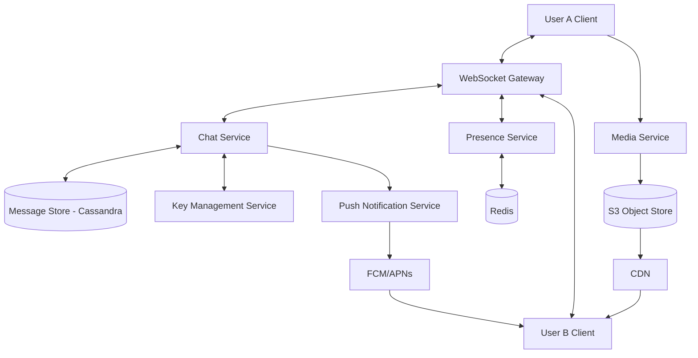

# System Design Document: WhatsApp / Messenger (Real-time Chat with E2EE)

## 1. Requirements & System Constraints

### 1.1 Functional Requirements
*   **One-to-One Messaging:** Real-time delivery of text messages between two users.
*   **Group Messaging:** Support for group chats with multiple participants.
*   **Message Status:** Tracking of "Sent", "Delivered", and "Read" (Double ticks).
*   **Presence Tracking:** Real-time "Online/Offline" status and "Last Seen".
*   **Media Support:** Ability to send images, videos, and documents.
*   **End-to-End Encryption (E2EE):** Messages must be encrypted on the sender's device and decrypted only on the receiver's device. The server must not have access to the plaintext.
*   **Push Notifications:** Notify offline users of new messages.

### 1.2 Non-Functional Requirements
*   **Low Latency:** Real-time feel; message delivery should happen in milliseconds.
*   **High Availability:** System must be available 24/7 (99.999% uptime).
*   **High Scalability:** Support for billions of users and millions of messages per second.
*   **Durability:** Once a message is acknowledged as received by the server, it must not be lost.
*   **Consistency:** Messages must be delivered in the order they were sent (Causal Consistency).

### 1.3 Scale Estimations
*   **Daily Active Users (DAU):** 1 Billion.
*   **Average Messages per User/Day:** 50.
*   **Total Messages per Day:** $1 \text{ Billion} \times 50 = 50 \text{ Billion messages/day}$.
*   **Peak QPS (Writes):** $\frac{50 \text{ Billion}}{86400 \text{ seconds}} \approx 580,000 \text{ msgs/sec}$ (Average). Peak could be $2\text{x} - 5\text{x}$ this.
*   **Storage (Messages):** Assuming average message size of 100 bytes: $50 \text{ Billion} \times 100 \text{ bytes} \approx 5 \text{ TB/day}$.
*   **Storage (Media):** Assuming 10% of messages contain media (avg 200 KB): $5 \text{ Billion} \times 200 \text{ KB} \approx 1 \text{ PB/day}$.

---

## 2. High-Level Architecture

### 2.1 Core Components
1.  **Client Application:** Handles E2EE encryption/decryption using the Signal Protocol.
2.  **WebSocket Gateway:** Maintains persistent bidirectional connections with clients for real-time push.
3.  **Chat Service:** Orchestrates message routing, persistence, and status updates.
4.  **Presence Service:** Heartbeat-based system to track user online/offline status.
5.  **User/Profile Service:** Manages user metadata and contact lists.
6.  **Key Management Service (KMS):** A public-key repository where users upload their public identity keys for E2EE.
7.  **Media Service:** Handles uploads to Object Storage (S3) and generates CDN links.
8.  **Notification Service:** Integrates with FCM (Firebase) or APNs (Apple) for offline delivery.

### 2.2 Architecture Diagram



### 2.3 E2EE Message Flow (The Signal Protocol Approach)
1.  **Key Exchange:** User B uploads a set of "Pre-keys" (public keys) to the **Key Management Service**.
2.  **Encryption:** User A wants to message User B. User A fetches User B's public keys from the Key Service and derives a shared session key (Double Ratchet Algorithm).
3.  **Transmission:** User A encrypts the message locally. The server receives an opaque blob.
4.  **Delivery:** The server delivers the blob to User B.
5.  **Decryption:** User B uses their private key to derive the same session key and decrypts the message.

---

## 3. Detailed Database Schema Design

### 3.1 Message Store (NoSQL - Apache Cassandra)
We use Cassandra because it is optimized for high write throughput and allows efficient retrieval of messages sorted by time for a specific conversation.

**Table: `messages`**
| Field | Type | Description | Index/Key |
| :--- | :--- | :--- | :--- |
| `chat_id` | UUID | Unique ID for the 1:1 or group chat | Partition Key |
| `message_id` | TimeUUID | Unique ID, includes timestamp | Clustering Key (DESC) |
| `sender_id` | UUID | User ID of sender | - |
| `content` | Blob/Text | Encrypted message payload | - |
| `status` | Int | 0: Sent, 1: Delivered, 2: Read | - |
| `created_at` | Timestamp | Time of message creation | - |

**Reasoning:** Using `chat_id` as the partition key ensures all messages for one conversation are stored together on the same physical node, making `SELECT * WHERE chat_id = ? ORDER BY message_id DESC` extremely fast.

### 3.2 User Profile Store (SQL - PostgreSQL)
Structured data with strict consistency for account management.

**Table: `users`**
| Field | Type | Description | Key |
| :--- | :--- | :--- | :--- |
| `user_id` | UUID | Primary Identifier | PK |
| `phone_number` | String | Unique phone number | Unique Index |
| `username` | String | Display name | - |
| `profile_pic` | String | URL to S3 | - |
| `created_at` | Timestamp | Account creation date | - |

### 3.3 Presence Store (In-Memory - Redis)
Low latency is critical for presence.

**Key-Value Pair:**
*   **Key:** `user:presence:{user_id}`
*   **Value:** `{ "status": "online", "last_seen": "2023-10-27T10:00:00Z" }`
*   **TTL:** 30-60 seconds (requires heartbeat from client).

---

## 4. Core API Design

### 4.1 Key Management API (REST)
Used by clients to establish the E2EE handshake.

*   **Upload Public Keys**
    *   `POST /v1/keys/upload`
    *   Payload: `{ "user_id": "uuid", "public_identity_key": "blob", "pre_keys": [...] }`
*   **Fetch Public Keys**
    *   `GET /v1/keys/{user_id}`
    *   Response: `{ "public_identity_key": "blob", "pre_key": "blob" }`

### 4.2 Chat API (WebSocket / Socket.io)
Most chat actions happen over a persistent WebSocket connection to avoid HTTP overhead.

**Event: `send_message`**
*   Payload:
    ```json
    {
      "chat_id": "uuid",
      "recipient_id": "uuid",
      "encrypted_content": "base64_blob",
      "message_id": "timeuuid",
      "type": "text"
    }
    ```

**Event: `message_status_update`**
*   Payload:
    ```json
    {
      "message_id": "timeuuid",
      "chat_id": "uuid",
      "status": "READ"
    }
    ```

### 4.3 Media API (REST)
*   **Upload Media**
    *   `POST /v1/media/upload`
    *   Returns: `media_id` and `cdn_url`.
    *   The client then sends this `media_id` inside an encrypted message.

---

## 5. Scalability & Advanced Topics

### 5.1 WebSocket Scaling & Load Balancing
Since WebSockets are stateful, we cannot use simple round-robin load balancing.
*   **Consistent Hashing:** Use a load balancer (like Nginx or HAProxy) with consistent hashing based on `user_id` to route users to specific Gateway nodes.
*   **Session Store:** Use Redis to map `user_id` $\rightarrow$ `gateway_node_id`. When User A sends a message to User B, the Chat Service looks up User B's current node in Redis and forwards the message to that specific WebSocket server.

### 5.2 Message Delivery Guarantees
*   **At-least-once Delivery:** The client expects an `ACK` from the server. If no `ACK` is received, the client retries.
*   **Ordering:** Using `TimeUUID` (which incorporates a timestamp) ensures that messages are sorted correctly even if they arrive slightly out of order due to network jitter.

### 5.3 Handling Group Chats
For large groups, sending a message to 1,000 people via 1,000 individual WebSocket pushes is expensive.
*   **Fan-out on Write:** For small groups, the server iterates through the member list and pushes to each.
*   **Fan-out on Read (Hybrid):** For massive groups (Channels), we store the message once and notify users. The client fetches the message only when the app is opened.

### 5.4 Caching Strategy
*   **L1 Cache (Client):** Local SQLite database to store message history.
*   **L2 Cache (Server):** Redis for the most recent 50-100 messages per `chat_id` to speed up "recent chat" loading.

---

## 6. Trade-off Analysis

### 6.1 CAP Theorem: Availability vs. Consistency
In a global chat app, **Availability (A)** and **Partition Tolerance (P)** are prioritized over **Strong Consistency (C)**. 
*   If a network partition occurs, it is better to allow users to send messages that will arrive eventually than to prevent them from sending messages at all. 
*   We accept **Eventual Consistency** for "Read" receipts and "Presence" status.

### 6.2 Storage: NoSQL vs. SQL
*   **SQL** was rejected for message storage because the volume of writes (50B/day) would cause massive lock contention and scaling bottlenecks in traditional RDBMS. 
*   **Cassandra** was chosen because it provides linear scalability and is optimized for the specific access pattern of chat (write-heavy, sequential read by time).

### 6.3 E2EE: Security vs. Server Features
*   **Trade-off:** Because the server cannot read messages, it cannot perform server-side indexing for "Search" or "Spam Filtering".
*   **Solution:** Search must be performed locally on the client device using the local SQLite index. Spam detection must rely on metadata (reporting, frequency) rather than content analysis.

### 6.4 Latency vs. Durability
*   To minimize latency, we write to Cassandra's commit log and memtable (in-memory) and return an `ACK` to the sender before the data is fully flushed to an SSTable on disk. This is a calculated risk to ensure a "snappy" user experience.