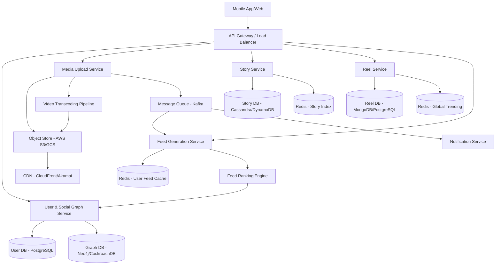

# System Design Document: Instagram (Stories, Feed, Reels)

## 1. Requirements & System Constraints

### 1.1 Functional Requirements
*   **Stories:** Users can upload photos/videos that disappear after 24 hours. Users can view stories from people they follow.
*   **Feed:** A personalized stream of posts (images/videos) from followed users, sorted by a combination of recency and relevance.
*   **Reels:** Short-form video content. Users can scroll through a global discovery feed (algorithmic) or see reels from followed users.
*   **Social Graph:** Ability to follow/unfollow other users.
*   **Interactions:** Like and comment on posts, reels, and stories.

### 1.2 Non-Functional Requirements
*   **High Availability:** The system must be available 24/7 (AP over CP in CAP theorem).
*   **Low Latency:** Feed loading and story transitions must be near-instant (< 200ms).
*   **Scalability:** Support for 500M+ Daily Active Users (DAU).
*   **Eventual Consistency:** It is acceptable if a post takes a few seconds to appear in all followers' feeds.
*   **Durability:** Permanent content (Reels, Posts) must never be lost.

### 1.3 Scale Estimations (HLD)
*   **DAU:** 500 Million.
*   **Read/Write Ratio:** Heavily read-biased (approx. 100:1).
*   **Stories:** ~1 Billion uploads/day. Each story lasts 24h.
*   **Feed:** Each user views ~20-50 posts per session.
*   **Storage:** 
    *   Images (~2MB avg), Videos (~10-50MB avg).
    *   Daily storage growth: Hundreds of Terabytes.
*   **Throughput:** 
    *   Peak QPS (Read): Millions of requests per second during global events.
    *   Peak QPS (Write): Hundreds of thousands per second.

---

## 2. High-Level Architecture

The system follows a microservices architecture to decouple the ephemeral nature of Stories from the permanent nature of Reels and the complex aggregation of the Feed.

### 2.1 Architecture Diagram (Mermaid)



### 2.2 Component Interaction
1.  **Media Upload:** User uploads a Reel/Story $\rightarrow$ `Media Service` $\rightarrow$ S3. A message is sent to Kafka to trigger transcoding (for different resolutions) and to notify the `Feed Service` to update followers' caches.
2.  **Story Consumption:** `Story Service` fetches active stories (current time < expiry) for the followed users from `StoryDB` and returns the CDN URLs.
3.  **Feed Generation:** The `Feed Service` uses a hybrid approach. For regular users, it pulls from a pre-computed `Feed Cache`. For celebrities, it fetches in real-time (Pull model).
4.  **Reels Discovery:** `Reel Service` uses a machine learning ranking engine to suggest content based on user interests, fetching metadata from `ReelDB`.

---

## 3. Detailed Database Schema Design

### 3.1 User & Social Graph (SQL/Graph)
Since social relationships are highly interconnected, a combination of SQL for profiles and a Graph-optimized approach for follows is used.

**Table: `users` (Relational - PostgreSQL)**
| Field | Type | Index | Notes |
| :--- | :--- | :--- | :--- |
| `user_id` | UUID | PK | Unique User ID |
| `username` | VARCHAR(50) | Unique | Unique handle |
| `email` | VARCHAR(100) | Unique | User email |
| `created_at` | Timestamp | - | Account creation date |

**Table: `follows` (Relational/Graph - CockroachDB/Neo4j)**
| Field | Type | Index | Notes |
| :--- | :--- | :--- | :--- |
| `follower_id` | UUID | FK, Composite PK | User who follows |
| `followee_id` | UUID | FK, Composite PK | User being followed |
| `created_at` | Timestamp | - | When the follow occurred |

### 3.2 Stories (NoSQL - Cassandra/DynamoDB)
Stories require high write throughput and automatic expiration. Cassandra is ideal due to its wide-column nature and TTL (Time-to-Live) support.

**Table: `stories`**
| Field | Type | Index | Notes |
| :--- | :--- | :--- | :--- |
| `story_id` | UUID | PK | Unique Story ID |
| `user_id` | UUID | Partition Key | Shard by user |
| `media_url` | TEXT | - | Link to S3/CDN |
| `type` | ENUM | - | Image or Video |
| `created_at` | Timestamp | Clustering Key | Sorted descending |
| `expires_at` | Timestamp | - | Used for TTL |

### 3.3 Reels & Posts (NoSQL/Document - MongoDB or PostgreSQL)
Reels are permanent and require complex metadata for search and discovery.

**Table: `reels`**
| Field | Type | Index | Notes |
| :--- | :--- | :--- | :--- |
| `reel_id` | UUID | PK | Unique Reel ID |
| `user_id` | UUID | Index | Creator |
| `video_url` | TEXT | - | S3 Link |
| `caption` | TEXT | - | User description |
| `tags` | ARRAY | GIN Index | For discovery/search |
| `created_at` | Timestamp | Index | Recency |

---

## 4. Core API Design

### 4.1 Media Upload (Stories/Reels)
`POST /v1/media/upload`
*   **Payload:**
    ```json
    {
      "user_id": "uuid",
      "media_type": "REEL", 
      "file": "binary_data",
      "caption": "Check out my trip!",
      "tags": ["travel", "beach"]
    }
    ```
*   **Response:** `202 Accepted` (Processing asynchronously).

### 4.2 Get Feed
`GET /v1/feed?limit=20&offset=0`
*   **Response:**
    ```json
    {
      "items": [
        {
          "post_id": "uuid",
          "user": { "username": "john_doe", "avatar": "url" },
          "media_url": "cdn_url",
          "likes_count": 1200,
          "timestamp": "2023-10-01T10:00:00Z"
        }
      ],
      "next_cursor": "cursor_string"
    }
    ```

### 4.3 Get Stories
`GET /v1/stories`
*   **Response:**
    ```json
    {
      "stories": [
        {
          "user_id": "uuid",
          "content": [
            { "story_id": "uuid", "url": "url", "expires_at": "timestamp" }
          ]
        }
      ]
    }
    ```

---

## 5. Scalability & Advanced Topics

### 5.1 Feed Generation: The Fan-out Challenge
Generating a feed for millions of users in real-time is computationally expensive.
*   **Push Model (Fan-out on Write):** When a user posts, the system pushes the post ID into the `Feed Cache` (Redis List) of all their followers. 
    *   *Pros:* Fast reads.
    *   *Cons:* Slow writes for "celebrities" (e.g., a user with 100M followers would trigger 100M writes).
*   **Pull Model (Fan-out on Read):** The system fetches posts from all followed users at the moment the feed is requested and merges them.
    *   *Pros:* Fast writes.
    *   *Cons:* Slow reads.
*   **Hybrid Approach:** 
    *   **Regular Users:** Use the Push model.
    *   **Celebrities:** Use the Pull model. When a user opens their feed, the system fetches the pre-computed feed (from regular follows) and merges it with the latest posts from the celebrities they follow.

### 5.2 Caching Strategy
*   **Edge Caching (CDN):** All images and videos are cached at the edge to reduce latency and origin load.
*   **Feed Cache:** Redis stores the `post_id` list for each user's feed.
*   **User Profile Cache:** LRU cache for frequently accessed user metadata.

### 5.3 Video Transcoding Pipeline
To support various network conditions (3G, 4G, WiFi), videos are processed asynchronously:
1.  Upload to S3 $\rightarrow$ Kafka Event $\rightarrow$ Transcoding Workers.
2.  Workers generate multiple resolutions (360p, 720p, 1080p) and formats (HLS/DASH for adaptive streaming).
3.  Update metadata in `ReelDB` once transcoding is complete.

### 5.4 Database Sharding
*   **UserDB:** Sharded by `user_id`.
*   **StoryDB:** Partitioned by `user_id` and clustered by `created_at` to ensure stories for a single user are stored together and sorted.

---

## 6. Trade-off Analysis

### 6.1 CAP Theorem: Availability vs. Consistency
Instagram prioritizes **Availability and Partition Tolerance (AP)**. If a user likes a post, it is acceptable if the like count is slightly out of sync across different regions for a few seconds. Using a distributed NoSQL store like Cassandra supports this eventual consistency.

### 6.2 Latency vs. Storage
To achieve sub-200ms feed latency, we trade off storage by using **Feed Pre-computation**. We store the same `post_id` in millions of different user feed caches. This increases storage costs significantly but is necessary for the user experience.

### 6.3 SQL vs. NoSQL
*   **PostgreSQL** is used for User profiles and Follows because these require ACID properties and complex relational queries (joins).
*   **Cassandra/DynamoDB** is used for Stories due to the massive write volume and the requirement for automatic data expiration via TTL.
*   **Redis** is used for the Feed because it provides the lowest latency for list-based data structures.