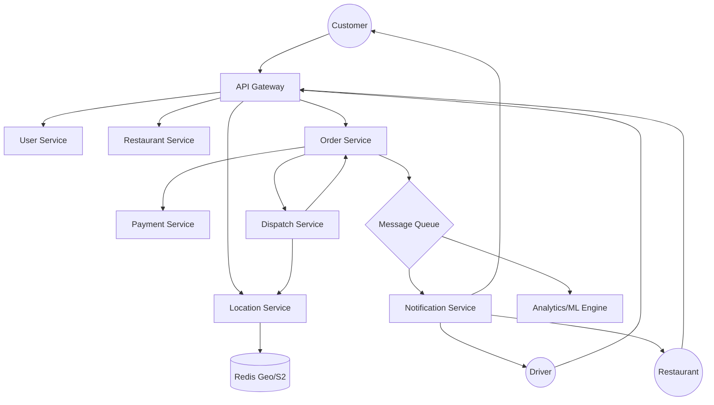

# System Design: Food Delivery Logistics (Swiggy / DoorDash)

## 1. Requirements & System Constraints

### 1.1 Functional Requirements
*   **Customer Side:**
    *   Search and browse restaurants based on location and cuisine.
    *   Place orders and make payments.
    *   Real-time tracking of the order and the delivery partner.
    *   Order history and ratings/reviews.
*   **Restaurant Side:**
    *   Manage menu items, pricing, and availability.
    *   Receive and accept/reject orders.
    *   Update order status (Preparing $\rightarrow$ Ready for Pickup).
*   **Delivery Partner Side:**
    *   Update availability status (Online/Offline).
    *   Accept/Reject delivery requests.
    *   Navigate to restaurant and customer locations.
    *   Update delivery status (Picked up $\rightarrow$ Delivered).
*   **System/Logistics:**
    *   **Matching Engine:** Efficiently assign the best available delivery partner to an order based on proximity, vehicle type, and load.
    *   **ETA Calculation:** Provide real-time estimated time of arrival.

### 1.2 Non-Functional Requirements
*   **High Availability:** The system must be available 24/7, especially during peak meal times.
*   **Low Latency:** Tracking updates must be near real-time (< 2 seconds lag).
*   **Consistency:** Strong consistency for payments and order status transitions.
*   **Scalability:** Handle massive spikes during lunch/dinner hours and holidays.

### 1.3 Scale Estimations (HLD)
*   **DAU:** 10 Million.
*   **Avg Orders per Day:** 1 Million.
*   **Peak Orders per Second (OPS):** ~500 - 1,000.
*   **Active Delivery Partners:** 500k.
*   **Location Updates:** Every 5 seconds per active driver $\rightarrow$ $500,000 / 5 = 100k$ writes per second. This is the primary write bottleneck.

---

## 2. High-Level Architecture

### 2.1 Core Components
*   **API Gateway:** Handles authentication, rate limiting, and request routing.
*   **User/Profile Service:** Manages user accounts, addresses, and preferences.
*   **Restaurant Service:** Manages restaurant metadata and menus.
*   **Order Service:** Orchestrates the order lifecycle (State Machine).
*   **Payment Service:** Integrates with third-party gateways (Stripe/PayPal).
*   **Location Service (Geo-Service):** Tracks driver coordinates and performs spatial queries (find nearby drivers).
*   **Dispatch/Matching Service:** The "brain" that matches an order to a driver.
*   **Notification Service:** Sends Push/SMS/Email notifications via Firebase (FCM) or Twilio.

### 2.2 Architecture Diagram (Mermaid)



### 2.3 Order Flow Sequence
1. **Order Placement:** Customer $\rightarrow$ Order Svc $\rightarrow$ Payment Svc $\rightarrow$ Order Svc (Status: Paid).
2. **Restaurant Notification:** Order Svc $\rightarrow$ Kafka $\rightarrow$ Notification Svc $\rightarrow$ Restaurant.
3. **Dispatching:** Order Svc (Status: Ready) $\rightarrow$ Dispatch Svc.
4. **Matching:** Dispatch Svc queries Location Svc for $N$ closest drivers $\rightarrow$ Sends request to Driver $\rightarrow$ Driver Accepts.
5. **Tracking:** Driver $\rightarrow$ Location Svc (Update Lat/Lng) $\rightarrow$ Customer (via WebSocket/Polling).

---

## 3. Detailed Database Schema Design

### 3.1 Database Selection
*   **Relational (PostgreSQL):** Used for User, Order, and Payment data where ACID compliance is non-negotiable.
*   **NoSQL (MongoDB/Cassandra):** Used for Restaurant Menus (highly polymorphic) and Order History (write-heavy, read-rarely).
*   **In-Memory (Redis):** Used for Driver real-time locations and session management.

### 3.2 Schema Definitions

#### User Table (SQL)
| Field | Type | Constraint | Note |
| :--- | :--- | :--- | :--- |
| `user_id` | UUID | PK | |
| `name` | VARCHAR | NOT NULL | |
| `email` | VARCHAR | UNIQUE | |
| `phone` | VARCHAR | UNIQUE | |
| `created_at` | TIMESTAMP | | |

#### Restaurant Table (SQL/NoSQL)
| Field | Type | Constraint | Note |
| :--- | :--- | :--- | :--- |
| `restaurant_id` | UUID | PK | |
| `name` | VARCHAR | | |
| `address` | TEXT | | |
| `geo_location` | GEOGRAPHY | INDEX | PostGIS Point |
| `rating` | DECIMAL | | |
| `is_active` | BOOLEAN | | |

#### Menu Table (NoSQL - MongoDB)
```json
{
  "restaurant_id": "UUID",
  "categories": [
    {
      "category_name": "Beverages",
      "items": [
        {"item_id": "UUID", "name": "Coke", "price": 2.99, "available": true}
      ]
    }
  ]
}
```

#### Order Table (SQL)
| Field | Type | Constraint | Note |
| :--- | :--- | :--- | :--- |
| `order_id` | UUID | PK | |
| `customer_id` | UUID | FK | |
| `restaurant_id`| UUID | FK | |
| `driver_id` | UUID | FK | Null until matched |
| `status` | ENUM | | PLACED, PAID, PREPARING, PICKED_UP, DELIVERED |
| `total_amount` | DECIMAL | | |
| `created_at` | TIMESTAMP | | |

#### Driver Table (SQL)
| Field | Type | Constraint | Note |
| :--- | :--- | :--- | :--- |
| `driver_id` | UUID | PK | |
| `vehicle_type` | ENUM | | Bike, Car, Scooter |
| `current_status`| ENUM | | ONLINE, BUSY, OFFLINE |
| `rating` | DECIMAL | | |

---

## 4. Core API Design

### 4.1 Customer APIs
*   `GET /v1/restaurants?lat={lat}&lng={lng}&cuisine={type}`
    *   Returns a list of nearby restaurants.
*   `POST /v1/orders`
    *   Request: `{ "restaurant_id": "UUID", "items": [{ "item_id": "UUID", "qty": 1 }], "address_id": "UUID" }`
    *   Response: `{ "order_id": "UUID", "status": "PLACED" }`
*   `GET /v1/orders/{order_id}/track`
    *   Response: `{ "driver_lat": 12.97, "driver_lng": 77.59, "eta": "12 mins" }`

### 4.2 Driver APIs
*   `PATCH /v1/driver/status`
    *   Request: `{ "status": "ONLINE" }`
*   `POST /v1/driver/location`
    *   Request: `{ "lat": 12.97, "lng": 77.59 }` (Sent every 5s)
*   `POST /v1/orders/{order_id}/accept`
    *   Response: `{ "success": true, "pickup_location": "..." }`

### 4.3 Restaurant APIs
*   `GET /v1/restaurant/orders/pending`
    *   Returns list of orders needing preparation.
*   `PATCH /v1/orders/{order_id}/status`
    *   Request: `{ "status": "READY_FOR_PICKUP" }`

---

## 5. Scalability & Advanced Topics

### 5.1 Handling High-Frequency Location Updates
Updating a SQL database 100k times per second is infeasible. 
*   **Redis Geo-hashes:** Use `GEOADD` to store driver coordinates and `GEORADIUS` to find drivers within a radius. Redis is in-memory and can handle the write throughput.
*   **S2 Geometry / Uber H3:** Divide the map into hexagonal cells. Drivers are indexed by cell ID. This allows the Dispatch Service to query only the cells surrounding the restaurant.

### 5.2 The Matching Algorithm (Dispatch Service)
Matching is not just "closest driver." It involves:
1.  **Filtering:** Only drivers who are `ONLINE` and not `BUSY`.
2.  **Scoring:** Calculate a score based on (Distance to Restaurant + Estimated Time to reach).
3.  **Batching:** Instead of instant matching, batch orders every 5-10 seconds to optimize the global assignment (avoiding the "greedy" approach where one driver takes an order they are barely suited for, leaving a later order unfulfillable).

### 5.3 Real-time Tracking
*   **WebSockets:** Maintain a persistent connection between the Client and the Location Service. When a driver updates their location, the server pushes the update to the specific customer.
*   **Polling Fallback:** If WebSockets are unavailable, use long-polling every 10 seconds.

### 5.4 Distributed Transactions (SAGA Pattern)
Since an order involves multiple services (Order $\rightarrow$ Payment $\rightarrow$ Restaurant $\rightarrow$ Driver), we use a **SAGA Orchestration** pattern:
*   If Payment fails $\rightarrow$ Order is marked as `FAILED`.
*   If Restaurant rejects order $\rightarrow$ Trigger Payment Refund $\rightarrow$ Order marked as `CANCELLED`.

### 5.5 Caching Strategy
*   **Restaurant Menus:** Cached in Redis with a TTL. Updated via a Cache-Aside pattern when the restaurant updates the menu.
*   **User Sessions:** JWTs stored in Redis for fast authentication.

---

## 6. Trade-off Analysis

### 6.1 CAP Theorem: Availability vs. Consistency
*   **Payment & Order Status:** We prioritize **Consistency (CP)**. It is better for a user to see a "Loading" spinner than to be charged twice or have an order disappear.
*   **Driver Tracking:** We prioritize **Availability (AP)**. If a driver's location update is delayed by 2 seconds or missed, it doesn't break the system. Eventual consistency is acceptable.

### 6.2 Push vs. Pull for Tracking
*   **Push (WebSockets):** Lower latency, higher server resource consumption (open connections).
*   **Pull (HTTP Polling):** Higher latency, easier to scale horizontally (stateless).
*   **Decision:** Use WebSockets for the active "Tracking" screen to provide a premium UX, and fallback to polling for background status checks.

### 6.3 Latency vs. Precision in Matching
*   **Exact Distance:** Calculating Haversine distance for 1,000 drivers is CPU intensive.
*   **Grid-based (H3/S2):** Using cell-based lookups is significantly faster but slightly less precise.
*   **Decision:** Use Cell-based lookup to narrow down candidates to $\sim 20$ drivers, then apply the precise Haversine formula only to that small subset.