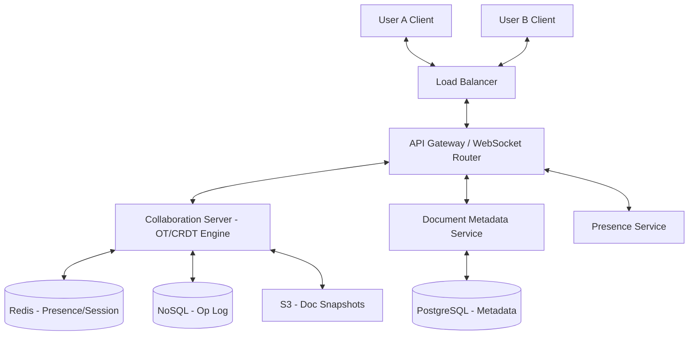

# System Design: Google Docs (Real-time Collaboration)

## 1. Requirements & System Constraints

### 1.1 Functional Requirements
*   **Document Creation & Management:** Users can create, open, rename, and delete documents.
*   **Real-time Collaborative Editing:** Multiple users can edit the same document simultaneously. Changes must be reflected across all clients with sub-second latency.
*   **Conflict Resolution:** The system must handle concurrent edits at the same position without data loss or divergence (Convergence).
*   **Presence Tracking:** Users should see who else is currently editing the document and the real-time position of their cursors.
*   **Version History:** Users can view previous versions of the document and revert to them.
*   **Permissions:** Granular access control (Viewer, Commenter, Editor).

### 1.2 Non-Functional Requirements
*   **Low Latency:** The "perceived" latency for a user's own keystroke must be zero (Optimistic UI), and the latency for others to see that change should be minimal (< 200ms).
*   **High Availability:** The system must be available even if individual servers fail.
*   **Strong Eventual Consistency:** All collaborators must eventually see the same document state once all operations are propagated.
*   **Scalability:** Must support millions of concurrent documents and thousands of users per document.

### 1.3 Scale Estimations (HLD)
*   **Daily Active Users (DAU):** 100 Million.
*   **Average Documents per User:** 10.
*   **Concurrent Users per Document:** Typically 2-5, but must support up to 100.
*   **Write Throughput:** If 1M users are typing at 2 characters per second, the system must handle $\approx 2 \times 10^6$ operations per second globally.
*   **Storage:** Document content is relatively small (text), but the operation log for versioning can grow significantly.

---

## 2. High-Level Architecture

### 2.1 Core Components
1.  **Client:** A rich-text editor that maintains a local copy of the document and an "Operation Queue."
2.  **Load Balancer:** Distributes requests across API gateways and routes WebSocket connections.
3.  **Collaboration Server (Session Manager):** A stateful server that manages a specific document session. It sequences operations and handles conflict resolution via Operational Transformation (OT) or CRDTs.
4.  **Document Service:** Stateless service for metadata management (CRUD operations on doc info).
5.  **Presence Service:** Manages ephemeral data (who is online, cursor coordinates) using a fast in-memory store.
6.  **Persistence Layer:** A hybrid approach using a Relational DB for metadata and a NoSQL/Log-based store for the document operation history.

### 2.2 Architecture Diagram



### 2.3 Collaboration Logic: OT vs CRDT
For this design, we implement **Operational Transformation (OT)**, as it is the industry standard for centralized collaborative editors (used by Google Docs).

*   **OT Process:**
    1.  Client A performs an operation $\text{Op}_1$ (e.g., `Insert('x', pos 5)`).
    2.  Client A applies it locally immediately (Optimistic UI) and sends it to the server with a version number.
    3.  If Client B concurrently performs $\text{Op}_2$ (e.g., `Insert('y', pos 5)`), the server receives $\text{Op}_1$ first, updates the doc to version $V+1$, and then receives $\text{Op}_2$ (which was based on version $V$).
    4.  The server **transforms** $\text{Op}_2$ relative to $\text{Op}_1$ to become $\text{Op}_2'$ (e.g., `Insert('y', pos 6)`).
    5.  The server broadcasts $\text{Op}_2'$ to all clients.

---

## 3. Detailed Database Schema Design

### 3.1 Metadata Store (PostgreSQL)
Used for structured data requiring ACID compliance and complex querying.

**Table: `users`**
| Field | Type | Constraints | Description |
| :--- | :--- | :--- | :--- |
| `user_id` | UUID | PK | Unique identifier |
| `email` | String | Unique, Indexed | User email |
| `name` | String | | Display name |

**Table: `documents`**
| Field | Type | Constraints | Description |
| :--- | :--- | :--- | :--- |
| `doc_id` | UUID | PK | Unique identifier |
| `owner_id` | UUID | FK $\to$ users | Document owner |
| `title` | String | | Doc title |
| `created_at` | Timestamp | | Creation date |
| `updated_at` | Timestamp | | Last modified date |

**Table: `permissions`**
| Field | Type | Constraints | Description |
| :--- | :--- | :--- | :--- |
| `doc_id` | UUID | PK, FK $\to$ docs | Document ID |
| `user_id` | UUID | PK, FK $\to$ users | User ID |
| `role` | Enum | (VIEWER, EDITOR) | Access level |

### 3.2 Operation Store (Cassandra or DynamoDB)
Because document edits are append-only logs of changes, a wide-column NoSQL store is ideal for high write throughput and linear scalability.

**Table: `doc_operations`**
| Field | Type | Constraints | Description |
| :--- | :--- | :--- | :--- |
| `doc_id` | UUID | Partition Key | Groups all ops for one doc |
| `version` | Integer | Sort Key | Monotonically increasing version |
| `user_id` | UUID | | Who made the change |
| `op_type` | Enum | (INSERT, DELETE) | Type of operation |
| `position` | Integer | | Index in the text |
| `value` | String | | The character/string inserted |
| `timestamp`| Timestamp | | Server-side time |

### 3.3 Storage Reasoning
*   **PostgreSQL:** Necessary for permissions and ownership where consistency and relational joins are critical.
*   **Cassandra:** Chosen for the operation log because we have a massive volume of writes and we primarily query operations by `doc_id` sorted by `version`.
*   **S3/Blob Storage:** Periodically, the server computes a "Snapshot" (the full current text) and saves it to S3. This prevents the system from having to replay millions of operations from version 0 every time a document is opened.

---

## 4. Core API Design

### 4.1 REST Endpoints (Metadata & Setup)
| Endpoint | Method | Description | Payload |
| :--- | :--- | :--- | :--- |
| `/api/v1/docs` | `POST` | Create a new document | `{ "title": "Meeting Notes" }` |
| `/api/v1/docs/{id}` | `GET` | Fetch metadata and latest snapshot | $\to$ `{ "content": "...", "version": 102 }` |
| `/api/v1/docs/{id}/share`| `POST` | Grant access to user | `{ "user_id": "...", "role": "EDITOR" }` |

### 4.2 WebSocket Interface (Real-time)
Connection: `wss://collab.docs.com/socket?docId={docId}&userId={userId}`

**Client $\to$ Server: Send Operation**
```json
{
  "type": "EDIT_OP",
  "docId": "uuid-123",
  "version": 102,
  "op": {
    "type": "INSERT",
    "pos": 15,
    "char": "a"
  }
}
```

**Server $\to$ Client: Broadcast Operation**
```json
{
  "type": "UPDATE",
  "version": 103,
  "op": {
    "type": "INSERT",
    "pos": 16,
    "char": "a"
  },
  "userId": "user-456"
}
```

**Client $\to$ Server: Cursor Move**
```json
{
  "type": "CURSOR_MOVE",
  "pos": 16
}
```

---

## 5. Scalability & Advanced Topics

### 5.1 Session Sticky Routing
Since the Collaboration Server must maintain the current state of the document and sequence operations, we use **Sticky Sessions**. 
*   A Load Balancer/Router uses a hash of the `docId` to route all users of a specific document to the same server instance.
*   If a server fails, the new server reconstructs the state by loading the latest snapshot from S3 and replaying remaining operations from Cassandra.

### 5.2 Presence Management
*   **Redis Pub/Sub:** Presence is ephemeral. When a user moves their cursor, the event is published to a Redis channel `presence:{docId}`.
*   **Heartbeats:** Clients send a heartbeat every 5-10 seconds. If a heartbeat is missed, the Presence Service removes the user from the "Active" list and broadcasts a `USER_OFFLINE` event.

### 5.3 Snapshotting Strategy
To avoid "Log Bloat":
1.  Every 100 operations, the Collaboration Server generates a full text snapshot.
2.  The snapshot is stored in S3 and the version number is recorded in the `documents` table.
3.  When a client opens a doc, they receive: `Snapshot(Version 1000)` $\to$ `Ops(1001 to 1020)`.

### 5.4 Fault Tolerance & Rate Limiting
*   **Client-side Buffering:** If the WebSocket disconnects, the client buffers local operations. Upon reconnection, it sends a "sync" request with its last known version.
*   **Rate Limiting:** To prevent API abuse, rate limits are applied per `userId` at the API Gateway.

---

## 6. Trade-off Analysis

### 6.1 CAP Theorem
In the context of the CAP theorem, Google Docs prioritizes **Availability** and **Partition Tolerance** (AP).
*   The system allows users to continue typing even if they lose connection to the server (Local Availability).
*   It achieves **Eventual Consistency** via the OT server, which acts as the final arbiter of truth.

### 6.2 Latency vs. Storage
*   **Storage Trade-off:** We store every single keystroke (the Operation Log) instead of just the final document. This increases storage costs significantly but is the only way to provide a robust "Version History" and "Undo/Redo" across multiple users.
*   **Latency Trade-off:** By using **Optimistic UI**, we trade absolute consistency for perceived performance. The user sees their change immediately, but there is a small window where the server might transform that change, causing a slight "jump" in the text.

### 6.3 OT vs. CRDT
| Feature | Operational Transformation (OT) | CRDT |
| :--- | :--- | :--- |
| **Architecture** | Centralized (Server-based) | Decentralized (Peer-to-Peer possible) |
| **Complexity** | High (Transform functions are hard) | Moderate (Data structures are complex) |
| **Metadata** | Low (Only stores the op) | High (Each char has a unique ID/Tombstone) |
| **Consistency** | Strong (Server sequences all) | Eventual (Commutative properties) |
| **Decision** | **Chosen** for Google Docs scale | Better for local-first/offline apps |