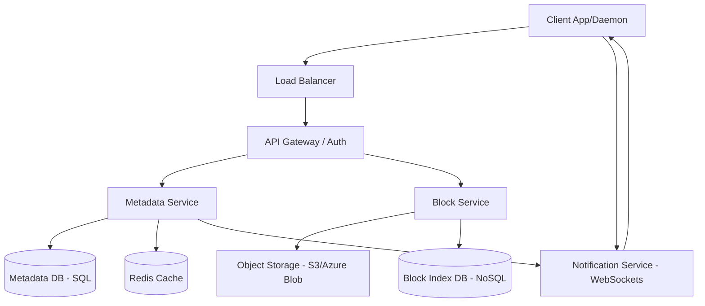

# System Design: Dropbox/Google Drive (File Storage & Synchronization)

## 1. Requirements & System Constraints

### 1.1 Functional Requirements
*   **File Upload/Download:** Users should be able to upload and download files from any device.
*   **File Synchronization:** Changes made to a file on one device must be reflected across all other devices linked to the same account.
*   **Versioning:** Users should be able to view and restore previous versions of a file.
*   **Offline Support:** Users can modify files offline; changes sync once the connection is restored.
*   **Sharing:** Ability to share files/folders with other users with specific permissions (Read-only, Read/Write).
*   **Folder Hierarchy:** Support for nested folders and directory structures.

### 1.2 Non-Functional Requirements
*   **High Durability:** Data must not be lost. 99.999999999% (11 nines) durability is the gold standard.
*   **High Availability:** The system should be available for access and synchronization at all times.
*   **Strong Consistency (Metadata):** A user should not see an old version of a file after a successful update.
*   **Efficiency (Bandwidth):** Use "Delta Sync" to upload only the modified parts of a file rather than the entire file.
*   **Scalability:** Support millions of concurrent users and petabytes of stored data.

### 1.3 Scale Estimations
*   **Users:** 100 Million total users; 10 Million Daily Active Users (DAU).
*   **Storage:** Average user stores 10GB $\rightarrow$ 1 Exabyte total storage.
*   **Traffic:** High read/write ratio for metadata, bursty write traffic for large file uploads.
*   **File Size:** Range from a few bytes to several gigabytes.

---

## 2. High-Level Architecture

### 2.1 Core Design Concept: Chunking
To optimize synchronization and handle large files, files are split into smaller **chunks** (e.g., 4MB). 
*   **Delta Sync:** If only one part of a 1GB file changes, only the affected chunks are uploaded.
*   **Deduplication:** If two users upload the same file (same hash), the system stores only one copy of the blocks.

### 2.2 Architecture Diagram

### 2.3 Component Interactions
1.  **Client App:** Monitors local folder changes (using `inotify` on Linux or `FSEvents` on macOS). It breaks files into chunks, hashes them, and communicates with the server.
2.  **Metadata Service:** Manages file names, folder structures, permissions, and version history.
3.  **Block Service:** Handles the uploading and downloading of raw binary chunks. It interacts with the Object Store.
4.  **Object Store:** A highly durable distributed storage system (like AWS S3) that stores the actual binary chunks.
5.  **Notification Service:** Uses WebSockets or Long Polling to push updates to other connected devices when a file changes.

---

## 3. Detailed Database Schema Design

### 3.1 Metadata Database (Relational - PostgreSQL)
We use a SQL database for metadata because we require ACID properties for file moves, renames, and permission updates to ensure consistency.

**Table: `Users`**
*   `user_id` (UUID, PK)
*   `username` (VARCHAR, Unique)
*   `email` (VARCHAR, Unique)
*   `created_at` (Timestamp)

**Table: `Files`**
*   `file_id` (UUID, PK)
*   `parent_folder_id` (UUID, FK) - References `Folders.folder_id`
*   `name` (VARCHAR)
*   `is_directory` (Boolean)
*   `current_version` (Integer)
*   `owner_id` (UUID, FK)
*   `created_at` (Timestamp)
*   `updated_at` (Timestamp)
*   *Index:* `(owner_id, parent_folder_id)` for fast directory listing.

**Table: `FileVersions`**
*   `version_id` (UUID, PK)
*   `file_id` (UUID, FK)
*   `version_number` (Integer)
*   `created_at` (Timestamp)
*   `checksum` (VARCHAR) - Root hash of the file version.

**Table: `FileVersionBlocks`**
*   `version_id` (UUID, FK)
*   `block_id` (VARCHAR, FK) - Hash of the block.
*   `block_order` (Integer) - Position of block in the file.
*   *PK:* `(version_id, block_order)`

### 3.2 Block Index (NoSQL - Cassandra/DynamoDB)
The Block Index maps a block's hash to its physical location in the Object Store. Since this is a simple Key-Value lookup with massive scale, NoSQL is preferred.

**Table: `Blocks`**
*   `block_hash` (VARCHAR, PK) - SHA-256 hash of content.
*   `storage_path` (VARCHAR) - Path in S3 (e.g., `s3://bucket/hash_prefix/block_hash`).
*   `size` (Integer)
*   `ref_count` (Integer) - Number of files using this block (for garbage collection).

---

## 4. Core API Design

### 4.1 File Upload Flow
The upload is a multi-step process to ensure reliability.

**Step 1: Initiate Upload**
`POST /api/v1/files/upload/init`
*   **Request:** `{ "file_name": "doc.pdf", "parent_id": "folder_123", "total_size": 10485760, "total_chunks": 3 }`
*   **Response:** `{ "upload_session_id": "sess_abc123", "file_id": "file_xyz" }`

**Step 2: Upload Chunks**
`POST /api/v1/files/upload/block`
*   **Request:** `Multipart form: { "session_id": "sess_abc123", "block_index": 0, "block_hash": "sha256_abc", "data": <binary> }`
*   **Response:** `{ "status": "success", "block_id": "sha256_abc" }` (Server checks if block already exists in `Blocks` table to avoid redundant storage).

**Step 3: Commit Upload**
`POST /api/v1/files/upload/commit`
*   **Request:** `{ "session_id": "sess_abc123", "block_hashes": ["sha256_abc", "sha256_def", "sha256_ghi"] }`
*   **Response:** `{ "status": "committed", "version": 1 }`

### 4.2 Other Endpoints
*   `GET /api/v1/files?parent_id={id}`: Lists files in a directory.
*   `GET /api/v1/files/download/{file_id}?version={v}`: Returns a signed URL to download the file or a stream of blocks.
*   `PATCH /api/v1/files/{file_id}`: Update metadata (rename, move).

---

## 5. Scalability & Advanced Topics

### 5.1 Deduplication Strategy
*   **Content-Addressable Storage:** By using the SHA-256 hash of the block as its ID, the system automatically implements "cross-user deduplication." If two different users upload the same 4MB chunk, only one instance is stored in the Object Store.

### 5.2 Sync Mechanism & Notification
To achieve real-time sync across devices:
1.  **Client Side:** The client maintains a local SQLite DB of file hashes.
2.  **Update Flow:** Client $\rightarrow$ Server $\rightarrow$ Metadata DB $\rightarrow$ Notification Service.
3.  **Notification:** The Notification Service pushes a "Change Event" (containing `file_id` and `version`) to all other active sessions of the user via WebSockets.
4.  **Pull:** The other clients receive the event and request only the modified blocks from the Block Service.

### 5.3 Database Sharding & Caching
*   **Metadata Sharding:** Shard the `Files` and `FileVersions` tables by `user_id`. Since most queries are user-centric, this prevents cross-shard joins.
*   **Caching:** Use Redis to cache the file tree for active users to reduce the load on the SQL DB during frequent directory browsing.

### 5.4 Fault Tolerance & Durability
*   **Object Store:** S3 inherently provides high durability through replication across multiple availability zones.
*   **Write-Ahead Log (WAL):** Use WAL in the metadata DB to ensure that file commits are atomic.
*   **Retry Logic:** Clients implement exponential backoff for failed chunk uploads.

---

## 6. Trade-off Analysis

### 6.1 CAP Theorem: Consistency vs. Availability
For a file storage system, **Consistency** is prioritized over **Availability** for metadata (CP). If a user moves a folder, they should not see the folder in both the old and new locations (split-brain). However, the binary data delivery (Block Service) can be **Eventually Consistent** (AP), as the metadata versioning ensures the client requests the correct block hash.

### 6.2 Latency vs. Storage Efficiency
*   **Chunking:** Increases metadata overhead (more rows in `FileVersionBlocks`) and adds slight latency due to hashing on the client. However, it drastically reduces bandwidth and storage costs through delta sync and deduplication.

### 6.3 SQL vs. NoSQL
*   **SQL (Metadata):** Chosen for complex relational queries (e.g., "Find all files shared with User X") and ACID guarantees.
*   **NoSQL (Block Index):** Chosen for the Block Index because the access pattern is a simple key-value lookup ($\text{Hash} \rightarrow \text{Path}$) with a massive volume of entries, requiring linear scalability.