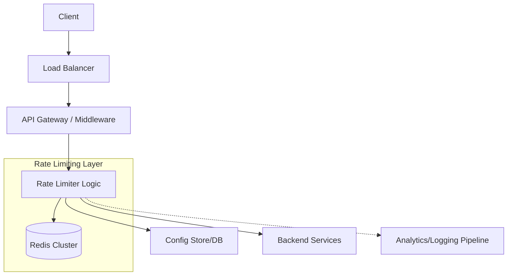

# Design Document: Distributed Rate Limiter

## 1. Requirements & System Constraints

### 1.1 Functional Requirements
*   **Limit Requests:** The system must limit the number of requests a user/IP/API key can make within a specific time window (e.g., 100 requests per minute).
*   **Error Handling:** When a limit is exceeded, the system must return a clear error response (HTTP 429 Too Many Requests).
*   **Granularity:** Support multiple levels of rate limiting (e.g., per-user, per-IP, per-endpoint).
*   **Dynamic Configuration:** Ability to update rate limits without restarting the service.
*   **Transparency:** Return headers indicating current status (e.g., `X-RateLimit-Remaining`, `X-RateLimit-Limit`, `X-RateLimit-Reset`).

### 1.2 Non-Functional Requirements
*   **Low Latency:** The rate limiter is in the critical path of every request. It must add negligible overhead (typically < 5ms).
*   **High Availability:** If the rate limiter fails, the system should "fail-open" (allow requests) to avoid becoming a single point of failure for the entire ecosystem.
*   **Distributed Accuracy:** Limits must be enforced consistently across a cluster of application servers.
*   **Scalability:** Must handle millions of users and hundreds of thousands of requests per second (RPS).

### 1.3 Scale Estimations (HLD)
*   **Traffic:** 100k Requests Per Second (RPS).
*   **Active Users:** 10 million daily active users.
*   **Storage:** If using a Sliding Window approach with Redis, assuming 100 bytes per user entry $\rightarrow 10M \times 100 \text{ bytes} \approx 1\text{GB}$ of RAM. This is well within the capacity of a single Redis node, but clustering is required for availability and throughput.

---

## 2. High-Level Architecture

### 2.1 Core Components
1.  **API Gateway / Middleware:** The entry point that intercepts requests and queries the Rate Limiter.
2.  **Rate Limiter Service:** The logic layer that decides whether a request should be allowed based on the algorithm and configuration.
3.  **Distributed Cache (Redis):** Stores the counters and timestamps. Redis is chosen for its atomic operations and sub-millisecond latency.
4.  **Configuration Store (ZooKeeper/Consul/DB):** Stores the limit rules (e.g., "Tier 1 users get 1000 req/hr").
5.  **Analytics/Logging Pipeline:** Asynchronously logs dropped requests for auditing and abuse detection.

### 2.2 Architecture Diagram



### 2.3 Request Flow
1.  Request arrives at the **API Gateway**.
2.  Gateway extracts the identifier (User ID, API Key, or IP).
3.  Gateway calls the **Rate Limiter Logic**.
4.  Logic retrieves the current count/timestamp from **Redis**.
5.  Logic applies the chosen algorithm (e.g., Sliding Window).
6.  If the limit is exceeded, return **HTTP 429**.
7.  If allowed, increment the counter in Redis and forward the request to the **Backend Service**.

---

## 3. Detailed Database Schema Design

Since rate limiting requires high-frequency reads and writes, a traditional RDBMS is unsuitable. We use **Redis** as the primary data store.

### 3.1 Storage Strategies by Algorithm

#### A. Fixed Window Counter
*   **Key:** `rate_limit:{userId}:{endpoint}:{window_timestamp}`
*   **Value:** Integer (Counter)
*   **TTL:** Window size (e.g., 60s).
*   **Operation:** `INCR(key)` $\rightarrow$ if value > limit, reject.

#### B. Sliding Window Log (High Accuracy)
*   **Key:** `rate_limit:{userId}:{endpoint}`
*   **Value:** Sorted Set (`ZSET`)
    *   **Score:** Timestamp of the request.
    *   **Member:** Unique Request ID or Timestamp.
*   **Operation:** 
    1. `ZREMRANGEBYSCORE(key, 0, current_time - window_size)` (Remove old entries).
    2. `ZCARD(key)` (Count remaining entries).
    3. If count < limit, `ZADD(key, current_time, requestId)`.

#### C. Token Bucket (Smooth Traffic)
*   **Key:** `rate_limit:{userId}:{endpoint}`
*   **Value:** Hash (`HSET`)
    *   `tokens`: Remaining tokens.
    *   `last_refill_time`: Timestamp of last update.
*   **Operation:** Calculated via Lua script to ensure atomicity.

### 3.2 Configuration Table (SQL/NoSQL)
To manage rules, a relational database or a configuration service is used.

| Field | Type | Description |
| :--- | :--- | :--- |
| `rule_id` | UUID (PK) | Unique identifier for the rule |
| `identifier_type` | Enum | USER, IP, API_KEY |
| `endpoint` | String | The API path (e.g., `/v1/payments`) |
| `limit_count` | Integer | Max requests allowed |
| `window_size` | Integer | Time window in seconds |
| `tier` | String | Gold, Silver, Bronze |

---

## 4. Core API Design

If the rate limiter is implemented as a standalone service, the internal API would look as follows:

### 4.1 Check Limit Endpoint
**Endpoint:** `POST /v1/check`

**Request Payload:**
```json
{
  "identifier": "user_12345",
  "endpoint": "/v1/charge",
  "identifier_type": "USER",
  "weight": 1
}
```

**Response Payload (Allowed):**
```json
{
  "allowed": true,
  "remaining": 45,
  "limit": 50,
  "reset_time": 1672531200,
  "retry_after_ms": 0
}
```

**Response Payload (Blocked):**
```json
{
  "allowed": false,
  "remaining": 0,
  "limit": 50,
  "reset_time": 1672531200,
  "retry_after_ms": 1200
}
```

---

## 5. Scalability & Advanced Topics

### 5.1 Solving Race Conditions
In a distributed environment, a "read-modify-write" cycle leads to race conditions. 
*   **Solution:** Use **Lua Scripts** in Redis. Lua scripts are executed atomically. The entire check-and-increment logic is sent to Redis as a single script, preventing other clients from interfering between the read and the write.

### 5.2 Global vs. Local Rate Limiting
*   **Global (Centralized Redis):** Accurate but introduces network latency.
*   **Local (In-Memory Cache):** Extremely fast but inaccurate across nodes.
*   **Hybrid Approach:** Use a local cache for a "burst" limit and periodically synchronize with the global Redis cluster (e.g., every 100ms or 50 requests) to maintain coarse-grained accuracy.

### 5.3 Sharding & Partitioning
To avoid a Redis hotspot:
*   **Consistent Hashing:** Partition user IDs across multiple Redis shards. `Shard = Hash(userId) % NumberOfShards`.
*   **Read Replicas:** Use replicas for monitoring, though the "write" path must hit the primary shard for consistency.

### 5.4 Fault Tolerance
*   **Fail-Open Strategy:** Wrap the rate limiter call in a circuit breaker. If Redis is unreachable or timeouts occur, the middleware should log a warning and allow the request to pass to the backend to ensure system availability.

---

## 6. Trade-off Analysis

| Trade-off | Selection | Reasoning |
| :--- | :--- | :--- |
| **Consistency vs. Latency** | Eventual Consistency (Hybrid) | For most businesses, allowing 105 requests instead of 100 is acceptable; adding 50ms of latency to every API call is not. |
| **Accuracy vs. Memory** | Sliding Window Counter | Sliding Window Log is 100% accurate but consumes significant memory (stores every timestamp). Sliding Window Counter approximates the log using two fixed windows, saving memory. |
| **Storage: SQL vs. Redis** | Redis (In-Memory) | SQL disks are too slow for the request path. Redis provides the necessary atomic increments and TTLs required for windowing. |
| **CAP Theorem** | AP (Availability & Partition Tolerance) | In a network partition, we prefer to let requests through (Availability) rather than blocking all traffic because we can't reach the counter (Consistency). |