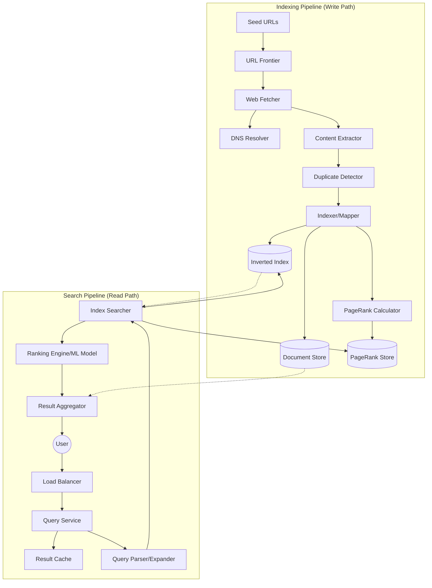

# System Design: Google-Scale Search Engine

## 1. Requirements & System Constraints

### 1.1 Functional Requirements
*   **Web Crawling:** Automatically discover and download web pages from the internet.
*   **Indexing:** Process crawled content and build a searchable data structure (Inverted Index).
*   **Searching:** Allow users to input queries and retrieve the most relevant documents.
*   **Ranking:** Order results based on relevance and authority (e.g., PageRank, ML-based scoring).
*   **Freshness:** Regularly update indices to reflect changes in the web.

### 1.2 Non-Functional Requirements
*   **Low Latency:** Query results must return in $< 200\text{ms}$.
*   **High Scalability:** Handle billions of pages and millions of queries per second (QPS).
*   **High Availability:** The system must be available $99.99\%$ of the time.
*   **Fault Tolerance:** No single point of failure; ability to recover from node crashes.
*   **Accuracy/Relevance:** High precision and recall for search results.

### 1.3 Scale Estimations
*   **Pages to Index:** $\sim 10^{12}$ (1 Trillion pages).
*   **Average Page Size:** $100\text{ KB}$.
*   **Total Storage (Raw):** $10^{12} \times 100\text{ KB} \approx 100\text{ Petabytes}$.
*   **Search QPS:** $\sim 100,000$ to $1,000,000$ queries per second.
*   **Index Size:** Assuming average 500 words per page, total entries $\approx 5 \times 10^{14}$.

---

## 2. High-Level Architecture

The system is divided into two primary planes: the **Write Path (Indexing Pipeline)** and the **Read Path (Query Pipeline)**.

### 2.1 Architecture Diagram



### 2.2 Component Breakdown

#### A. Indexing Pipeline
1.  **URL Frontier:** A distributed queue that manages which URLs to visit next, handling politeness (avoiding DDOSing a site) and priority.
2.  **Web Fetcher:** Downloads HTML content. Uses a distributed DNS cache to minimize lookup latency.
3.  **Content Extractor & Duplicate Detector:** Extracts text and cleans HTML. Uses **SimHash** or **MinHash** to detect near-duplicate pages to avoid indexing the same content multiple times.
4.  **Indexer:** Tokenizes text, removes stop words, performs stemming/lemmatization, and updates the Inverted Index.
5.  **PageRank Calculator:** An offline MapReduce/Spark job that computes the importance of pages based on the link graph.

#### B. Search Pipeline
1.  **Query Service:** The entry point. Handles authentication, rate limiting, and request routing.
2.  **Query Parser:** Converts the raw string into a structured query (e.g., handling quotes, minus signs, and synonyms).
3.  **Index Searcher:** Queries the Inverted Index to find the list of documents containing the search terms (Posting Lists).
4.  **Ranking Engine:** Applies a scoring function combining **TF-IDF/BM25** (term frequency) and **PageRank** (global authority) to sort results.
5.  **Result Aggregator:** Fetches snippets and titles from the Document Store to present to the user.

---

## 3. Detailed Database Schema Design

### 3.1 The Inverted Index (The Core)
Because of the scale, a traditional SQL database cannot store the index. We use a **Distributed Key-Value Store** (e.g., BigTable or HBase).

**Schema:**
*   **Key:** `term` (e.g., "distributed_systems")
*   **Value:** `PostingList` $\to$ `List<{doc_id, frequency, positions[]}>`

*Optimization:* Since posting lists can be massive, they are compressed using **Delta Encoding** or **Variable Byte Encoding** and split into shards.

### 3.2 Document Store
Stores the actual page content or a compressed version for snippet generation.
*   **Store:** NoSQL Column-Family Store (Cassandra/HBase).
*   **Key:** `doc_id`
*   **Value:** `{url, title, body_text, language, last_crawled_timestamp}`

### 3.3 PageRank Store
*   **Store:** Distributed KV store.
*   **Key:** `doc_id`
*   **Value:** `rank_score` (float)

### 3.4 URL Frontier Store
*   **Store:** Distributed Queue / Database (Redis + MySQL for persistence).
*   **Fields:** `url`, `priority`, `last_visited`, `status` (Pending, Visited, Failed).

---

## 4. Core API Design

### 4.1 Search API
**Endpoint:** `GET /v1/search`

**Request Parameters:**
| Parameter | Type | Description |
| :--- | :--- | :--- |
| `q` | String | The search query |
| `page` | Integer | Page number for pagination |
| `start` | Integer | Offset for results |
| `filter` | String | Filter by date, region, etc. |

**Response Payload:**
```json
{
  "query": "system design",
  "total_results": 1500000,
  "latency_ms": 45,
  "results": [
    {
      "doc_id": "abc123xyz",
      "url": "https://example.com/system-design",
      "title": "Mastering System Design",
      "snippet": "...the core principles of <b>system design</b> involve scalability...",
      "rank": 1
    },
    {
      "doc_id": "def456uvw",
      "url": "https://blog.tech/design-guide",
      "title": "Guide to Distributed Systems",
      "snippet": "...when designing a <b>system</b>, consider the CAP theorem...",
      "rank": 2
    }
  ]
}
```

---

## 5. Scalability & Advanced Topics

### 5.1 Index Sharding (Partitioning)
To handle trillions of documents, the index must be partitioned across thousands of nodes:
*   **Document-based Partitioning (Local Index):** Each node stores a full index for a subset of documents. A query is broadcast to all nodes, and results are merged. (Better for write-heavy workloads).
*   **Term-based Partitioning (Global Index):** Each node stores all documents for a specific set of terms (e.g., Node A handles 'A-C', Node B 'D-F'). (Better for read-heavy workloads, but creates hotspots for common terms like "the" or "news").
*   **Hybrid Approach:** Use term-based for rare words and document-based for common words.

### 5.2 Caching Strategy
*   **Query Cache:** Store `Query String $\to$ Result List` in Redis. Very high hit rate for trending topics.
*   **Index Cache:** Keep frequently accessed "Posting Lists" in memory (RAM) using an LRU cache.
*   **DNS Cache:** To avoid repeated lookups during crawling.

### 5.3 Ranking Algorithm
1.  **Phase 1 (Retrieval):** Use the Inverted Index to get a candidate set of $\sim 10,000$ documents using BM25.
2.  **Phase 2 (Ranking):** Pass the candidate set through a heavy Machine Learning model (e.g., Learning to Rank - LTR) using features like:
    *   PageRank.
    *   User location and search history.
    *   Click-through rate (CTR) of the link for that query.
    *   Document freshness.

### 5.4 Crawling Politeness & Scheduling
*   **Robots.txt:** The fetcher must respect `robots.txt` to avoid banned areas.
*   **Politeness:** Maintain a queue per domain to ensure the fetcher doesn't hit one server too many times per second.
*   **Priority:** Pages with higher PageRank are recrawled more frequently.

---

## 6. Trade-off Analysis

### 6.1 CAP Theorem: Availability vs. Consistency
A search engine prioritizes **Availability and Partition Tolerance (AP)**. It is acceptable if a user sees a slightly outdated search result (Eventual Consistency) rather than the system being unavailable. The crawling and indexing process is asynchronous by nature.

### 6.2 Latency vs. Storage
*   **Storage Trade-off:** We store the index multiple times (replication) and use massive Document Stores to avoid expensive on-the-fly computations. We sacrifice disk space for millisecond retrieval.
*   **Latency Trade-off:** We use a multi-stage ranking process. We don't run a complex ML model on 1 billion documents; we prune the set to 10k using a fast index lookup first, then rank the small set.

### 6.3 Precision vs. Recall
*   **Recall:** Ensuring all relevant documents are found. (Improved by query expansion/synonyms).
*   **Precision:** Ensuring the top results are actually relevant. (Improved by the ML Ranking Engine).
*   In a Google-scale engine, **Precision** is more important for the first page of results, as users rarely click past page one.