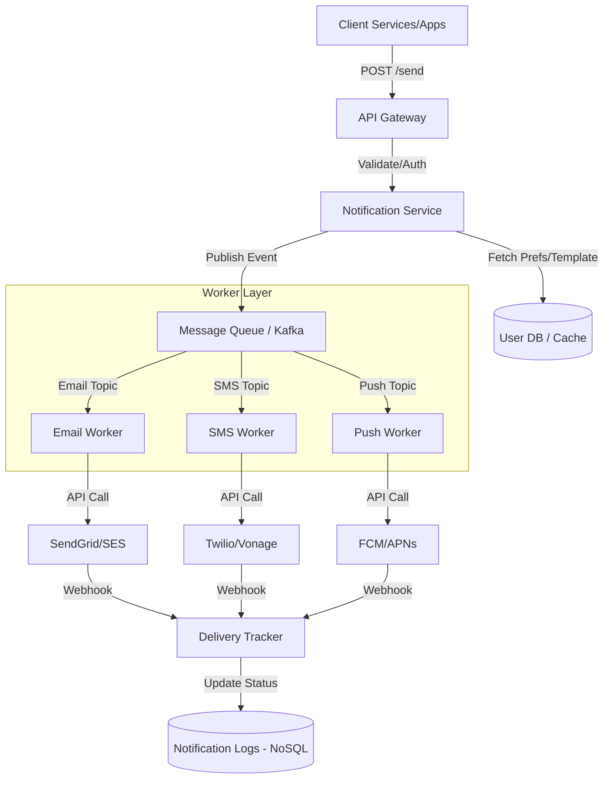

# System Design: Multi-Channel Notification System

## 1. Requirements & System Constraints

### Functional Requirements
*   **Multi-Channel Support:** Support for Push Notifications (iOS/Android), Email, and SMS.
*   **User Preferences:** Users should be able to opt-in or opt-out of specific notification channels for different categories (e.g., Marketing: Email only, Transactional: Push and SMS).
*   **Templating Engine:** Support for dynamic content using templates (e.g., "Hello {name}, your order {order_id} has shipped").
*   **Priority Handling:** Ability to distinguish between high-priority (OTP, Password Reset) and low-priority (Marketing, Newsletters) notifications.
*   **Tracking & Analytics:** Track the lifecycle of a notification: `Sent` $\rightarrow$ `Delivered` $\rightarrow$ `Read/Clicked`.
*   **Reliability:** Guarantee "at-least-once" delivery.

### Non-Functional Requirements
*   **High Availability:** The system must be available to accept notification requests even if downstream providers (e.g., Twilio, SendGrid) are experiencing outages.
*   **Scalability:** Handle bursts of traffic (e.g., flash sales, breaking news) efficiently.
*   **Low Latency:** Transactional notifications (OTPs) must be delivered within seconds.
*   **Idempotency:** Prevent sending the same notification multiple times to the user due to retry logic.

### Scale Estimations (HLD)
*   **Daily Active Users (DAU):** 10 Million.
*   **Notifications per Day:** 100 Million.
*   **Average Throughput:** $\approx 1,150$ notifications per second.
*   **Peak Throughput:** $\approx 10,000+$ notifications per second.
*   **Storage:** 100M logs/day $\times$ 30 days retention $\approx 3$ Billion records.

---

## 2. High-Level Architecture

The system follows a decoupled, event-driven architecture to ensure that slow third-party APIs do not block the internal services.

### Architecture Diagram (Mermaid)



### Component Descriptions
1.  **Notification Service:** The orchestrator. It validates the request, resolves the user's contact info, checks preferences, and fetches the rendered template.
2.  **Message Queue (Kafka):** Acts as a buffer. It separates the intake of notifications from the actual delivery, allowing the system to handle spikes without crashing. Different topics are used for different channels and priorities.
3.  **Channel Workers:** Specialized consumers that handle the specific API logic, rate limits, and retry policies of the third-party providers.
4.  **Third-Party Providers:** External gateways for the actual delivery to the end-user's device.
5.  **Delivery Tracker:** A service that consumes webhooks from providers to update the delivery status of the notification.

---

## 3. Detailed Database Schema Design

### Database Selection
*   **Relational DB (PostgreSQL):** Used for `UserPreferences` and `Templates` because these are highly structured and require strong consistency for updates.
*   **NoSQL DB (Cassandra or DynamoDB):** Used for `NotificationLogs`. The volume of write operations is massive, and the access pattern is primarily time-series (querying logs for a specific user over a time range).

### Schema

#### Table: `UserPreferences` (SQL)
| Field | Type | Constraint | Description |
| :--- | :--- | :--- | :--- |
| `user_id` | UUID | PK | Unique identifier of the user |
| `channel` | Enum | PK | EMAIL, SMS, PUSH |
| `category` | Enum | PK | TRANSACTIONAL, MARKETING, SOCIAL |
| `is_enabled` | Boolean | Not Null | Opt-in/out status |

*   **Index:** Composite index on `(user_id, category)` for fast preference lookups.

#### Table: `NotificationTemplates` (SQL)
| Field | Type | Constraint | Description |
| :--- | :--- | :--- | :--- |
| `template_id` | String | PK | Unique ID (e.g., "order_shipped_v1") |
| `channel` | Enum | Not Null | The target channel |
| `subject` | String | - | Email subject line |
| `body_template`| Text | Not Null | Template with placeholders |

#### Table: `NotificationLogs` (NoSQL)
| Field | Type | Role | Description |
| :--- | :--- | :--- | :--- |
| `notification_id`| UUID | Partition Key | Unique ID for the request |
| `user_id` | UUID | Sort Key | For querying user history |
| `channel` | String | Attribute | Channel used |
| `status` | String | Attribute | PENDING, SENT, DELIVERED, FAILED |
| `retry_count` | Int | Attribute | Number of delivery attempts |
| `created_at` | Timestamp | Attribute | Time of request |
| `updated_at` | Timestamp | Attribute | Last status update time |

---

## 4. Core API Design

### Send Notification
`POST /v1/notifications/send`

**Request Payload:**
```json
{
  "user_id": "u-12345",
  "category": "TRANSACTIONAL",
  "template_id": "order_confirmation",
  "placeholders": {
    "name": "John Doe",
    "order_id": "ORD-9988",
    "amount": "$45.00"
  },
  "priority": "HIGH"
}
```

**Response:**
```json
{
  "notification_id": "notif-abc-123",
  "status": "ACCEPTED",
  "estimated_delivery": "2023-10-27T10:00:05Z"
}
```

### Update User Preferences
`PATCH /v1/user/preferences`

**Request Payload:**
```json
{
  "user_id": "u-12345",
  "preferences": [
    { "channel": "EMAIL", "category": "MARKETING", "is_enabled": false },
    { "channel": "PUSH", "category": "SOCIAL", "is_enabled": true }
  ]
}
```

---

## 5. Scalability & Advanced Topics

### Message Queueing & Priority
To prevent marketing blasts from delaying OTPs, we implement **Priority Queues**:
*   **High Priority Topic:** For OTPs and Security alerts. Dedicated workers with higher resource allocation.
*   **Default Priority Topic:** For transactional updates.
*   **Low Priority Topic:** For newsletters and marketing.

### Idempotency
To prevent duplicate notifications (e.g., due to consumer retries), the `Notification Service` generates a unique `notification_id`. Workers check a distributed lock (Redis) or the `NotificationLogs` table using the `notification_id` before calling the external provider.

### Rate Limiting & Throttling
*   **Internal Rate Limiting:** Prevent a single internal service from flooding the system using a Token Bucket algorithm at the API Gateway.
*   **External Rate Limiting:** Third-party providers have strict quotas. Workers implement **leaky bucket** logic to smooth out bursts and avoid `429 Too Many Requests` errors.

### Fault Tolerance & Retries
*   **Exponential Backoff:** If a provider returns a 5xx error, the worker retries with increasing delays ($2^n$ seconds).
*   **Dead Letter Queue (DLQ):** If a notification fails after $X$ attempts, it is moved to a DLQ for manual inspection or automated fallback (e.g., if Push fails, try SMS).
*   **Circuit Breaker:** If a provider (e.g., SendGrid) is completely down, the circuit breaker trips, and the system either fails fast or switches to a backup provider (e.g., Amazon SES).

### Caching Strategy
*   **User Preferences:** Cached in Redis with a TTL. Since preferences don't change often, this eliminates millions of DB reads.
*   **Templates:** Cached in local memory (LRU Cache) within the Notification Service as they are updated infrequently.

---

## 6. Trade-off Analysis

### CAP Theorem: Availability over Consistency
The system prioritizes **Availability** and **Partition Tolerance** (AP). In a notification system, it is acceptable if the "Read" status of a notification is updated a few seconds late (Eventual Consistency), but it is unacceptable for the system to stop accepting notification requests because a log database is lagging.

### Latency vs. Reliability
By introducing a Message Queue, we introduce a small amount of overhead (latency) in terms of the time it takes to move a message from the producer to the consumer. However, this is a necessary trade-off to achieve **Reliability** and **Durability**, ensuring that no notification is lost if a worker crashes.

### SQL vs. NoSQL for Logs
*   **SQL:** Would struggle with the write-heavy nature of 100M events/day and the massive storage growth, leading to expensive indexing and slow vacuuming.
*   **NoSQL (Cassandra/DynamoDB):** Provides linear scalability and optimized writes, making it the superior choice for audit logs and delivery tracking.